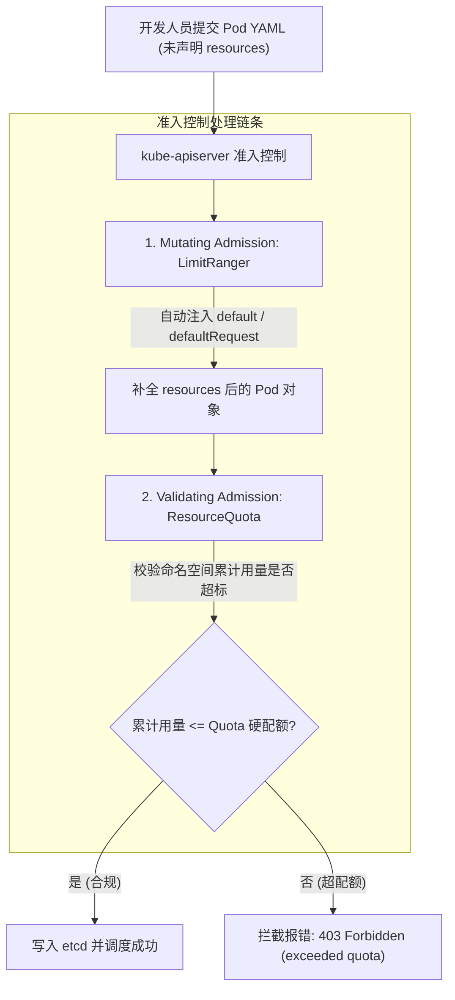

# 🌐 Namespace 隔离、ResourceQuota 与 LimitRange 资源治理

在多租户、多业务线共用同一个 Kubernetes 集群的场景下，资源的合理分配与硬性隔离是保障集群稳定运行的根本前提。本章将深度剖析 Namespace、Node 映射，以及控制命名空间资源水位的两大核心工具：`ResourceQuota`（资源配额）与 `LimitRange`（资源范围限制）。

---

## 一、 命名空间 (Namespace) 物理与逻辑隔离

`Namespace` 用于在逻辑上将集群内部的资源对象（如 Pod、Service、Deployment）划分到不同的分组中。

### 1. 隔离维度与限制
*   **逻辑隔离**：Namespace 仅仅是 API 层面上的逻辑分组，**默认情况下，不同 Namespace 之间的 Pod 网络依然是互通的**（若要实现网络物理隔离，需借助 CNI 的 `NetworkPolicy`）。
*   **资源分类**：
    *   **命名空间级资源**：Pod、Service、PVC、ConfigMap、Secret、Deployment 等。
    *   **集群级资源 (无空间划分)**：Node、PersistentVolume、Namespace、ClusterRole、StorageClass 等。

### 2. 命名空间创建与使用
```yaml
apiVersion: v1
kind: Namespace
metadata:
  name: development
---
apiVersion: v1
kind: Pod
metadata:
  name: busybox-pod
  namespace: development                 # 声明调度到 development 命名空间下
spec:
  containers:
  - name: busybox
    image: busybox:1.36
    command: ["sleep", "3600"]
```

---

## 二、 架构关键辨析：`ResourceQuota` (空间配额) vs `LimitRange` (单容器默认值)

> **核心结论**：`ResourceQuota` 是针对 Namespace 的“团队总预算上限”，而 `LimitRange` 是针对单个容器的“个人消费规格与兜底默认值”。两者必须搭配使用！

### 1. 现实物理比喻：部门总预算 vs 个人出差标准
* **ResourceQuota (部门总预算)**：财务规定“研发部全员本月报销总额不能超过 10 万元”。只要部门内所有人相加超过 10 万，再提交新报销单直接拒绝！
* **LimitRange (个人消费标准与默认填充)**：HR 规定“单人单次出差住酒店不能低于 200 元（min），不能超过 1000 元（max）；如果你忘记填住宿标准，系统默认自动按 400 元（default）帮你填上！”。

### 2. 两者协同工作的刚性锁死与自动补全原则



1. **配置 ResourceQuota 后触发的“强制填写锁”**：
   一旦在 Namespace 下启用了 `ResourceQuota` 限制 CPU/Memory，之后发往该空间的每一个 Pod **必须显式声明 `requests` 与 `limits` 字段**。只要有一个容器没写，APIServer 准入控制会直接拦截报错（`is forbidden: failed quota: must specify cpu,memory`）！
2. **LimitRange 自动救场注入**：
   为了防止普通开发人员忘记写 `resources` 导致 Pod 批量创建失败，SRE 运维会在该空间同步配置 `LimitRange`。当提交的 YAML 没写资源限制时，`Mutating Admission Webhook` 准入控制器会**自动读取 LimitRange 的 `default` / `defaultRequest` 补全 Pod YAML**，实现既防资源吃光、又不卡业务发布的闭环！

---

## 三、 ResourceQuota (命名空间资源配额)

> [!IMPORTANT]
> **资源配额的价值**：如果某个开发者的代码陷入死循环疯狂扩容，或者配置了极大的 Limits，可能会瞬间榨干整个集群所有节点的物理资源。`ResourceQuota` 允许管理员限制**单个命名空间**可消耗的资源总量。

### 1. 限制维度
*   **计算资源**：限制 CPU 和内存的总申请量（Requests）和最大硬限制（Limits）。
*   **存储资源**：限制该空间下所有的 PVC 存储空间总容量。
*   **对象数量**：限制该空间下 Pod、Service、ConfigMap、Secret、PVC 的最大创建数量。

### 2. ResourceQuota 生产级配置 YAML
```yaml
apiVersion: v1
kind: ResourceQuota
metadata:
  name: dev-resource-quota
  namespace: development                 # 作用于 development 命名空间
spec:
  hard:
    # 限制所有 Pod 累计申请的 CPU 最小总和为 4 核，最大硬限制为 8 核
    requests.cpu: "4"
    limits.cpu: "8"
    # 限制所有 Pod 累计申请的内存最小总和为 8Gi，最大硬限制为 16Gi
    requests.memory: 8Gi
    limits.memory: 16Gi
    # 限制该命名空间下最多只能创建 10 个 Pod 实例
    pods: "10"
    # 限制最多只能创建 5 个 Service
    services: "5"
    # 限制最多只能创建 20 个 ConfigMap
    configmaps: "20"
    # 限制申请的存储总量上限为 50Gi
    requests.storage: 50Gi
```

### 3. ResourceQuota 作用域过滤 (Scopes)
可通过 `scopes` 或 `scopeSelector` 针对特定生命周期的 Pod 进行精细化配额：
* `Terminating`：匹配 `spec.activeDeadlineSeconds >= 0` 的 Pod（如 Job/CronJob）。
* `NotTerminating`：匹配长期运行的 Pod（如 Deployment、StatefulSet）。
* `BestEffort`：匹配未设置 Request/Limit 的尽力而为型 Pod。
* `NotBestEffort`：匹配设置了至少一项 Request/Limit 的 Pod。

---

## 四、 LimitRange (资源边界与默认配置)

如果配置了 `ResourceQuota`，**所有发往该命名空间的 Pod 必须显式声明 resources.requests 和 resources.limits**，否则会直接被 API Server 拒绝创建。
为了减少开发人员的重复配置负担，`LimitRange` 可以在命名空间级别为容器设置**默认的资源限制值**和**可允许的上下界限**。

### 1. 核心功能
*   **自动注入（默认值）**：若 Pod 未配置资源限额，LimitRange 自动为其注入默认的 Requests/Limits。
*   **范围校验（上下界限）**：如果 Pod 声明的资源低于 `min` 或高于 `max`，API Server 将直接拦截并拒绝该 Pod 的创建。
*   **比例限制（MaxLimitRequestRatio）**：限制 `limits / requests` 的最大超售比，防止开发为了挤进调度把 Request 设得过小而 Limit 设得极大。

### 2. LimitRange 生产级配置 YAML
```yaml
apiVersion: v1
kind: LimitRange
metadata:
  name: dev-limit-range
  namespace: development                 # 作用于 development 命名空间
spec:
  limits:
  - type: Container                      # 针对容器进行限制
    default:                             # 默认 Limit (硬限制)
      cpu: "500m"
      memory: 512Mi
    defaultRequest:                      # 默认 Request (初始申请量)
      cpu: "100m"
      memory: 256Mi
    max:                                 # 容器最大可配置的值 (上限门槛)
      cpu: "2"
      memory: 4Gi
    min:                                 # 容器最少必须配置的值 (下限门槛)
      cpu: "50m"
      memory: 64Mi
    maxLimitRequestRatio:                # 限制 Limit 与 Request 的最大比例 (防超售失控)
      cpu: "4"
      memory: "2"
  - type: Pod                            # 针对整个 Pod 级别的总和进行限制
    max:
      cpu: "4"
      memory: 8Gi
```

### 3. 工作流逻辑
```text
Pod 创建请求 ──▶ [APIServer 准入控制器 LimitRanger] 
                        │
             ┌──────────┴──────────┐
             ▼ (未声明 resource)   ▼ (已声明 resource)
      [自动注入默认 default值]    [校验是否在 min 与 max 范围内]
             │                             │
             └─────────────┬───────────────┘
                           ▼
                  [ 校验通过，写入 etcd ]
```

---

## 五、 生产多租户资源治理最佳实践

1. **组合策略**：每个业务团队（Namespace）必须同时配置 `ResourceQuota`（卡总量）和 `LimitRange`（设默认值与上下限）。
2. **监控告警**：对 `kube_resourcequota{type="used"} / kube_resourcequota{type="hard"} > 0.85` 进行监控告警，提前预警团队配额耗尽。
3. **配合 PriorityClass**：在配额紧张时，确保核心业务配置高优先级，避免非核心测试应用占满命名空间配额导致核心业务发布受阻。

---

> [!TIP] 💡 关联技术与延伸阅读
>
> * [准入控制 Admission Controller 校验](./02-安全认证与准入控制.md)
> * [资源限制对 HPA 伸缩计算的影响](../02-集群负载/07-HPA与VPA弹性扩缩容底层算法与指标管道.md)
