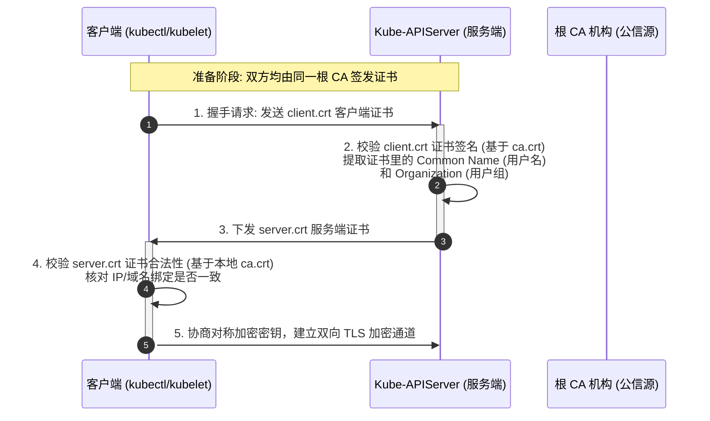
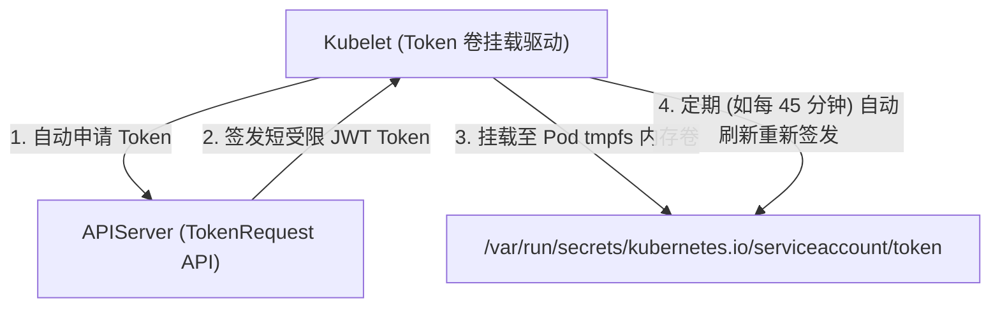

# 🔐 API Server 安全访问控制、RBAC 授权与证书过期自愈指南

Kubernetes 集群的安全性完全依赖于对 `kube-apiserver` 的访问控制机制。任何请求（无论是来自运维人员的 `kubectl` 指令，还是来自 Pod 内运行的程序代码）都必须通过三层安全关卡：**认证 (Authentication)**、**授权 (Authorization)** 和 **准入控制 (Admission Control)**。

---

## 一、 访问控制三阶段与身份体系

```text
客户端请求 ──▶ [ 1. 认证 (Authentication) ] ──▶ [ 2. 授权 (Authorization) ] ──▶ [ 3. 准入控制 (Admission) ] ──▶ etcd
```

### 1. 两种用户账号体系 (User Account vs Service Account)
*   **User Account (用户账号)**：
    *   **对象类型**：面向人类用户（如管理员、研发人员）。
    *   **管理特征**：**K8S 集群内没有对应的实体对象资源**。它依赖于外部的证书或统一身份认证系统（如 OIDC、静态 Token 文件）。作用范围为全局。
*   **Service Account (服务账号)**：
    *   **对象类型**：面向集群内运行的 Pod 进程（如 Prometheus Agent, Ingress Controller）。
    *   **管理特征**：**是 K8S API 资源对象**。隶属于特定的命名空间。Kubelet 会自动将 Service Account 的 Token 以 Volume 形式挂载进 Pod 内部的 `/var/run/secrets/kubernetes.io/serviceaccount/token`，使 Pod 进程可以直接凭此 Token 完成对 API Server 的免密认证。

### 2. 双向 CA (TLS) 证书认证工作流

Kubernetes 默认使用强 TLS 双向认证保护 API 接口：



---

## 二、 RBAC (基于角色的访问控制) 授权体系

Kubernetes 使用 RBAC（Role-Based Access Control）来定义“谁（Subject）”能对“什么资源（Resource）”执行“什么操作（Verb）”。

```text
  【角色定义】                  【绑定绑定】                【授权主体 (Subject)】
┌─────────────┐               ┌─────────────┐             ┌─────────────────────┐
│    Role     │◀─────────────▶│ RoleBinding │◀───────────▶│ - User (用户)        │
│ (Namespace) │               └─────────────┘             │ - Group (用户组)      │
├─────────────┤                                           │ - ServiceAccount    │
│ ClusterRole │◀─────────────▶┌────────────────────┐      │   (服务账号)        │
│   (Cluster) │               │ ClusterRoleBinding │◀────▶└─────────────────────┘
└─────────────┘               └────────────────────┘
```

### 1. 核心对象详解
*   **Role (角色)**：局限于某个命名空间，定义一组操作资源的规则列表。
*   **ClusterRole (集群角色)**：作用于整个集群范围（例如：可以定义读取所有命名空间下 Node、Namespace 的规则）。
*   **RoleBinding (角色绑定)**：将 Role 或 ClusterRole 绑定到主体上，**仅在当前命名空间生效**。
*   **ClusterRoleBinding (集群角色绑定)**：将 ClusterRole 绑定到主体上，**在全局所有命名空间生效**。

---

### 2. 生产级 RBAC YAML 实战配置

#### 场景：允许 `production` 空间下的 Service Account `monitor-sa` 查看整个集群的 Pod 和 Node 信息。

```yaml
# 1. 创建 Service Account
apiVersion: v1
kind: ServiceAccount
metadata:
  name: monitor-sa
  namespace: production
---
# 2. 定义集群级别角色 (因为 Node 是全局资源，必须用 ClusterRole)
apiVersion: rbac.authorization.k8s.io/v1
kind: ClusterRole
metadata:
  name: pod-node-reader
spec:
  rules:
  - apiGroups: [""]                       # 核心资源组 ("" 代表核心 core 组)
    resources: ["pods", "nodes"]          # 授权操作的资源对象名称
    verbs: ["get", "list", "watch"]       # 允许的操作动作
---
# 3. 创建集群角色绑定，将全局权限赋予 production 空间的 ServiceAccount
apiVersion: rbac.authorization.k8s.io/v1
kind: ClusterRoleBinding
metadata:
  name: monitor-global-binding
subjects:
- kind: ServiceAccount
  name: monitor-sa
  namespace: production
roleRef:
  kind: ClusterRole
  name: pod-node-reader                   # 绑定关联的集群角色
  apiGroup: rbac.authorization.k8s.io
```

---

## 三、 准入控制 Webhook (Admission Control)

通过认证和授权（第一、二阶段）仅能核验发起者是否有权限，但无法限制请求内容的具体参数（例如：不能强行校验“镜像是否来自于私有仓库”）。**准入控制**提供了这层深度检查：

*   **Mutating Webhook (修改型准入)**：在请求写入 etcd 之前，拦截并修改对象属性（如：Sidecar 容器的自动注入、设置默认 CPU 限额）。
*   **Validating Webhook (验证型准入)**：在修改完成后进行合规性验证。如果不符合（如：未配置健康检查探针），则直接拦截并向用户返回错误，写入失败。

---

## 四、 集群证书与认证过期事件：原因分析与深度修复指南

在 Kubernetes 生产运行中，**集群凭证/证书过期**是最常见的导致集群突然瘫痪的故障之一。以下是深度修复及检测方案。

### 1. 证书过期核心原因分析
*   **Kubeadm 1年大限**：通过 `kubeadm` 工具初始化的集群，其控制面板组件（API Server, Controller Manager, Scheduler, etcd）的证书**默认有效期仅为 1 年**。
*   **Kubelet 自动轮转失效**：如果 Kubelet 配置中未开启 `rotateCertificates: true`，或者因 CSR 审批挂起导致轮转申请失败，1年后节点证书过期，Node 会变成 `NotReady`。

### 2. 检查证书过期时间的手段

#### 方法 A：使用 Kubeadm 工具（首选）
在 Master 节点上直接运行命令，一键检查所有控制面组件证书的有效期：
```bash
kubeadm certs check-expiration
```
*该命令会列出所有控制面板证书的剩余天数（Residual Time）。*

#### 方法 B：使用 OpenSSL 工具（自定义集群）
```bash
openssl x509 -in /etc/kubernetes/pki/apiserver.crt -noout -text | grep -A 2 "Validity"
```

---

### 3. 过期紧急修复实战（基于 Kubeadm）

当集群证书已经过期且 `kubectl` 命令完全失效（报 `x509: certificate has expired` 错误）时，必须通过以下物理步骤进行救治：

#### 🚨 核心前提：备份证书与配置
```bash
cp -r /etc/kubernetes /etc/kubernetes.bak
```

#### 步骤 1：重新生成并续签所有控制面证书
```bash
kubeadm certs renew all
```

#### 步骤 2：更新管理员配置文件
重新生成的证书不会自动覆盖用户家目录下的配置文件，需要手动复制最新的 `admin.conf`：
```bash
cp -i /etc/kubernetes/admin.conf $HOME/.kube/config
chown $(id -u):$(id -g) $HOME/.kube/config
```

#### 步骤 3：强行重载控制面静态 Pod
静态 Pod（API Server 等）常驻内存可能持有着已过期旧证书，必须强制触发 Kubelet 重新加载：
```bash
# 临时移出静态 Pod YAML 文件，触发 Kubelet 销毁容器
mv /etc/kubernetes/manifests/*.yaml /tmp/

# 等待 10 秒钟（确保容器已被停止并清理）后，将配置移回以重新创建 Pod
mv /tmp/*.yaml /etc/kubernetes/manifests/

# 重启本地 kubelet 进程
systemctl restart kubelet
```

---

### 4. Kubelet 客户端证书（Node 节点）过期修复

如果更新控制面证书后，部分 Node 节点依然无法注册回集群，需在故障的 Node 节点上手动重新申请证书：

1.  **清理老旧证书**：
    ```bash
    rm -f /var/lib/kubelet/pki/kubelet-client-current.pem
    rm -f /etc/kubernetes/bootstrap-kubelet.conf
    ```
2.  **拷贝临时 Bootstrap 配置文件**：
    在 Master 节点上拷贝一份当前可用的认证文件作为引导文件，发往故障 Node：
    ```bash
    # 在 Master 节点上执行：
    scp /etc/kubernetes/admin.conf root@<node-ip>:/etc/kubernetes/bootstrap-kubelet.conf
    ```
3.  **重启 Node 节点的 Kubelet**：
    在故障的 Node 节点上执行：
    ```bash
    systemctl restart kubelet
    ```
    *Kubelet 启动时检测到无证书，会自动读取 `bootstrap-kubelet.conf` 向 API Server 发起证书签名申请 (CSR)。*
4.  **在 Master 节点审批 CSR**：
    在 Master 节点上查看并批准 Node 的加入申请：
    ```bash
    # 查看 Pending 状态的 CSR
    kubectl get csr
    
    # 批准申请
    kubectl certificate approve <csr-name>
    ```
    *批准后，Kubelet 会自动建立新证书，Node 状态恢复为 `Ready`。*

---

## 七、 深度扩展：Bound ServiceAccount Token 轮换与 Validating/Mutating Webhook 链路 (参考源: K8s 官方 Docs & Sysdig Security)

### 1. Bound ServiceAccount Token 动态轮换机制 (K8s 1.21+)
旧版 K8s 自动为 SA 生成永久有效的 Secret 密钥，存在极高的密钥泄露安全风险。



* **安全特性**：
  1. **有时效性**：默认过期时间为 1 小时，由 Kubelet 自动轮换。
  2. **受限受众 (Audience)**：JWT Payload 内硬编码了 `aud: ["https://kubernetes.default.svc"]`，防止将该 Token 重用到外部服务引发越权攻击。
  3. **绑死 Pod UID**：与具体 Pod 的 UID 强绑定，Pod 销毁后该 JWT 立即在 API Server 端作废！

---

### 2. Admission Webhook 拦截与失败策略 (FailurePolicy)
当写请求经过 Mutating / Validating 准入控制时：

* **`failurePolicy: Fail` (默认硬拦截)**：如果第三方 Webhook 服务（如 OPA / Gatekeeper Pod）宕机或超时，**API Server 会直接拒绝整个业务 Pod 的创建**（HTTP 500），确保绝对安全。
* **`failurePolicy: Ignore` (旁路降级)**：当 Webhook 故障时自动跳过检验，保障集群可写容灾能力。

---

> [!TIP] 💡 关联技术与延伸阅读
>
> * [OPA/Kyverno 策略引擎与 Webhook 开发实战](./03-OPA_Kyverno策略引擎与AdmissionWebhook开发实战.md)
> * [RBAC 权限控制与鉴权模型](./04-RBAC权限控制实战指南.md)
> * [kube-apiserver 认证与准入处理流](../01-组件原理/01-API_Server.md)
