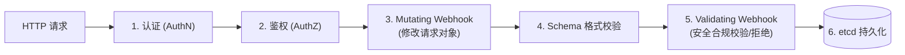
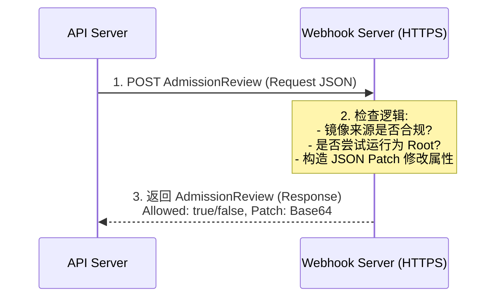

# 🛡️ OPA、Kyverno 策略引擎与 Admission Webhook 开发实战

> 本文档面向高级 Kubernetes 工程师与云原生架构师，深入剖析 API Server 准入控制（Admission Control）机制、Mutating 与 Validating Webhook 架构、OPA (Open Policy Agent) Rego 策略引擎、Kyverno 声明式策略，以及自定义准入控制器开发实战。

---

## 目录
- [一、 准入控制 (Admission Control) 在 K8s 安全体系中的位置](#一-准入控制-admission-control-在-k8s-安全体系中的位置)
- [二、 Dynamic Admission Webhook 架构原理](#二-dynamic-admission-webhook-架构原理)
- [三、 OPA (Open Policy Agent) 与 Rego 策略语言](#三-opa-open-policy-agent-与-rego-策略语言)
- [四、 Kyverno 云原生声明式策略引擎](#四-kyverno-云原生声明式策略引擎)
- [五、 自定义 Go 语言 Admission Webhook 开发实战](#五-自定义-go-语言-admission-webhook-开发实战)

---

## 一、 准入控制 (Admission Control) 在 K8s 安全体系中的位置

准入控制器是 API Server 拦截请求的**最后一道安全关卡**（位于认证和鉴权之后，etcd 持久化之前）。



---

## 二、 Dynamic Admission Webhook 架构原理

K8s 允许通过 HTTP Webhook 动态扩展准入逻辑：



### 核心差异对比：
- **MutatingWebhookConfiguration**：**可以修改**请求对象（如自动注入 Envoy Sidecar、为 Pod 注入默认 LimitRange）。
- **ValidatingWebhookConfiguration**：**只能批准或拒绝**请求（如禁止使用 `latest` 标签镜像、禁止使用 `privileged: true`）。

---

## 三、 OPA (Open Policy Agent) 与 Rego 策略语言

OPA Gatekeeper 是 CNCF 毕业的通用策略引擎。

### 规则示例：禁止 Pod 使用 `latest` 标签镜像 (Rego 语言)

```rego
package k8srequiredtags

violation[{"msg": msg}] {
    container := input.review.object.spec.containers[_]
    endswith(container.image, ":latest")
    msg := sprintf("禁止使用 latest 标签镜像: %v", [container.image])
}
```

---

## 四、 Kyverno 云原生声明式策略引擎

相比 OPA 复杂的 Rego 语言，**Kyverno** 专门为 Kubernetes 设计，完全采用声明式 YAML 定义策略。

### 策略示例：强制所有创建的 Pod 必须包含 `owner` 标签 (Kyverno ClusterPolicy)

```yaml
apiVersion: kyverno.io/v1
kind: ClusterPolicy
metadata:
  name: require-owner-label
spec:
  validationFailureAction: Enforce   # Enforce 直接拒绝，Audit 仅警告记录
  rules:
  - name: check-for-owner-label
    match:
      any:
      - resources:
          kinds:
          - Pod
    validate:
      message: "创建 Pod 必须包含 'owner' 标签！"
      pattern:
        metadata:
          labels:
            owner: "?*"
```

---

## 五、 自定义 Go 语言 Admission Webhook 开发实战

基于 `controller-runtime` 快速开发一个自动为命名空间添加安全标签的 Mutating Webhook：

```go
package webhook

import (
    "context"
    "net/http"
    corev1 "k8s.io/api/core/v1"
    "sigs.k8s.io/controller-runtime/pkg/webhook/admission"
)

type PodMutator struct {
    decoder *admission.Decoder
}

// Handle 处理 API Server 传入的 AdmissionRequest
func (a *PodMutator) Handle(ctx context.Context, req admission.Request) admission.Response {
    pod := &corev1.Pod{}
    err := a.decoder.Decode(req, pod)
    if err != nil {
        return admission.Errored(http.StatusBadRequest, err)
    }

    // 逻辑 1: 如果 Pod 没有配置 SecurityContext，注入 default 限制
    if pod.Spec.SecurityContext == nil {
        pod.Spec.SecurityContext = &corev1.PodSecurityContext{}
    }
    nonRoot := true
    pod.Spec.SecurityContext.RunAsNonRoot = &nonRoot // 强制以非 Root 运行

    // 构造 Patch 响应
    marshaledPod, err := json.Marshal(pod)
    if err != nil {
        return admission.Errored(http.StatusInternalServerError, err)
    }

    return admission.PatchResponseFromRaw(req.Object.Raw, marshaledPod)
}
```

---

> [!TIP] 💡 关联技术与延伸阅读
>
> * [准入控制体系架构](./02-安全认证与准入控制.md)
> * [Controller-Runtime Webhook 机制](../07-集群扩展/07-Operator开发与Controller-Runtime原理.md)
