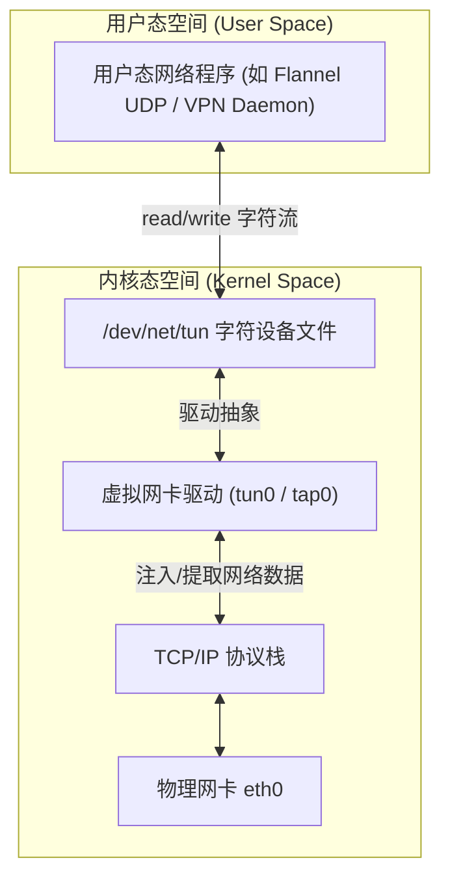
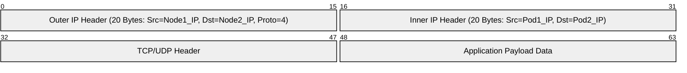
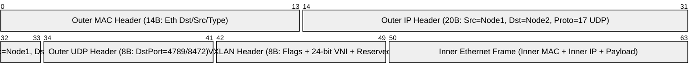
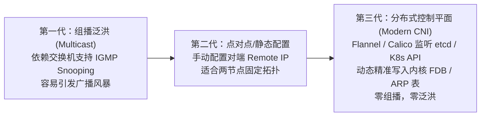
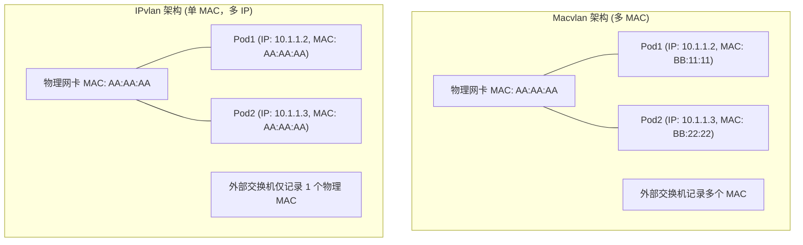

# 🌐 Linux 虚拟网络进阶与隧道技术深度指南 (tun/tap, IPIP, VXLAN, Macvlan, IPvlan)

在容器与 Kubernetes 云原生网络体系中，除了基础的 `Network Namespace`、`Veth-Pair` 和 `Linux Bridge`（详见 [01-Docker容器网络.md](./01-Docker容器网络.md)），支撑高级跨主机通信（Overlay/Underlay）、服务网格隧道、虚拟专用网（VPN）以及超高并发裸金属性能的，正是 Linux 内核更深层的虚拟网络技术：**TUN/TAP**、**IPIP 隧道**、**VXLAN**、**Macvlan** 与 **IPvlan**。

本文深度剖析这些底层技术的数据链路层/网络层转发机制、内核报文流转路径以及在 Kubernetes CNI（如 Flannel、Calico、Multus）中的工程实践。

---

## 一、 用户态网络通信通道：TUN/TAP 设备

在 Linux 内核网络栈中，常规物理网卡和虚拟网卡（如 `veth`、`bridge`）的数据均直接由内核协议栈处理。如果需要在**用户空间进程**中直接拦截、修改、封装或发送网络数据包（例如早期的 Flannel UDP 模式、OpenVPN、WireGuard 等），则必须依赖 **TUN/TAP 设备**。



### 1. TUN 与 TAP 的本质区别

TUN 和 TAP 属于同一个内核驱动（`drivers/net/tun.c`），用户态通过 `/dev/net/tun` 字符设备与其交互，核心区别在于**工作协议层级**：

| 特性 | TUN 设备 (Network Tunnel) | TAP 设备 (Network Tap) |
|---|---|---|
| **OSI 工作层级** | **L3 (网络层 / IP 层)** | **L2 (数据链路层 / 以太网帧)** |
| **处理数据格式** | 纯 IP 数据包（包含 IP 头与上层 Payload，无 MAC 帧头） | 完整以太网帧（包含 14 字节以太网头部：源/目的 MAC、EtherType） |
| **典型应用场景** | VPN、Flannel UDP 模式、IP 隧道加密传输 | 虚拟机网卡后端（QEMU/KVM）、虚拟交换机（Open vSwitch）、以太网透明桥接 |
| **MAC 地址** | 无 MAC 地址（点对点 Point-to-Point 属性） | 具有合法的虚拟 MAC 地址，可加入 Linux Bridge |

### 2. TUN 设备报文内核流转时序

以一个进程发送数据到 `tun0` 为例：
1. 宿主机应用通过套接字发送目的 IP 为 `10.244.0.5` 的报文；
2. 宿主机内核路由表命中条目：`10.244.0.0/16 dev tun0`；
3. 内核将 IP 数据包递交给 `tun0` 虚拟网卡驱动；
4. `tun` 驱动并不直接将数据包送上物理电缆，而是将其放入 `/dev/net/tun` 关联的等待队列；
5. 监听在该字符设备的用户态守护进程（如 `flanneld`）通过系统调用 `read()` 读出原始 IP 数据包；
6. 用户态守护进程将该 IP 包作为 Payload，外层封装标准 UDP 头部，通过物理网卡 `eth0` 发往远端节点；
7. **性能瓶颈根因**：每个数据包在发端和收端均需经历 **两次用户态-内核态上下文切换（Context Switch）与内存拷贝**，导致吞吐大幅下降、CPU 开销陡增。这也正是 Flannel 迅速废弃 UDP 模式、全面转向内核级 VXLAN 的核心技术诱因。

---

## 二、 最简网络隧道：IPIP (IP-in-IP) 协议

IPIP 是一种点对点的轻量级隧道技术，定义于 RFC 2003。它通过在原始 IPv4 报文外层再次封装一个标准 IPv4 报文头，将 Pod 的私有 IP 报文隐匿在宿主机物理 IP 报文中跨节点传输。



### 1. IPIP 报文结构与开销
*   **外层 IP 头部**：占用固定的 20 字节。外层 IP 头部的 `Protocol` 字段被填入固定值 `4`（表示协议类型为 IP-in-IP）。
*   **MTU 计算原则**：标准以太网物理 MTU 为 1500 字节，因此 IPIP 虚拟接口（如 `tunl0`）的 MTU **必须扣除 20 字节，配置为 1480 字节**。若未正确配置，当应用发送大包（1500 字节）时会导致物理网卡分片（IP Fragmentation）甚至触发 PMTU 黑洞导致 TCP 连接无响应挂死。
*   **Calico 中的应用**：Calico 在跨三层网段通信时，默认启动 `IPIP: Always` 或 `IPIP: CrossSubnet`。Calico 节点上的 `tunl0` 网卡即为 Linux 原生 IPIP 隧道接口，由内核 `ipip.ko` 模块直接驱动，免去了用户态上下文切换开销。

---

## 三、 现代云原生网络基石：VXLAN (Virtual Extensible LAN)

VXLAN（RFC 7348）是当前 Kubernetes CNI（如 Flannel VXLAN 模式、Cilium Overlay 模式、Calico VXLAN 模式）中使用最广泛的二层隧道技术。它采用 **MAC-in-UDP** 封装机制，在三层 IP 底座网络之上虚拟构建出海量的逻辑二层以太网。

### 1. 为什么 VXLAN 成为行业标准？

1. **突破 4096 VLAN 瓶颈**：传统 802.1Q VLAN 只有 12 位的 VLAN ID，最多支持 4094 个隔离子网，无法满足公有云与多租户 Kubernetes 集群规模。VXLAN 引入 **24 位的 VNI (VXLAN Network Identifier)**，理论上支持 $2^{24} \approx 1677$ 万个隔离子网。
2. **跨三层二层打通**：将二层以太网帧封装在通用 UDP 报文中，可以轻松跨越任意具备标准 IP 路由能力的三层物理网络，物理交换机无需感知 Pod MAC 或 Pod IP，只负责转发底层的普通 UDP 流量。
3. **内核硬件卸载（NIC Offloading）支持**：现代主流网卡均支持 VXLAN 内层校验和卸载与 TSO/GSO 硬件加速，性能损耗远低于传统通用隧道。

### 2. VXLAN 报文结构与 MTU 损耗



*   **封装头部总开销**：
    $$14 \text{ 字节 (外层以太网头)} + 20 \text{ 字节 (外层 IP 头)} + 8 \text{ 字节 (外层 UDP 头)} + 8 \text{ 字节 (VXLAN 专用头)} = 50 \text{ 字节}$$
*   **MTU 强制规范**：若物理网卡 MTU 为 1500，则 Pod 内网卡（或宿主机 `flannel.1`）的 MTU **必须设置为 $1500 - 50 = 1450$ 字节**（若底层物理网络包含 VLAN Tag，则需设为 1446 字节）。

### 3. VTEP 与 FDB 核心概念

*   **VTEP (VXLAN Tunnel Endpoint)**：VXLAN 隧道端点，是负责对二层以太网帧进行 VXLAN 封装和解封装的核心实体。在 Linux 中，VTEP 表现为一个网络接口（例如 Flannel 中的 `flannel.1`）。
*   **FDB (Forwarding Database，转发表)**：记录 **“内部目的 MAC 地址 ↔ 宿主机 VTEP 外层物理 IP 地址”** 的映射表。Linux 内核根据 FDB 表决定封包后将 UDP 发送给哪一台宿主机。

```bash
# 查看 Linux 节点上的 VXLAN FDB 转发表项
bridge fdb show dev flannel.1

# 典型输出示例：
# 92:8e:66:34:5b:77 dst 192.168.10.21 self permanent
# 含义：当需要向内部 MAC 为 92:8e:66:34:5b:77 的 Pod 发送流量时，外层 UDP 包的目标 IP 填 192.168.10.21
```

### 4. 组网与控制面机制演进

VXLAN 在如何获知对端 MAC 与 VTEP IP 的控制面实现上经历了三代演变：



在生产级 CNI（如 Flannel）中，`flanneld` 监听 K8s 集群节点事件，当新节点加入时，`flanneld` 自动向本地内核写入：
1. **路由表**：指向对端 Pod 子网的网关为对端 VTEP IP；
2. **ARP 表**：对端 VTEP IP 对应的 VTEP MAC 地址；
3. **FDB 表**：对端 VTEP MAC 对应的物理宿主机外层 IP。
由此彻底消除了网络中任何广播和泛洪行为。

---

## 四、 物理网卡分身术：Macvlan

对于极致追求网络吞吐与超低延迟（如电信 5G UPF、金融高频交易、大数据实时计算）的场景，Overlay 隧道（VXLAN/IPIP）带来的 50 字节包头损耗和 CPU 封包解包开销不可接受。此时，**Macvlan** 提供了直接基于物理网卡切分的 Underlay 方案。

### 1. Macvlan 核心机制

Macvlan 允许在同一个物理网卡上创建多个具有**独立 MAC 地址和独立 IP 地址**的虚拟网卡子接口（如 `macvlan0@eth0`）。物理交换机视角下，每一台 Pod 就相当于一台直连物理交换机端口的真实物理机。

### 2. Macvlan 的 5 大工作模式

Macvlan 子接口之间的互访行为由其配置的模式决定：

```mermaid
graph TD
    subgraph Private ["1. Private 模式"]
        P1["Macvlan 1"] -. "绝对隔离 (即使经外部交换机也丢弃)" .- P2["Macvlan 2"]
    end

    subgraph VEPA ["2. VEPA 模式 (Virtual Ethernet Port Aggregator)"]
        V1["Macvlan 1"] -->|上行发给外部交换机| SW["外部交换机 (需支持 Hairpin / 反射)"]
        SW -->|发回| V2["Macvlan 2"]
    end

    subgraph Bridge ["3. Bridge 模式 (最常用)"]
        B1["Macvlan 1"] <-->|内核虚拟二层交换机内部直通| B2["Macvlan 2"]
    end

    subgraph Passthru ["4. Passthru 模式"]
        PT1["单个虚拟接口"] ===|1对1完全独占物理网卡| Phys["物理网卡"]
    end

    subgraph Source ["5. Source 模式"]
        Src["仅允许指定源 MAC 列表的数据包通过"]
    end
```



| 模式名称 | 通信特点 | 适用场景 |
|---|---|---|
| **Private** | 同一物理网卡下的不同 Macvlan 子接口之间**绝对不能互通**，即使外部交换机反射数据包也会被内核丢弃。 | 严格的多租户强隔离网络。 |
| **VEPA** | 子接口间不能在本地直接通信，所有流量强制发送至外部支持 **Hairpin（发夹/反射）模式** 的物理交换机，由交换机再转回。 | 需要由硬件交换机统一下发 ACL/安全策略与审计的合规场景。 |
| **Bridge** | 内核在物理网卡上模拟一个虚拟的以太网 Bridge，同一宿主机下的 Macvlan 子接口之间**直接在内核内存中快速转发，无需外部交换机介入**。 | **容器与 Kubernetes 下最常用的默认模式**。 |
| **Passthru** | 物理网卡与虚拟接口 1:1 绑定，子接口独占物理网卡并允许修改 MAC，通常用于直通虚拟机。 | SR-IOV 场景或容器独占单网卡。 |
| **Source** | 基于 MAC 地址过滤白名单，只接收来自特定源 MAC 的流量。 | 严格的源地址防嗅探安全环境。 |

> [!WARNING] ⚠️ Macvlan 的天然致命缺陷：宿主机与子接口互通问题
> 在 Linux 内核设计中，**出于安全隔离防嗅探考虑，宿主机自身的物理网卡与挂载在该网卡上的 Macvlan 子接口默认无法直接互相通信**！
> **解决 SOP**：必须在宿主机上额外创建一个同子网的 Macvlan 接口（如 `macvlan-host`），将宿主机对容器网段的默认路由指向该虚拟接口，方可打通宿主机与本地容器。

---

## 五、 Macvlan 的救护员：IPvlan

虽然 Macvlan 性能极高，但在超大规模 Kubernetes 生产环境中，它面临两个严重的底层物理限制：
1. **交换机 MAC 地址表溢出**：若每台物理机运行 200 个 Pod，几百台宿主机将向接入交换机注入上万个虚拟 MAC 地址，极易撑爆传统硬件交换机有限的 MAC 地址转发表（CAM 表），引发交换机降级为广播泛洪。
2. **公有云/虚拟化网络限制**：AWS、阿里云、腾讯云等公有云的 VPC 底层具备严格的 MAC 校验与防欺骗机制（Port Security），一个物理网卡接口禁止出现多个非认证 MAC 地址，导致 Macvlan 无法在云主机上正常工作。

为了解决上述问题，Linux 内核 3.19 正式合并了 **IPvlan**。

### 1. IPvlan 的核心设计哲学：共享 MAC，多 IP

IPvlan 在物理网卡上创建的子接口，**全部复用底层物理网卡的物理 MAC 地址**，仅拥有独立的 IP 地址。在外部网络看来，该宿主机依然只有一个合法的 MAC 地址，从而彻底解决了交换机 MAC 表爆炸与云厂商 MAC 限制问题。



### 2. IPvlan L2 vs L3 模式对比

IPvlan 主要包含两种工作模式：**L2 (二层模式)** 与 **L3 (三层模式)**。

| 对比维度 | IPvlan L2 模式 | IPvlan L3 模式 |
|---|---|---|
| **工作层级** | 数据链路层 (L2) | 网络层 (L3) |
| **ARP 处理** | 由内核截获并在本宿主机内处理，或直接广播至物理交换机 | **完全不处理 ARP/广播**！所有报文由内核根据 IP 路由转发 |
| **IP 分配约束** | 所有子接口必须处于与物理网络**相同的 IP 子网**内 | 子接口可以配置与物理网络**完全不同、甚至跨网段的独立 IP** |
| **DHCP 支持** | 支持通过 DHCP 动态获取 IP | 不支持 DHCP 广播，必须静态或通过 IPAM 分配 |
| **网关位置** | 外部物理交换机/路由器作为网关 | **宿主机内核直接充当本地三层路由器** |

> [!TIP] 💡 生产选型启示
> - **IPvlan L2**：适合需要 Pod 与外部物理网络直接同二层打通、获取内网统一网段 IP 的场景，且规避了 Macvlan 的 MAC 污染问题。
> - **IPvlan L3**：具有更高的路由性能与隔离性，天然消除广播风暴，是构建大规模自路由容器网络的理想基石。

---

## 六、 容器虚拟网络技术全景选型对比

| 技术方案 | 工作层级 | 封装额外开销 | 性能损耗 | 物理网络要求 | 核心代表 CNI | 适用场景 |
|---|---|---|---|---|---|---|
| **Linux Bridge + Veth** | L2 | 0 字节 | 极低（宿主机内） | 无要求 | Kubenet / Flannel host-gw (单机内) | 单机 Docker 与传统小规模集群 |
| **TUN/TAP + UDP** | L3/L2 | 54+ 字节 | 极高 (用户态双重拷贝) | 任意 IP 网络即可 | Flannel (已废弃的 UDP 模式) | 仅用于学习验证或穿透复杂防火墙 |
| **IPIP** | L3 | 20 字节 | 较低 (内核驱动) | 必须支持 IP 协议，注意 MTU | Calico IPIP 模式 | 跨机房三层网络不可控时 Pod 互通 |
| **VXLAN** | L2 over L4 | 50 字节 | 低 (现代网卡卸载硬件加速) | 允许 UDP 4789 端口放行 | Flannel VXLAN / Cilium Overlay | **现代化 Kubernetes 集群最通用的标准默认方案** |
| **Macvlan** | L2 | 0 字节 | 接近裸金属零损耗 | 交换机允许海量 MAC，禁止开启 Port Security | Multus (高性能辅助网卡) | 私有机房、超低延迟高吞吐单租户业务 |
| **IPvlan (L2/L3)** | L2 / L3 | 0 字节 | 接近裸金属零损耗 | 无多 MAC 要求，对交换机极其友好 | Multus / Cilium Underlay 模式 | 公有云 VPC 限制环境、超大规模容器高密部署 |

---

> [!TIP] 💡 关联技术与延伸阅读
>
> * [Docker 容器网络原理与基础 NetNS/Veth/Bridge 实践](./01-Docker容器网络.md)
> * [Kubernetes 集群网络架构与 CNI 基础原理](./02-Kubernetes集群网络.md)
> * [Flannel 网络模式深度解析与对比 (VXLAN vs host-gw vs UDP)](./07-Flannel网络模式深度解析与对比.md)
> * [Calico 架构与 calico-node 及 kube-controllers 深度剖析](./02-1-Calico架构与calico-node及kube-controllers深度剖析.md)
> * [eBPF 与 Cilium 下一代网络架构原理](./04-eBPF与Cilium下一代网络架构原理.md)
