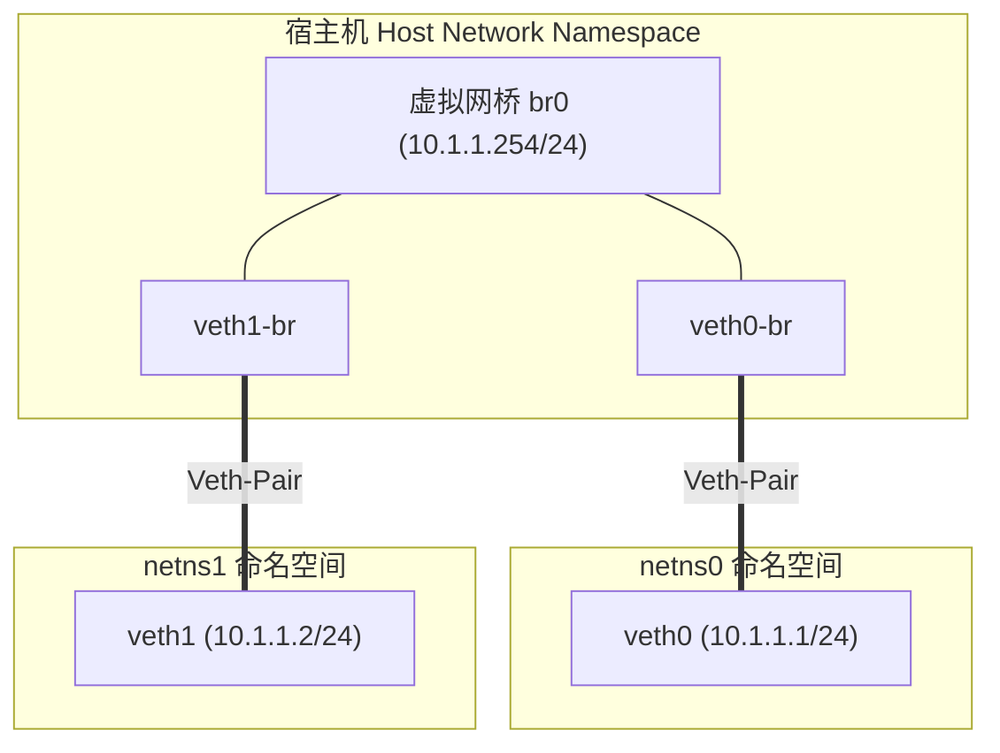
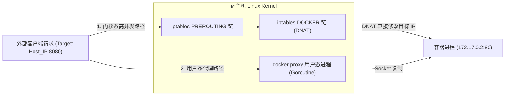
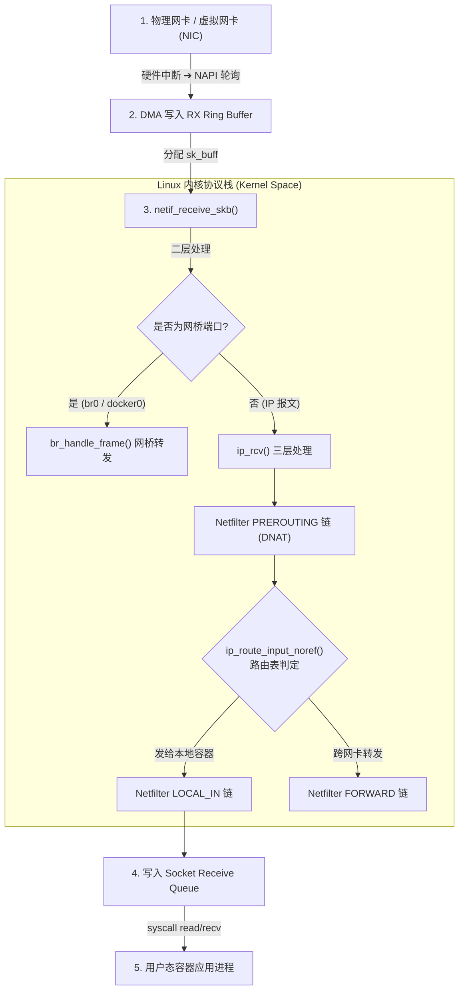

# 🐳 Linux 宿主机网络与 Docker 容器网络原理

在深入理解 Kubernetes 复杂的集群网络架构（如 CNI、Flannel、Calico、Cilium）之前，必须首先夯实 Linux 操作系统底层的虚拟网络基础设施。Docker 的单机与跨主机容器网络正是建立在 Linux 内核的 `Network Namespace`、`Veth-Pair`、`Linux Bridge` 和 `iptables (Netfilter)` 基础之上的。

---

## 一、 Linux 虚拟网络基础设施

Linux 内核通过以下几种虚拟设备和技术，构建出隔离且灵活的虚拟网络拓扑：

### 1. Network Namespace (网络命名空间)
*   **作用**：网络命名空间用于隔离网络协议栈资源（网卡、IP 地址、路由表、`iptables/netfilter` 规则、套接字端口等）。
*   **特性**：每个 Namespace 拥有独立的网络环境。例如，两个独立的 Namespace 内可以同时启动监听在 `0.0.0.0:80` 的 HTTP 服务而互不干扰。
*   > 💡 **核心概念辨析：隔离 ≠ 物理数值必须不同**
    > 1. **视图与作用域独立**：NetNS 隔离的是**访问作用域 (`struct net`)**。两个独立的 NetNS 完全可以配置**完全相同的网卡名 (`eth0`)、相同的 IP 地址 (`192.168.1.100`) 和相同的监听端口 (`:80`)** 且互不干扰。
    > 2. **资源共享例外**：在 K8s Pod 模式或 Docker `--net=host` 模式下，多个进程通过 `setns()` 共享同一个 NetNS，此时它们的网络资源**不仅相同，而且物理上指向同一个内核对象**。

### 2. Veth-Pair (虚拟网卡对)
*   **工作原理**：Veth-Pair（Virtual Ethernet Pair）是一对成对出现的虚拟网卡设备。**就像一根双绞网线连接着两个网口**，数据从其中一端（如 `veth0`）写入，会原封不动从另一端（如 `veth1`）弹出。
*   **应用**：跨 Namespace 通信的核心纽带，用于将容器内的 `eth0` 连接到宿主机网络空间。

### 3. Linux Bridge (虚拟网桥)
*   **工作原理**：Linux Bridge 作用于 OSI 二层（数据链路层），功能等同于一台虚拟交换机。它具备 MAC 地址学习与帧转发能力，能够连接多个虚拟或物理网卡。
*   **应用**：Docker 默认创建的 `docker0` 就是一个虚拟网桥，宿主机上所有 Bridge 模式容器对应的 Veth 对端网卡都插在 `docker0` 上。

---

## 二、 实战：纯命令行打通两个 Namespace

我们可以通过 Linux 原生 `ip netns` 与 `ip link` 命令，不依赖 Docker 引擎，手动模拟 Docker 创建容器网络的过程：



### 详细实战命令：

```bash
# 1. 创建两个独立的 Network Namespace
ip netns add netns0
ip netns add netns1

# 2. 创建虚拟网桥 br0，并为其分配宿主机网关 IP
ip link add br0 type bridge
ip addr add 10.1.1.254/24 dev br0
ip link set br0 up

# 3. 创建第一对 Veth-Pair 并挂载
ip link add veth0 type veth peer name veth0-br
ip link set veth0 netns netns0             # 将 veth0 移入 netns0
ip link set veth0-br master br0            # 将 veth0-br 插在 br0 网桥上
ip link set veth0-br up                    # 启动宿主机端网卡

# 4. 创建第二对 Veth-Pair 并挂载
ip link add veth1 type veth peer name veth1-br
ip link set veth1 netns netns1             # 将 veth1 移入 netns1
ip link set veth1-br master br0            # 将 veth1-br 插在 br0 网桥上
ip link set veth1-br up                    # 启动宿主机端网卡

# 5. 在 Namespace 内部配置 IP 并添加默认路由
ip netns exec netns0 ip addr add 10.1.1.1/24 dev veth0
ip netns exec netns0 ip link set veth0 up
ip netns exec netns0 ip route add default via 10.1.1.254

ip netns exec netns1 ip addr add 10.1.1.2/24 dev veth1
ip netns exec netns1 ip link set veth1 up
ip netns exec netns1 ip route add default via 10.1.1.254

# 6. 【测试连通性】从 netns0 跨网桥 ping netns1
ip netns exec netns0 ping -c 2 10.1.1.2
```

---

## 三、 Docker 4 大单机网络模式对比

Docker 提供了 4 种原生的网络模式，对应不同的 Namespace 隔离级别：

```text
┌─────────────────────────────────────────────────────────────────────────┐
│ 1. Bridge 模式 (默认)                                                   │
│    [Host NetNS] ── docker0 网桥 ── VethPair ──► [Container NetNS (独立)]  │
├─────────────────────────────────────────────────────────────────────────┤
│ 2. Host 模式                                                            │
│    [Container Process] ───────────────────────► [Host NetNS (共享主机)]  │
├─────────────────────────────────────────────────────────────────────────┤
│ 3. Container 模式 (K8s Pause 容器基础)                                   │
│    [App Container] ───────────────────────────► [Pause Container NetNS] │
├─────────────────────────────────────────────────────────────────────────┤
│ 4. None 模式                                                            │
│    [Container NetNS (仅 lo 回环网卡，无外部接口)]                         │
└─────────────────────────────────────────────────────────────────────────┘
```

| 网络模式 | 命令行参数 | Network Namespace 隔离性 | IP 分配情况 | 适用场景 |
| :--- | :--- | :--- | :--- | :--- |
| **Bridge** | `--net=bridge` | **独立**，通过 Veth 连接 `docker0` 网桥 | 从 `docker0` 子网分配独立私有 IP | 标准单机容器服务，需要端口隔离 |
| **Host** | `--net=host` | **无隔离**，共享宿主机网络栈 | 直接使用宿主机 IP 及端口 | 对网络性能要求极高、无需端口隔离的应用 |
| **Container** | `--net=container:<name/id>` | **共享**指定容器的 NetNS | 与被共享容器共享 IP 地址和端口空间 | Kubernetes Pod 内多容器通信（Infra/Pause） |
| **None** | `--net=none` | **完全隔离**，仅保留 `lo` 接口 | 无外部 IP 地址 | 安全敏感的批处理任务、离线计算 |

---

### 💡 架构关键辨析：`docker0` 虚拟网桥 vs 宿主机物理网卡 (`eth0`)

> **核心结论**：Docker 默认的 `bridge` 模式下，`docker0` 是宿主机内部的“虚拟二层交换机”，`172.17.0.1` 是容器的默认网关。容器出外网通过 **Linux 宿主机内核路由与 `iptables` 动态 MASQUERADE (SNAT)** 转发给物理网卡。

* **同宿主机容器互访**：流量在 `docker0` 网桥内部完成二层 MAC 帧交换，**物理网卡 0% 参与**。
* **容器访问公网外网**：容器 ➔ `veth` ➔ `docker0` (网关 `172.17.0.1`) ➔ 宿主机路由表 ➔ `iptables` SNAT 换源 IP ➔ 宿主机物理网卡 `eth0` 送出物理线缆。

---

## 四、 NAT 机制与端口映射（iptables vs docker-proxy）

当使用 Bridge 模式时，容器 IP 为局域网私有地址（如 `172.17.0.2`），公网无法直接寻址。Docker 通过 `iptables` 实现网络地址转换。

### 1. 容器访问外网 (SNAT 源地址转换)
当容器内部主动访问公网（如 `curl https://www.baidu.com`）时，数据包流经宿主机网卡，被宿主机的 `iptables` 执行源地址伪装（MASQUERADE）：

```bash
# 查看 iptables nat 表 POSTROUTING 链规则
iptables -t nat -nL POSTROUTING

# 典型规则体现：
-A POSTROUTING -s 172.17.0.0/16 ! -o docker0 -j MASQUERADE
```
*   **机制**：若数据包源 IP 为容器网段（`172.17.0.0/16`）且出口网卡不是 `docker0`，内核将数据包的源 IP 修改为宿主机物理网卡的 IP（SNAT）。响应数据包返回时，宿主机根据 `conntrack` 连接跟踪表还原目标 IP 送回容器。

---

### 2. 外部访问容器端口映射 (DNAT vs docker-proxy)

当执行 `docker run -p 8080:80 nginx` 时，外部流量访问宿主机 8080 端口有两种流量到达容器的路径：



#### (1) 内核态 DNAT 路径 (高效主路径)
Docker 会在 `iptables` `nat` 表中注入 `DOCKER` 链规则：
```bash
-A DOCKER ! -i docker0 -p tcp -m tcp --dport 8080 -j DNAT --to-destination 172.17.0.2:80
```
*   **过程**：数据包到达宿主机网卡后，在 `PREROUTING` 链命中 DNAT 规则，目标 IP 被强行修改为 `172.17.0.2`，目标端口修改为 `80`。直接在内核态完成路由转发，性能极高。

#### (2) 用户态 `docker-proxy` 路径 (兜底代理)
Docker 默认会针对每个映射端口启动一个用户态进程 `/usr/bin/docker-proxy`：
*   **缺陷**：`docker-proxy` 在用户态监听 `0.0.0.0:8080`，通过 `accept()` 和 `socket` 数据拷贝完成中转。这种方式涉及频繁的用户态/内核态上下文切换，在海量连接下性能极差。
*   **生产调优**：生产环境通常可以通过将 Docker daemon 配置加 `--userland-proxy=false` 关闭 `docker-proxy`，完全交由 `iptables` 内核态处理。

---

## 五、 容器跨主机网络简介

在单机 Docker 架构中，`docker0` 网桥只能解决同宿主机上的容器通信。要实现跨主机的容器通信，主流有两种架构技术：

1.  **Overlay 覆盖网络 (如 Docker Swarm Overlay / Flannel VXLAN)**：
    *   在现有三层网络之上构建二层虚拟网络，将容器的二层以太网帧封装在 UDP 数据包中传输。
2.  **Direct Routing 直连路由 (如 Calico BGP / Flannel Host-GW)**：
    *   不进行封包，而是将宿主机配置为路由器，直接通过物理网络的路由表完成跨主机容器 IP 的寻址与转发。

---

## 六、 深度扩展：Linux 内核 sk_buff 数据包处理链路 (孟凡杰课程精髓)

当数据包从网卡进入宿主机并到达容器内部时，Linux 内核通过 **`sk_buff` (Socket Buffer)** 结构体在各个网络协议层之间高效传递指针：



### 关键系统调用与内核函数：
1.  **`NAPI` (New API)**：结合中断与软中断轮询（SoftIRQ），在高并发收包时关闭硬件中断，防止中断风暴打爆 CPU。
2.  **`ip_route_input_noref()`**：根据 Linux 内核路由表（`ip route`）判定数据包是发往本地 NetNS 还是需要转发。
3.  **`sk_buff` 零拷贝处理**：在整个协议栈传递过程中，只传递 `sk_buff` 头的指针，避免在内核空间内发生昂贵的内存数据复制。

---

> [!TIP] 💡 关联技术与延伸阅读
>
> * [Kubernetes 集群网络模型](./02-Kubernetes集群网络.md)
> * [Pause 容器与 Network Namespace 共享机制](../01-组件原理/04-Kubelet/03-Docker与Containerd底层实现及Pause通信深度解析.md)
