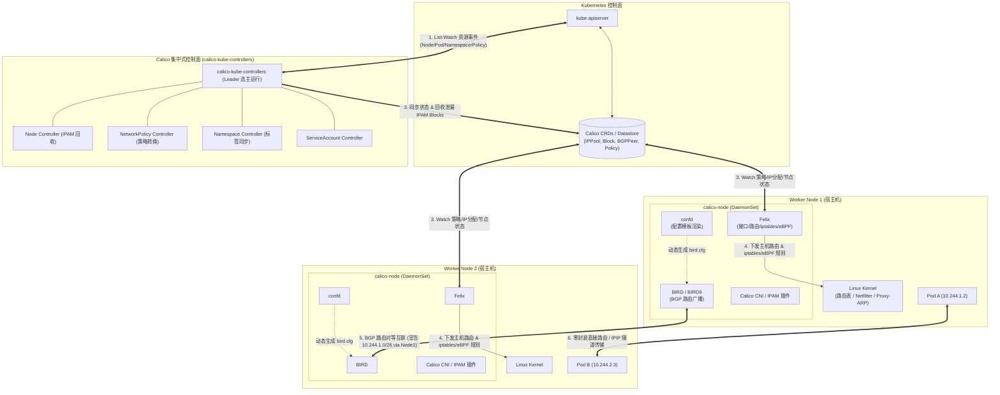
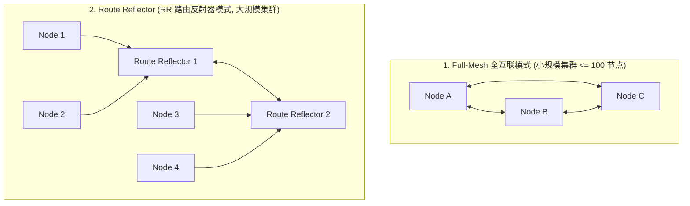
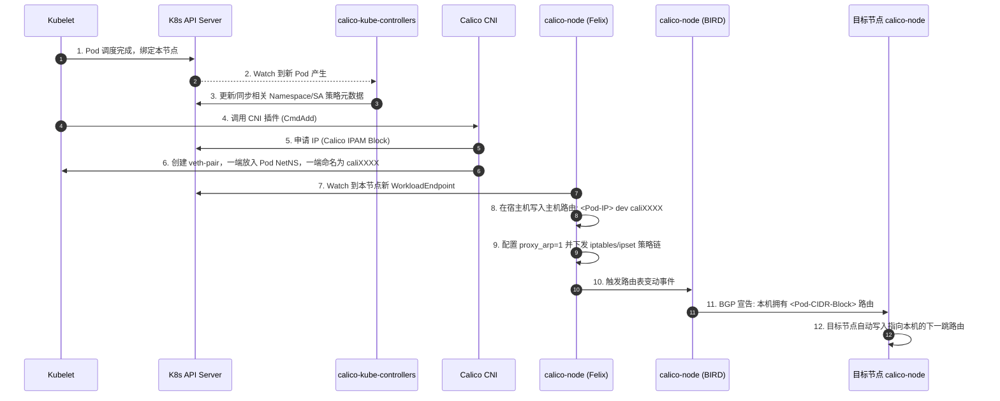

# 🌐 Calico 架构与核心组件（calico-node 与 calico-kube-controllers）深度剖析

`Project Calico` 是 Kubernetes 生态中最广泛使用的开源纯三层（Pure L3）网络和网络安全虚拟化方案。Calico 摒弃了传统虚拟网桥（如 Linux Bridge / OVS）与繁重的二层封包机制，通过巧妙利用 Linux 宿主机内核的**路由表（Routing Table）**、**Netfilter/iptables/eBPF** 以及业界标准的 **BGP（Border Gateway Protocol）路由协议**，实现了极高吞吐、极低延迟的容器网络互联与细粒度安全访问控制。

本篇文档将深入拆解 Calico 的分层架构体系，对两大核心中枢组件 —— **`calico-node`（数据面代理）** 与 **`calico-kube-controllers`（控制面协同控制器）** 的内部构造、工作原理、协同流程及生产运维排障展开全面深入的技术剖析。

---

## 一、 Calico 整体架构与设计哲学



### 1. 核心设计原则
1. **纯三层直连路由（No Bridge, No Encapsulation in BGP）**：
   - 宿主机被视作一台虚拟路由器（vRouter）。
   - Pod 的网卡直接通过 `veth-pair` 接入宿主机网络栈，宿主机依靠内核路由表直接寻址，免去了虚拟网桥的 MAC 学习与广播泛洪开销。
2. **声明式安全策略（Rich Policy Engine）**：
   - 支持 K8s 原生 `NetworkPolicy` 以及功能更强大的 Calico `GlobalNetworkPolicy`（支持应用层 HTTP 规则、全局防火墙规则、针对 Host 节点的保护策略等）。
3. **数据存储演进（etcd ➔ KDD 模式）**：
   - **KDD (Kubernetes API Datastore) 模式**：现代 Calico 默认将所有元数据、网络策略、IPAM 资源存储在 Kubernetes CRD 中，直接复用 K8s 的 API Server 与 etcd，无需独立维护一套专用的 etcd 集群。

---

## 二、 `calico-node` 深度技术剖析（数据面与节点代理）

`calico-node` 以 **DaemonSet** 的形态运行在 Kubernetes 集群中的每一个物理/虚拟节点上。它是 Calico 数据面的核心实体，也是资源开销和网络转发的关键承载者。

### 1. 内部核心模块组成

在一个 `calico-node` Pod 内部，运行着以下核心守护程序：

| 模块名称 | 运行角色 | 核心职责 |
| :--- | :--- | :--- |
| **Felix** | 核心主守护进程 (Golang 编写) | 接口配置、路由写入、Netfilter/iptables/ipset 规则编译下发、eBPF 程序加载、健康检查。 |
| **BIRD / BIRD6** | BGP 动态路由引擎 (C 语言开源守护进程) | 跨节点建立 BGP Session，将本地分配的 Pod CIDR 路由宣告给集群内其他节点或物理交换机。 |
| **confd** | 配置模板监听与渲染器 | 监听 Calico 数据存储中 BGP 配置与 Peer 变更，动态生成 BIRD 配置文件并触发平滑热重载。 |
| **Calico CNI 插件** | 命令行二进制插件 (调用即运行) | 由 `kubelet` 触发执行，负责分配 IP（IPAM）、创建 veth-pair 设备并配置网络命名空间。 |

---

### 2. 子组件深入：Felix（网络规则与策略引擎）

Felix 是 `calico-node` 的大脑与执行枢纽，主要负责以下底层工作：

```text
               ┌────────────────────────────────────────────────────────┐
               │                      Felix 守护进程                    │
               └───────┬──────────────────┬──────────────────┬──────────┘
                       │                  │                  │
                       ▼                  ▼                  ▼
             ┌──────────────────┐ ┌───────────────┐ ┌─────────────────┐
             │  Linux 路由表     │ │ Netfilter /   │ │  eBPF 数据面    │
             │  (ip route)      │ │ iptables/ipset│ │  (可选高性能模式)│
             └──────────────────┘ └───────────────┘ └─────────────────┘
```

#### (1) 主机路由表（Routing Table）生命周期管理
当节点上创建一个新 Pod（例如 IP 为 `10.244.1.2`，宿主机端网卡为 `cali46f3a7`）时：
* Felix 会在宿主机的内核路由表中插入一条精准的**主机路由**：
  ```bash
  10.244.1.2 dev cali46f3a7 scope link
  ```
* 凡是发往该 Pod IP 的数据包，宿主机内核查表后，直接无损推入虚拟网卡 `cali46f3a7`，进而送达 Pod 内部的 `eth0`。

#### (2) Proxy-ARP（ARP 代理机制）实现原理
Calico 体系中，Pod 内部并没有网关实体的 MAC 地址，Pod 内部默认路由通常形如：
```bash
default via 169.254.1.1 dev eth0
169.254.1.1 dev eth0 scope link
```
* **工作机制**：
  1. Pod 尝试向默认网关 `169.254.1.1` 发送数据，首先发出 ARP 请求询问 `169.254.1.1 的 MAC 是什么？`。
  2. Felix 在创建 `caliXXXX` 网卡时，强行将内核参数 `/proc/sys/net/ipv4/conf/caliXXXX/proxy_arp` 设为 `1`。
  3. 宿主机收到 ARP 请求后，无论请求哪个 IP 的 MAC，都直接返回 **宿主机 `caliXXXX` 网卡自身的 MAC 地址**。
  4. Pod 得到 MAC 后将以太网帧发出，数据包立即进入宿主机的网络协议栈处理。

#### (3) 细粒度安全规则（iptables / ipset 优化）
Felix 会将所有网络安全策略编译为高度优化的 iptables 链与 ipset 集合：
* **`ipset` 加速**：如果一条策略允许访问数十个 Pod 或 IP 范围，Felix 不会生成数十条连续的 iptables 规则，而是将其聚合为一个 `ipset` 哈希表，将原本 $O(N)$ 复杂度的逐条匹配降为 $O(1)$ 常数时间哈希查找。
* **规则链体系**：
  * `cali-INPUT` / `cali-OUTPUT` / `cali-FORWARD`：接管宿主机主流量；
  * `cali-from-wl-dispatch` / `cali-to-wl-dispatch`：根据入口/出口网卡（`cali+`）分流进入具体 Workload 的安全策略链。

---

### 3. 子组件深入：BIRD（BGP 路由广播）

BIRD 是一个轻量级高性能的动态路由守护程序。在 Calico 中，BIRD 负责在节点间同步路由信息。

#### (1) BGP 网络拓扑模式



1. **Full-Mesh（节点全互联）**：
   - 默认模式。集群中每个节点都与其余所有节点建立 BGP 对等体（BGP Peer）连接。
   - **局限性**：节点间连接数呈 $N \times (N-1) / 2$ 指数级上升。当集群节点数超过 100 时，BGP 广播流量和连接维护开销剧增。
2. **Route Reflector（路由反射器模式）**：
   - 指定部分核心节点（或专门的硬件交换机）作为 RR。
   - 普通工作节点只需与 RR 建立 BGP Peer，RR 负责将路由反射给集群所有节点。连接复杂度降为 $O(N)$。

#### (2) 跨三层跨机房传输：IPIP / VXLAN 模式

当 Kubernetes 节点分布在不同二层子网、且物理路由器不支持 BGP 动态路由协议时，BGP 直连路由无法跨越物理网关。Calico 提供了隧道封装模式：

* **IPIP 模式 (`tunl0`)**：
  - 在原始 IP 包外部追加一层 20 字节的外层宿主机 IP 报头。
  - 支持 `CrossSubnet`（同子网走纯 BGP 直连，跨子网自动启用 IPIP 封装）。
* **VXLAN 模式**：
  - 标准 UDP 4789 端口封装，提供更强的公有云多租户穿透能力。

---

### 4. 子组件深入：Calico IPAM（IP 地址块精细化管理）

Calico 不使用通用的 `host-local` 插件，而是自带高度优化的 `calico-ipam` 插件：

1. **IPPool 与 Block 分配**：
   - 定义一个全局的大网段（如 `10.244.0.0/16`）。
   - Calico 将其划分为多个较小的 **CIDR Block（默认 `/26`，包含 64 个 IP）**。
   - 每个工作节点在调度到第一个 Pod 时，会向 Calico IPAM 申请并绑定一个或多个 Block（节点亲和性）。
2. **IP 借用机制（IP Borrowing）**：
   - 当节点 A 的 Block 耗尽，而全局网段尚有富余时，节点 A 可以向其他 Block 借用临时 IP，保证业务 Pod 调度不受阻塞。

---

## 三、 `calico-kube-controllers` 深度技术剖析（控制面与状态中枢）

`calico-kube-controllers` 通常以 **Deployment（单副本或主备高可用）** 形式部署在控制面节点上。它扮演着 Kubernetes API 与 Calico 底层数据模型之间的“翻译官”与“垃圾回收器”。

```text
               ┌────────────────────────────────────────────────────────┐
               │             calico-kube-controllers                    │
               │             (基于 Leader Election 选主)                 │
               └───────┬──────────────────┬──────────────────┬──────────┘
                       │                  │                  │
                       ▼                  ▼                  ▼
             ┌──────────────────┐ ┌───────────────┐ ┌─────────────────┐
             │ Node Controller  │ │ Policy/NS Ctrl│ │ IPAM GC Manager │
             │ (节点离线资源清理)│ │ (K8s策略转CRD) │ │ (孤儿 IP 块回收) │
             └──────────────────┘ └───────────────┘ └─────────────────┘
```

### 1. 核心控制器矩阵与工作职责

| 控制器名称 | 监听的 K8s 资源 | 核心职责与业务逻辑 |
| :--- | :--- | :--- |
| **Node Controller** | `v1.Node` | **核心垃圾回收**：监听 Node 删除事件。当节点下线/销毁时，自动解绑并释放该节点占用的 Calico IPAM Block 和 BGP 配置，彻底防止 IP 泄露。 |
| **NetworkPolicy Controller** | `networking.k8s.io/v1 NetworkPolicy` | 监听 K8s 原生的 NetworkPolicy 资源，将其无缝转换为 Calico 内部格式的规则对象，供 Felix 消费。 |
| **Namespace Controller** | `v1.Namespace` | 监听 Namespace 的生命周期与 Labels 变动，确保依赖命名空间选择器（`namespaceSelector`）的安全策略能毫秒级更新生效。 |
| **ServiceAccount Controller** | `v1.ServiceAccount` | 监听 ServiceAccount 的创建与标签变更，支持基于容器身份的细粒度零信任网络策略。 |
| **Pod Controller** | `v1.Pod` | 监听 Pod 销毁事件，作为兜底机制清理残留的 WorkloadEndpoint 与网络标签元数据。 |

---

### 2. 核心场景剖析：为什么缺少 Node Controller 会引发灾难性 IP 泄漏？

在基于公有云弹性伸缩（Auto-scaling）或高频节点轮换的集群中：
1. **发生场景**：K8s 节点缩容，Node 对象被从集群中删除；
2. **潜在风险**：如果 `calico-kube-controllers` 异常挂起或未运行，该节点绑定的 Calico IPAM Block（如 `10.244.1.0/26`）仍然被标记为“归属于已删除的 Node”；
3. **严重后果**：
   - 随时间推移，全局 IPPool 内的 Block 被全部占满，新节点无法分配到任何 IP 块；
   - 新 Pod 调度到新节点后，因 `calico-ipam: no free blocks found` 报错而导致大规模创建失败（`ContainerCreating` 假死）。

---

## 四、 `calico-node` 与 `calico-kube-controllers` 核心对比

| 对比维度 | `calico-node` (数据面代理) | `calico-kube-controllers` (控制面中枢) |
| :--- | :--- | :--- |
| **资源类型** | **`DaemonSet`** | **`Deployment`** |
| **实例数量** | 等于集群的节点总数（1 节点 = 1 Pod） | 1 副本（或多副本 Active-Standby 选主） |
| **系统特权** | **高特权（Privileged: true）**，需挂载宿主机 `/proc`, `/sys`, `/var/run`, 具备 `NET_ADMIN` 权限 | 普通非特权容器，仅依赖 ServiceAccount 访问 K8s API Server |
| **操作对象** | 宿主机内核（iptables, eBPF, ip route, veth-pair） | Kubernetes API Server 资源与 Calico CRD 元数据 |
| **直接通信对象** | 其它节点的 BIRD（179 端口）、本机内核、K8s APIServer | K8s APIServer、Calico CRDs |
| **故障影响等级** | 🔴 **严重**：该节点新 Pod 无法建网、跨节点网络不通、安全策略无法下发。 | 🟡 **中等/滞后**：存量网络转发完全不受影响；但节点下线后 IP 不会被回收，新策略无法跨 Namespace 级联更新。 |

---

## 五、 端到端协作时序图：创建 Pod 时的完整网络闭环



---

## 六、 生产级高频故障排查与运维调优 SOP

### 1. 网卡自动探测错误导致 `calico-node` 无法通信
* **现象**：多网卡或存在虚拟网卡（如 `flannel.1`、`docker0`、`bond0`）的节点上，`calico-node` 汇报的 IP 错误，BGP 无法建立连接。
* **解决办法**：在 `calico-node` DaemonSet 中配置 `IP_AUTODETECTION_METHOD`：
  ```yaml
  - name: IP_AUTODETECTION_METHOD
    value: "interface=eth.*"    # 或根据网段 "cidr=192.168.1.0/24"
  ```

### 2. MTU 不匹配导致的大数据包 TCP 挂起（PMTU 黑洞）
* **现象**：Ping 小包能通，Curl 大文件或拉取大镜像、传输大量 JSON 时连接无响应并超时。
* **原因**：底层物理网卡 MTU（如 1500），而使用了 IPIP 模式（需减 20 字节）或 VXLAN 模式（需减 50 字节），若未调整 Calico MTU 会导致封包后超过 1500 被丢弃。
* **解决办法**：修改 ConfigMap / Calico CRD 中的 MTU：
  * **IPIP 模式**：设置 `veth_mtu: 1480`（1500 - 20）
  * **VXLAN 模式**：设置 `veth_mtu: 1450`（1500 - 50）

### 3. 排查 BGP 邻居建立状态
在任意工作节点上直接通过 `calicoctl` 检查 BGP Peer 状态：
```bash
# 查看当前节点与所有邻居的 BGP 连接状态
calicoctl node status
```
* 正常状态应为：`State: up`，`Info: Established`。
* 若显示 `State: start` 或 `Idle`，请检查：
  1. 节点间 **TCP 179 端口** 是否被云厂商安全组或本地防火墙拦截；
  2. 节点宿主机 IP 是否发生变更或存在冲突。

---

## 🔗 关联文档与延伸阅读
* ☸️ [Kubernetes 集群网络与四大通信模型](./02-Kubernetes集群网络.md)
* ⚡ [eBPF 与 Cilium 下一代网络架构原理](./04-eBPF与Cilium下一代网络架构原理.md)
* 🛠️ [K8s 集群网络故障诊断与抓包实战指南](./06-K8s集群网络故障诊断与抓包实战指南.md)
* 🔌 [CNI (Container Network Interface) 原理与规范](../01-组件原理/04-Kubelet/CNI.md)

---

> [!TIP] 💡 关联技术与延伸阅读
>
> * [Flannel 与 Calico 选型与性能深度对比](./07-Flannel网络模式深度解析与对比.md)
> * [Cilium eBPF 与 Calico eBPF 模式对比](./04-eBPF与Cilium下一代网络架构原理.md)
> * [跨节点网络故障抓包与诊断](./06-K8s集群网络故障诊断与抓包实战指南.md)
