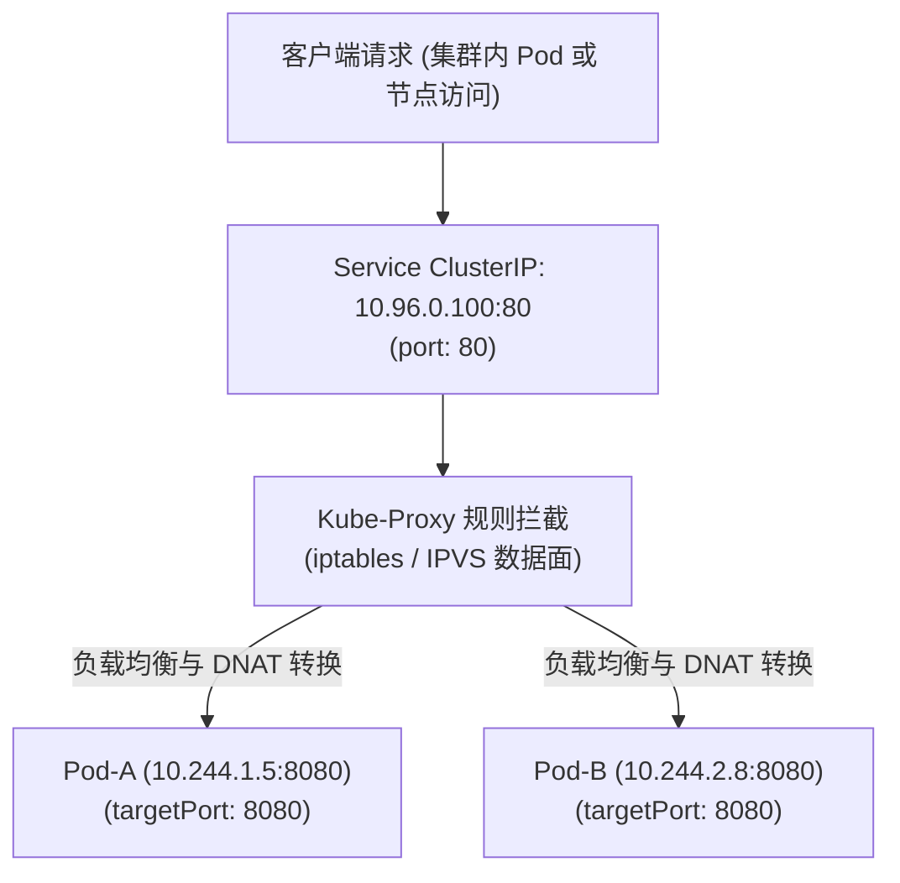
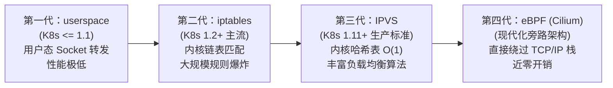
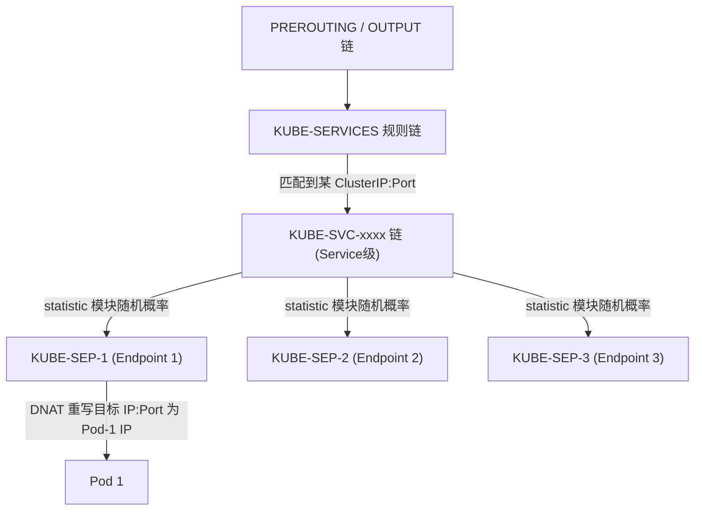
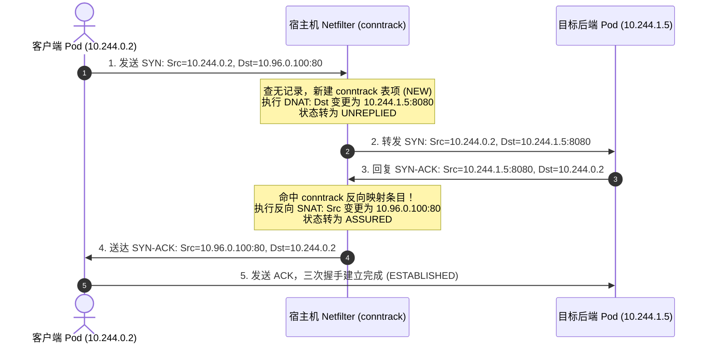

# ⚙️ Kube-Proxy 底层实现机制与 Service 转发深度指南 (userspace, iptables, IPVS, conntrack)

在 Kubernetes 集群中，Pod 的生命周期是短暂且动态变化的（因自动扩缩容、滚动更新、节点漂移而随时可能被销毁重建，Pod IP 会随时发生变化）。为了向客户端提供一个稳定且统一的网络入口，Kubernetes 抽象出了 **Service（服务）** 资源。

然而，**Service 的 ClusterIP 是一个完全虚拟的 IP，它并没有绑定在任何真实的物理或虚拟网络接口上**。负责在集群每个节点上将访问 ClusterIP:Port 的流量透明拦截并重定向负载均衡到后端各个 Pod 的核心组件，正是 **Kube-Proxy**。

本文深度剖析 Service 的抽象本质、Kube-Proxy 四代数据面转发引擎（userspace、iptables、IPVS、eBPF）的内核流转机理，以及作为核心支撑的 Linux Netfilter 连接跟踪（`conntrack`）底层原理与生产级瓶颈调优。

---

## 一、 Kubernetes Service 抽象本质与端口流转



### 1. 三个核心端口的本质辨析

初学者最容易混淆 Service 定义中的三个 Port，其在网络报文生命周期中的角色截然不同：

| 端口定义 | 作用范围 | 报文交互过程中的位置 |
|---|---|---|
| **`port`** | Service 自身的虚拟暴露端口 | 客户端发起请求时，目标 IP 为 ClusterIP，**目标端口即为 `port`**（例如 `curl 10.96.0.100:80`）。 |
| **`targetPort`** | 后端业务容器实际监听的端口 | 数据包经过内核 DNAT 转换后，目标端口被重写为 **`targetPort`**（例如转发至 Pod 容器内的 `:8080`）。 |
| **`nodePort`** | 每个 Node 节点物理 IP 上监听的静态端口 | 允许集群外部流量通过访问 `<NodeIP>:<NodePort>` 进入集群，取值范围通常为 `30000-32767`。 |

### 2. Service 的 5 大发布形态

1. **ClusterIP (默认)**：仅在集群内部可达的虚拟 IP。
2. **NodePort**：在每个节点上分配静态端口，构建从节点端口到 ClusterIP 的桥梁。
3. **LoadBalancer**：在公有云环境中联动 Cloud Provider 自动化创建物理负载均衡器（如 AWS ELB、阿里云 SLB），将流量引导至 NodePort。
4. **Headless Service (`clusterIP: None`)**：不分配 ClusterIP，Kube-Proxy 也不为其生成任何转发规则；DNS 解析直接返回后端 Pod 的 A 记录列表，由客户端自行做负载均衡，专用于有状态服务（StatefulSet）。
5. **ExternalName**：通过 CNAME 别名将集群内部服务映射到外部域名，无任何代理和端口转发行为。

---

## 二、 Kube-Proxy 四代数据面转发引擎演化

Kube-Proxy 本身是一个运行在每个节点上的控制面代理，它监听 Kubernetes API Server 中 `Service` 和 `Endpoints / EndpointSlice` 资源的变化，并驱动节点上的底层网络转发数据面。



### 1. 第一代：userspace 模式（历史产物）

在 Kube-Proxy 的初始版本中，其工作原理与普通的反向代理完全一致：
*   Kube-Proxy 在用户态针对每个 Service 启动一个监听随机端口的代理服务。
*   配置 iptables 规则将访问 ClusterIP 的流量重定向（REDIRECT）到该本地端口。
*   Kube-Proxy 在用户空间通过系统调用接收连接，并在用户态向后端真实 Pod 发起连接代理。
*   **致命缺陷**：每个数据包必须在 **内核空间 ↔ 用户空间** 之间经历两次甚至四次上下文切换（Context Switch）和大量内存拷贝，CPU 开销极大，单节点 QPS 难以突破千级。

---

### 2. 第二代：iptables 模式（经典机制）

为了消灭用户态上下文切换，Kube-Proxy 演进出 iptables 模式。所有 Service 的负载均衡和 DNAT 转换全部由 Linux 内核态的 Netfilter / iptables 直接完成。

#### iptables 规则调用链拓扑



#### 规则执行与负载均衡实现细节

以一个包含 3 个副本的 Service 为例，Kube-Proxy 生成的 iptables 规则利用了内核 `statistic` 扩展模块进行概率分配：

```bash
# 1. 命中第一条规则的概率为 1/3 (0.3333333333)
iptables -A KUBE-SVC-EXAMPLE -m statistic --mode random --probability 0.3333333333 -j KUBE-SEP-POD1

# 2. 未命中第 1 条，进入第 2 条，此时在剩下的 2/3 中命中概率为 1/2 (0.5)
iptables -A KUBE-SVC-EXAMPLE -m statistic --mode random --probability 0.5000000000 -j KUBE-SEP-POD2

# 3. 前两条均未命中，最后剩余流量 100% 走第 3 条规则
iptables -A KUBE-SVC-EXAMPLE -j KUBE-SEP-POD3

# 4. 在 KUBE-SEP-* 链中执行最终的 DNAT
iptables -A KUBE-SEP-POD1 -p tcp -m tcp -j DNAT --to-destination 10.244.1.5:8080
```

#### iptables 模式的大规模性能瓶颈（规则爆炸）

当集群规模扩大（例如 5,000 个 Service、50,000 个 Pod）时，iptables 模式暴露出了严重的底层缺陷：
1. **$O(N)$ 线性链表检索复杂度**：iptables 的规则链在内核中以双向链表形式顺序存放。每个进入节点的数据包，都必须从头到尾逐行对比数万条规则，导致网络数据包转发延迟随 Service 数量线性激增。
2. **全量更新与全局互斥锁 (`xtables_lock`)**：iptables 命令行工具不支持单个规则的增量注入，任何一个 Pod 上下线，Kube-Proxy 都必须将当前全量规则通过 `iptables-restore` 完整重写进内核。全量刷新期间必须获取内核的 `xtables_lock`，频繁锁竞争会导致高并发下的网络抖动与节点 CPU 假死。

---

### 3. 第三代：IPVS 模式（现代大规模集群标准）

为了彻底解决 iptables 的 $O(N)$ 链表与锁瓶颈，从 Kubernetes 1.11 开始，Kube-Proxy 推出了基于 **IPVS (IP Virtual Server)** 的高性能数据面。

#### 核心技术原理

*   **Netfilter 挂载点**：IPVS 本身是 Linux 内核 LVS 体系的一部分。IPVS 模式下，Kube-Proxy 将 ClusterIP 绑定到虚拟网络接口 `kube-ipvs0`（Dummy 网卡）上。
*   **$O(1)$ 哈希表复杂度**：IPVS 不再使用链表，而是采用内核 **Hash Table（哈希表）** 组织服务映射。无论集群中有 10 个还是 100,000 个 Service，报文查表耗时恒定为 $O(1)$！
*   **结合 IPset 进行高效集合匹配**：配合 Linux `ipset` 扩展，数万个 IP/端口可以被聚合为一个极小的哈希集合，iptables 规则条数从几万条锐减至几十条。
*   **Netlink 原生增量同步**：Kube-Proxy 直接通过 Linux 原生 Netlink Socket 接口与内核 IPVS 驱动通信，支持**单个端点的纯增量添加与删除**，彻底摒除 `iptables-restore` 的全量刷表与全局锁竞争。
*   **丰富的企业级调度算法**：支持 `rr` (轮询)、`wrr` (加权轮询)、`lc` (最少连接)、`wlc` (加权最少连接)、`sh` (源地址哈希)、`sed` (最短预期延迟) 等。

```bash
# 查看节点上的 IPVS 转发规则
ipvsadm -ln

# 典型输出示例：
# TCP  10.96.0.100:80 rr
#   -> 10.244.1.5:8080              Masq    1      0          0
#   -> 10.244.2.8:8080              Masq    1      0          0
#   -> 10.244.3.12:8080             Masq    1      0          0
```

---

## 三、 幕后功臣与瓶颈杀手：Netfilter 连接跟踪 (conntrack)

无论是在 iptables 还是 IPVS（NAT 模式）下，所有数据包的地址转换都绝非孤立运行，其背后必须依赖 Linux 内核的 **连接跟踪系统（Connection Tracking，简称 conntrack）**。

### 1. 为什么 DNAT 必须依赖 conntrack？

当客户端向 `ClusterIP:80` 发起 TCP SYN 请求时，Kube-Proxy 通过 NAT 将其重写为 `PodIP:8080`。当 Pod 返回 SYN-ACK 响应时，源 IP 为 `PodIP`。
*   **问题**：客户端只认识 `ClusterIP`，如果直接收到来自未知 `PodIP` 的报文，客户端协议栈会因为五元组不匹配而直接向服务端发送 `RST` 丢弃连接！
*   **解决机制**：Linux 内核必须在内存中维持一张状态表。在第一个 SYN 包通过时，记录 `(Src: ClientIP:1234, Dst: ClusterIP:80) ↔ (Src: PodIP:8080, Dst: ClientIP:1234)` 的反向映射关系。当回包到达节点时，内核查表自动将源 IP 反向替换回 `ClusterIP`，客户端方能顺利建立 TCP 连接。



### 2. 生产级灾难："table full, dropping packet" 故障根因

在生产高并发业务（或遭遇短连接高频洪峰、DNS 查询风暴）时，宿主机内核日志常常会出现如下报错：

```text
kernel: nf_conntrack: table full, dropping packet
```

此时，宿主机将直接丢弃所有新建连接的 SYN 报文，导致整个节点上的所有 Pod 间歇性无响应。

#### 根因剖析
Linux 内核给 conntrack 表分配的最大条目数由 `nf_conntrack_max` 决定。底层实际是一个指定大小的哈希表（`buckets`），每个 bucket 挂载一个双向链表。
*   当活跃连接数达到 `nf_conntrack_max` 上限；
*   或者短连接释放后处于 `TIME_WAIT`（默认超时 120 秒）占用表项尚未过期；
*   内核内存无法再为新数据包分配 `struct nf_conn` 结构体，直接执行丢弃。

### 3. 生产级内核参数调优 SOP

针对超高并发 Kubernetes 集群，必须对内核连接跟踪参数进行科学计算与固化：

```bash
# 1. 查看当前连接跟踪表使用量与上限
sysctl net.netfilter.nf_conntrack_count
sysctl net.netfilter.nf_conntrack_max

# 2. 科学计算黄金比例公式：
# buckets = RAM_bytes / (16384 * (ARCH_bits / 32)) = 64位机器上 内存字节 / 32768
# 理想状态下：nf_conntrack_max = buckets * 4 (保持链表平均长度 <= 4)
# 以 64GB 内存物理机为例：
# buckets 建议设为 1,048,576 (2^20)
# nf_conntrack_max 建议设为 4,194,304

# 3. 修改 /etc/sysctl.d/99-k8s-conntrack.conf
cat <<EOF > /etc/sysctl.d/99-k8s-conntrack.conf
# 调整连接跟踪表上限与哈希桶大小
net.netfilter.nf_conntrack_max = 2097152

# 缩短空闲 TCP 连接超时 (默认往往高达 5 天，建议缩短为 1-2 小时)
net.netfilter.nf_conntrack_tcp_timeout_established = 7200

# 缩短 TIME_WAIT 状态占用时间 (默认 120 秒，调优为 30 秒)
net.netfilter.nf_conntrack_tcp_timeout_time_wait = 30

# 缩短 CLOSE_WAIT 与 FIN_WAIT 超时时间
net.netfilter.nf_conntrack_tcp_timeout_close_wait = 30
net.netfilter.nf_conntrack_tcp_timeout_fin_wait = 30
EOF

# 4. 生效配置
sysctl -p /etc/sysctl.d/99-k8s-conntrack.conf

# 5. 特别注意：修改 buckets 大小必须写入 module 参数
echo 524288 > /sys/module/nf_conntrack/parameters/hashsize
```

---

## 四、 iptables 模式与 IPVS 模式全方位对比

| 对比维度 | iptables 模式 | IPVS 模式 |
|---|---|---|
| **底层核心数据结构** | 双向顺序单向链表 ($O(N)$ 线性查找) | Hash Table 哈希表 ($O(1)$ 恒定开销) |
| **规则条目复杂度** | 随 Service × Pod 数急剧膨胀（可达上万条） | 规则条数极少，数万 IP 压缩为 IPset 哈希集合 |
| **规则更新开销** | 全量刷新，需获取 `xtables_lock` 全局锁，易引发 CPU 假死 | Netlink 原生增量更新，纳秒级增删单项 |
| **支持的调度算法** | 仅基于 `statistic` 模块支持简单随机负载均衡 | 支持 rr, wrr, lc, wlc, sh, sed 等多种专业负载均衡算法 |
| **连接跟踪依赖** | 强依赖 Netfilter conntrack | 仍然依赖 Netfilter conntrack（NAT 模式下） |
| **生产推荐规模** | 适合小规模集群（< 1000 Service） | **生产推荐标配（尤其适合 > 1000 Service 集群）** |

---

> [!TIP] 💡 关联技术与延伸阅读
>
> * [Kubernetes 集群网络架构与通信模型基础](./02-Kubernetes集群网络.md)
> * [集群网络访问详细流程与报文穿透剖析](./03-集群网络访问详细流程.md)
> * [eBPF 与 Cilium 下一代网络架构原理 (彻底告别 iptables/IPVS)](./04-eBPF与Cilium下一代网络架构原理.md)
> * [CoreDNS 底层架构与服务发现技术深度指南 (DNS解析与Service对应机理)](./08-CoreDNS底层架构与服务发现技术深度指南.md)
> * [K8s 集群网络故障诊断与抓包实战指南](./06-K8s集群网络故障诊断与抓包实战指南.md)
