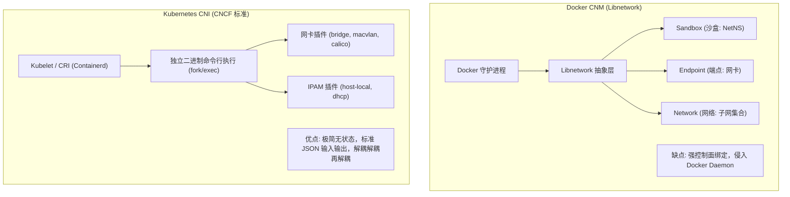
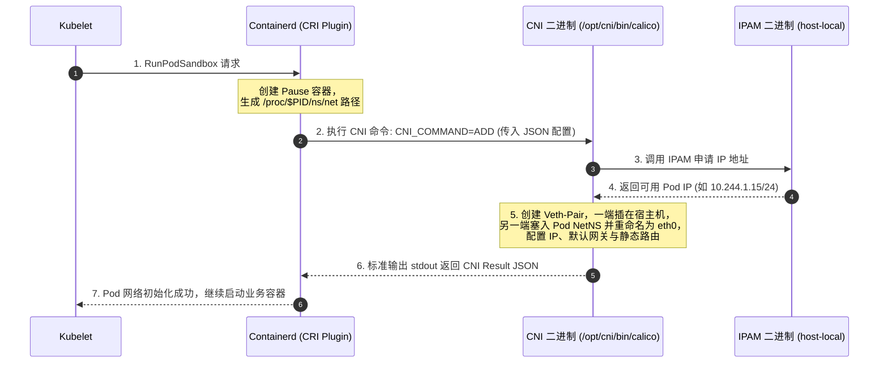
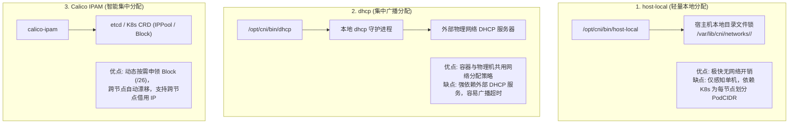
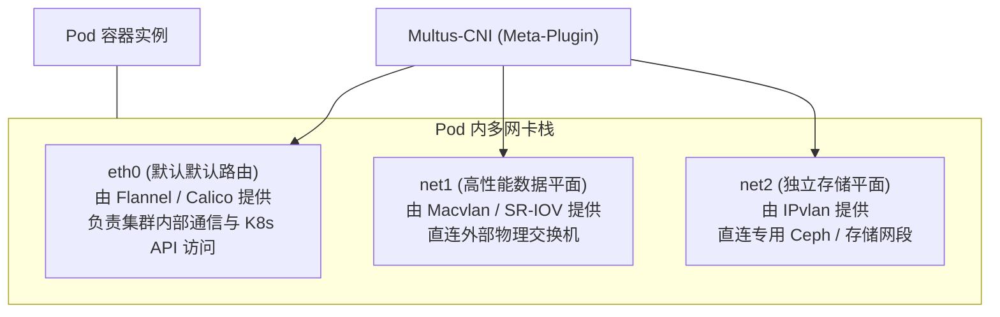

# 🔌 CNI 规范演进与容器网络插件生态全景指南

在容器编排体系中，如何将异构的基础物理网络、虚拟化网络与容器的动态生命周期无缝连接，是云原生领域最关键的基础设施课题。在 Docker 统治早期的 **CNM（Container Network Model）** 与 Kubernetes 最终选型的 **CNI（Container Network Interface）** 的标准之战中，极简且遵循 Unix 设计哲学的 CNI 最终一统江湖。

本文深度剖析 CNI 的诞生背景、规范交互协议（ADD/DEL/CHECK/VERSION 指令时序）、IPAM（IP 地址管理）机制，梳理主流网络方案的架构演化决策树，并详解针对企业级复杂多平面隔离的 **Multus / CNI-Genie 多网卡架构**。

---

## 一、 容器网络标准演化之争：CNM vs CNI

在 2015 年容器生态爆发期，行业内曾存在两大针锋相对的容器网络接口标准：



### 1. CNM (Container Network Model)
*   **提出者**：Docker 公司主导，核心实现库为 `libnetwork`。
*   **三大核心对象**：
    1.  **Sandbox（沙盒）**：隔离的网络栈（对应 Linux Network Namespace）。
    2.  **Endpoint（端点）**：将沙盒连接到网络的通信端点（对应 Veth-Pair 的一端）。
    3.  **Network（网络）**：一组互联的端点集合（对应 Bridge 或 Overlay 逻辑交换机）。
*   **局限性**：设计过于重度，与 Docker 引擎的生命周期强耦合，且试图接管服务发现、DNS 和跨主机网络编排的控制面，与 Kubernetes 自身倡导的 Pod 级轻量调度理念严重冲突。

### 2. CNI (Container Network Interface)
*   **提出者**：CoreOS 牵头，后贡献给 CNCF 作为中立标准。
*   **设计哲学**：**“做一件事并做好它”（Do One Thing and Do It Well）**。CNI 根本不关心容器如何发现服务，也不管理容器编排，它**只专注做两件事**：
    1.  在容器创建时，配置好网络接口并连通网络；
    2.  在容器销毁时，清理网络接口并释放 IP 资源。
*   **为何 CNI 能够大获全胜？**
    *   **极简可替换**：CNI 插件就是一个普通的单体命令行二进制可执行文件，无需常驻守护进程侵入。
    *   **管道化链式调用（Plugin Chaining）**：支持将主网络插件（如 Bridge、Calico）与辅助插件（如 Portmap、Tuning、Bandwidth 流量整形）像积木一样串联组合。

---

## 二、 CNI 核心工作机制深度剖析

### 1. 运行时与 CNI 插件的交互调用流

在现代 Kubernetes（基于 Containerd 或 CRI-O）中，当 Kubelet 创建一个 Pod 时：
1. CRI 容器运行时首先通过底层系统调用创建 Pause 容器的基础 Network Namespace；
2. 运行时扫描宿主机上的配置目录 `/etc/cni/net.d/`，按字典序读取主网络配置文件（例如 `10-flannel.conflist` 或 `10-calico.conflist`）；
3. 运行时在环境变量中注入必要元数据，并通过 `stdin` 标准输入流传入 JSON 格式的网络配置；
4. 运行时通过 `fork/exec` 方式调用位于 `/opt/cni/bin/` 目录下的具体 CNI 插件二进制（例如 `flannel`、`calico`、`bridge`、`host-local`）。



### 2. CNI 的四大标准操作指令 (CNI Commands)

每个 CNI 插件必须严格实现以下四种指令，运行时通过环境变量 `CNI_COMMAND` 告知插件：

| 指令 | 触发时机 | 插件必须执行的动作 |
|---|---|---|
| **`ADD`** | Pod 创建时（`RunPodSandbox`） | 创建虚拟网卡、挂载至指定 NetNS、配置 Pod IP、分配默认路由、在宿主机端建立转发表。 |
| **`DEL`** | Pod 删除时（`StopPodSandbox`） | 撤销宿主机转发表项、拆除虚拟网卡接口、向 IPAM 归还已分配的 Pod IP。 |
| **`CHECK`** | 容器健康检查或探针巡检 | 验证指定 NetNS 内的网络接口、IP 配置与路由表是否符合预期（不符合时返回错误码）。 |
| **`VERSION`** | 运行时初始化阶段 | 输出当前 CNI 二进制支持的 CNI 规范版本号列表（如 `0.4.0`, `1.0.0`）。 |

### 3. CNI 标准环境变量与输入输出协议

运行时调用 CNI 插件时，通过环境变量传递上下文，通过 `stdin` 传递网络定义：

```bash
# 核心环境变量定义：
export CNI_COMMAND="ADD"                          # 动作类型 (ADD/DEL/CHECK/VERSION)
export CNI_CONTAINERID="c8e1f0e4b7..."            # 容器唯一 ID
export CNI_NETNS="/proc/28491/ns/net"             # 容器网络命名空间的文件描述符路径
export CNI_IFNAME="eth0"                          # 容器内部网卡名称
export CNI_PATH="/opt/cni/bin"                    # 查找其他 CNI 二进制的搜索目录
```

标准输入 JSON 配置示例（以网络插件链 `conflist` 为例）：

```json
{
  "cniVersion": "0.4.0",
  "name": "mynet",
  "plugins": [
    {
      "type": "bridge",
      "bridge": "cni0",
      "isGateway": true,
      "ipMasq": true,
      "ipam": {
        "type": "host-local",
        "subnet": "10.244.1.0/24",
        "routes": [{ "dst": "0.0.0.0/0" }]
      }
    },
    {
      "type": "portmap",
      "capabilities": { "portMappings": true }
    }
  ]
}
```

---

## 三、 IPAM (IP Address Management) 机制

IP 地址管理插件专职负责子网切分、IP 分配、状态持久化与防重分，主流实现有三种模式：



*   **`host-local`**：最轻量方案。Kubernetes 控制面为每个节点分配一段固定的 `PodCIDR`（如 Node1 为 `10.244.1.0/24`），`host-local` 直接在宿主机本地磁盘通过创建以 IP 命名的锁文件实现计数。
*   **`Calico IPAM`**：企业级高级方案。定义一个大型 `IPPool`（如 `/16`），各节点按需动态向 etcd 申领小块 Block（如 `/26`，包含 64 个 IP）。当单节点 Pod 暴增时可继续申领新 Block；节点缩容后自动释放，极大避免了固定子网造成的 IP 碎片化浪费。

---

## 四、 容器网络方案沙场点兵与选型决策树

面对社区繁多的 CNI 插件，企业应如何根据业务场景进行技术选型？

```mermaid
graph TD
    Start{"底层物理网络环境是否完全可控？<br/>(支持 BGP / 交换机允许调整)"}
    
    Start -- 否 (公有云VPC / 异构机房 / 不可改底层网络) --> Overlay{"追求极简运维还是进阶性能？"}
    Overlay -- 极简运维/小规模 --> Flannel_VXLAN["Flannel (VXLAN模式)<br/>架构极简，开箱即用，成熟稳定"]
    Overlay -- 高性能/大规模/安全管控 --> Calico_VXLAN["Calico (IPIP / VXLAN模式)<br/>集成 NetworkPolicy，支持大规模"]
    
    Start -- 是 (自建机房 / 拥有网络掌控权) --> Underlay{"追求三层路由还是二层直通？"}
    Underlay -- 三层无损路由 (大三层BGP) --> Calico_BGP["Calico (BGP 纯路由模式)<br/>性能最高，无封包损耗，直通物理交换机"]
    Underlay -- 二层直通 (极低延迟/网络隔离) --> UnderlayType{"是否有 MAC 限制与高密部署？"}
    
    UnderlayType -- 无 MAC 限制/裸金属 --> Macvlan["Macvlan CNI<br/>接近裸金属吞吐，需防交换机 CAM 满"]
    UnderlayType -- 有限制/超大规模 --> IPvlan["IPvlan CNI<br/>单 MAC 多 IP，交换机友好"]
    
    Start -. 现代化内核 (Linux 5.4+) .-> Cilium["Cilium (eBPF 架构)<br/>全协议栈 bypass，高性能服务路由与 L7 深度可观测"]
```

---

## 五、 企业级多网络平面：Multus 与 CNI-Genie

在金融高频交易、电信核心网（5G UPF）、或大数据分布式存储等严苛生产场景中，单个 Pod 拥有单块虚拟网卡（`eth0`）往往无法满足架构需求：
*   **痛点 1：控制面与数据面分离**：Pod 需要一条用于集群通信与 K8s API 交互的管理网络（走 Overlay），同时需要一条用于高吞吐业务数据的专用高速通道（走 SR-IOV 或 Macvlan）。
*   **痛点 2：业务流量与存储流量隔离**：Ceph / NFS 存储读写流量极大，必须走独立的万兆存储物理网卡，防止占满业务网络带宽。

### 1. Multus-CNI：元插件（Meta-Plugin）架构

Multus 并不提供具体的网络驱动，而是一个 **CNI 编排元插件（Meta-Plugin）**。它在 Kubelet 与多个底层 CNI 插件之间充当调度中枢：



### 2. Multus 工作实践（NetworkAttachmentDefinition）

Multus 通过 Kubernetes CRD `NetworkAttachmentDefinition` 定义第二块及更多网卡的接入规范：

```yaml
# 1. 定义一个基于 Macvlan 的高速网络附件
apiVersion: "k8s.cni.cn/v1"
kind: NetworkAttachmentDefinition
metadata:
  name: macvlan-conf
  namespace: default
spec:
  config: '{
      "cniVersion": "0.3.0",
      "type": "macvlan",
      "master": "eth1",
      "mode": "bridge",
      "ipam": {
        "type": "host-local",
        "subnet": "192.168.100.0/24",
        "rangeStart": "192.168.100.50",
        "rangeEnd": "192.168.100.100",
        "gateway": "192.168.100.1"
      }
    }'
---
# 2. 在业务 Pod 模板中挂载该网络
apiVersion: v1
kind: Pod
metadata:
  name: multi-nic-app
  annotations:
    k8s.v1.cni.cn/networks: macvlan-conf  # 注入第二块网卡 net1
spec:
  containers:
  - name: app
    image: nginx:alpine
```

进入该 Pod 执行 `ip addr`，即可看到：
*   `eth0`：来自默认 Calico/Flannel 的集群 IP（用于 Service 代理与集群发现）；
*   `net1`：分配自 `192.168.100.0/24` 的高速 Macvlan 独立物理 IP，直通底层专用网络。

---

> [!TIP] 💡 关联技术与延伸阅读
>
> * [Linux 虚拟网络进阶与隧道技术深度指南 (tun/tap, IPIP, VXLAN, Macvlan, IPvlan)](./01-1-Linux虚拟网络进阶与隧道技术深度指南_tun-tap_IPIP_VXLAN_Macvlan_IPvlan.md)
> * [Kubernetes 集群网络架构与 CNI 原理](./02-Kubernetes集群网络.md)
> * [Calico 架构与 calico-node 及 kube-controllers 深度剖析](./02-1-Calico架构与calico-node及kube-controllers深度剖析.md)
> * [Flannel 网络模式深度解析与对比 (VXLAN vs host-gw vs UDP)](./07-Flannel网络模式深度解析与对比.md)
> * [eBPF 与 Cilium 下一代网络架构原理](./04-eBPF与Cilium下一代网络架构原理.md)
