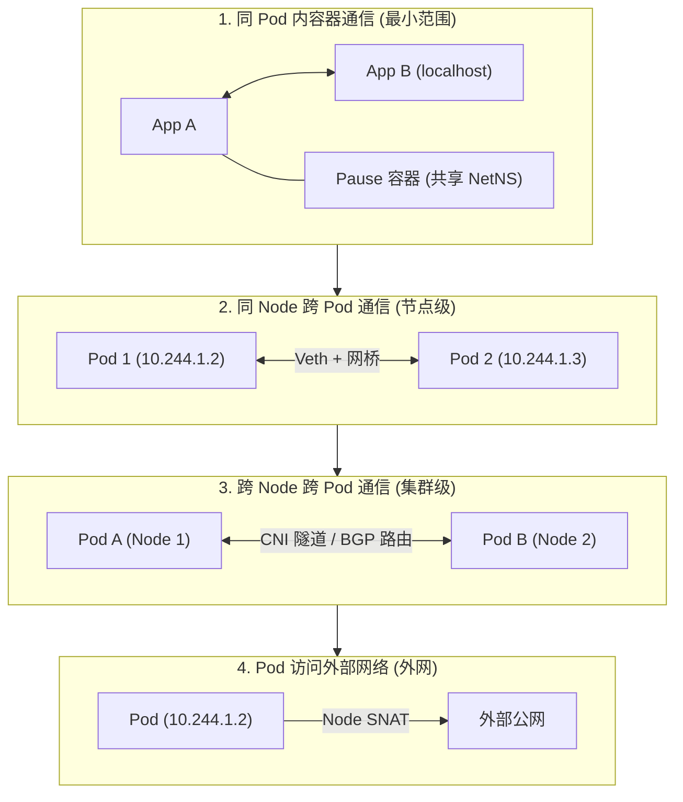
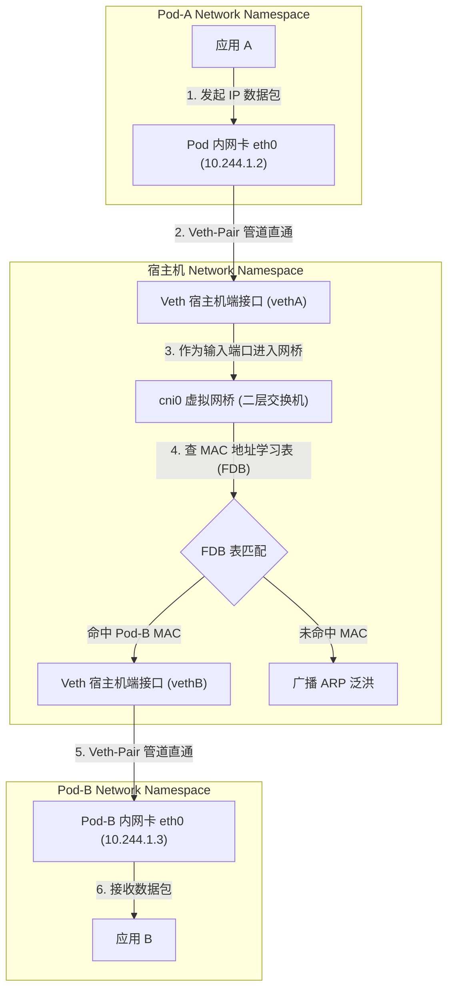
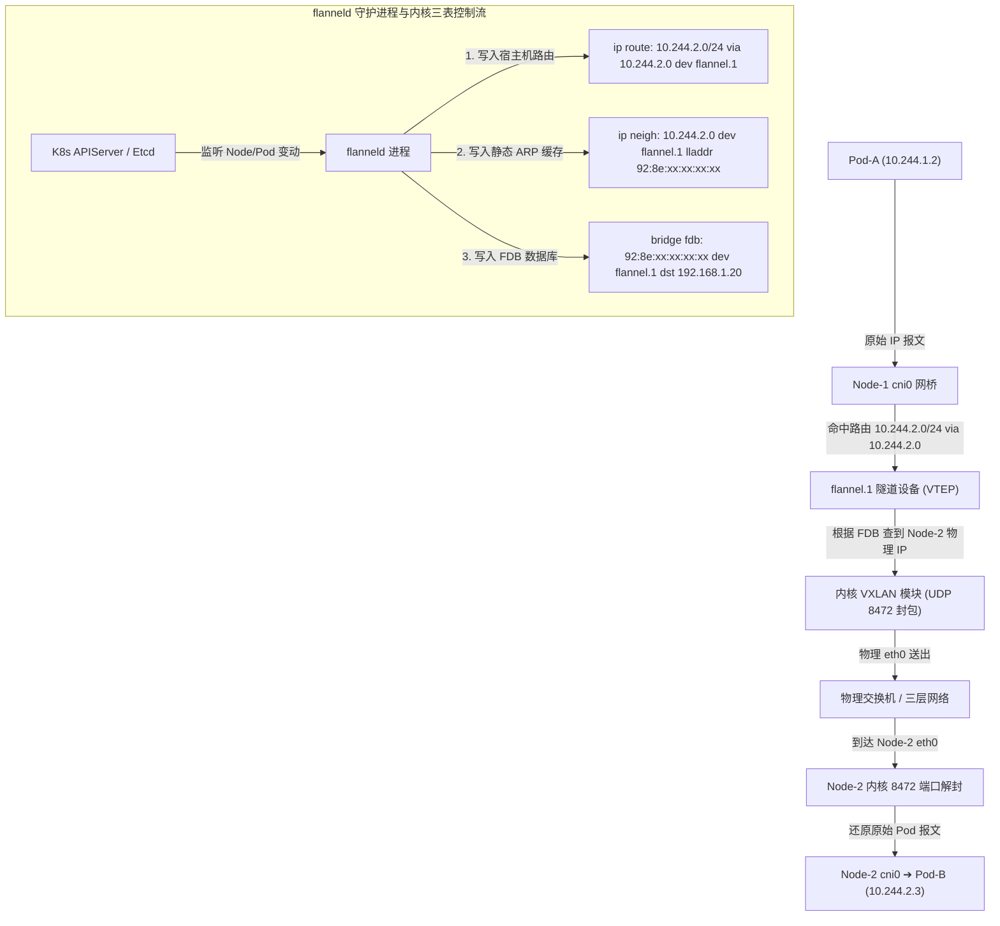
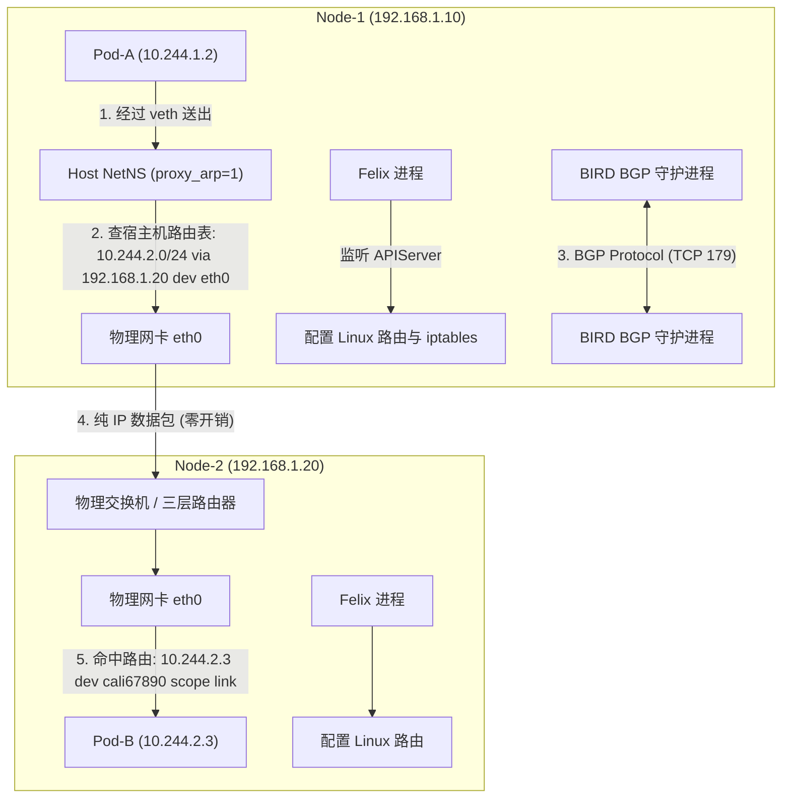
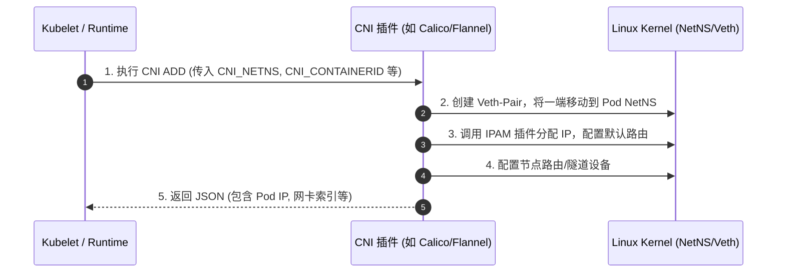
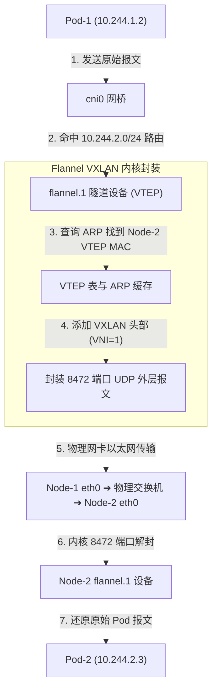

# 🌐 Kubernetes 集群网络架构与 CNI 原理

Kubernetes 网络模型的核心设计哲学是：**每个 Pod 拥有一个全局唯一的独立 IP 地址**。Pod 内部的所有容器共享相同的 Network Namespace，跨节点的 Pod 之间可以在无需显式端口映射（NAT）的情况下直接通过 IP 地址进行双向通信。

---

## 一、 Kubernetes 核心网络设计原则

Kubernetes 规范规定了所有集群网络方案必须满足的三个基本约束：

1.  ** Pod 间直通**：集群内任意节点上的 Pod 都可以直接通过 IP 访问其他节点上的 Pod（无需 NAT）。
2.  ** Node 与 Pod 直通**：节点上的 Agent（如 `kubelet`）可以直接通过 Pod IP 访问该节点上的所有 Pod。
3.  ** IP 语义一致**：Pod 看到自己的 IP，与其他 Pod 看见的该 Pod IP 完全相同（无 NAT 转换）。

---

## 二、 4 大 Kubernetes 基础通信模型



### 1. 同一个 Pod 内容器间通信
*   **原理**：Pod 启动时首先创建并运行 Pause 容器（Infra Container），Pause 持有 Pod 级的 Network Namespace。
*   **交互**：业务容器共享该 Namespace，业务容器之间直接通过 `localhost` 加上各自端口完成数据互访，完全走系统回环网卡 `lo`，性能极高。
*   > 💡 **底层细节延伸**：使用 Docker 运行时通过 `--net=container:<pause_id>` 关联；而 Containerd 在 OCI Specification 中将 `/proc/<pause_pid>/ns/net` 直接写入 `namespaces` 节点，由 `runc` 执行 `setns` 生效。详见：[03-Docker与Containerd底层实现及Pause通信深度解析.md](../01-组件原理/04-Kubelet/03-Docker与Containerd底层实现及Pause通信深度解析.md)。

---

### 2. 同一 Node 上 Pod 间的通信 (Veth-Pair 与虚拟网桥二层转发)

当同一节点上的 `Pod-A (10.244.1.2)` 访问 `Pod-B (10.244.1.3)` 时，底层通过 **Veth-Pair 虚拟网卡对** 与 **宿主机虚拟网桥（如 `cni0`）** 完成二层以太网帧转发：



#### 核心机制与架构优势：
1. **Veth-Pair 虚拟设备对**：
   - Veth-Pair 就像一条无形的虚拟网线，成对创建。一端放置在 Pod 的 Network Namespace 中（命名为 `eth0`），另一端插在宿主机的 Network Namespace 中（命名为 `vethXXXX`）。
   - 从 `eth0` 发出的所有数据包，会瞬间直接从宿主机端的 `vethXXXX` 弹出，数据传输完全在内核内存中完成。
2. **`cni0` 虚拟网桥二层交换**：
   - 同一 Node 上的所有 Pod 宿主机端 Veth 网卡都插在同一个虚拟二层网桥（如 `cni0`）上。
---

### 💡 架构关键辨析：`cni0` 虚拟网桥 vs 宿主机物理网卡 (`eth0`)

> **核心结论**：`cni0` 虚拟网桥是 Node 内部的“二层局域网交换机”，而宿主机物理网卡（如 `eth0`）是连接外部物理世界的“出口网关/路由器”。它们在逻辑与物理上是完全分离的，通过 **Linux 内核路由表与 SNAT 规则** 产生关联。

#### 1. 两种核心通信场景对比 (流量走不走物理网卡？)

* **场景 1：同节点 Pod 访问 Pod (`Pod-A ➔ Pod-B`)**
  - **数据路径**：`Pod-A` ➔ `vethA` ➔ **`cni0` 网桥** ➔ `vethB` ➔ `Pod-B`
  - **物理关系**：数据包完全在 `cni0` 虚拟网桥内部完成二层 MAC 帧交换。**此时与宿主机物理网卡没有任何关系，物理网卡 0% 参与！**
* **场景 2：Pod 访问跨节点 Pod 或公网外网 (`Pod-A ➔ 外网/Node-2`)**
  - **数据路径**：
    1. `Pod-A` 将数据包发送给默认网关（即 `cni0` 网桥的 IP `10.244.1.1`）。
    2. 数据包从 `cni0` 弹出，推给 **Linux 宿主机内核路由表** (`ip route`)。
    3. 宿主机命中路由表与 `iptables` 中的 `SNAT (MASQUERADE)` 规则，把源 IP 替换为宿主机的物理 IP (`192.168.1.10`)。
    4. 最后由 **宿主机物理网卡 (`eth0`)** 把数据包真实发送到物理线缆上。

#### 2. 3 个最容易混淆的技术事实

1. **物理网卡插不插在 `cni0` 上？**
   - **不插**。`cni0` 上只插各个 Pod 的 `veth` 接口。宿主机物理网卡（`eth0`）是一个独立的物理设备，不属于 `cni0` 的端口。
2. **`cni0` 为什么有一个 IP 地址？**
   - `cni0` 在宿主机看来也是一个虚拟网络设备，它的 IP（如 `10.244.1.1`）充当了当前节点上**所有 Pod 的默认网关 (Default Gateway)**。
3. **它们是怎么连接起来的？**
   - 依靠 Linux 内核的 **三层路由转发 (`net.ipv4.ip_forward=1`)** 和 **IP 伪装 (`iptables POSTROUTING SNAT`)** 作为桥梁，把 `cni0` 的虚拟二层局域网与宿主机物理网卡的外部网络连接在一起。

---

### 3. 跨 Node 的 Pod 间通信 (CNI 内核组件与二/三层物理封包)

当 `Node-1 (192.168.1.10)` 上的 `Pod-A (10.244.1.2)` 访问 `Node-2 (192.168.1.20)` 上的 `Pod-B (10.244.2.3)` 时，两大主流 CNI 方案的物理层与数据组件流转如下：

#### (1) Flannel VXLAN 模式 (Overlay 二层 UDP 8472 封包剖析)

Flannel 通过 `flanneld` 守护进程与内核 `VXLAN` 驱动协同工作：

```text
                                 [物理线缆上的完整以太网报文 Header 分布]
┌────────────────────────────────────────────────────────────────────────────────────────────────────────┐
│ 物理 Eth Header │ Outer IP Header          │ Outer UDP Header │ VXLAN Header │ Inner Eth Header │ Inner IP Header         │ Payload │
│ (Src/Dst MAC)   │ Src: 192.168.1.10        │ Dst Port: 8472   │ VNI: 1       │ (PodA/PodB MAC)  │ Src: 10.244.1.2         │ (Data)  │
│ 14 Bytes        │ Dst: 192.168.1.20 (20B)  │ (8 Bytes)        │ (8 Bytes)    │ 14 Bytes         │ Dst: 10.244.2.3 (20B)   │         │
└────────────────────────────────────────────────────────────────────────────────────────────────────────┘
```



* **包头精准开销**：VXLAN 封包增加了外层 Eth (14B) + Outer IP (20B) + Outer UDP (8B) + VXLAN Header (8B) = **额外 50 字节 Header 开销**！因此使用 Flannel VXLAN 时，宿主机网卡 MTU 若为 1500，**Pod 内网卡 MTU 必须强制设为 1450**（1500 - 50），否则大包必触发 PMTUD 分片或静默丢包！

---

#### (2) Calico BGP 模式 (Direct Routing 零封包路由机制)

Calico 的核心组件包括 **Felix**、**BIRD** 和 **BPF/Iptables 规则管理器**，彻底放弃了 `cni0` 网桥和封包开销：



* **Proxy ARP 关键内核参数**：
  Calico 为每个 Pod 在宿主机侧创建的 `caliXXXX` 接口都将 `/proc/sys/net/ipv4/conf/caliXXXX/proxy_arp` 设为 `1`。
  当 Pod-A 发起 ARP 查询网关 IP 时，宿主机的 `cali` 网卡强行用自己的 MAC 地址响应。因此 Pod-A 产生的所有数据包都直接发给宿主机，完全由宿主机路由表进行三层转发。
* **BIRD BGP 路由广播**：
  每个节点上的 `BIRD` 进程作为 BGP Client（或搭配 Route Reflector 路由反射器），在节点之间实时同步路由信息（如 `10.244.2.0/24 via 192.168.1.20`）。网络中没有封包解包，**吞吐量等同于物理线缆极限**！
* > 💡 **深度专题延伸**：关于 Calico 分层架构、`calico-node`（Felix、BIRD、confd、IPAM）与 `calico-kube-controllers`（Node、Policy、Namespace 垃圾回收）的深度运作机制，详见：[02-1-Calico架构与calico-node及kube-controllers深度剖析.md](./02-1-Calico架构与calico-node及kube-controllers深度剖析.md)。

---

### 3. 跨 Node 的 Pod 间通信
当 `Node-1` 上的 `Pod-A (10.244.1.2)` 访问 `Node-2` 上的 `Pod-B (10.244.2.3)` 时，需要依靠 **CNI 插件** 搭建跨主机网络通道。目前业界有两种主流实现方案：

#### (1) Overlay 覆盖网络方案 (如 Flannel VXLAN / Calico IPIP)
Overlay 方案在已有的物理三层网络之上构建一层虚拟的二层/三层Overlay网络。

```text
                                [物理以太网包 (Outer)]
┌─────────────────────────────────────────────────────────────────────────────────┐
│ Outer IP (Node1 -> Node2) │ Outer UDP (8472) │ VXLAN Header │ Inner IP (PodA -> PodB) │ Payload │
└─────────────────────────────────────────────────────────────────────────────────┘
```
1.  **封包 (Encapsulation)**：数据包离开 `Node-1` 的 Pod 后，命中内核路由进入隧道设备（如 `flannel.1` 或 `tunl0`）。隧道设备将原始 Pod 数据包作为 Payload，嵌套一层外层 UDP/IP 报文（源地址为 `Node-1 IP`，目的地址为 `Node-2 IP`）。
2.  **传输**：外层报文在物理网络中像普通 Node 间流量一样路由传输。
3.  **拆包 (Decapsulation)**：到达 `Node-2` 后，内核隧道设备解封外层报文，还原原始 Pod 数据包，送入 `Node-2` 的网桥并到达 `Pod-B`。

#### (2) Direct Routing 直连路由方案 (如 Flannel Host-GW / Calico BGP)
直连路由方案**不进行数据包二次封装**，将宿主机直接作为路由器使用。

```text
Pod-A (10.244.1.2) ──► Node-1 ──[物理二层交换机/直连路由]──► Node-2 ──► Pod-B (10.244.2.3)
```
1.  **路由表配置**：CNI 插件在 `Node-1` 的宿主机路由表中添加一条静态/动态路由：
    `10.244.2.0/24 via <Node-2_IP> dev eth0`
2.  **转发**：`Node-1` 上的内核路由表直接将目的 IP 为 `Pod-B` 的数据包发往 `Node-2` 物理网卡。
3.  **优势**：由于没有 UDP 封包解包的性能损耗，吞吐量几乎等同于宿主机物理网络。
4.  **限制**：要求所有 Node 必须处于**同一个二层广播域**（或物理路由器支持 BGP 路由协议同步）。

---

### 4. Pod 访问集群外部网络
当 Pod 主动访问集群外网（如公网 API）时：
1.  数据包流出 Pod 到达宿主机。
2.  宿主机 `iptables` 规则命中 `POSTROUTING` 链中的 `MASQUERADE` 规则。
3.  宿主机进行 **SNAT**，把源地址从 `Pod IP (10.244.1.2)` 替换为 `Node 物理 IP`。
4.  外网响应包返回到 Node 物理网卡，Node 通过 `conntrack` 表进行反向 DNAT 转换后推回 Pod。

---

## 三、 CNI (Container Network Interface) 规范与主流插件

CNI 是 CNCF 旗下的标准接口规范，定义了容器运行时如何配置和管理容器网络。

### 1. CNI 插件交互工作流



### 2. 主流 CNI 插件对比矩阵

| CNI 插件 | 模式 | 跨节点通信技术 | 数据包开销 | 适用场景 |
| :--- | :--- | :--- | :--- | :--- |
| **Flannel** | VXLAN (默认) | UDP 8472 隧道封包 | 较高 (50 字节 Header 开销) | 中小型集群，简单的扁平网络需求 |
| **Flannel** | Host-GW | 宿主机静态路由 | **零开销** | 必须位于同一个二层局域网的私有云 |
| **Calico** | IPIP | IP-in-IP 隧道封包 (tunl0) | 较小 (20 字节 IP Header) | 跨三层子网的大型企业集群 |
| **Calico** | BGP | BGP 动态路由宣告 (Felix/BIRD) | **零开销** | 高性能要求，物理网络支持 BGP 组网 |
| **[Cilium](./04-eBPF与Cilium下一代网络架构原理.md)** | eBPF / Direct | eBPF 替换 iptables + VXLAN/Geneve | 极低 / 零开销 | 超大规模集群、高并发、微服务 Service Mesh |

---

## 四、 深度扩展：Flannel VXLAN 与 Calico BGP 物理封包原理 (孟凡杰课程精髓)

### 1. Flannel VXLAN 模式的数据包封包全路径
当 Pod-1 (10.244.1.2) 向 Node-2 上的 Pod-2 (10.244.2.3) 发送 HTTP 请求时：



* **VTEP (VXLAN Tunnel End Point)**：`flannel.1` 设备既是虚拟网卡也是 VTEP 端点。
* **ARP & FDB 转发数据库**：`flanneld` 进程监听到 Node-2 加入集群后，在 Node-1 内核中添加三条映射：
  1. 路由表：`10.244.2.0/24 via 10.244.2.0 dev flannel.1 onlink`
  2. ARP 表：`10.244.2.0` 对应的 MAC 地址为 Node-2 的 `flannel.1` MAC。
  3. FDB 表：Node-2 `flannel.1` MAC 对应的宿主机 IP 为 `192.168.1.20`。

---

### 2. Calico BGP 模式网络拓扑
Calico 在不经过任何二层封包的情况下，通过 BGP (Border Gateway Protocol) 将每台宿主机配置为一个独立的虚拟路由器：

```text
┌──────────────────────────────┐              ┌──────────────────────────────┐
│            Node-1            │              │            Node-2            │
│  ┌────────────────────────┐  │  BGP Peer    │  ┌────────────────────────┐  │
│  │   BIRD (BGP 守护进程)   │◀┼─────────────┼▶ │   BIRD (BGP 守护进程)   │  │
│  └───────────┬────────────┘  │  (端口 179)  │  └───────────┬────────────┘  │
│              ▼               │              │              ▼               │
│  宿主机路由表:               │              │  宿主机路由表:               │
│  10.244.2.0/24 via Node-2 IP │              │  10.244.1.0/24 via Node-1 IP │
└──────────────────────────────┘              └──────────────────────────────┘
```

* **Felix**：负责编写 Linux 宿主机内核路由表和 iptables/IPVS 规则。
* **BIRD**：负责集群内各 Node 节点间（BGP Route Reflector）的 BGP 动态路由宣告。数据包以纯 IP 直连方式在物理网络中转发，**性能极其接近物理网络极限**。

---

> [!TIP] 💡 关联技术与延伸阅读
>
> * [Calico 架构与底层实现深度剖析](./02-1-Calico架构与calico-node及kube-controllers深度剖析.md)
> * [Flannel 网络模式深度解析与对比](./07-Flannel网络模式深度解析与对比.md)
> * [集群网络访问全链路流程](./03-集群网络访问详细流程.md)
> * [kube-proxy 底层转发与负载均衡](../01-组件原理/05-Kube_Proxy.md)
