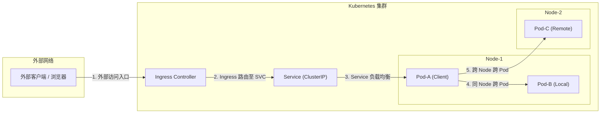
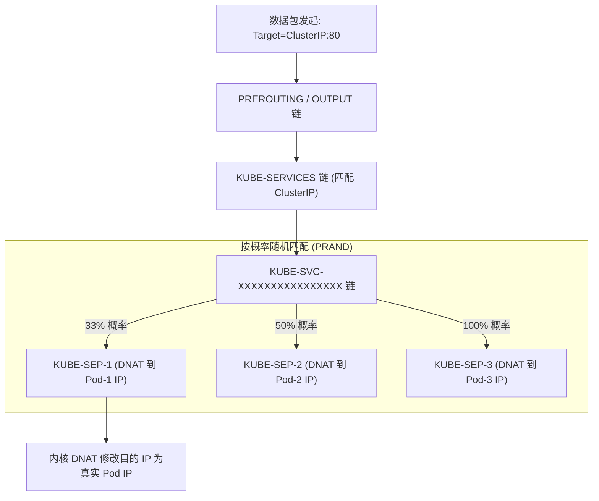
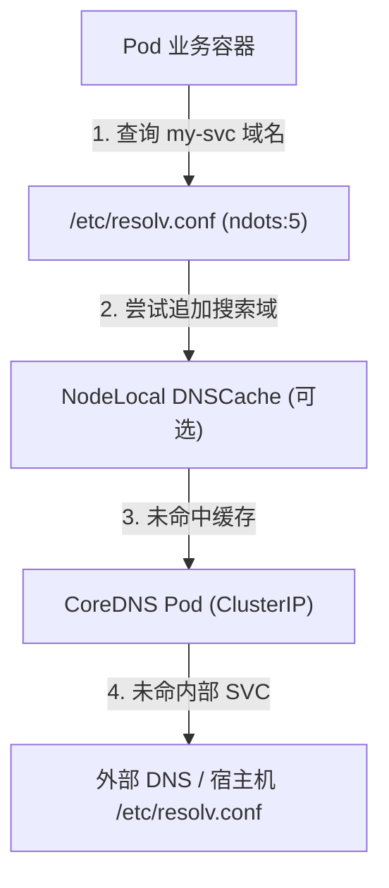
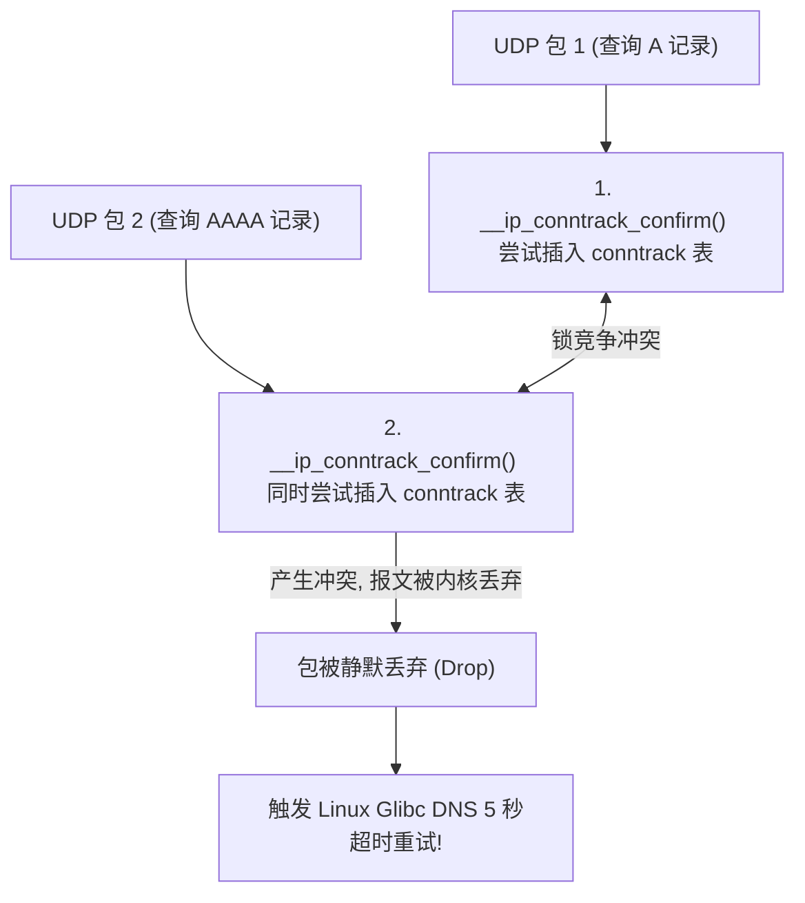

# 🌐 Kubernetes 集群网络访问详细流程

本文以「一个数据包的完整生命周期」为视角，逐跳追踪 Kubernetes 集群中各类网络访问场景的底层流转逻辑，并深度剖析 kube-proxy、Service 负载均衡以及 CoreDNS 的内核机制。

---

## 一、 全景：Kubernetes 网络访问的 5 大场景



---

## 二、 Service 服务发现与负载均衡底层原理

Service 是 Kubernetes 解决 Pod IP 动态变化（Pod 重启或扩缩容）的关键抽象。Service 的 IP（ClusterIP）是一个**虚拟 IP**（VIP），宿主机物理网卡上并不存在这个 IP 接口。所有发送到 ClusterIP 的流量，全靠部署在各节点上的代理服务 **kube-proxy** 进行拦截与重定向。

### 1. kube-proxy 3 种 ProxyMode 深度剖析

```text
┌────────────────────────────────────────────────────────────────────────┐
│ 1. Userspace Mode (v1.0 废弃)                                           │
│    Client Pod ──► Kernel iptables ──► 用户态 kube-proxy ──► Target Pod   │
│    缺点: 两次用户态/内核态上下文切换，性能极差                               │
├────────────────────────────────────────────────────────────────────────┤
│ 2. Iptables Mode (标准默认)                                             │
│    Client Pod ──► Kernel Netfilter (PREROUTING / OUTPUT) ──► Target Pod │
│    优点: 纯内核态转发                                                   │
│    缺点: 规则表为线性数组，算法复杂度 O(N)，集群规模大时 CPU 飙升          │
├────────────────────────────────────────────────────────────────────────┤
│ 3. IPVS Mode (大中型集群推荐)                                           │
│    Client Pod ──► Kernel IPVS (Netfilter Hook) ──► Target Pod          │
│    优点: 基于内核 Hash 表，算法复杂度 O(1)，支持多种复杂 LB 算法         │
└────────────────────────────────────────────────────────────────────────┘
```

---

### 2. iptables 模式下的概率负载均衡链条

当向 ClusterIP 发起请求时，数据包在内核 Netfilter 管道中的流转过程如下：



#### iptables 概率链防坑点：
如果有 3 个 Endpoint Pod，kube-proxy 生成的规则链概率分布如下：
1. 第一条规则匹配概率为 $1/3$。
2. 若未命中，进入第二条规则，匹配概率为剩下一半（即 $(1 - 1/3) \times 1/2 = 1/3$）。
3. 若未命中，进入第三条规则，匹配概率为 $100\%$。
通过这种按递减概率叠加的方式，使得流量在概率上实现**绝对均匀的随机负载均衡**。

---

### 3. IPVS 模式下的高效 Hash 映射

在高并发或有上万个 Service 的大规模集群中，iptables 规则数量会随 Pod 数量暴涨至数十万条，此时 `iptables -L` 遍历会导致严重的内核延迟。

#### IPVS 的实现优势：
1. **Hash 表散列**：IPVS 针对 ClusterIP/NodePort 建立虚拟服务器（Virtual Server），绑定对应存有 Endpoint IP 的 `ipset` 规则，查询开销为 $O(1)$。
2. **丰富的均衡算法**：支持 `rr`（轮询）、`lc`（最小连接）、`dh`（目标哈希）、`sh`（源哈希）、`sed`（最小期望延迟）等多种算法。

---

## 三、 CoreDNS 域名解析机制与性能坑点

集群内部通过 `service-name.namespace.svc.cluster.local` 的域名互相访问，其核心依靠集群内置的 **CoreDNS** 服务。



### 1. Pod 默认 `/etc/resolv.conf` 配置
Pod 启动时，Kubelet 会为其自动注入以下 DNS 配置：
```ini
nameserver 10.96.0.10
search default.svc.cluster.local svc.cluster.local cluster.local
options ndots:5
```

### 2. `ndots:5` 的性能陷阱与优化

*   **陷阱原理**：`ndots:5` 表示：**若请求域名中的句点 `.` 数量少于 5 个，DNS 解析器必须优先按 `search` 域逐层拼接搜索，直到失败后再进行原始域名查询**。
*   **影响**：当 Pod 内部代码发起访问外部网站 `www.baidu.com`（点数为 2，< 5）时，解析器会产生以下无效请求链：
    1.  `www.baidu.com.default.svc.cluster.local` (NXDOMAIN)
    2.  `www.baidu.com.svc.cluster.local` (NXDOMAIN)
    3.  `www.baidu.com.cluster.local` (NXDOMAIN)
    4.  `www.baidu.com` (最终成功)
    一次公网 DNS 解析产生了 **4 次 UDP 报文开销**，导致整体 QPS 下降及 CoreDNS 压力飙升。

#### 生产优化方案：
1.  **域名末尾加点**：代码中使用绝对域名 `www.baidu.com.`（显式指定点数或绝对路径，绕过搜索域）。
2.  **Pod 级别自定义 `dnsConfig`**：在 Pod Spec 中覆盖 `ndots` 参数：
    ```yaml
    dnsConfig:
      options:
        - name: ndots
          value: "2"
    ```
3.  **部署 NodeLocal DNSCache**：在每个节点上以 DaemonSet 方式部署 LocalDNS，拦截节点上的 DNS UDP 流量，缓存解析结果，消除 CoreDNS 单点瓶颈。

---

## 四、 深度扩展：NodeLocal DNSCache 防 UDP 锁竞争机制 (孟凡杰课程精髓)

### 1. UDP 5 秒超时 (Conntrack Race Condition) 的物理根因
Linux 内核在处理并发 UDP 数据包的 DNAT 转换时存在已知 race condition：
当 Pod 并发发起两个 UDP DNS 查询（如 A 记录和 AAAA 记录）时，两个数据包通过不同的 socket 发往同一个 ClusterIP：



### 2. NodeLocal DNSCache 解决流程
NodeLocal DNSCache 以 DaemonSet 在每个工作节点运行一个轻量 DNS 代理：

* **绑定 Link-Local IP**：在宿主机网卡上绑定一个 link-local IP（如 `169.254.20.10`）。
* **免 DNAT 方案**：Pod 的 `nameserver` 指向 `169.254.20.10`。所有 DNS 请求直接在本地节点环回网卡以 **TCP 或免 DNAT 的方式** 处理，**彻底绕过了 Netfilter conntrack 连接跟踪表**，从根本上消除了 UDP 5 秒延时的毒瘤！

---

> [!TIP] 💡 关联技术与延伸阅读
>
> * [kube-proxy 与 Linux 内核数据流深度剖析](../01-组件原理/05-Kube_Proxy.md)
> * [CoreDNS 域名解析与服务发现全链路](./08-CoreDNS底层架构与服务发现技术深度指南.md)
> * [七层 Ingress 流量接入全流程](./05-1-Ingress基础全景与进化延伸指南.md)
