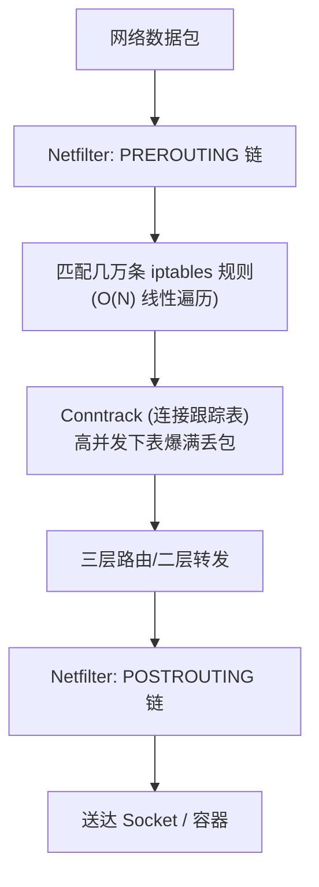
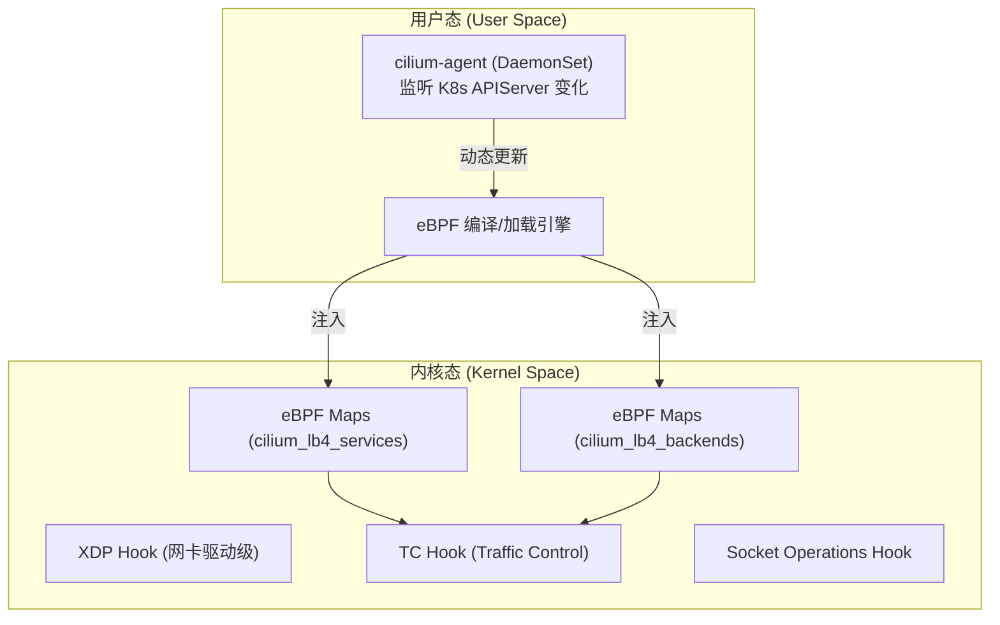
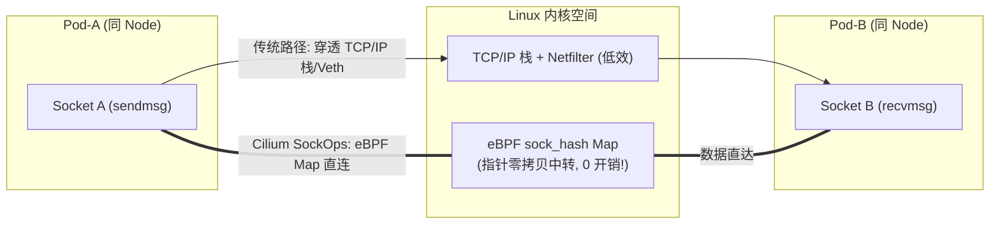

# 🐝 eBPF 与 Cilium 下一代云原生网络架构深度解析

深入剖析 Linux 内核 eBPF 技术原理、Cilium 如何通过 eBPF 彻底替代 kube-proxy 与 Netfilter/iptables，以及 XDP 极速报文处理、Socket 层 Bypass 机制与 Service Mesh 扩展。

---

## 一、 传统 K8s 网络 (Netfilter/iptables) 的性能瓶颈

在传统 K8s 网络中（如 `Flannel + kube-proxy(iptables)`），数据包转发严重依赖 Linux 内核的 **Netfilter** 框架：



### 致命瓶颈：
1. **$O(N)$ 线性匹配时延**：iptables 规则链是单向链表，集群有 1 万个 Service 时会产生几万条规则，每个包都要逐条遍历匹配，延迟呈线性飙升。
2. **Conntrack 连接跟踪锁瓶颈**：高并发长短连接交替场景下，Linux 内核 `nf_conntrack` 表容易爆满，引发 `netfilter: connection tracking full` 丢包与 CPU 锁竞争。
3. **协议栈开销过大**：数据包必须完整走完内核 TCP/IP 协议栈（L2 ➔ L3 ➔ L4），经历多次内存拷贝与软中断。

---

## 二、 eBPF 技术核心原理

**eBPF (Extended Berkeley Packet Filter)** 允许开发者在无需修改内核源码或加载内核模块的前提下，将沙箱字节码动态注入内核指定 Hook 点（Hook Point）安全高效地运行。


### 核心特性：
- **安全沙箱 (Verifier)**：内核在加载字节码前进行严格的静态指令分析，确保无死循环、空指针解引用或越界访问。
- **JIT 即时编译**：直接将 eBPF 字节码编译为 x86/ARM 本机 CPU 机器码，运行效率接近原生 C 内核。
- **eBPF Maps**：高效的内核 KV 哈希表，支持用户态 `cilium-agent` 与内核态 eBPF 程序实时共享服务映射字典。

---

## 三、 Cilium 核心架构与底层数据面

Cilium 是基于 eBPF 打造的下一代云原生网络、安全与服务网格插件。



---

## 四、 Cilium 如何完全替代 kube-proxy (eBPF Service 负载均衡)

Cilium 通过在 Linux 内核的 **TC (Traffic Control)** 和 **Socket Hook** 点注入 eBPF 程序，完全摆脱对 `kube-proxy` 和 `iptables` 的依赖。

### 转发路径对比：

```text
【传统 kube-proxy (iptables)】:
数据包 ➔ 物理网卡 ➔ Netfilter PREROUTING ➔ 逐条匹配 10,000 条 iptables 链 ➔ DNAT ➔ 发送

【Cilium (eBPF 模式)】:
数据包 ➔ 进入 TC Hook ➔ 运行 eBPF 程序 ➔ O(1) 查 eBPF Map (cilium_lb4_services) ➔ 直接修改 IP ➔ 转发
```

```c
// eBPF 拦截逻辑示意伪代码 (内核态运行)
SEC("tc")
int cilium_service_lb(struct __sk_buff *skb) {
    // 1. 提取数据包三四层 Key (Dst IP, Dst Port)
    struct lb4_key key = extract_key(skb);
    
    // 2. O(1) 查找 eBPF 哈希 Map
    struct lb4_service *svc = map_lookup_elem(&cilium_lb4_services, &key);
    if (svc) {
        // 3. 直接在 SKB 内存区域完成目标 Pod IP 重写 (DNAT)
        struct lb4_backend *backend = select_backend(svc);
        update_packet_dst(skb, backend->ip, backend->port);
        return TC_ACT_OK; // 直接转发，彻底绕过 Netfilter 链!
    }
    return TC_ACT_OK;
}
```

> 💡 **性能性能收益**：在 10 万级 Service 规模下，Cilium 转发延迟保持在微秒级且**曲线完全平坦**（恒定 $O(1)$ 查找），吞吐量比 iptables 提高 300% 以上。

---

## 五、 Socket 层加速 (SockOps Bypass) 机制

同一 Node 节点上的 Pod 间通信时，传统网络包需要向下穿透 TCP/IP 协议栈、Veth-Pair 设备，再向上穿透到目标 Pod 协议栈。

Cilium 提供了 **Socket Layer Enforcement (SockOps)** 优化，实现套接字直连：



- **机制**：Cilium 将本地容器的套接字描述符保存在 `sock_hash` Map 中。
- **效果**：当 Pod-A 向 Pod-B 发送数据时，eBPF 的 `sk_msg` 程序捕获 `sendmsg` 调用，直接把数据包内存指针投递给 Pod-B 的 Socket 接收队列。
- **结果**：**完全绕过网络层、二层链路层与 Veth 设备**，TCP 延迟下降 50% 以上。

---

## 六、 XDP 与带宽管理 (Bandwidth Manager)

### 1. XDP (eXpress Data Path) 极速防御
XDP 是 Linux 内核中最靠近网卡驱动层的 eBPF 挂接点（数据包刚从网卡 DMA 接收、尚未分配 `sk_buff` 内存结构体时）。
*   **DDoS 极速丢包**：恶意流量在到达 TCP/IP 协议栈前被 `XDP_DROP` 扔掉，单核可处理上千万 PPS 攻击流量。
*   **极速 NodePort 转发**：通过 `XDP_TX`，发往 NodePort 的流量在驱动层直接修改 IP 并原网卡弹回。

### 2. Cilium Bandwidth Manager (EDT 替代 HTB)
传统 K8s 通过 CNI 插件使用 Linux TC 规则 (HTB) 进行 Pod 限速，容易产生缓冲区膨胀（Bufferbloat）和高延迟。
Cilium 基于 eBPF 的 **EDT (Earliest Departure Time)** 机制，在套接字层直接计算数据包的最早离开时间戳，避免在网络接口处堆积队列，在保证限速精准度的同时将平缓延迟降低 90%。

---

## 七、 深度扩展：Cilium 双模式部署与生产 Helm 参数矩阵 (孟凡杰课程精髓)

### 1. Cilium 两大模式对比
* **Overlay 模式 (Geneve/VXLAN)**：全二层虚拟封包。无需物理网络支持，可跨任意三层网段部署（适用于 AWS / 阿里云等 VPC 场景）。
* **Direct Routing 模式 (Native Routing)**：直接基于宿主机内核路由转发，去除封包头开销。要求物理网口间二层互通，通过 `bpf-lb-mode: dsr` 实现直接服务端响应（DSR）。

### 2. 生产级 Cilium Helm 核心调优参数
```yaml
# Cilium 生产 Helm 参数配置
kubeProxyReplacement: "strict"            # 彻底替换 kube-proxy (包括 NodePort / ClusterIP)
tunnel: "disabled"                       # 开启 Native Direct Routing (零封包开销)
ipv4NativeRoutingCIDR: "10.244.0.0/16"   # 指定 Pod CIDR 网段
bpf:
  masquerade: true                       # 基于 eBPF 的 SNAT (替换 iptables MASQUERADE)
  clockProbe: true
enableIPv4Masquerade: true
loadBalancer:
  mode: dsr                              # 开启 DSR (Direct Server Return) 模式，响应包绕过 LB 节点
sockops:
  enabled: true                          # 开启 Socket 层 (sendmsg/sk_msg) eBPF 直连加速
```

---

> [!TIP] 💡 关联技术与延伸阅读
>
> * [传统 kube-proxy iptables/IPVS 瓶颈剖析](../01-组件原理/05-Kube_Proxy.md)
> * [Calico 路由模式对比](./02-1-Calico架构与calico-node及kube-controllers深度剖析.md)
> * [eBPF 云原生无侵入可观测性](../06-集群运维/08-云原生可观测性架构Prometheus_Thanos_Tempo与eBPF链路追踪.md)
