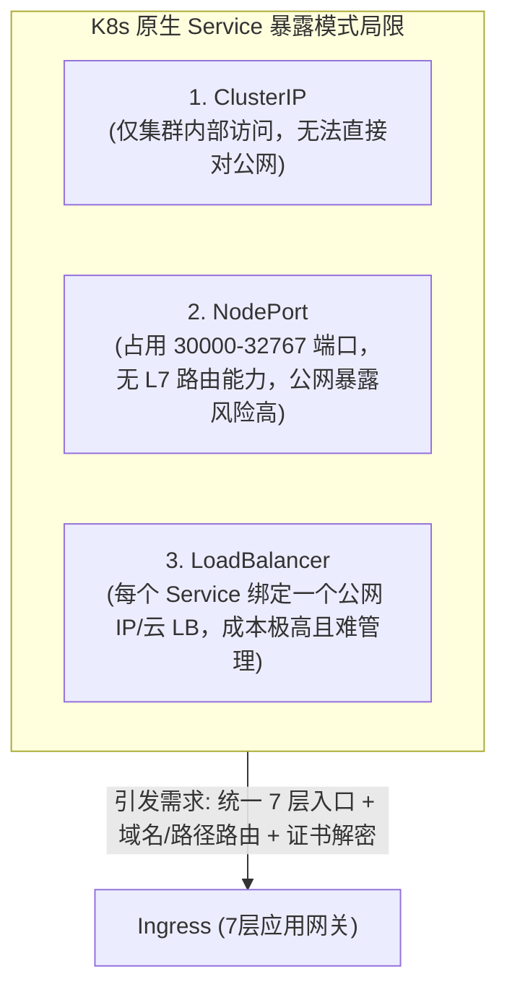
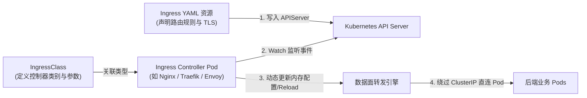
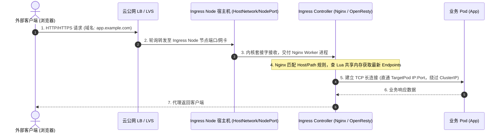
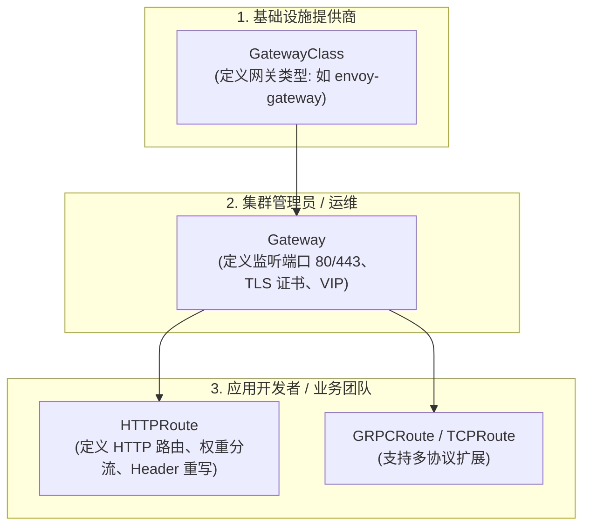
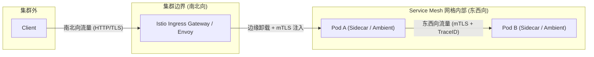
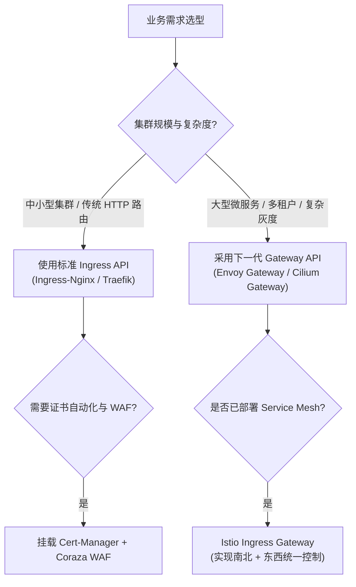

# 🌐 Kubernetes Ingress 核心原理、架构全景与下一代技术演进指南

本文全面剖析 Kubernetes Ingress 的诞生背景、核心架构组件、Spec 字段匹配算法、高可用网络流量路径，并重点进行 **4 大一级架构延伸**（包含 Gateway API 演变、Service Mesh 协同、高可用部署选型以及安全可观测体系）。

---

## 一、 Ingress 诞生背景与设计初衷

在 Kubernetes 集群中，Pod 的 IP 是动态变化的。为了向外部客户端暴露 HTTP/HTTPS 服务，K8s 早期提供了三种原生 Service 模式，但各自存在局限：



### 1.1 四种网络暴露方式对比矩阵

| 特性维度 | ClusterIP | NodePort | LoadBalancer | Ingress (L7 网关) |
| :--- | :--- | :--- | :--- | :--- |
| **网络层级** | L4 (TCP/UDP) | L4 (TCP/UDP) | L4 (TCP/UDP) | **L7 (HTTP/HTTPS/gRPC)** |
| **外部可达性** | 否 | 是 (通过宿主机端口) | 是 (通过云厂商公网 IP) | **是 (统一入口)** |
| **域名/路径路由**| 不支持 | 不支持 | 不支持 | **支持 (基于 Host 和 Path 转发)** |
| **TLS/SSL 卸载** | 不支持 | 不支持 | 部分云厂商支持 | **原生支持 (Secret 托管证书)** |
| **IP 资源开销** | 占用 ClusterIP | 消耗节点端口 | 每个服务消耗一个公网 IP | **多个服务共享 1~2 个公网 IP** |

### 1.2 Ingress 的解耦设计哲学
Ingress 的核心设计思想是 **声明与实现分离**：
* **控制面声明（Kubernetes API）**：开发者仅需编写 YAML 规则（Ingress 资源），定义域名、路径与后端的映射关系。
* **数据面实现（Ingress Controller）**：由独立的网络组件（如 Ingress-Nginx、Traefik、Envoy 等）监听 API 变更，将 YAML 规则转换为代理引擎真正的配置文件（如 `nginx.conf`）并动态生效。

---

## 二、 Ingress 核心概念与架构组件

一个完整的 Ingress 解决方案由以下三要素构成：



### 2.1 Ingress Resource (规则声明对象)
Kubernetes 中的 `networking.k8s.io/v1` Ingress 对象，仅存放路由规则、域名和证书配置。

### 2.2 Ingress Controller (控制器与代理引擎)
集群内运行的守护进程（ Pod 形式），负责：
1. 监听 APIServer 中 `Ingress`、`Service`、`Endpoints`、`Secret` 资源的更新。
2. 将 Ingress 规则实时转化为 Nginx / Envoy / Traefik 的转发逻辑。
3. 执行具体的 7 层 HTTP/HTTPS 负载均衡、TLS 终止与 Header 处理。

### 2.3 IngressClass (多控制器协同与隔离)
当集群内同时存在多个 Ingress Controller（例如：公网访问走 `nginx-external`，内网网关走 `nginx-internal`，特种流量走 `traefik`）时，通过 `IngressClass` 进行路由解耦：

```yaml
apiVersion: networking.k8s.io/v1
kind: IngressClass
metadata:
  name: nginx-external
  annotations:
    ingressclass.kubernetes.io/is-default-class: "true" # 设为默认控制器
spec:
  controller: k8s.io/ingress-nginx                       # 指定控制器标识
```

在 Ingress 资源中通过 `spec.ingressClassName: nginx-external` 进行绑定。

---

## 三、 Ingress API 规范与关键配置详解

### 3.1 标准 Ingress Spec YAML 模版

```yaml
apiVersion: networking.k8s.io/v1
kind: Ingress
metadata:
  name: main-app-ingress
  namespace: prod
  annotations:
    # 专属扩展注解 (Annotations)
    nginx.ingress.kubernetes.io/rewrite-target: /$2
    nginx.ingress.kubernetes.io/ssl-redirect: "true"
spec:
  ingressClassName: nginx-external
  # 1. TLS 证书配置
  tls:
  - hosts:
    - app.example.com
    secretName: example-com-tls-secret   # 存储 tls.crt 与 tls.key 的 Secret
  # 2. 默认兜底后端
  defaultBackend:
    service:
      name: fallback-service
      port:
        number: 8080
  # 3. 路由规则配置
  rules:
  - host: app.example.com
    http:
      paths:
      - path: /api(/|$)(.*)
        pathType: Prefix                 # 路径匹配类型: Exact / Prefix / ImplementationSpecific
        backend:
          service:
            name: api-service
            port:
              number: 80
      - path: /static
        pathType: Exact
        backend:
          service:
            name: static-service
            port:
              number: 80
```

### 3.2 路径匹配类型 (`pathType`) 细节与坑点

Kubernetes 定义了三种严格的路径匹配规则：

| pathType | 规则示例 | 匹配请求 | 不匹配请求 | 适用场景 |
| :--- | :--- | :--- | :--- | :--- |
| **`Exact`** | `/foo` | `/foo` | `/foo/`, `/foobar`, `/foo/bar` | 严格精确匹配（如单页应用入口、特定 API） |
| **`Prefix`** | `/foo` | `/foo`, `/foo/`, `/foo/bar` | `/foobar` | 树形前缀匹配（如子路径分发） |
| **`ImplementationSpecific`** | `/foo.*` | 由 Controller 自定义处理（如正则匹配） | - | 依赖特定控制器高级正则逻辑 |

> ⚠️ **常见坑点**：`Prefix` 匹配是以 `/` 为分割符的元素级匹配。如果 path 为 `/foo`，Prefix 规则会匹配 `/foo` 和 `/foo/bar`，但 **绝对不会** 匹配 `/foobar`！

### 3.3 Annotations 机制与生产常用注解分类全景

由于标准 Ingress API 仅定义了域名、路径和 TLS 等通用字段，高级网关功能必须通过 `metadata.annotations` 驱动。以下是日常生产项目中高频使用的 **8 大类核心 Annotations**：

#### 1. 路由重写与 Rewrite 治理
* **URL 重写**：`nginx.ingress.kubernetes.io/rewrite-target: /$2` （配合正则提取捕获组重写发给后端的 URL）。
* **开启正则匹配**：`nginx.ingress.kubernetes.io/use-regex: "true"`
* **应用根路径重定向**：`nginx.ingress.kubernetes.io/app-root: "/dashboard"` （访问 `/` 时自动 302 跳转）。
* **强制 HTTPS 重定向**：`nginx.ingress.kubernetes.io/ssl-redirect: "true"` （HTTP 自动 301 重定向至 HTTPS）。

#### 2. 金丝雀发布 / 灰度切流 (Canary Release)
用于新版本发布时的流量按比例分发或按 Header/Cookie 特征切流：
* **开启 Canary 功能**：`nginx.ingress.kubernetes.io/canary: "true"`
* **按权重百分比切流**：`nginx.ingress.kubernetes.io/canary-weight: "10"` （10% 流量发往 Canary 版本）。
* **按 Header 规则切流**：`nginx.ingress.kubernetes.io/canary-by-header: "X-Canary"`（匹配 Header `X-Canary: always` 时发往 Canary）。
* **按 Cookie 规则切流**：`nginx.ingress.kubernetes.io/canary-by-cookie: "user_beta"`（匹配特定 Cookie 时发往新版）。

#### 3. 请求体与文件上传限制 (Body & Upload)
* **大文件上传限制**：`nginx.ingress.kubernetes.io/proxy-body-size: "100m"` （解决 `413 Request Entity Too Large` 报错，`"0"` 表示不限制）。
* **Client Body Buffer**：`nginx.ingress.kubernetes.io/client-body-buffer-size: "128k"`

#### 4. 超时与 Websocket/长连接支持 (Timeouts & Long-polling)
* **代理连接超时**：`nginx.ingress.kubernetes.io/proxy-connect-timeout: "5"`
* **代理读取/响应超时**：`nginx.ingress.kubernetes.io/proxy-read-timeout: "3600"` （Websocket / 长轮询项目必须将此参数调大，防止 60s 频繁断开）。
* **代理发送超时**：`nginx.ingress.kubernetes.io/proxy-send-timeout: "3600"`

#### 5. 跨域访问控制 (CORS - Cross-Origin Resource Sharing)
* **开启 CORS 跨域**：`nginx.ingress.kubernetes.io/enable-cors: "true"`
* **允许来源域名**：`nginx.ingress.kubernetes.io/cors-allow-origin: "https://app.example.com"`
* **允许请求 Header**：`nginx.ingress.kubernetes.io/cors-allow-headers: "DNT,X-CustomHeader,Keep-Alive,User-Agent,X-Requested-With,If-Modified-Since,Cache-Control,Content-Type,Authorization"`
* **允许携带 Credentials/Cookie**：`nginx.ingress.kubernetes.io/cors-allow-credentials: "true"`

#### 6. 安全防护与访问控制 (Security & ACL)
* **IP 来源白名单**：`nginx.ingress.kubernetes.io/whitelist-source-range: "192.168.1.0/24, 10.0.0.0/8"` （仅允许特定网段访问，非白名单返回 403）。
* **Basic Auth 基础认证**：
  * `nginx.ingress.kubernetes.io/auth-type: "basic"`
  * `nginx.ingress.kubernetes.io/auth-secret: "basic-auth-secret"`
* **External Auth 外部认证**：`nginx.ingress.kubernetes.io/auth-url: "https://auth.example.com/verify"` （用于统一 OAuth2 / SSO 拦截）。

#### 7. 限流防刷与 QoS 保护 (Rate Limiting)
* **单 IP 限流 (RPS)**：`nginx.ingress.kubernetes.io/limit-rps: "100"` （单 IP 每秒限制 100 次请求）。
* **单 IP 限流 (RPM)**：`nginx.ingress.kubernetes.io/limit-rpm: "1000"`
* **单 IP 并发连接数**：`nginx.ingress.kubernetes.io/limit-connections: "20"`

#### 8. 零 502 / 失败自动重试 (Fault Tolerance)
* **触发重试的异常状态码**：`nginx.ingress.kubernetes.io/proxy-next-upstream: "error timeout invalid_header http_502 http_503"`
* **最大重试次数**：`nginx.ingress.kubernetes.io/proxy-next-upstream-tries: "3"`

---

### 3.4 生产级综合配置 Annotations YAML 案例

```yaml
apiVersion: networking.k8s.io/v1
kind: Ingress
metadata:
  name: prod-full-featured-ingress
  namespace: default
  annotations:
    ingressclass.kubernetes.io/is-default-class: "true"
    
    # 1. 重写与匹配
    nginx.ingress.kubernetes.io/use-regex: "true"
    nginx.ingress.kubernetes.io/rewrite-target: /$2
    
    # 2. 上传与超时
    nginx.ingress.kubernetes.io/proxy-body-size: "50m"
    nginx.ingress.kubernetes.io/proxy-read-timeout: "600"
    
    # 3. 跨域支持
    nginx.ingress.kubernetes.io/enable-cors: "true"
    nginx.ingress.kubernetes.io/cors-allow-origin: "https://fe.example.com"
    
    # 4. 零 502 重试
    nginx.ingress.kubernetes.io/proxy-next-upstream: "error timeout invalid_header http_502 http_503"
    nginx.ingress.kubernetes.io/proxy-next-upstream-tries: "3"
spec:
  ingressClassName: nginx
  rules:
  - host: api.example.com
    http:
      paths:
      - path: /user-service(/|$)(.*)
        pathType: ImplementationSpecific
        backend:
          service:
            name: user-service
            port:
              number: 8080
```

---

## 四、 Ingress 流量数据包完整路径透视

一个公网 HTTP 请求从客户端到达业务 Pod，经历了如下完整的 7 层与 4 层流转：



### 为什么 Ingress 能够并应该直连 Pod IP？
传统流量通过 Service 转发时，依赖 `kube-proxy` 维护的 `iptables` / `IPVS` 规则将 `ClusterIP` 翻译为 `Pod IP`。
但 Ingress Controller（如 Ingress-Nginx）通过直接监听 APIServer 的 **Endpoints / EndpointSlice** 资源，在内存中维护了一个动态 Pod IP 地址池。
* **避免二次 SNAT/DNAT 开销**：无需经过内核 Netfilter 表的层层查找。
* **支持真正的 HTTP KeepAlive 复用**：反向代理直接与后端容器建立长连接池。
* **实现无损 Reload**：Pod 扩缩容时，Lua 脚本动态刷新内存 IP，无需 Nginx 进程重载。

---

## 五、 Ingress 一级延伸（架构演进与深水区扩展）

随着微服务架构的深入发展，传统 Ingress 暴露了许多局限。以下是 4 个方向的一级深度延伸：

### 延伸一：下一代 Kubernetes 网关标准 —— Gateway API

#### 1. 传统 Ingress 的致命缺陷：
* **Annotations 地狱**：无法跨控制器通用，配置碎片化且缺乏校验。
* **角色职责混乱**：集群管理员、运维、业务开发者都在修改同一个 Ingress 对象，无法做细粒度的 RBAC 隔离。
* **协议支持狭隘**：对 TCP/UDP 端口转发、gRPC 协议、HTTP 灰度分流（如按比例 90%:10% 转发）缺乏原生支持。

#### 2. Gateway API 的角色解耦设计
Gateway API 通过全新的面向角色的 CRD 体系重构了网关标准：



#### 3. Ingress vs Gateway API 全方位对比

| 对比维度 | 传统 Ingress API | 下一代 Gateway API |
| :--- | :--- | :--- |
| **API 稳定性** | `networking.k8s.io/v1` (已封版，仅维持更新) | `gateway.networking.k8s.io/v1` (官方演进主推) |
| **角色划分** | 混合单文件 (无隔离) | `GatewayClass` (厂商) / `Gateway` (运维) / `Route` (业务) |
| **流量切分/金丝雀发布** | 依赖 Annotation（如 `canary-weight`）| **原生支持 `weight: 90` / `weight: 10`** |
| **多协议支持** | 仅 HTTP / HTTPS | **HTTP, HTTPS, gRPC, TCP, UDP, TLS 交叉支持** |
| **跨 Namespace 路由** | 不支持 (只能同一个 NS 转发) | **原生支持跨 Namespace 流量绑定 (`ReferenceGrant`)** |

---

### 延伸二：南北向流量 (Ingress) 与 东西向流量 (Service Mesh) 协同

在现代化微服务架构中，网络流量被明确划分为两类：
* **南北向流量 (North-South)**：客户端 ➔ 集群入口网关 (Ingress)。
* **东西向流量 (East-West)**：集群内部 Service ➔ Service (Pod 间通信)。



#### 融合架构优势：
1. **统一数据面技术栈**：边缘 Ingress 与 Mesh 内部均使用 **Envoy** 作为转发引擎，配置统一（XDS 动态驱动）。
2. **端到端零信任安全 (mTLS)**：流量在 Ingress 解密公网 TLS 后，立刻转换为 Mesh 内部的双向 SPIFFE/SPIRE 证书 mTLS 加密发往后端 Pod。
3. **全链路可观测性串联**：Ingress 自动生成并注入 `x-request-id` / `traceparent`，无缝透传至内部微服务链路追踪（Jaeger / OpenTelemetry）。

---

### 延伸三：Ingress Controller 生产级高可用部署与网络接入选型

在生产环境中，Ingress Controller 本身作为全站流量的总咽喉，其自身的部署架构至关重要：

```text
┌─────────────────────────────────────────────────────────────────────────────┐
│ 模式 1: Deployment + NodePort + 外部云 LB                                    │
│ 客户端 ──► 云 LB ──► NodePort (30000+) ──► Ingress Controller Pod ──► 业务 Pod │
│ 优点: 简单通俗；缺点: 多一重 NodePort 转发，存在 SNAT 丢真实 IP 风险          │
├─────────────────────────────────────────────────────────────────────────────┤
│ 模式 2: DaemonSet + HostNetwork + 独占节点 (Taint) + BGP/MetalLB (推荐自建)   │
│ 客户端 ──► 物理硬件 LB / BGP 路由 ──► 宿主机 80/443 端口 ──► Ingress Pod    │
│ 优点: 极致性能，无 NAT/iptables 损耗，保留 Client IP；缺点: 需要独占物理节点 │
├─────────────────────────────────────────────────────────────────────────────┤
│ 模式 3: Cloud LB 直通 Endpoints (云原生最佳实践)                            │
│ 客户端 ──► 云厂商 ALB/NLB ──► (通过 ENI 网卡直连) ──► Ingress Controller Pod  │
│ 优点: 阿里云 MSE / AWS ALB / 腾讯云 TKE 原生直通，高性能、弹性好            │
└─────────────────────────────────────────────────────────────────────────────┘
```

---

### 延伸四：Ingress 安全防护与可观测性体系构建

#### 1. 自动化证书管理 (`Cert-Manager`)
无需手动向 Ingress 注入 TLS Secret，部署 `cert-manager` 结合 ACME (Let's Encrypt)：
```yaml
apiVersion: networking.k8s.io/v1
kind: Ingress
metadata:
  name: auto-tls-ingress
  annotations:
    cert-manager.io/cluster-issuer: "letsencrypt-prod" # 自动签发并自动续期证书
```

#### 2. 网关层 WAF 安全防护
在 Ingress 入口处集成 **OWASP ModSecurity / Coraza WAF** 模块，过滤恶意 SQL 注入、XSS 攻击、CC 攻击与 Webshell 上传。

#### 3. 黄金四大指标 (Golden Signals) 可观测性
通过 Prometheus 自动采集 Ingress Controller 暴漏的度量指标：
* **请求 QPS**：`sum(rate(nginx_ingress_controller_requests[5m]))`
* **延迟 P99/P95**：`histogram_quantile(0.99, sum(rate(nginx_ingress_controller_request_duration_seconds_bucket[5m])) by (le))`
* **错误率 5xx**：`sum(rate(nginx_ingress_controller_requests{status=~"5.*"}[5m]))`
* **连接池使用率**：`nginx_ingress_controller_nginx_process_connections`

---

## 六、 总结与选型指南图谱



---

### 关联阅读
* 📖 [Ingress_Nginx高并发内核调优指南](./05-Ingress_Nginx高并发内核调优指南.md)
* 📖 [Kubernetes集群网络访问详细流程](./03-集群网络访问详细流程.md)
* 📖 [eBPF与Cilium下一代网络架构原理](./04-eBPF与Cilium下一代网络架构原理.md)

---

> [!TIP] 💡 关联技术与延伸阅读
>
> * [Ingress-Nginx 高并发内核调优指南](./05-Ingress_Nginx高并发内核调优指南.md)
> * [四层 Service 与七层 Ingress 协作关系](../01-组件原理/05-Kube_Proxy.md)
