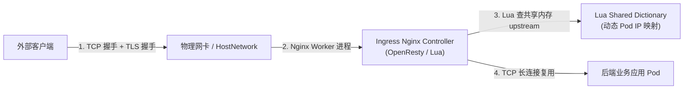
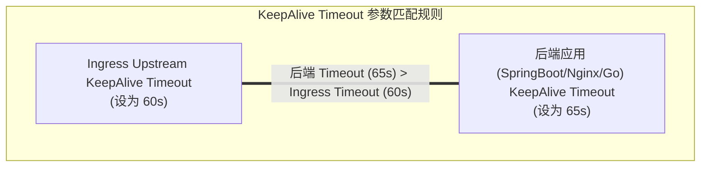

# 🚀 Ingress-Nginx 高并发场景下内核与性能调优全景指南

深入解析 Ingress-Nginx 在万级 QPS 高并发流量、突发大流量场景下的性能瓶颈，提供从 Linux 内核参数、TCP 连接池、KeepAlive 策略到 Lua 共享内存的上百项生产级调优指南。

---

## 一、 Ingress-Nginx 高并发链路全景与性能瓶颈

Ingress-Nginx 内部基于 OpenResty（Nginx + Lua）架构。一个请求从公网到达后端应用容器，经历以下 4 个阶段：



### 生产四大瓶颈点：
1. **TCP 连接池溢出**：高并发连接瞬间冲垮内核 `somaxconn` 和 `tcp_max_syn_backlog` 全/半连接队列，引发建连超时。
2. **连接短路与 TIME_WAIT 积压**：未开启 HTTP KeepAlive 复用，导致连接频繁创建销毁，大量 Socket 卡在 `TIME_WAIT`。
3. **Nginx Worker 进程句柄瓶颈**：工作进程数、`worker_rlimit_nofile` 句柄数不足，报 `Too many open files` 错误。
4. **动态 Upstream 锁瓶颈**：Pod 频繁变更导致 Lua 共享内存锁竞争。

---

## 二、 节点与容器层 Linux 内核参数调优 (sysctl)

在运行 Ingress Controller 的工作节点及 Ingress Pod 容器内，必须配置以下内核参数：

### 生产级 sysctl 调优模板：

```yaml
apiVersion: apps/v1
kind: Deployment
metadata:
  name: ingress-nginx-controller
  namespace: ingress-nginx
spec:
  template:
    spec:
      hostNetwork: true                 # 推荐高并发下开启 hostNetwork 绕过 bridge/iptables NAT
      dnsPolicy: ClusterFirstWithHostNet
      securityContext:
        sysctls:
        # 1. 扩大 TCP 全连接队列 (防止 504 建连超时)
        - name: net.core.somaxconn
          value: "65535"
        # 2. 扩大 TCP 半连接队列 (SYN 队列)
        - name: net.ipv4.tcp_max_syn_backlog
          value: "65535"
        # 3. 快速回收 TIME_WAIT 状态 sockets
        - name: net.ipv4.tcp_tw_reuse
          value: "1"
        # 4. 扩大客户端局部端口范围
        - name: net.ipv4.ip_local_port_range
          value: "1024 65535"
        # 5. 降低 KeepAlive 心跳探针探测间隔
        - name: net.ipv4.tcp_keepalive_time
          value: "300"
        - name: net.ipv4.tcp_keepalive_intvl
          value: "15"
        - name: net.ipv4.tcp_keepalive_probes
          value: "3"
```

---

## 三、 Ingress-Nginx ConfigMap 核心参数调优

Ingress-Nginx 通过 ConfigMap 全局配置 `nginx.conf`。以下是经过生产验证的万级 QPS 黄金调优模板：

```yaml
apiVersion: v1
kind: ConfigMap
metadata:
  name: ingress-nginx-controller
  namespace: ingress-nginx
data:
  # 1. Worker 进程与句柄优化
  worker-processes: "auto"              # 自动按 CPU 亲和性绑定
  worker-rlimit-nofile: "1048576"       # 突破文件描述符限制 (默认 1024 极易爆表)
  max-worker-open-files: "1048576"
  worker-connections: "65535"           # 单个 worker 支持的最大并发连接数
  
  # 2. 事件模型
  use-epoll: "true"
  multi-accept: "true"                  # 允许 worker 一次性接收所有新连接

  # 3. 上游 (Upstream) 长连接复用调优 (核心!)
  upstream-keepalive-connections: "10000" # 每个 worker 保持与后端 Pod 的长连接池大小
  upstream-keepalive-requests: "100000"  # 单个长连接允许处理的最大请求数
  upstream-keepalive-timeout: "60"       # 长连接空闲超时时间 (秒)

  # 4. 客户端连接与 Buffer 调优
  keep-alive: "75"
  keep-alive-requests: "100000"
  client-header-buffer-size: "16k"
  large-client-header-buffers: "4 64k"
  client-body-buffer-size: "128k"

  # 5. Gzip 压缩关闭 (CPU 换吞吐量)
  use-gzip: "false"

  # 6. 高 QPS 下磁盘 I/O 优化
  disable-access-log: "true"            # 超过 5 万 QPS 建议关闭 access.log 或走异步流
  access-log-async: "true"
```

---

## 四、 长连接与 KeepAlive 策略匹配（消除 502 报错）

在代理架构中，必须严格匹配 Ingress 与后端 Pod 的 Timeout 参数，防止出现 **KeepAlive 竞争引发的 502 Bad Gateway**：



### 为什么必须“后端应用 Timeout > Ingress Timeout”？
若后端应用的 Timeout 为 30s，而 Ingress 为 60s：
- 当连接空闲到达第 30s 时，后端应用主动发起 `FIN` / `RST` 包断开连接。
- 恰好在此毫秒内，Ingress 复用该长连接将客户端的新请求发往后端。
- 请求碰撞到已被关掉的 TCP Socket，抛出 `Connection reset by peer` 异常，产生 502 错误。

---

## 五、 OpenResty / Lua 动态 Upstream 机制优化

### 动态路由原理：
传统 Nginx 改变 Upstream 必须重载（Reload）进程，这会导致长连接全部断开。Ingress-Nginx 使用 OpenResty 的 **Lua 模块（balancer.lua）** 实现无需 Reload 的内存动态刷新：

```text
Pod IP 发生变更 (如 Pod 扩缩容/滚动更新)
   │
   ▼
Ingress Controller 监听 APIServer
   │
   ▼
直接更新 Lua 内存共享字典 (ngx.shared.configuration_data)
   │
   ▼
新请求进入时，Lua 脚本直接从内存字典中获取最新的 Pod IP 列表，零 Reload!
```

### 优化建议：
在规模极大的集群（> 1000 Services）中，调优 Lua 共享内存大小：
```yaml
# Ingress-Nginx ConfigMap
data:
  lua-shared-dict-size: "128m" # 默认 32m，大集群避免内存溢出
```

---

## 六、 深度扩展：Zero-502 配置矩阵与失败重试 Annotation (孟凡杰课程精髓)

为实现在滚动更新或后端偶尔异常时的**绝对零 502 报错**，必须在 Ingress 资源上配置失败重试 Annotation：

```yaml
apiVersion: networking.k8s.io/v1
kind: Ingress
metadata:
  name: zero-502-ingress
  annotations:
    # 1. 配置触发重试的异常类型 (包含 502, 503, 超时与连接错误)
    nginx.ingress.kubernetes.io/proxy-next-upstream: "error timeout invalid_header http_502 http_503"
    
    # 2. 限制最大重试次数与超时
    nginx.ingress.kubernetes.io/proxy-next-upstream-tries: "3"
    nginx.ingress.kubernetes.io/proxy-next-upstream-timeout: "10"
    
    # 3. 设置代理连接与读取超时
    nginx.ingress.kubernetes.io/proxy-connect-timeout: "5"
    nginx.ingress.kubernetes.io/proxy-read-timeout: "60"
    nginx.ingress.kubernetes.io/proxy-send-timeout: "60"
spec:
  rules:
  - host: app.example.com
    http:
      paths:
      - path: /
        pathType: Prefix
        backend:
          service:
            name: app-service
            port:
              number: 80
```

* **原理解析**：当 Nginx 尝试将请求转发到某正在关闭的旧 Pod 遇到 502 错误时，`proxy-next-upstream` 机制允许 Nginx 在毫秒级内自动将该请求重试发送给健康的其他 Pod 副本，**对前端用户完全透明无感**。

---

### 关联阅读
* 📖 [Ingress基础全景与进化延伸指南](./05-1-Ingress基础全景与进化延伸指南.md)

---

> [!TIP] 💡 关联技术与延伸阅读
>
> * [Ingress 基础全景与架构](./05-1-Ingress基础全景与进化延伸指南.md)
> * [大规模集群底层内核网络参数调优](../06-集群运维/07-万级节点与十万级Pod大规模集群调优指南.md)
