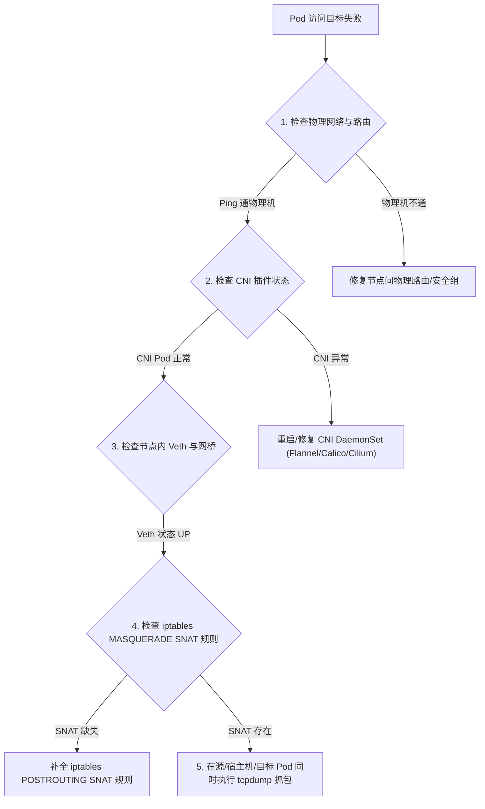

# 🛠️ K8s 集群网络故障诊断与抓包实战指南

当 Kubernetes 集群遇到网络不通、Pod 访问外网失败、Service 访问偶发超时或 CoreDNS 解析缓慢等故障时，一套标准、系统化的诊断排查 SOP 命令手册是排错的核心保障。本文梳理了生产级的 K8s 网络故障定位方法与抓包命令。

---

## 一、 网络诊断排查神器工具箱

在 Pod 或 Host 宿主机上进行排查时，核心依靠以下 Linux 底层工具：

| 工具名称 | 核心用途 | 典型场景 |
| :--- | :--- | :--- |
| **`nsenter`** | 穿越进入任意 Pod 的 Network Namespace | Pod 内缺乏 `tcpdump`/`ping` 等调试工具时 |
| **`tcpdump`** | 链路层、网络层、传输层抓包与报文分析 | 排查丟包、重传、RST 异常、数据包未到达网桥 |
| **`ip netns`** | 管理与查看 Linux Network Namespace | 检查节点命名空间列表及隔离接口 |
| **`iptables-save` / `ipset`** | 导出与检查 Netfilter / IPVS 转发规则 | 查验证 Service 负载均衡与 NAT 映射 |
| **`conntrack`** | 查看并追踪 Linux 内核连接跟踪表 | 排查连接超时、死锁及表爆满 (`table full`) 丢包 |
| **`crictl`** | 检索宿主机上运行的容器 PID | 搭配 `nsenter` 快速定位 Pod 的 PID |

---

## 二、 核心实战技巧：使用 `nsenter` 穿透至 Pod Namespace

由于生产环境中的业务 Pod 镜像（如 Alpine/Distroless）通常没有安装 `curl`、`ping` 或 `tcpdump`，我们可以利用宿主机的 `nsenter` 命令行工具，**无需修改 Pod 镜像即可直接以宿主机工具对 Pod 内部网络进行调试和抓包**。


### 实战步骤命令：

```bash
# 1. 查找目标 Pod 的容器 ID
crictl ps | grep <pod-name>

# 2. 获取该容器在宿主机上的 PID (Process ID)
PID=$(crictl inspect --output json <container-id> | jq '.info.pid')
echo "Pod PID is: $PID"

# 3. 使用 nsenter 进入该 Pod 的 Network Namespace 执行 ping
nsenter -t $PID -n ping 10.96.0.1

# 4. 使用宿主机的 tcpdump 监听该 Pod 内的 eth0 网卡
nsenter -t $PID -n tcpdump -i eth0 -nn -vvv tcp port 80 -w /tmp/pod_traffic.pcap
```

---

## 三、 经典网络故障定位 SOP 流程

### 场景一：Pod 无法访问外网或跨节点 Pod 无法通信



#### 命令排查步骤：
```bash
# 1. 检查 CNI 网卡接口与状态
ip link show

# 2. 检查宿主机路由表中是否存在到达目标 Pod 网段的路由
ip route show

# 3. 检查 iptables SNAT 规则
iptables -t nat -L POSTROUTING -n -v | grep MASQUERADE
```

---

### 场景二：Service 访问偶发超时或丢包

*   **常见原因**：
    1.  `conntrack` 连接跟踪表爆满。
    2.  `iptables` / `IPVS` 规则混乱或丢包。
    3.  MTU 设置不一致导致 overlay 隧道数据包超大（PMTUD 失效）。

#### 诊断命令：
```bash
# 1. 查看内核 conntrack 表使用率与最大限制
sysctl net.netfilter.nf_conntrack_count
sysctl net.netfilter.nf_conntrack_max

# 2. 检索是否有 conntrack 异常丢包日志
dmesg -T | grep -i "nf_conntrack: table full"

# 3. 检查当前节点上匹配某 Service 的 IPVS 转发项 (针对 IPVS 模式)
ipvsadm -ln -t <Service-ClusterIP>:80

# 4. 检查网卡是否存在 MTU 异常丢包 (查看 errors / dropped)
netstat -i
```

---

### 场景三：CoreDNS 5 秒解析延迟排查

*   **现象**：应用请求 DNS 域名时突然出现固定的 5000ms（5 秒）延迟。
*   **根因**：Linux 内核 `conntrack` 模块在 UDP 并发请求（AAAA 与 A 记录同时查询）时存在著名的 **Race Condition 锁竞争冲突**，导致其中一个 UDP 包被内核隐式丢弃，引发 5 秒超时重试。

#### 排查与修复：
```bash
# 1. 验证 CoreDNS 容器日志
kubectl logs -n kube-system -l k8s-app=kube-dns --tail=100

# 2. 在业务 Pod Spec 中配置 single-request-reopen 绕过 UDP 竞争锁
spec:
  template:
    spec:
      dnsConfig:
        options:
          - name: single-request-reopen
          - name: ndots
            value: "2"
```

---

## 四、 tcpdump 排查 Pod 通信数据包全路径实战

当怀疑数据包在某一级网络设备丢失时，可以使用 `tcpdump` 同时在数据流经的多个节点和设备上抓包：

```bash
# 1. 在源 Pod 内部抓包 (检查是否真正送出)
nsenter -t $SRC_PID -n tcpdump -i eth0 -nn host <Dst_IP> -w /tmp/src_pod.pcap

# 2. 在源 Node 的 Veth 端口抓包 (检查是否从 Pod 弹回宿主机)
tcpdump -i vethxxxx -nn host <Dst_IP>

# 3. 在源 Node 的 CNI 隧道网卡上抓包 (如 flannel.1 或 tunl0)
tcpdump -i flannel.1 -nn host <Dst_IP>

# 4. 在宿主机物理网卡 eth0 上抓包 (检查 Outer VXLAN UDP 8472 包)
tcpdump -i eth0 -nn udp port 8472
```
通过对比四个捕获点的 timestamp 和报文 Sequence，能以 100% 的精准度准确定位数据包是在哪一步被 Drop 掉的。

---

## 五、 深度扩展：8 大高级 tcpdump 过滤表达式与 TCP 标志位抓包 (孟凡杰课程精髓)

在生产环境中进行抓包时，海量的日志流会导致 pcap 文件过大。使用特定的 TCP 标志位过滤表达式能精准捕获异常：

```bash
# 1. 精准捕获 TCP RST (重置连接) 报文 (常用于排查 502 Bad Gateway 异常)
tcpdump -i eth0 'tcp[tcpflags] & (tcp-rst) != 0' -nn -vv

# 2. 精准捕获 TCP SYN 握手建连报文 (检查建连请求是否到达)
tcpdump -i eth0 'tcp[tcpflags] & (tcp-syn) != 0' -nn -vv

# 3. 捕获重传报文 (TCP Retransmission，判断物理网络抖动/丢包)
tcpdump -i eth0 'tcp[13] & 0x8 != 0' -nn

# 4. 捕获所有 HTTP GET 与 POST 请求头 (在应用层协议层面诊断)
tcpdump -i eth0 -s 0 -A 'tcp dst port 80 and (tcp[((tcp[12:1] & 0xf0) >> 2):4] = 0x47455420 or tcp[((tcp[12:1] & 0xf0) >> 2):4] = 0x504f5354)'

# 5. 结合 nsenter 查看 Pod 内部所有的 conntrack 连接条目
nsenter -t $PID -n conntrack -L -p tcp --orig-port-dst 80

# 6. 监听特定 MAC 地址的以太网二层帧 (排查 ARP 广播与网桥学习问题)
tcpdump -i eth0 ether host aa:bb:cc:dd:ee:ff -nn

# 7. 查看 Socket 读写缓冲区与 Drop 计数统计
netstat -s | grep -E "buffer errors|TCPBacklogDrop"

# 8. 实时打印接收到的 ICMP Destination Unreachable (端口不可达/分片耗尽)
tcpdump -i any 'icmp[icmptype] == icmp-unreach' -nn -vv
```

---

> [!TIP] 💡 关联技术与延伸阅读
>
> * [集群网络访问链路图解](./03-集群网络访问详细流程.md)
> * [生产级综合高难故障排障方案](../06-集群运维/06-生产级高难故障排查与实战方案.md)
