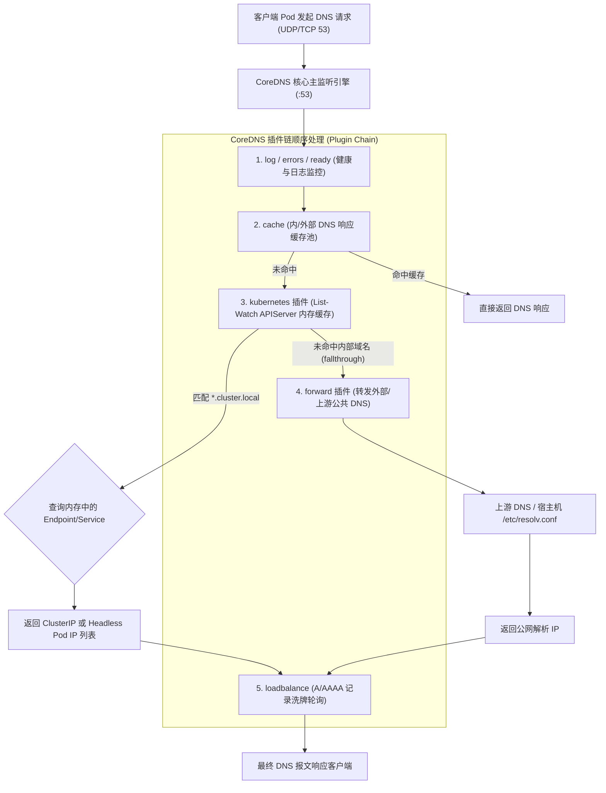
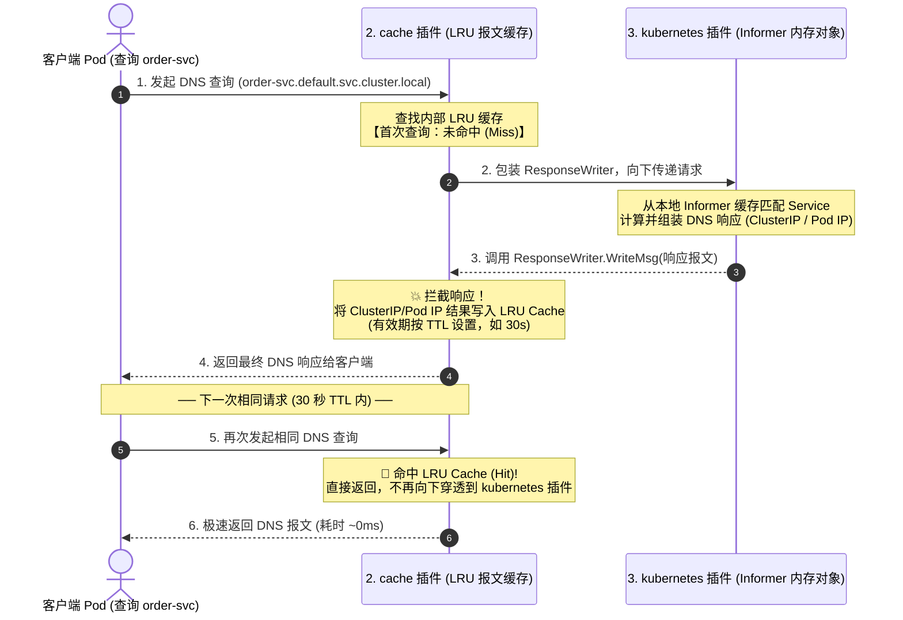
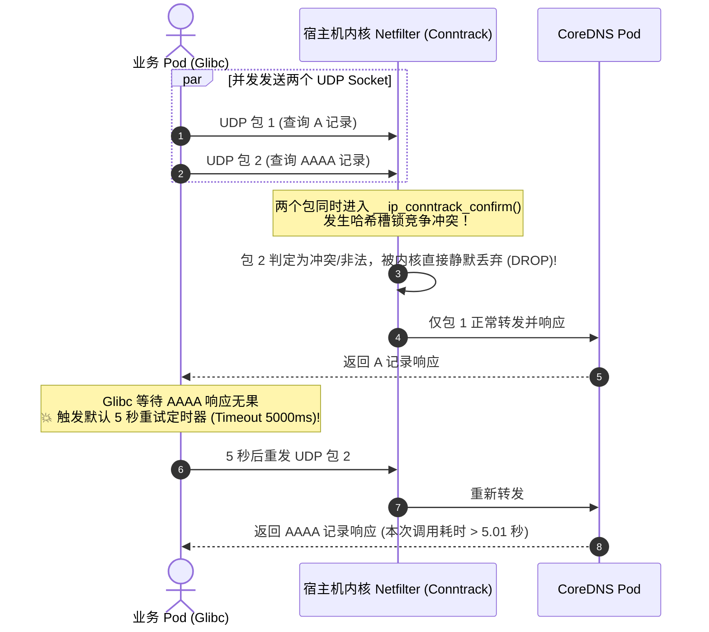

# 🌐 CoreDNS 底层架构与服务发现技术深度指南

CoreDNS 是 CNCF 毕业级的开源 DNS 服务器，也是 Kubernetes 官方默认的服务发现引擎（从 K8s v1.11 起全面替代传统的 kube-dns）。它采用基于 Go 语言的高性能、模块化插件架构，负责为整个集群中的微服务、Pod 实例以及外部公网提供极速、高可用的域名解析服务。

---

## 一、 CoreDNS 核心架构与运行模型

CoreDNS 的设计高度遵循了“插件链（Plugin Chain）”模式。服务器本身仅包含极简的核心引擎，所有的 DNS 解析、缓存、日志、转发、路由及策略控制全部由串联的插件协同完成。



### 1. 核心运行实体与工作机制
* **部署形态**：通常以 `Deployment` 形式运行在 `kube-system` 命名空间下，默认暴露 `:53` 端口（同时支持 UDP 与 TCP）。
* **服务暴露**：通过名为 `kube-dns` 的固定 ClusterIP（例如 `10.96.0.10`）对外提供服务，各工作节点的 Kubelet 会自动将该 IP 注入所有业务容器的 `/etc/resolv.conf` 中。
* **数据来源**：`kubernetes` 插件并非在每次收到 DNS 查询时都实时向 `kube-apiserver` 发起 REST 请求，而是**通过 client-go 的 Informer (List-Watch) 机制在 CoreDNS 本地内存中维护一份只读的 Service 和 EndpointSlice 缓存**，查询时延通常小于 1ms。

### 2. 深度拆解：双层缓存模型与洋葱拦截机制（Informer 缓存 vs cache 插件）

在 CoreDNS 内部，存在两道不同维度的“内存缓存”。理解两者的协作关系与回填机制是掌握 CoreDNS 高并发解析的关键：



#### 两层缓存的核心差异与协作价值：
* **为什么从 Informer 获取到的 ClusterIP / Pod IP 还会写入 `cache` 插件？**
  * **机制层面**：CoreDNS 采用洋葱拦截模型，`cache` 插件通过包装 `ResponseWriter` 自动截获所有下游插件（`kubernetes` / `forward`）返回的成功与否定响应，并以 `(qname, qtype, qclass)` 为 Key 存入 LRU 缓存。
  * **性能层面**：
    | 缓存层级 | 所在组件/插件 | 缓存数据结构 | 性能与作用 |
    | :--- | :--- | :--- | :--- |
    | **对象级缓存** | `3. kubernetes` (Informer) | K8s `Service` / `EndpointSlice` 的 **Go 原生结构体** | 消除对 APIServer 的远程调用，但在收到查询时仍需**遍历命名空间、正则匹配域名、计算并序列化为 DNS 报文**。 |
    | **报文级缓存** | `2. cache` 插件 (LRU Cache) | 已经序列化好的**完整标准 DNS 二进制报文** | 以域名和记录类型为 Key 直接返回二进制报文，**跳过所有业务逻辑计算**，将解析时延从 1~2ms 压降至 0.1ms 以下。 |

---

## 二、 Kubernetes DNS 命名寻址规范与解析类型

在 Kubernetes 中，CoreDNS 为不同类型的网络对象建立了严格的 RFC 1035 / RFC 2782 标准 DNS 命名规范：

```
[基本域名结构]:
<service-name>.<namespace-name>.svc.<cluster-domain>
```

| 记录类型与对象 | 标准 DNS 命名格式示例 | 解析返回结果 (A/AAAA/SRV/PTR) | 典型应用场景 |
| :--- | :--- | :--- | :--- |
| **标准 Service (ClusterIP)** | `order-svc.default.svc.cluster.local` | 返回单个虚拟 IP (VIP)，如 `10.96.20.50` | 普通微服务间解耦调用 |
| **无头服务 (Headless Service)** | `mysql-hs.db.svc.cluster.local` | 直接返回该 Service 后端**所有真实就绪的 Pod IP 集合** | StatefulSet 数据库主从发现、Kafka/ES 节点发现 |
| **有状态 Pod 个体 (StatefulSet)**| `mysql-0.mysql-hs.db.svc.cluster.local` | 精准解析出特定序号 Pod (`mysql-0`) 的真实 Pod IP | 数据库读写分离（定点路由主库 `mysql-0`） |
| **普通 Pod 别名解析** | `10-244-1-25.default.pod.cluster.local` | 返回对应 Pod IP `10.244.1.25` | 跨节点 Pod 寻址（需开启 `pods insecure/verified`） |
| **命名端口 SRV 记录** | `_http._tcp.web-svc.default.svc.cluster.local` | 返回服务端口号、协议及对应主机名 | 动态端口发现（如 Prometheus 服务发现） |
| **反向 PTR 指针记录** | `50.20.96.10.in-addr.arpa` | 返回对应的 Service 域名 `order-svc.default.svc.cluster.local` | 日志反查、网络安全审计 |

---

## 三、 CoreDNS 生产级 `Corefile` 配置深度解构

CoreDNS 的配置文件 `Corefile` 以 ConfigMap 形式托管在 `kube-system/coredns`。以下是一份涵盖生产最佳实践的深度注释模版：

```nginx
.:53 {
    # 1. 错误与日志记录
    errors                          # 将错误日志输出到 stdout/stderr
    log . {                         # 生产环境建议针对特定场景开启，避免高并发下日志刷屏
        class denial                # 仅记录被拒绝或未命中的请求 (NXDOMAIN/SERVFAIL)
    }

    # 2. 健康检查与优雅下线
    health {
       lameduck 5s                  # 收到退出信号时进入“跛脚鸭”状态 5 秒，继续响应现有请求，防止滚动升级丢包
    }
    ready                           # 暴露就绪探针端点 (:8181/ready)，供 Kubelet 检测

    # 3. 核心：Kubernetes 集群内部服务发现插件
    kubernetes cluster.local in-addr.arpa ip6.arpa {
       pods insecure                # 支持按 IP 格式 (a-b-c-d.ns.pod.cluster.local) 解析 Pod
       fallthrough in-addr.arpa ip6.arpa  # 若反向解析未命中内部集群对象，向下传递给 forward 插件
       ttl 30                       # 针对内部 Service 域名解析结果的 TTL（建议 5~30s）
    }

    # 4. 可观测性指标暴露
    prometheus :9153                # 暴露 Prometheus 监控指标 (coredns_dns_request_duration_seconds 等)

    # 5. 上游转发插件 (解析公网与非集群域名)
    forward . /etc/resolv.conf {
       max_concurrent 2000          # 调大并发上游查询数上限，避免突发公网查询被限流
       prefer_udp                   # 优先使用 UDP 向上游发起查询
       expire 10s                   # 上游无响应超时时间
    }

    # 6. 高性能缓存
    cache 30 {                      # 全局缓存有效时间 30 秒
       success 10000 30             # 成功响应最大缓存 10000 条，TTL 30s
       denial 5000 5                # NXDOMAIN 等否定响应最大缓存 5000 条，TTL 5s (防缓存击穿)
       prefetch 2 1m                # 预拉取机制：当某热门域名在过期前 1 分钟内被访问超过 2 次，后台自动刷新缓存！
    }

    # 7. 异常防御与负载均衡
    loop                            # 自动检测是否存在转发环路，发现死循环立即终止并报警
    reload                          # 自动热加载 Corefile (ConfigMap 修改后 10~30 秒内无损生效)
    loadbalance round_robin         # 针对有多条 A/AAAA 记录的域名（如 Headless Service），随机打乱返回顺序
}
```

### 2. 外部域名解析 4 大高频实战场景与 ConfigMap 落地案例

在实际生产（如混合云打通、自建 IDC 纳管、静态第三方接口定向解析）中，通常需要修改 `kube-system` 下名为 `coredns` 的 ConfigMap。以下是 4 个最典型的高频实战场景：

#### 场景 1：自建 IDC / 自定义私有域名分流转发（Stub Domain）
* **需求**：将公司内部自建域（如 `*.corp.example.com` 和 `*.internal`）定向转发到 IDC 私有 DNS 服务器（`192.168.1.10`, `192.168.1.11`），其余域名仍走集群默认链路。
* **实现方式**：在 Corefile 中新增专属的 **Server Block**：

```yaml
apiVersion: v1
kind: ConfigMap
metadata:
  name: coredns
  namespace: kube-system
data:
  Corefile: |
    # 1. 公司私有专属内网域转发 (Stub Domain)
    corp.example.com:53 internal:53 {
        errors
        cache 30
        forward . 192.168.1.10 192.168.1.11 {
            prefer_udp
            max_fails 3
            expire 10s
        }
    }

    # 2. 默认集群主解析块
    .:53 {
        errors
        health {
           lameduck 5s
        }
        ready
        kubernetes cluster.local in-addr.arpa ip6.arpa {
           pods insecure
           fallthrough in-addr.arpa ip6.arpa
           ttl 30
        }
        prometheus :9153
        forward . /etc/resolv.conf
        cache 30
        loop
        reload
        loadbalance
    }
```

---

#### 场景 2：静态外部域名硬编码解析（`hosts` 插件）
* **需求**：针对特定外部第三方 API 或未建 DNS 的中间件（如 `git.corp.local`、`oss-internal.aliyun.com`），直接在 CoreDNS 内写死 IP，无需部署额外 DNS 服务器。
* **实现方式**：在默认块中注入 `hosts` 插件，**务必配置 `fallthrough`**（未匹配到的域名继续向下走 `kubernetes` 和 `forward`）：

```yaml
.:53 {
    errors
    # 静态 hosts 映射 (类似在所有 Pod 中注入 /etc/hosts)
    hosts {
        192.168.10.88 git.corp.local
        10.200.0.15   database-ext.partner.com
        10.200.0.16   database-ext.partner.com   # 支持多 IP 负载均衡
        fallthrough                              # 💥 关键：未命中的域名必须向下透传！
    }
    kubernetes cluster.local in-addr.arpa ip6.arpa {
       pods insecure
       ttl 30
    }
    forward . /etc/resolv.conf
    cache 30
    reload
    loadbalance
}
```

---

#### 场景 3：外部域名无感重写为集群内 Service（`rewrite` 插件）
* **需求**：业务代码里写死了请求外部域名 `api.external-partner.com`，现已将该服务迁移进集群内 `api-svc.prod.svc.cluster.local`，希望业务零改动实现流量拦截转接。
* **实现方式**：使用 `rewrite` 插件在解析入口处重写查询请求：

```yaml
.:53 {
    errors
    # 将外部域名精准重写为集群内部 Service 域名
    rewrite name exact api.external-partner.com api-svc.prod.svc.cluster.local
    
    # 针对某个后缀规则进行泛解析重写
    # rewrite name suffix .legacy.domain.com .default.svc.cluster.local

    kubernetes cluster.local in-addr.arpa ip6.arpa {
       pods insecure
       ttl 30
    }
    forward . /etc/resolv.conf
    cache 30
    reload
    loadbalance
}
```

---

#### 场景 4：绕过宿主机 `/etc/resolv.conf` 直连公网公共 DNS
* **需求**：部分 Linux 宿主机的 `/etc/resolv.conf` 指向了不稳定或有污染的本地 systemd-resolved (127.0.0.53)，希望 CoreDNS 解析外部公网域名时直连阿里云 DNS / 腾讯云 DNSPod / 谷歌 DNS。
* **实现方式**：显式指定公共 DNS IP 列表：

```yaml
.:53 {
    errors
    kubernetes cluster.local in-addr.arpa ip6.arpa {
       pods insecure
       ttl 30
    }
    # 显式声明公共 DNS，配置轮询与健康检查
    forward . 223.5.5.5 119.29.29.29 8.8.8.8 {
        prefer_udp
        policy round_robin      # 负载均衡策略：random / round_robin / sequential
        max_concurrent 2000
        health_check 5s         # 每 5 秒对上游 DNS 发起健康检查，自动剔除故障 IP
    }
    cache 30
    reload
    loadbalance
}
```

---

#### 3. ConfigMap 更新与热加载生效命令
Corefile 配置了 `reload` 插件后，修改 ConfigMap 无需重启 CoreDNS Pod：

```bash
# 1. 在线编辑 CoreDNS ConfigMap
kubectl edit cm coredns -n kube-system

# 2. 或直接通过 YAML 文件覆盖应用
kubectl apply -f coredns-configmap.yaml

# 3. 观察 CoreDNS 日志，验证配置热加载成功 (通常在 10~30 秒内触发)
kubectl logs -n kube-system -l k8s-app=kube-dns --tail=20 | grep -i "reload"
# 正常输出：[INFO] plugin/reload: Running configuration SHA512 = ...
```


---

## 四、 生产高频性能陷阱与深度剖析

### 1. `ndots:5` 外部域名解析放大与延时倍增陷阱

#### (1) 产生机理：
当业务 Pod 在默认配置下查询外部域名（如 `www.aliyun.com`，点数为 2，小于默认的 `ndots:5`）时，Linux `glibc` 解析器会严格按照 `/etc/resolv.conf` 中的 `search` 列表进行多级补全查询：

```
Pod 容器发起 query: www.aliyun.com
 │
 ├── 1. 查询 www.aliyun.com.default.svc.cluster.local ────► CoreDNS 返回 NXDOMAIN (耗时 ~2ms)
 ├── 2. 查询 www.aliyun.com.svc.cluster.local         ────► CoreDNS 返回 NXDOMAIN (耗时 ~2ms)
 ├── 3. 查询 www.aliyun.com.cluster.local             ────► CoreDNS 返回 NXDOMAIN (耗时 ~2ms)
 └── 4. 最终发起 www.aliyun.com 查询                  ────► CoreDNS 请求上游公网 DNS 返回 203.x.x.x
```
* **代价**：单次公网请求放大了 **4 倍网络报文与 CoreDNS CPU 消耗**，若遇到高并发外部 API 调用，CoreDNS 会瞬间被巨量 NXDOMAIN 垃圾请求打爆。

#### (2) 生产综合优化方案：
1. **应用侧点号终结**：在代码配置中使用绝对 FQDN 域名（如 `www.aliyun.com.`，末尾加点），直接跳过 search 补全。
2. **Pod 级别下调 ndots**：为频繁访问外部的 Pod 配置 `dnsConfig`：
   ```yaml
   spec:
     dnsConfig:
       options:
         - name: ndots
           value: "2"
   ```

---

### 2. Linux 内核 UDP 并发 DNAT 丢包与 5 秒超时 (Conntrack Race Condition)

#### (1) 物理根因：
在未开启 NodeLocal DNSCache 的集群中，Pod 解析 DNS 时通常会并发发出 **A 记录（IPv4）** 与 **AAAA 记录（IPv6）** 的 UDP 查询包。由于发往同一个 CoreDNS Service IP (`10.96.0.10:53`)，两个数据包在工作节点 Linux 内核 Netfilter 管道执行 DNAT 时，会触发 **`__ip_conntrack_confirm()` 连接跟踪表的锁竞争（Race Condition）**：



#### (2) 彻底根治方案：部署 NodeLocal DNSCache
在集群各节点以 DaemonSet 运行 `node-local-dns`，在宿主机上分配 Link-Local 虚拟 IP（如 `169.254.20.10`）：
* Pod 的 `nameserver` 指向本机的 `169.254.20.10`。
* 本地通信**不跨网卡、不走 iptables/IPVS DNAT 转换**，彻底绕过 Conntrack 表，从根本上解决 5 秒超时问题，并将高频查询就近在节点内存中拦截。

---

## 五、 CoreDNS 高可用架构、自动弹性伸缩与大促调优

在大规模 Kubernetes 集群中，CoreDNS 是最核心的基础控制面服务之一。

### 1. 多副本打散与 Pod 反亲和性 (PodAntiAffinity)
避免多个 CoreDNS 副本被集中调度在同一个节点或可用区上：

```yaml
apiVersion: apps/v1
kind: Deployment
metadata:
  name: coredns
  namespace: kube-system
spec:
  replicas: 3
  template:
    spec:
      affinity:
        podAntiAffinity:
          # 强制不同副本分散在不同物理节点
          requiredDuringSchedulingIgnoredDuringExecution:
          - labelSelector:
              matchExpressions:
              - key: k8s-app
                operator: In
                values: ["kube-dns"]
            topologyKey: "kubernetes.io/hostname"
```

---

### 2. 基于集群规模自动扩缩容 (cluster-proportional-autoscaler)
安装官方的 `cluster-proportional-autoscaler` 组件，让 CoreDNS 的副本数根据集群的 **节点数量 (Nodes)** 和 **核心数量 (Cores)** 动态自动伸缩：

```yaml
apiVersion: v1
kind: ConfigMap
metadata:
  name: coredns-autoscaler
  namespace: kube-system
data:
  linear: |-
    {
      "coresPerReplica": 256,
      "nodesPerReplica": 16,
      "min": 3,
      "max": 50,
      "preventSinglePointFailure": true
    }
```
* **伸缩逻辑**：集群中每新增 16 个 Node 或 256 个 CPU 核心，CoreDNS 自动增加 1 个副本，最小保持 3 副本高可用。

---

## 六、 CoreDNS 生产排障与性能监控 SOP

### 1. 抓包与实时日志诊断
```bash
# 1. 实时查看 CoreDNS 运行日志
kubectl logs -n kube-system -l k8s-app=kube-dns -f --tail=100

# 2. 在业务 Pod 内部使用 dig 命令精准排查解析链路与耗时
kubectl exec -it <business-pod> -- dig @10.96.0.10 order-svc.default.svc.cluster.local +trace

# 3. 抓取工作节点上的 53 端口 DNS 交互报文
tcpdump -i any -nn 'udp port 53' -vv
```

### 2. Prometheus 核心告警指标矩阵
| Prometheus 监控指标名 | 含义与关注阈值 | 生产排查与处置动作 |
| :--- | :--- | :--- |
| `coredns_dns_request_duration_seconds_bucket` | DNS 请求响应延迟分布（P99 > 15ms 需关注） | 检查 CoreDNS 副本数是否不足、是否遭遇外部 DNS 慢解析 |
| `coredns_dns_responses_total{rcode="SERVFAIL"}` | 解析失败返回 SERVFAIL 错误计数 | 检查 `kubernetes` 插件 Informer 状态或上游 DNS 连接超时 |
| `coredns_dns_responses_total{rcode="NXDOMAIN"}` | 域名不存在返回率（突增通常意味着 `ndots` 滥用） | 排查业务应用是否有未加根点的大量外部域名请求 |
| `coredns_forward_max_concurrent_rejects_total` | 上游查询因超过 `max_concurrent` 被丢弃 | 在 Corefile 中调大 `forward` 插件的 `max_concurrent` 配置 |
| `coredns_cache_entries` | 当前 LRU 缓存条目总数 | 评估 Corefile 中 `cache` 容量上限是否合理 |
| `coredns_cache_hits_total` / `misses_total` | 缓存命中率 (`hits / (hits + misses)`) | 命中率低于 70% 需分析是否有大量离散随机域名查询 |

---

### 3. DNS 列表获取与缓存命中实战观测 SOP

#### (1) 客户端视角：探测解析列表与 TTL 衰减验证缓存
在业务 Pod 中可通过 `dig` 或 `nslookup` 获取后端 IP 列表，并通过 TTL 衰减判断是否命中 CoreDNS 的 `cache` 插件：

```bash
# 1. 查询 Headless Service，一次性获取后端所有健康 Pod IP 列表
kubectl exec -it <business-pod> -- dig @10.96.0.10 mysql-hs.default.svc.cluster.local +noall +answer

# 2. 观察返回的 TTL 与 Query time 判定缓存命中：
# 第一次查询 (Cache Miss)：
# mysql-hs.default.svc.cluster.local. 30 IN A 10.244.1.20   -> Query time: 2 msec
# 5 秒后二次查询 (Cache Hit)：
# mysql-hs.default.svc.cluster.local. 25 IN A 10.244.1.20   -> Query time: 0 msec (TTL 从 30 衰减为 25，耗时归零)
```

#### (2) 服务端视角：CoreDNS 缓存容量与命中率实时监控
CoreDNS 内部采用 LRU 哈希表管理缓存，未开放整表 Dump 接口，但可通过 Metrics 端点获取全局缓存状态：

```bash
# 从集群内抓取 CoreDNS 的 Prometheus 指标观察缓存命中情况
kubectl exec -it <business-pod> -- curl -s http://10.96.0.10:9153/metrics | grep coredns_cache
```

#### (3) 运维视角：一键导出集群全量 Service / DNS 映射清单
由于 CoreDNS 的内部记录源头为 APIServer，可以通过 `kubectl` 直接拉取集群当前所有服务的全量 DNS 解析清单：

```bash
# 导出集群所有 Service 的 FQDN 标准域名与 ClusterIP 对照表
kubectl get svc -A -o custom-columns=\
"SERVICE-FQDN":.metadata.name+"."+.metadata.namespace+".svc.cluster.local",\
"TYPE":.spec.type,\
"CLUSTER-IP":.spec.clusterIP,\
"PORTS":.spec.ports[*].port
```

---

> [!TIP] 💡 关联技术与延伸阅读
>
> * [kube-proxy ClusterIP 负载均衡](../01-组件原理/05-Kube_Proxy.md)
> * [域名解析在访问链路中的定位](./03-集群网络访问详细流程.md)
