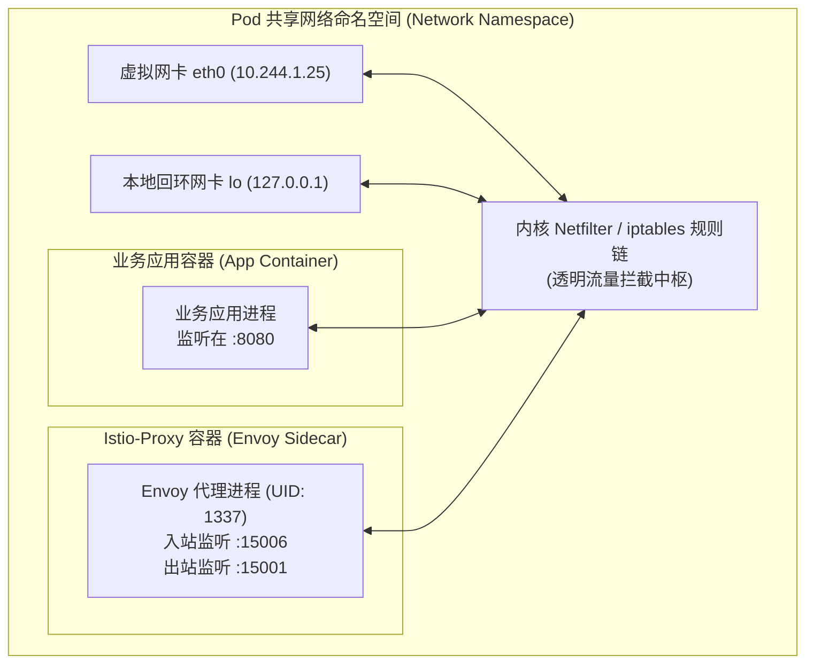
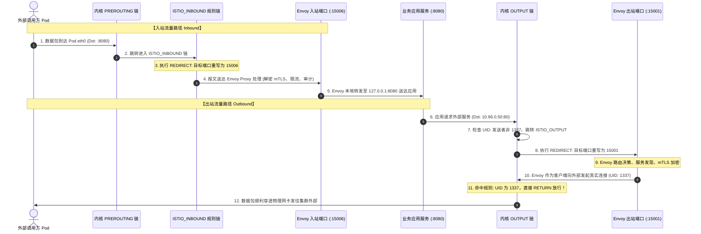
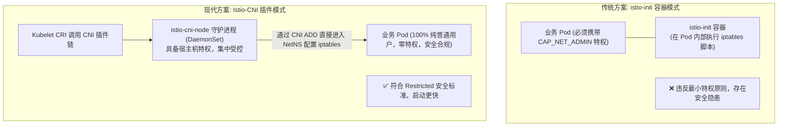

# 🕸️ Service Mesh 底层网络拦截与 Istio-Sidecar 流量劫持深度解密

在云原生架构的演进历程中，如果说 CNI 和 Kube-Proxy 解决了基础设施层“如何连通”的问题，那么 **Service Mesh（服务网格）** 则将治理能力提升到了应用协议（L7/HTTP/gRPC）层级。

服务网格最迷人的特性是**业务无侵入性**：业务代码无需引入任何 SDK，即可自动获得双向 mTLS 加密、微秒级金丝雀灰度分流、动态超时重试、熔断降级以及分布式链路追踪。而这一切魔法的基石，正是其底层的**网络命名空间共享机制**与 **iptables / CNI 透明流量拦截系统**。

本文深度剖析 Istio Sidecar（Envoy）的网络拓扑、`istio-init` 容器注入的 iptables 规则链流转时序、规避无限死锁回环的关键机理，以及面向企业级零信任安全的 **Istio-CNI 零特权演进方案**。

---

## 一、 Sidecar 模式网络拓扑与内核原理

在 Kubernetes 中，Pod 是资源调度的最小原子单位。一个 Pod 内部可以同时运行多个容器，这些容器共享由 **Pause 容器** 创建的同一个 Linux Network Namespace（包含相同的 IP、网卡设备、路由表与 iptables 过滤表）。



*   **共享协议栈**：应用容器与 Envoy 容器均可以直接绑定到 `127.0.0.1`，彼此之间可以通过本地回环网卡以极低延迟交互。
*   **透明截获目标**：
    1.  **所有进入 Pod 的外来流量**：必须在到达业务端口（`:8080`）前，被强行“拐弯”送入 Envoy 的入站端口（`:15006`）；
    2.  **所有从应用容器发往外部的流量**：必须在离开 Pod 网卡前，被强行拦截并送入 Envoy 的出站端口（`:15001`）。

---

## 二、 iptables 透明流量拦截核心机制解密

在 Pod 注入 Sidecar 时，Istio 注入器（`sidecar-injector` 准入控制器）会向 Pod Spec 中注入一个特殊的初始化容器：**`istio-init`**。该容器在业务应用和 Envoy 容器启动之前运行完毕，其唯一的使命就是**配置 Pod 网络命名空间内的 iptables 规则链**。



### 1. 入站流量拦截时序 (Inbound)

当外部流量到达 Pod 的 `eth0` 网卡时，内核依次遍历以下链路：
1. **`PREROUTING` 链**：命中规则 `-j ISTIO_INBOUND`；
2. **`ISTIO_INBOUND` 链**：检查目标端口，若非排除端口（如探针端口），则跳转至 `ISTIO_IN_REDIRECT`；
3. **`ISTIO_IN_REDIRECT` 链**：执行核心重定向动作：
   ```bash
   iptables -t nat -A ISTIO_IN_REDIRECT -p tcp -j REDIRECT --to-ports 15006
   ```
4. 内核将 TCP 数据包直接重写送往本地的 `15006` 虚拟监听端口，Envoy 捕获连接并提取原始目标端口（通过 `SO_ORIGINAL_DST` 套接字选项），进行访问控制与双向身份认证。

### 2. 出站流量拦截时序 (Outbound)

当业务容器中的应用程序向外部某个 Service 发起 HTTP 请求时：
1. 数据包由应用程序产生，首先进入本地的 **`OUTPUT` 链**；
2. `OUTPUT` 链跳转进入 **`ISTIO_OUTPUT` 链**；
3. 数据包被重写并重定向至 Envoy 出站监听端口：
   ```bash
   iptables -t nat -A ISTIO_REDIRECT -p tcp -j REDIRECT --to-ports 15001
   ```
4. Envoy 接收请求，执行微服务客户端治理（负载均衡选择最佳 Pod 实例、配置故障注入、建立 mTLS 隧道等）。

### 3. 最关键的设计：如何彻底规避无限死锁自回环？

> [!CAUTION] 🚨 致命死循环风险
> 当 Envoy 代理处理完出站请求后，它自身必须作为一个网络客户端，向远端真实的后端 Pod 发送网络报文。
> **如果 Envoy 自身发送的数据包再次进入 `OUTPUT` 链，岂不是又会被重定向回 Envoy 的 `15001` 端口？**
> 这样就会引发**死循环自重定向（Infinite Loop / Deadlock）**，导致 CPU 瞬间 100% 且网络彻底中断！

#### 解决方案：基于 UID 的过滤白名单 (`-m owner --uid-owner`)
Istio 在编译 Envoy 镜像时，创建了一个专用系统用户：**`istio-proxy`（UID 固定为 `1337`）**。
在 `ISTIO_OUTPUT` 规则链的顶部，写入了最高优先级的放行规则：

```bash
# 检查数据包的创建进程所属 UID
# 如果当前发送报文的进程正是 UID 1337 (Envoy 本身)，直接跳过拦截，予以放行！
iptables -t nat -A ISTIO_OUTPUT -m owner --uid-owner 1337 -j RETURN
```
正是这一行看似不起眼的内核所有者匹配规则，完美破解了出站重定向死循环难题。

---

## 三、 iptables 劫持的生产痛点与安全隐患

虽然基于 `istio-init` 的流量劫持方案十分成熟，但在严苛的企业级金融生产环境中，暴露出两大显著短板：

1. **容器特权违规（Privilege Escalation）**：
   *   为了执行 `iptables` 命令修改网络协议栈，`istio-init` 容器在 `SecurityContext` 中必须声明：
       ```yaml
       securityContext:
         capabilities:
           add:
             - NET_ADMIN
             - NET_RAW
       ```
   *   在金融等高安全合规要求场景下，任何业务命名空间赋予 `CAP_NET_ADMIN` 特权，都将触发容器逃逸安全告警，并直接被 Kubernetes **Pod Security Standards (Restricted 策略)** 拦截阻断。
2. **初始化时延与不可见故障**：
   *   每个 Pod 启动均必须额外拉起一个 Init 容器，串行等待执行脚本完毕才能启动业务容器，增加了冷启动耗时；
   *   若节点因内存紧张或底层网络卡死导致 `istio-init` 执行失败，业务容器将永远处于 `Init:CrashLoopBackOff` 状态。

---

## 四、 零特权安全演进：Istio-CNI 插件架构

为了彻底消除对特权容器的依赖，Istio 社区推出了 **Istio-CNI 插件**。



### 1. 工作原理
1. 集群中以 DaemonSet 形式在每个节点上常驻部署 `istio-cni-node`，在宿主机 `/opt/cni/bin/` 注册 `istio-cni` 二进制；
2. 当业务 Pod 被创建时，Kubelet 调用 CNI 插件链（如 `calico` -> `istio-cni`）；
3. `istio-cni` 作为合法的节点级网络插件，**从宿主机外部直接打开该 Pod 的网络命名空间（`/proc/$PID/ns/net`）并在其中配置好所有的重定向规则**；
4. 业务 Pod Spec 中无需再注入任何 `istio-init` 容器，业务容器也不需要开启任何 `CAP_NET_ADMIN` 特权，实现真正的安全合规与零信任运行。

---

## 五、 服务网格网络拦截技术全方位演进对比

| 对比维度 | 传统 istio-init 模式 | Istio-CNI 插件模式 | eBPF 旁路模式 (Cilium Service Mesh) |
|---|---|---|---|
| **拦截层级** | Netfilter / iptables (L4/L7) | Netfilter / iptables (L4/L7) | **Socket 层短路 (Sockops / XDP)** |
| **容器特权要求** | 必须 `CAP_NET_ADMIN`, `CAP_NET_RAW` | **完全零特权（符合 Restricted 安全基线）** | **完全零特权** |
| **Pod 初始化耗时** | 较高（需等待 Init 容器运行） | 极低（在 CNI 阶段完成毫秒级注入） | 极低（运行时自动挂载 eBPF 程序） |
| **内核协议栈开销** | 存在两次完整的 TCP/IP 握手与协议栈开销 | 存在两次完整的 TCP/IP 握手与协议栈开销 | **直通 Socket 内存拷贝，绕过三次握手与协议栈** |
| **生产选型建议** | 开发测试环境、非敏感轻量集群 | **当前企业级生产环境最佳安全标配** | 面向现代化高内核（Linux 5.4+）极致性能集群 |

---

> [!TIP] 💡 关联技术与延伸阅读
>
> * [Kubernetes 集群网络架构与 CNI 原理](./02-Kubernetes集群网络.md)
> * [Kube-Proxy 底层实现机制与 Service 转发深度指南](./02-2-Kube-Proxy底层实现机制与Service转发深度指南_userspace_iptables_IPVS_conntrack.md)
> * [CNI 规范演进与容器网络插件生态全景指南](./02-3-CNI规范演进与容器网络插件生态全景指南.md)
> * [eBPF 与 Cilium 下一代网络架构原理 (无 Sidecar 旁路网络模式)](./04-eBPF与Cilium下一代网络架构原理.md)
> * [Ingress 基础全景与网关进化延伸指南](./05-1-Ingress基础全景与进化延伸指南.md)
