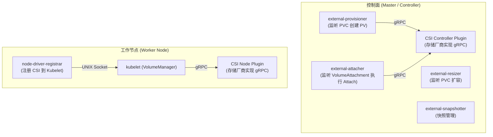
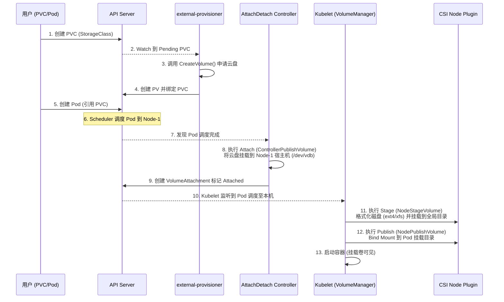
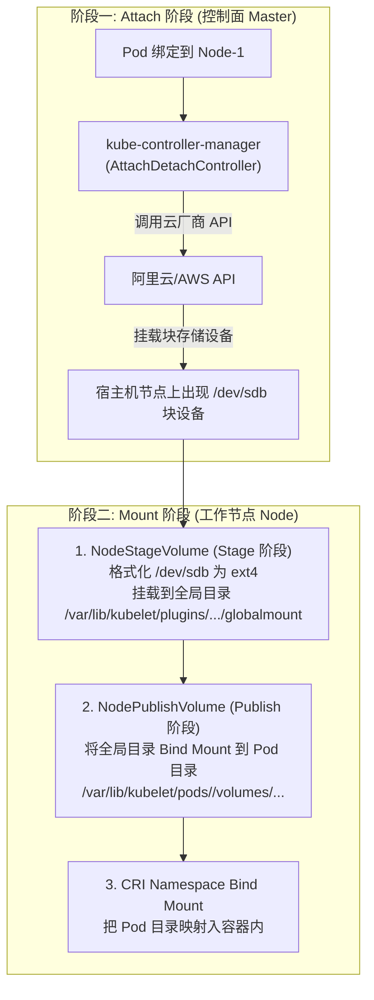
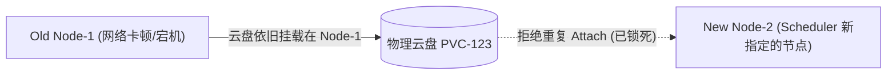

# 💾 CSI 架构与存储挂载全链路机制深度解析

> 本文档面向高级 Kubernetes 工程师与云原生架构师，深入剖析 CSI (Container Storage Interface) 架构设计、PVC/PV 动态供给流程、存储卷挂载两阶段（Attach & Mount）底层细节，以及生产中常见的存储挂载死锁与救援 SOP。

---

## 目录
- [一、 Kubernetes 存储架构演进](#一-kubernetes-存储架构演进)
- [二、 CSI 插件架构与核心组件](#二-csi-插件架构与核心组件)
- [三、 存储卷动态供给与生命周期全流程 (Provision & Attach & Mount)](#三-存储卷动态供给与生命周期全流程-provision--attach--mount)
- [四、 深入两阶段挂载：Attach 与 Mount 的底层区别](#四-深入两阶段挂载attach-与-mount-的底层区别)
- [五、 生产级故障：存储挂载死锁 (Volume in Use) 与紧急救援 SOP](#五-生产级故障存储挂载死锁-volume-in-use-与紧急救援-sop)

---

## 一、 Kubernetes 存储架构演进

| 阶段 | 实现方式 | 致命缺陷 / 特点 |
| :--- | :--- | :--- |
| **1. In-Tree 插件** | 存储驱动代码直接嵌入到 K8s 核心源码库（如 `k8s.io/kubernetes/pkg/volume/aws_ebs`） | 必须随 K8s 主版本一起编译发布，第三方存储厂商无法独立迭代；代码存在严重安全隐患。 |
| **2. FlexVolume** | 通过 Exec 方式调用宿主机上的 Executable 脚本 | 性能差，依赖宿主机环境依赖，无标准化接口。 |
| **3. CSI (当前标准)** | 声明式 gRPC 规范，解耦控制面与存储驱动 | 存储厂商只需实现标准的 gRPC 接口，作为独立 Pod 运行在集群中。 |

---

## 二、 CSI 插件架构与核心组件

CSI 插件由 **Sidecar 容器 (官方提供)** 与 **Storage Driver 容器 (存储厂商实现)** 共同组成：



### 核心 Sidecar 容器职责：
- **`external-provisioner`**：监听 PVC 创建，调用 CSI Controller 的 `CreateVolume` 向云厂商 API 申请物理存储块。
- **`external-attacher`**：监听 `VolumeAttachment` 对象，调用 CSI Controller 的 `ControllerPublishVolume` 将云盘挂载到宿主机（Attach 阶段）。
- **`node-driver-registrar`**：将 CSI Node 插件的 gRPC endpoint 注册到 Kubelet 中。

---

## 三、 存储卷动态供给与生命周期全流程 (Provision & Attach & Mount)

一个带有动态 PVC 的 Pod 从提交到容器启动，存储经历了 **5 大核心步骤**：



---

## 四、 深入两阶段挂载：Attach 与 Mount 的底层区别

存储挂载分为**控制面 Attach** 与**节点面 Mount** 两个独立阶段：



### 关键区别：
1. **Attach 阶段**：将远端独立存储块挂载为宿主机的一块**裸磁盘设备**（如 `/dev/sdb`）。*注：NFS 等网络文件系统无 Attach 阶段。*
2. **Stage 阶段**：在宿主机上对裸设备进行**格式化**（如 `mkfs.ext4`），并挂载到 Kubelet 的全局共享目录（防止多个 Pod 复用时重复格式化）。
3. **Publish 阶段**：使用 Linux `mount --bind` 命令，将格式化好的挂载点硬链接到对应 Pod 的专属私有目录中。

---

## 五、 生产级故障：存储挂载死锁 (Volume in Use) 与紧急救援 SOP

### 5.1 现象描述
Pod 迁移或重新调度时，卡在 `ContainerCreating` 状态，`kubectl describe pod` 报错：
`Multi-Attach error for volume "pvc-xxxx" Volume is already exclusively attached to one node and can't be attached to another node`。



### 5.2 深度根因链条
1. 当原 Node-1 出现网络抖动或失联时，`AttachDetachController` 试图强制将存储卷从 Node-1 解绑 (Detach)。
2. 但云厂商 API 回复：Node-1 上的 Kubelet 尚未响应卸载，出于**数据一致性保护**（防止两台机器同时写同一个块设备导致文件系统损坏），云厂商拒绝解绑。
3. 新节点 Node-2 无法完成 Attach，Pod 锁死在 `ContainerCreating`。

### 5.3 紧急救援与安全解除 SOP

#### 安全救援步骤（严格按顺序执行）：

```bash
# 1. 确认原 Node-1 上的应用进程已彻底停止 (防止双写破坏文件系统!)
ssh node-1 "ps aux | grep <app-name>"

# 2. 检查对应的 VolumeAttachment 对象
kubectl get volumeattachment | grep pvc-xxxx

# 3. 强制删除阻碍 Attach 的 VolumeAttachment 对象
kubectl delete volumeattachment <volume-attachment-id> --force --grace-period=0

# 4. 若 Pod 依旧卡住，在原 Node-1 物理机上手动卸载挂载点 (若节点可达)
ssh node-1 "umount -f -l /var/lib/kubelet/pods/<pod-uid>/volumes/kubernetes.io~csi/<pv-name>/mount"

# 5. 重启目标 Node 节点上的 kubelet 强制重新 Trigger 调谐
systemctl restart kubelet
```

---

## 六、 深度扩展：VolumeAttachment 锁清理与全局挂载目录结构

### 1. Kubelet 物理挂载 2 个本地全局目录 (Global Directory)
在 Node 节点上，块设备与目录经过两步挂载：

1. **Global Stage 挂载路径 (NodeStageVolume)**：
   `/var/lib/kubelet/plugins/kubernetes.io/csi/<driver-name>/<volume-id>/globalmount`
   * 职责：将新 Attach 到宿主机的硬块设备（如 `/dev/vdb`）格式化为文件系统（ext4/xfs），并挂载到宿主机公共插件目录。同一个 PV 无论在节点上有多少 Pod 共享，**该全局目录只挂载一次**。
2. **Pod Publish 挂载路径 (NodePublishVolume)**：
   `/var/lib/kubelet/pods/<pod-uid>/volumes/kubernetes.io~csi/<volume-name>/mount`
   * 职责：通过 Linux 系统调用 `mount --bind <globalmount> <pod-mount>`，将全局挂载目录以 Bind Mount 方式映射给具体 Pod。

---

### 2. 存储死锁 `VolumeAttachment` 锁清理 SOP
当 Node-1 突然物理宕机，节点上的 Pod 被控制器强行重新调度到 Node-2 时，常常因 AWS EBS / 阿里云云盘不支持多节点同时 Attach 而引发死锁：

* **死锁原因**：API Server 中残留了指向旧 Node-1 的 `VolumeAttachment` 对象，`AttachDetachController` 拒绝在 Node-2 执行 Attach。
* **紧急解锁 3 步走**：
  ```bash
  # 2. 强行删除旧 Node 相关的 VolumeAttachment
  kubectl delete volumeattachment <volume-attachment-id> --force
  ```

---

> [!TIP] 💡 关联技术与延伸阅读
>
> * [Kubelet VolumeManager 存储挂载驱动](../01-组件原理/04-Kubelet.md)
> * [Ceph CSI 驱动与 IOPS 调优实战](./02-Ceph_RBD与CephFS在K8s的高性能挂载与IOPS调优.md)
