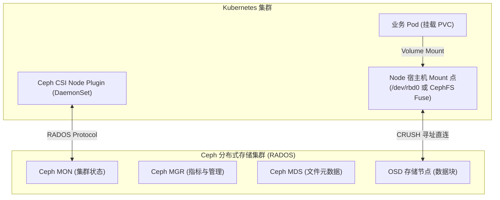
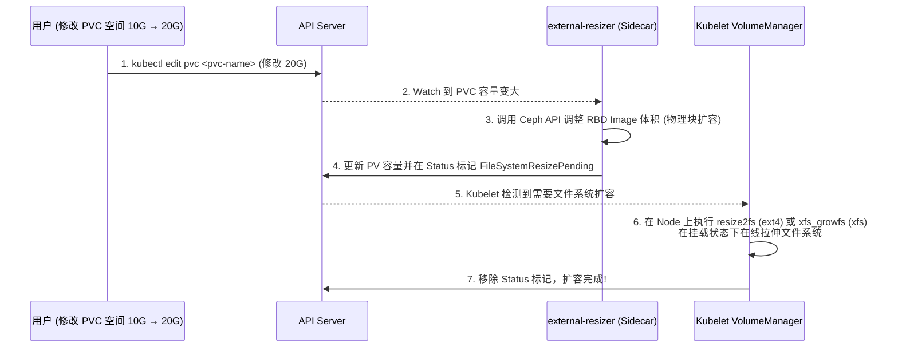

# 🗄️ Ceph RBD 与 CephFS 在 K8s 中的高性能挂载与 IOPS 调优实战

> 本文档面向高级 Kubernetes 工程师与云原生架构师，深入剖析 Ceph 分布式存储（RBD 块存储与 CephFS 文件系统）在 Kubernetes CSI 架构下的挂载机制、在线扩容原理、CRUSH 寻址调优、内核 RBD 缓存优化以及 IOPS 隔离限速。

---

## 目录
- [一、 Ceph 与 K8s CSI 交互全景架构](#一-ceph-与-k8s-csi-交互全景架构)
- [二、 Ceph RBD 块存储高性能挂载与 Kernel RBD 优化](#二-ceph-rbd-块存储高性能挂载与-kernel-rbd-优化)
- [三、 CephFS 共享文件系统多读多写 (RWX) 实践](#三-cephfs-共享文件系统多读多写-rwx-实践)
- [四、 PV 动态在线扩容 (Resizing) 底层机制](#四-pv-动态在线扩容-resizing-底层机制)
- [五、 生产级存储性能与 IOPS 隔离调优](#五-生产级存储性能与-iops-隔离调优)

---

## 一、 Ceph 与 K8s CSI 交互全景架构

Rook-Ceph 或原生 Ceph CSI 驱动通过标准的 CSI 接口接入 Kubernetes：



---

## 二、 Ceph RBD 块存储高性能挂载与 Kernel RBD 优化

RBD (RADOS Block Device) 为 Pod 提供高性能的独占块存储（RWO 模式）。

### 挂载模式对比：
- **Kernel RBD (krbd)**：直接在宿主机 Linux 内核加载 `rbd` 模块。**性能最高、延迟最低**，生产环境推荐。
- **RBD-NBD (UserSpace)**：用户态 NBD 驱动，延迟较高，仅用于特殊内核版本。

### 生产级 StorageClass 配置模板 (RBD)

```yaml
apiVersion: storage.k8s.io/v1
kind: StorageClass
metadata:
  name: csi-rbd-sc
provisioner: rbd.csi.ceph.com
parameters:
  clusterID: c23d4567-xxxx-xxxx
  pool: k8s-rbd-pool
  imageFormat: "2"
  imageFeatures: "layering,exclusive-lock,object-map,fast-diff" # 开启高级特性加速快照与 diff
  csi.storage.k8s.io/fstype: ext4
reclaimPolicy: Delete
allowVolumeExpansion: true   # 允许动态扩容!
```

---

## 三、 CephFS 共享文件系统多读多写 (RWX) 实践

CephFS 允许多个 Pod 在不同的 Node 上同时以 `ReadWriteMany (RWX)` 模式挂载同一个 PVC。

### MDS 高可用架构：
为了支撑高并发文件读写，CephFS 依赖 MDS (Metadata Server)。生产环境配置 **Active-Standby** 或 **Multi-Active (多主切片)** 模式，提高元数据处理能力。

---

## 四、 PV 动态在线扩容 (Resizing) 底层机制

Kubernetes 支持在**不停止 Pod** 的情况下，在线扩容 PVC 空间：



---

## 五、 生产级存储性能与 IOPS 隔离调优

### 1. 宿主机内核 RBD 调优
修改宿主机 `/etc/sysctl.conf` 提升 I/O 吞吐：

```bash
# 增大读写 request 队列深
echo "1024" > /sys/block/rbd0/queue/nr_requests

# 开启 read_ahead 预读 (针对大文件顺序读)
echo "4096" > /sys/block/rbd0/queue/read_ahead_kb

# 选用 kyber 或 none 调度器 (SSD/NVMe 磁盘)
echo "none" > /sys/block/rbd0/queue/scheduler
```

### 2. 通过 CSI 控制单 Pod IOPS 与 Bandwidth 限制
在 StorageClass 或 Pod 级限制读写带宽，防止单个喧闹邻居（Noisy Neighbor）占满整个 Ceph OSD：

```yaml
apiVersion: storage.k8s.io/v1
kind: StorageClass
metadata:
  name: csi-rbd-throttled
provisioner: rbd.csi.ceph.com
parameters:
  # 限制最大 IOPS 与读写吞吐量
  readbps: "104857600"       # 100 MB/s 读限制
  writebps: "52428800"       # 50 MB/s 写限制
  readiops: "5000"           # 5000 IOPS
  writeiops: "2500"
```

---

> [!TIP] 💡 关联技术与延伸阅读
>
> * [CSI 架构与底层挂载时序](./01-CSI架构与存储挂载全链路机制.md)
> * [Ceph 集群架构与部署实战](../07-集群扩展/03-Ceph分布式存储架构与部署实战.md)
> * [Ceph 存储应用与高可用运维](../07-集群扩展/04-Ceph存储应用与高可用运维.md)
