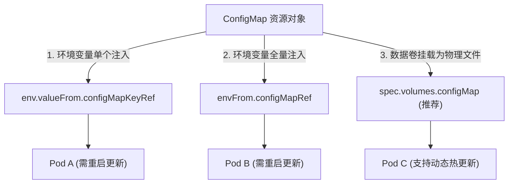

# ⚙️ ConfigMap (配置管理) 与 Secret (凭证保护) 核心指南

在云原生应用的设计中，**“配置与镜像解耦”**是保证镜像具备可移植性与重用性的金科玉律。Kubernetes 提供了两大资源对象：`ConfigMap`（用于非机密性业务配置）和 `Secret`（用于敏感密码、证书和 Token 的保护）。

---

## 一、 ConfigMap 配置统一管理

`ConfigMap` 专门用于保存非机密性的配置信息（如 `nginx.conf`、数据库连接串），数据以 `key-value` 键值对形式保存，单个 ConfigMap 的数据量**不能超过 1MiB**。

### 1. 配置注入的三种方式



*   **方式 ①：独立环境变量注入**
    *   将 ConfigMap 中的某个 Key 注入容器内指定的单个环境变量。
*   **方式 ②：全量环境变量注入 (envFrom)**
    *   将 ConfigMap 中所有的 Key-Value 批量自动展开为容器内的同名环境变量。
*   **方式 ③：数据卷（Volume）挂载 (推荐)**
    *   将 ConfigMap 转化为一个物理数据卷。挂载进容器后，每个 Key 会映射为挂载目录下的一个**物理配置文件**，配置文件内容即为 Value。

---

### 2. 生产关键机制：环境变量 vs 数据卷挂载热更新对比
> [!IMPORTANT]
> **热更新特性差异**：
> *   **挂载为 Volume**：当在集群中修改了 ConfigMap 后，Kubelet 会定期同步变更。大约在 10~60 秒内，容器内挂载的**物理配置文件内容会自动改变**，应用无需重启即可通过监测文件变化实现配置热载（如 `nginx -s reload`）。
> *   **作为环境变量注入**：应用进程在启动时会一次性读取环境变量。当 ConfigMap 修改后，容器内的**环境变量数值绝对不会改变**。若要使新配置生效，必须触发 Pod 重启（如执行 `kubectl rollout restart`）。

---

### 3. ConfigMap 创建与挂载 YAML 实战

#### 步骤 1：声明包含 Nginx 配置的 ConfigMap
```yaml
apiVersion: v1
kind: ConfigMap
metadata:
  name: nginx-config
  namespace: default
data:
  # nginx 虚拟主机配置文件以 Key 形式声明
  default-site.conf: |
    server {
        listen       80;
        server_name  localhost;
        location / {
            root   /usr/share/nginx/html;
            index  index.html index.htm;
        }
    }
```

#### 步骤 2：以 Volume 形式挂载进 Pod 容器
```yaml
apiVersion: v1
kind: Pod
metadata:
  name: nginx-config-pod
spec:
  containers:
  - name: web-nginx
    image: nginx:1.25
    volumeMounts:
    # 挂载到 Nginx 的默认配置读取路径
    - mountPath: /etc/nginx/conf.d/default.conf
      name: config-volume
      subPath: default.conf                     # 使用 subPath 防止覆盖容器原目录的其他文件
  volumes:
  - name: config-volume
    configMap:
      name: nginx-config                        # 引用上面创建的 ConfigMap
      items:
      - key: default-site.conf
        path: default.conf                      # 将对应的 Key 映射为具体文件名
```

---

## 二、 Secret 敏感数据保护机制

`Secret` 专门用于存储敏感数据，例如数据库密码、TLS 证书、私有镜像仓库认证 Token 等。

> [!CAUTION]
> **Base64 编码 vs 真正加密**：
> Kubernetes 默认的 Secret 数据仅仅是经过了 **Base64 编码**（以明文展示），**它不是加密！** 任何能访问 API Server 的用户或能直接读取 etcd 数据库的攻击者都可以使用 `base64 -d` 轻松恢复出密码。
> *   **安全防范**：必须开启 K8S 的 **`etcd encryption at rest` (etcd 静态加密)** 机制，并对接外部 KMS（密钥管理服务）来实现真正的物理加密保护。

---

### 1. 三种最常用的 Secret 类型
1.  **`Opaque` (默认类型)**：
    *   最常用的通用类型，包含任意自定义的用户敏感键值对。
2.  **`kubernetes.io/tls` (TLS 证书类型)**：
    *   专用于存放 SSL/TLS 证书。固定包含 `tls.crt`（公钥证书）和 `tls.key`（私钥）两个键。常用于 Ingress 配置 HTTPS 加密。
3.  **`kubernetes.io/dockerconfigjson` (镜像仓库凭证)**：
    *   专用于存放私有镜像仓库（如 Harbor、DockerHub 私有库）的用户名与密码。创建后，在 Pod 中声明 `imagePullSecrets` 进行绑定，Kubelet 凭此 Token 才能拉取私有镜像。

---

### 2. 命令行快速创建 Secret 命令
```bash
# 1. 创建通用 Opaque 密码凭证
kubectl create secret generic db-user-pass \
  --from-literal=username=admin \
  --from-literal=password='SecretP@ssword!'

# 2. 创建 TLS 证书凭证
kubectl create secret tls domain-ssl-secret \
  --cert=path/to/tls.crt \
  --key=path/to/tls.key

# 3. 创建私有镜像仓库拉取凭证
kubectl create secret docker-registry harbor-registry-token \
  --docker-server=harbor.mycompany.com \
  --docker-username=puller-user \
  --docker-password='PullerPassword!'
```

---

### 3. Secret 的安全挂载与内存保证 (tmpfs)
当以 Volume 形式挂载 Secret 时，Kubernetes 会采用极其安全的物理机制：
*   **内存文件系统 (tmpfs)**：Secret 挂载进容器的文件系统完全驻留在**节点的内存**中，**数据绝不写入节点的物理磁盘**。一旦容器终止，内存缓冲区立刻被擦除，防止敏感信息残留在宿主机磁盘上被窃取。

```yaml
apiVersion: v1
kind: Pod
metadata:
  name: secret-volume-pod
spec:
  containers:
  - name: secure-app
    image: alpine:latest
    command: ["sh", "-c", "cat /etc/secret-volume/password && sleep 3600"]
    volumeMounts:
    - name: secret-vol
      mountPath: "/etc/secret-volume"
      readOnly: true
  volumes:
  - name: secret-vol
    secret:
      secretName: db-user-pass                # 引用创建的通用密码 Secret
```
