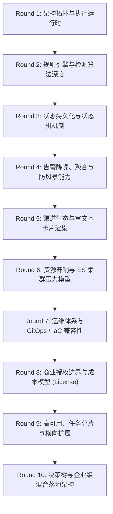
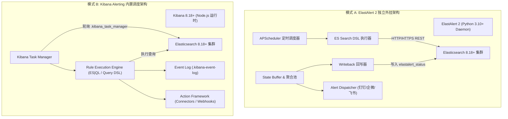
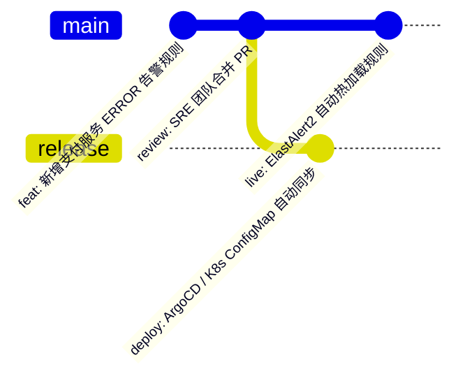

# Elasticsearch 日志告警双雄：ElastAlert 2 vs Kibana Alerting & Rules 深度全景解析

> 基于 Elastic Stack 8.18+ 与 ElastAlert 2 架构，通过 10 轮深度推演，全面剖析独立告警引擎与内置规则系统的底层机制、算法模型、降噪策略、商业边界与企业级选型。

---

## 10 轮深度推演思维矩阵 (10-Round Analytical Framework)



---

## Round 1：架构拓扑与执行运行时 (Architecture & Runtime)



| 维度 | ElastAlert 2 | Kibana Alerting & Rules |
|------|--------------|-------------------------|
| **运行宿主** | 独立的轻量容器/进程（Python 3），与 Kibana 完全解耦 | 运行在 Kibana 内部（Node.js），作为 Kibana 后台任务子系统 |
| **调度核心** | 内置 Python `APScheduler` 定时轮询，精确到秒级 | 基于 `Kibana Task Manager` 分布式任务队列，由各 Kibana 实例抢占执行 |
| **耦合程度** | **极低**：Kibana 宕机甚至不安装 Kibana 均完全不影响告警 | **极高**：依赖 Kibana 实例的健康度与 Task Manager 的消费能力 |
| **查询接口** | 纯标准 Elasticsearch REST API (`_search`) | 深度集成内部 API、Query DSL 及新一代 **ES\|QL 向量化引擎** |

---

## Round 2：规则引擎与检测算法深度 (Detection Algorithms)

```
┌─────────────────────────────────────────────────────────────────────────────────┐
│                           ElastAlert 2 规则模型库                                │
├─────────────────┬─────────────────┬──────────────────┬──────────────────────────┤
│ Any (单条命中)   │ Frequency (频次) │ Spike (突增/突降) │ Flatline (心跳假死)       │
├─────────────────┼─────────────────┼──────────────────┼──────────────────────────┤
│ Blacklist/White │ Change (字段突变)│ Cardinality(基数)│ Percentage (占比异常)     │
└─────────────────┴─────────────────┴──────────────────┴──────────────────────────┘
```

### 1. 核心算法模型对比

| 告警场景 | ElastAlert 2 实现方式 | Kibana Alerting (Basic 免费版) 实现方式 |
|---------|----------------------|---------------------------------------|
| **错误日志单条匹配** | `type: any` + Query String 过滤 | `Elasticsearch query` 或 `Index threshold` (Doc Count > 0) |
| **5 分钟错误 > 50 次** | `type: frequency` + `timeframe: 5m` | `Index threshold` (IS ABOVE 50 FOR THE LAST 5 minutes) |
| **流量/报错同比激增 3 倍** | `type: spike` + `spike_height: 3` + `spike_type: up` (原生支持) | ❌ **不支持**（需 Gold/Platinum 商业版 ML 异常检测或复杂 ES\|QL） |
| **服务心跳丢失/日志假死** | `type: flatline` + `threshold: 1` + `timeframe: 10m` (原生支持) | ⚠️ 需通过 `Index threshold` (Doc Count IS BELOW 1) 变通实现 |
| **同 IP 爆破不同账号数超标** | `type: cardinality` + `cardinality_field: user` (原生支持) | ❌ 免费版不支持（需 Platinum 级 SIEM Detection Rules） |
| **字段突变检测 (A->B)** | `type: change` + `compare_key: status` (原生支持) | ❌ 不支持 |

> **关键推论**：ElastAlert 2 的算法深度主要体现在**无状态流与时序比较**（如跨周期对比 Spike、唯一值基数 Cardinality、状态迁移 Change）；而 Kibana 免费版主要局限在**单一时间窗口内的静态阈值判定**。

---

## Round 3：状态持久化与状态机机制 (State & Tracking)

### 1. ElastAlert 2 状态流转（Writeback 机制）
ElastAlert 2 将所有内部运行状态持久化在 Elasticsearch 的专属索引中：
- **`elastalert_status`**：记录每个 Rule 的查询执行耗时、命中数、最新扫描的时间游标（`@timestamp` 检查点）；
- **`elastalert` (Alert Log)**：记录已触发的告警详情、发送通道、状态（Success/Error）；
- **`elastalert_silence`**：记录用户设置的静默期（Silence/Realert）。

```
[ElastAlert 启动] ──► 查询 elastalert_status 获取上次检查点 ──► 执行增量查询 ──► 回写新检查点
```
* **容灾能力**：容器重启后，会自动从上次中断的时间游标继续扫描，**不丢日志、不漏告警**。

### 2. Kibana Alerting 状态流转（Task Manager & Event Log）
- 依托于 `.kibana_task_manager` 系统索引分配任务锁；
- 告警执行记录与动作触发历史写入 `.kibana-event-log-*`；
- 状态机包含：`Active`（触发中）、`Recovered`（已恢复）、`Untracked`（未跟踪）、`Muffled/Muted`（已静音）。

---

## Round 4：告警降噪、聚合与防风暴能力 (De-noising & Storm Protection)

在高并发微服务场景下，一次数据库断连可能导致 1 秒内产生 100,000 条 ERROR。若无降噪机制，会瞬间打满钉钉/企微机器人的 API 限流，导致群聊瘫痪。

```
原始错误日志流 (10,000 条/分)
       │
       ▼
┌────────────────────────────────────────────────────────┐
│             ElastAlert 2 多级防风暴流水线               │
│                                                        │
│  1. 过滤降噪: 排除 healthz / actuator / 探针日志        │
│  2. 匹配聚合: 按 kubernetes.pod_name 分桶聚合 (5分钟)   │
│  3. 频次抑制: realert: 15m (同类故障 15 分钟内不复发)   │
│  4. 全局限速: drop_old_signals 丢弃堆积陈旧告警         │
└────────────────────────────────────────────────────────┘
       │
       ▼ 压缩率 99.9%
最终通知: 1 条精炼聚合卡片 (附带受影响 Pod 列表与错误提要)
```

| 降噪维度 | ElastAlert 2 | Kibana Alerting & Rules |
|---------|--------------|-------------------------|
| **按字段聚合发送** | `aggregation: {minutes: 5}`<br>`aggregate_by_match_keys: [pod_name]` | ⚠️ 规则级别聚合，按字段拆分需配置 Group-by（支持但消息模板渲染较受限） |
| **告警静默期 (Realert)** | `realert: {minutes: 15}`（规则粒度精确控制） | 支持 **Snooze**（手动休眠）和 **Throttle**（如每 1 小时最多触发一次） |
| **告警恢复自动通知** | 需配置 `attach_related: true` 或变通规则 | ✅ **原生支持 Alert Recovery 动作**（告警恢复时自动发一条群通知） |
| **黑白名单过滤** | 支持 `filter` DSL 复杂正则与字段嵌套排除 | 支持 KQL / Lucene 语法精准排除 |

---

## Round 5：渠道生态与富文本卡片渲染 (Notification Channels)

```yaml
# ElastAlert 2 原生钉钉 Markdown 卡片定义 (极简且功能完备)
alert:
- "dingtalk"
dingtalk_webhook: "https://oapi.dingtalk.com/robot/send?access_token=xxxx"
dingtalk_msgtype: "markdown"
alert_subject: "🚨【生产故障】{0} 服务异常"
alert_text_args: ["kubernetes.pod_name", "log"]
```

```json
// Kibana Action (需通过 Webhook Connector 拼装钉钉 JSON Payload)
{
  "msgtype": "markdown",
  "markdown": {
    "title": "{{context.rule.name}}",
    "text": "### 🚨 {{context.rule.name}}\n> **触发时间**: {{context.date}}\n> **原因**: {{context.reason}}"
  }
}
```

| 特性 | ElastAlert 2 | Kibana Alerting |
|------|--------------|-----------------|
| **国内 IM 官方支持** | **原生内置**：`dingtalk`、`wechatwork`、`feishu` 开箱即用 | 需通过通用 **Webhook Connector** 手动拼装各家 JSON 报文 |
| **模板引擎** | Python 原生格式化字符串 / Jinja2 模板 | **Mustache 模板语法**（`{{context.value}}`） |
| **邮件 (SMTP)** | 原生内置，支持 HTML 渲染与附件 | 原生内置 Email Connector |
| **告警上下文传递** | 可直接截取原始错误日志文本作为 `{0}` 注入 | 可传递触发时的聚合统计指标与匹配文档上下文 |

---

## Round 6：资源开销与 ES 集群压力模型 (Resource & Cluster Impact)

```
                       ES 查询压力与开销模型
                       
  ElastAlert 2:  [单进程] ──(每 30s 发送 1 次 DSL)──► [ES Coordinating Node]
                 内存占用: 50MB ~ 150MB (极轻)
                 CPU 占用: 0.05 ~ 0.2 Core
                 
  Kibana Rules:  [Kibana Task Manager] ──(并发分布式任务)──► [ES Coordinating Node]
                 内存占用: 共享 Kibana 进程 (1GB ~ 2GB+)
                 CPU 占用: 依赖 Node.js 事件循环
```

1. **查询下推效率**：
   - **ElastAlert 2**：尽量将过滤（Filter）、聚合（Aggregation）下推至 ES，客户端只做轻量结果比对，内存消耗极低（通常设置 Limit 128MB~256MB 即可稳定运行）。
   - **Kibana 8.18 ES\|QL**：利用 ES 8 新一代向量化执行引擎，直接在 ES 底层列式计算，查询速度极快且极大减轻 Coordinating 节点的序列化压力。
2. **连接治理**：
   - ElastAlert 2 维持单连接池；Kibana 则由连接池与 Task Manager 并发线程池共同管理。

---

## Round 7：运维体系与 GitOps / IaC 兼容性 (Operations & GitOps)



| 运维维度 | ElastAlert 2 | Kibana Alerting |
|---------|--------------|-------------------------|
| **配置承载形态** | **纯文本 YAML 规则文件** | Kibana **Saved Objects**（底层为 ES 内部 JSON 格式存储） |
| **GitOps 支持** | **极佳**：通过 K8s ConfigMap 挂载，ArgoCD/Git 提交直接生效，支持热加载 | ⚠️ 需通过 Kibana REST API 或 Terraform Provider (`elastic/elasticstack`) 同步 |
| **可视化编排** | 依赖开源项目 **Praeco** 或手动编写 YAML | **极佳**：Kibana UI 原生可视化向导，非技术人员也能轻松点选 |
| **规则版本回滚** | `git revert` 即可精准秒级回滚单个告警规则 | 依赖 Kibana Saved Objects 导出导入或 API 变更审计 |

---

## Round 8：商业授权边界与成本模型 (License & Cost)

| 场景功能 | ElastAlert 2 | Kibana Alerting (Elastic License) |
|---------|:------------:|:---------------------------------:|
| **基础阈值告警 (Doc Count / Threshold)** | ✅ 免费 (Apache 2.0) | ✅ 免费 (Basic License) |
| **自定义 Webhook 发送 (钉钉/企微)** | ✅ 免费 (内置开箱即用) | ✅ 免费 (Basic License 支持通用 Webhook) |
| **Spike 跨周期同比/环比突增突降** | ✅ **100% 免费** | ❌ **付费 (Gold / Platinum ML 模块)** |
| **Flatline 心跳假死/断流检测** | ✅ **100% 免费** | ⚠️ 免费版需复杂配置，商业版提供 Uptime 专用告警 |
| **Cardinality 唯一值基数异动** | ✅ **100% 免费** | ❌ **付费 (Platinum 级 SIEM Rules)** |
| **Jira / ServiceNow / PagerDuty 官方连接器** | ⚠️ 需自定义脚本/Webhook | ❌ **付费 (Gold / Platinum 专有 Connector)** |

---

## Round 9：高可用、任务分片与横向扩展 (HA & Scalability)

### 1. ElastAlert 2 高可用方案
- **主备（Active-Passive）**：部署 2 副本 StatefulSet/Deployment，利用相同的 `writeback_index`。
- **规则分片（Rule Sharding）**：当有成百上千条规则时，按命名空间或业务线拆分 Deployment（如 `elastalert-infra`、`elastalert-biz`），各自加载不同的 ConfigMap 规则子集。

### 2. Kibana Alerting 高可用方案
- **原生多活（Active-Active）**：部署多个 Kibana 实例，底层自动通过 `.kibana_task_manager` 索引进行分布式任务抢占与负载均衡。一个 Kibana 实例宕机，其他实例自动接管其未完成的告警任务。

---

## Round 10：企业级全场景选型决策树与落地建议 (Decision Tree)

### 1. 选型决策树

```
                              企业日志告警选型
                                     │
            ┌────────────────────────┴────────────────────────┐
            ▼                                                 ▼
   【已有 / 追求 GitOps】                             【追求可视化开箱即用】
   【需复杂算法 (Spike/基数)】                         【仅需常规阈值/ERROR触发】
            │                                                 │
            ▼                                                 ▼
     选用 ElastAlert 2                                选用 Kibana Alerting
   (当前项目的生产推荐解法)                           (Kibana 页面配置 Webhook)
            │                                                 │
            ├─► 声明式 YAML 纳管                               ├─► 页面拖拽配置
            ├─► 原生钉钉/企微 Markdown                         └─► 自动恢复通知 (Recovery)
            └─► 零额外 License 成本
```

### 2. 企业级终极落地形态：双轨制混合架构 (Hybrid Architecture)

在大型企业生产落地中，最成熟的方案往往不是“非此即彼”，而是**双轨协同**：

```
                              [ Elasticsearch 8.18+ ]
                                   ▲             ▲
                                   │             │
                    ┌──────────────┴──┐       ┌──┴──────────────┐
                    │                 │       │                 │
             [ ElastAlert 2 ]         │       │    [ Kibana ]   │
                    │                 │       │        │        │
             【深度特征与模式检测】    │       │   【日常阈值与快速排障】
             • 突发流量激增 (Spike)   │       │   • 业务线自主配置阈值
             • 心跳假死 (Flatline)    │       │   • 告警一键跳回 Discover
             • 异常基数 (Cardinality) │       │   • 临时排错与快速止血
                    │                 │       │        │
                    ▼                 │       │        ▼
             [ 统一运维钉钉/企微群 ] ◄─┴───────┴──► [ 业务研发通知群 ]
```

---

> [!TIP] 💡 关联技术与延伸阅读
>
> * [Elasticsearch 8.18+ 核心原理与底层架构](./01-Elasticsearch.md)
> * [Fluentd 复杂日志清洗与字段裁剪管道](./03-Fluentd.md)
> * [Kibana 8.18 生产部署与 ES|QL 实战](./04-Kibana.md)
> * [ElastAlert 2 生产级日志告警引擎深度架构与实战指南](./06-ElastAlert2.md)
> * [Kubernetes EFK 生产部署 YAML 清单与 ElastAlert 2 配置](../../../../05-Install/kubenetes/efk/README.md)
