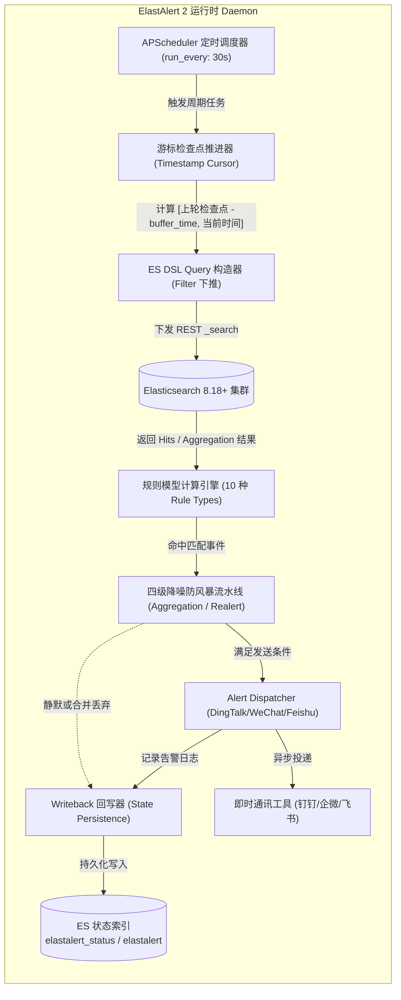
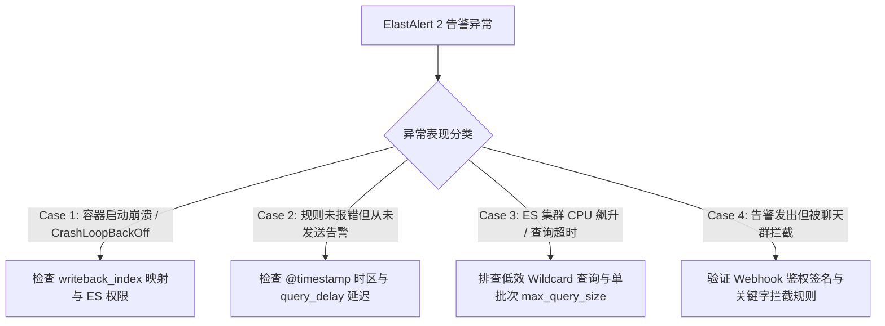

# ElastAlert 2 生产级日志告警引擎深度架构与实战指南

> [!NOTE]
> 本文档基于 **Elasticsearch 8.18+** 与 **ElastAlert 2**，全面解析其底层调度架构、Writeback 状态机、10 种核心规则模型、多级告警防风暴流水线以及 Kubernetes 生产级交付与排障指南。

---

## 1. 业务背景与技术定位 (Context & Core Value)

### 1.1 解决的核心痛点

在现代可观测性体系中，Prometheus 聚焦于指标（Metrics）监控，而微服务与基础架构运行时的深层故障（如空指针异常堆栈、特定错误码、慢 SQL 与高危入侵行为）深埋于海量日志（Logs）之中。传统日志监控面临三大核心痛点：

1. **指标监控的黑盒盲区**：Prometheus 只能感知接口失败率升高，却无法捕获发生异常时的具体堆栈日志（Stack Trace）、错误原因与关键入参。
2. **Kibana 原生告警的商业与算法限制**：Elasticsearch 原生 X-Pack / Kibana Alerting 的免费版本功能受限，很多高阶连接器需要商业授权，且缺乏针对复杂流式模式（如跨周期突增突降 Spike、唯一值基数 Cardinality、状态迁移 Change）的灵活支持。
3. **日志告警风暴灾难**：当发生数据库连接池耗尽或网络闪断时，集群内成千上万个 Pod 瞬间每秒打印数百条 ERROR 日志。若无精细的聚合、分组与静默机制，告警通道将在几秒内被彻底打爆，导致告警接收人产生“告警麻痹”。

### 1.2 演进历程与架构生态位

- **ElastAlert 1.x (Yelp 原版)**：由 Yelp 于 2014 年基于 Python 2/3 开源，但由于社区维护中断，停滞在 ES 7.x 早期，无法原生兼容 ES 8.x 安全通信、现代化 API 及国内主流 IM（钉钉、企业微信、飞书）。
- **ElastAlert 2 (现代化开源标准)**：由开源社区全面接棒重构，支持 Python 3.10+、全面适配 **Elasticsearch 7.x / 8.x 及 OpenSearch**，支持 GitOps 配置管理、原生集成主流通讯工具，并支持秒级热加载。
- **EFK 生态位**：在 Kubernetes 云原生日志闭环中，ElastAlert 2 作为外挂式准实时分析与告警分发引擎，构筑了日志流水线的“最后关键一公里”。

```
[K8s Pod 容器日志]
       │
       ▼
 [Fluent Bit] (边缘 DaemonSet 极速采集)
       │
       ▼
  [Fluentd] (集中式多行合并 / 正则过滤 / 字段裁剪)
       │
       ▼
[Elasticsearch 8.18+] (分布式倒排索引存储与检索)
       │
       ├──► [Kibana 8.18+] (可视化探索 / ES|QL 深度排查)
       │
       └──► [ElastAlert 2] (流式规则引擎 / 状态回写 / 智能防风暴)
                   │
                   ▼ (富文本 Markdown 卡片)
        [钉钉 / 企业微信 / 飞书 / Webhook]
```

---

## 2. 核心架构与底层原理解析 (Architecture & Deep Dive)

### 2.1 整体架构与执行拓扑

ElastAlert 2 采用独立于 Elasticsearch 和 Kibana 的单体轻量常驻进程（Daemon）架构，其内部核心由**调度器、查询构造器、规则引擎、防风暴管道与状态持久化器**五大核心子系统协同工作：



### 2.2 状态回写机制 (Writeback 架构)

为了保障在网络抖动、进程重启或节点漂移过程中**不漏查、不重发**，ElastAlert 2 摒弃了外部 Redis/MySQL 依赖，创新性地将全部运行状态以标准 JSON 文档回写至 Elasticsearch 自身的专属索引中：

| 索引名称                         | 索引用途                     | 核心记录字段                                                                                     | 关键机制与作用                                                                                                      |
| :------------------------------- | :--------------------------- | :----------------------------------------------------------------------------------------------- | :------------------------------------------------------------------------------------------------------------------ |
| **`elastalert_status`**  | **全局执行游标与心跳** | `rule_name`, `@timestamp`, `starttime`, `endtime`, `hits`, `matches`, `time_taken` | **断点续传核心**：记录每个规则上次扫描成功的确切时间戳游标。进程冷重启时直接从此游标续跑，杜绝漏扫。          |
| **`elastalert`**         | **告警投递审计日志**   | `rule_name`, `alert_time`, `alert_text`, `alert_sent`, `alert_exception`               | **告警归档**：记录每次告警的完整上下文及下游接口响应状态，用于复盘与投递失败排查。                            |
| **`elastalert_silence`** | **静默期与抑制状态**   | `rule_name`, `until`, `exponent`                                                           | **防重复打扰**：记录由 `realert` 或人工通过 API 设置的静默截止时间。调度器在 `until` 之前自动短路该规则。 |
| **`elastalert_past`**    | **长周期时序基线缓存** | `rule_name`, `match_body`, `@timestamp`                                                    | 专供`spike`、`change` 等跨周期对比规则暂存历史对比基准。                                                        |

### 2.3 缓冲窗口滑动算法 (Sliding Buffer Time)

针对分布式采集体系中固有的**日志传输与入库延迟（Ingestion Lag）**，ElastAlert 2 设计了 `buffer_time` 重叠检索机制：

- 若仅按严格的时间点查询 `[T1, T2]`，由于 Fluent Bit 缓存、网络传输或 ES 刷新延迟（`refresh_interval`），部分打着 `T1 - 5s` 时间戳的日志在 `T2` 时刻才写入 ES，会导致传统查询出现**边缘盲区漏报**。
- ElastAlert 2 在每次执行时，将查询窗口设定为 `[上轮最新游标 - buffer_time, 当前执行时间]`。
- 检索到结果后，通过内存中的 `Event Cache` 依据文档的唯一 `_id` 自动去重，从而兼顾**近实时性**与**零漏报**。

---

## 3. 十大核心规则模型与算法深度剖析 (Rule Types)

ElastAlert 2 的强大之处在于其预置了完备的时序分析与离散事件算法模型，覆盖从单点致命异常到复杂统计学行为分析的全场景：

```
┌─────────────────────────────────────────────────────────────────────────────────┐
│                           ElastAlert 2 规则模型库                                │
├────────────────────────┬────────────────────────┬───────────────────────────────┤
│    单点与状态迁移类     │     频次与基线异常类     │        高级统计与基数类        │
├────────────────────────┼────────────────────────┼───────────────────────────────┤
│ • any (单次命中)       │ • frequency (频次阈值) │ • cardinality (唯一值基数)    │
│ • change (状态跃迁)    │ • spike (突增突降比对) │ • metric_aggregation (指标)   │
│ • blacklist (黑名单)   │ • flatline (跌零掉线)  │ • percentage_match (占比模型) │
│ • whitelist (白名单)   │ • new_term (新值发现)  │                               │
└────────────────────────┴────────────────────────┴───────────────────────────────┘
```

### 3.1 基础匹配类模型

#### 1. `any`（单点命中即告警）

- **算法逻辑**：只要检索到一条符合 `filter` 条件的日志，立即生成一条匹配事件。
- **适用场景**：捕获致命单点异常，如 Java `OutOfMemoryError`、Go `runtime panic`、内核 `Kernel OOM Killer` 等。
- **典型配置片段**：
  ```yaml
  type: any
  index: "k8s-log-*"
  filter:
  - query:
      query_string:
        query: 'log: (Panic OR "OutOfMemoryError" OR "Fatal Error")'
  ```

#### 2. `blacklist` 与 `whitelist`（黑白名单匹配）

- **算法逻辑**：提取文档中的特定 `compare_key` 字段，比对该字段是否存在于预设的 `blacklist` 列表中；或是否脱离了 `whitelist` 集合。
- **适用场景**：安全合规审计。例如非运维网段 IP 尝试访问管理后台、容器内检测到非受信用户执行特权提权。

#### 3. `change`（字段状态迁移检测）

- **算法逻辑**：针对相同的实体标识（`compare_key`，如 `pod_name` 或 `user_id`），监控关注字段（`query_key`，如 `status` 或 `role`）在短时间内是否发生跃迁变化。
- **适用场景**：监控容器状态从 `Running` 骤变为 `CrashLoopBackOff`，或关键系统管理员权限发生非法变更。

---

### 3.2 频次与基线异常类模型

#### 4. `frequency`（滑动窗口频次阈值）

- **算法逻辑**：在预设的时间窗口（`timeframe`）内，当匹配事件的计数 $\ge$ `num_events` 时触发告警。
- **适用场景**：HTTP 5xx 网关错误率突发、应用频繁抛出 `Connection Refused`。
  ```yaml
  type: frequency
  index: "gateway-access-*"
  num_events: 50
  timeframe:
    minutes: 1
  filter:
  - term:
      response_code: 500
  ```

#### 5. `spike`（相邻时间窗口动态基线比对）

- **算法逻辑**：定义当前窗口（`timeframe`）与参考基线窗口。计算两个相邻周期的事件发生率比例：
  $$
  \text{Spike Ratio} = \frac{\text{Count}_{\text{current}}}{\text{Count}_{\text{reference}}}
  $$

  当比值超过 `spike_height` 且满足 `spike_type: "up"`（突增）或 `"down"`（突降）时触发。
- **适用场景**：业务流量激增或断崖式下跌。相比固定阈值，能有效适应“白天流量高、凌晨流量低”的潮汐业务特性。
  ```yaml
  type: spike
  index: "app-orders-*"
  spike_height: 3        # 当前流量是上个周期的 3 倍以上时告警
  spike_type: "up"
  timeframe:
    minutes: 10          # 探测窗口
  threshold_cur: 100     # 最小绝对事件数，防止低频噪声误报
  ```

#### 6. `flatline`（跌零掉线检测）

- **算法逻辑**：在指定的 `timeframe` 窗口内，若匹配到的日志总数**低于**预设的 `threshold`（通常设为 1），即刻告警。
- **适用场景**：采集组件探活与服务心跳检测。例如边缘节点 Fluent Bit 采集失联、支付回调心跳丢失、定时调度 Worker 停止工作。
  ```yaml
  type: flatline
  index: "k8s-log-*"
  threshold: 1
  timeframe:
    minutes: 10
  filter:
  - term:
      kubernetes.container_name.keyword: "order-cron-job"
  ```

---

### 3.3 高级统计学与安全检测类模型

#### 7. `cardinality`（唯一值基数检测）

- **算法逻辑**：利用 Elasticsearch 的 `cardinality` 聚合（基于 HyperLogLog++ 算法），计算指定实体（`query_key`）下某个字段的非重复值数量。当基数超过 `max_cardinality` 或低于 `min_cardinality` 时触发。
- **适用场景**：**反暴力破解 / 撞库攻击**。例如：5 分钟内同一客户端 IP（`query_key`）尝试登录的不同用户名（`cardinality_field: username`）超过 20 个。
  ```yaml
  type: cardinality
  index: "auth-audit-*"
  cardinality_field: "username.keyword"
  query_key: "client_ip.keyword"
  timeframe:
    minutes: 5
  max_cardinality: 20
  ```

#### 8. `new_term`（未知特征词新发现）

- **算法逻辑**：自动在内存与持久化索引中维护特定字段的已见历史词典。一旦检索到新出现的字段值即触发告警。
- **适用场景**：微服务网关捕获到以前从未定义过的未知异常错误码，或集群首次出现未知的系统调用。

#### 9. `metric_aggregation`（数值聚合度量）

- **算法逻辑**：在 ES 端执行 `avg`、`max`、`min` 或 `sum` 聚合计算。类似 Prometheus，直接对日志中的结构化数值字段判定阈值。
- **适用场景**：慢接口与性能劣化分析。例如：近 5 分钟某核心接口的 `response_time_ms` 平均值超过 2000ms。

#### 10. `percentage_match`（双条件比例模型）

- **算法逻辑**：向 ES 发起双重查询，计算符合特定错误条件的日志数占总体匹配日志数的百分比。当百分比超过 `match_bucket_filter` 阈值时触发。
- **适用场景**：计算特定接口的实际错误率百分比（如登录接口 5xx 占比超过 5%）。

---

## 4. 企业级告警降噪与防风暴流水线 (Noise Reduction Pipeline)

日志数据具备极高的脉冲突发性。ElastAlert 2 构建了从**检索过滤、时间聚合、多维聚类到静默抑制**的四级防风暴流水线：

```
       [ES 瞬时命中 5,000 条 Pod 异常日志]
                       │
                       ▼
┌─────────────────────────────────────────────────────────┐
│ 第一级: 检索过滤下推 (Filter-Level Pushdown)              │
│ - Lucene query_string 提前剔除心跳、探针与正常重试日志      │
└─────────────────────────────────────────────────────────┘
                       │ (过滤后剩余 1,200 条真实异常)
                       ▼
┌─────────────────────────────────────────────────────────┐
│ 第二级: 时间窗口聚合 (Time-Window Aggregation)           │
│ - aggregation.minutes: 5                                │
│ - 窗口内所有命中事件截流暂存，不产生任何逐条外部通知    │
└─────────────────────────────────────────────────────────┘
                       │ (打包为 1 个时间批次)
                       ▼
┌─────────────────────────────────────────────────────────┐
│ 第三级: 多维空间聚类 (aggregate_by_match_keys)          │
│ - 按 kubernetes.pod_name 或 error_code 分组             │
│ - 同一 Pod 的 300 次报错收敛为 1 组，多 Pod 分别独立汇总│
└─────────────────────────────────────────────────────────┘
                       │ (生成精炼的聚合摘要)
                       ▼
┌─────────────────────────────────────────────────────────┐
│ 第四级: 状态机静默抑制 (Realert & Silence Engine)       │
│ - realert.minutes: 30                                   │
│ - 相同规则在故障持续期间保持静默，禁止重复刷屏打扰      │
└─────────────────────────────────────────────────────────┘
                       │
                       ▼
           [投递 1 条高浓度 Markdown 诊断卡片]
```

### 降噪核心参数调优指南

| 参数名称                    | 推荐生产值                  | 作用机理与生产调优依据                                                                                         |
| :-------------------------- | :-------------------------- | :------------------------------------------------------------------------------------------------------------- |
| `aggregation`             | `minutes: 5`              | **时间窗口聚合**。5 分钟内所有满足条件的匹配事件打包延迟发送，彻底终结“一秒十报”的告警轰炸。           |
| `aggregate_by_match_keys` | `["kubernetes.pod_name"]` | **多维分组键**。配合聚合使用。确保各 Pod 之间的报错独立统计汇总，既避免交叉混淆，又避免告警遗漏。        |
| `realert`                 | `minutes: 15` 或 `30`   | **重复抑制期**。某规则触发告警后，在此时间内即便再次达到阈值也不打扰，给运维人员留出充足的处理时间。     |
| `query_delay`             | `minutes: 1` 或 `2`     | **写入延迟补偿**。将 ES 扫描窗口向前偏移，确保日志经过采集、传输、解析并全量落盘后再检索，杜绝临界漏报。 |
| `exponential_realert`     | `hours: 1`                | **指数退避静默**。长时间未恢复的常态故障，静默周期按 2 的幂次方倍增，防止长期存在的已知问题持续噪声化。  |

---

## 5. 生产级配置与 Kubernetes 交付规范 (Production Delivery)

### 5.1 全局配置文件 (`config.yaml`)

全局配置管控 ElastAlert 进程的生命周期与集群连接：

```yaml
# ElastAlert 2 全局核心配置文件
rules_folder: /opt/elastalert/rules    # 规则存储目录 (支持多级目录与动态监听)
run_every:
  seconds: 30                          # 调度轮询主周期 (推荐 15s~30s)
buffer_time:
  minutes: 15                          # 历史重叠缓冲区大小
es_host: elasticsearch.logging.svc     # ES 服务端点 (支持集群域名)
es_port: 9200
use_ssl: False                         # 开启 HTTPS 时设为 True
# es_username: "elastalert"            # 生产环境 RBAC 专有账号
# es_password: "YourSecurePassword"

writeback_index: elastalert_status     # 核心状态回写索引名称
writeback_alias: elastalert_alerts     # 索引别名
alert_time_limit:
  days: 2                              # 告警失败后在本地重试的最大时效

# 性能保护参数
max_query_size: 10000                  # 单次下推 ES 查询最大返回文档数 (防 OOM)
scroll_keepalive: "2m"                 # 游标查询滚动上下文存活时长
```

### 5.2 生产级业务告警规则模板 (`k8s-error-alert.yaml`)

配套工程实践（详见知识库 [02-elastalert2-alerting.yaml](../../../../05-Install/kubenetes/efk/02-elastalert2-alerting.yaml)）采用标准 Markdown 富文本排版，注入上下文诊断字段：

```yaml
name: "K8s-Container-Error-Alert"
type: any
index: "k8s-log-*"

# 1. 过滤下推：精准捕获高危异常，反向排除健康检查与探测日志
filter:
- query:
    query_string:
      query: >-
        log: (ERROR OR Exception OR Fatal OR "status: 500" OR Panic)
        AND NOT log: ("healthz" OR "readiness" OR "liveness" OR "actuator/health" OR "kube-probe")

# 2. 四级防风暴流水线
aggregation:
  minutes: 5
aggregate_by_match_keys:
  - "kubernetes.namespace_name"
  - "kubernetes.pod_name"
realert:
  minutes: 15

# 3. 通知渠道：钉钉机器人 Markdown 卡片 (可无缝扩展企微/飞书)
alert:
- "dingtalk"
dingtalk_webhook: "https://oapi.dingtalk.com/robot/send?access_token=YOUR_SECURE_TOKEN"
dingtalk_msgtype: "markdown"

# 4. 富文本渲染与参数动态注入
alert_subject: "🚨【生产告警】K8s 容器异常 ERROR 日志 ({0}/{1})"
alert_subject_args:
  - "kubernetes.namespace_name"
  - "kubernetes.pod_name"
alert_text_type: alert_text_only
alert_text: |
  ### 🚨 Kubernetes 业务容器异常日志提要
  > **告警环境**: 生产核心集群 (`prod-k8s-01`)
  > **告警时间**: {0}
  > **命名空间**: `{1}`
  > **Pod 实例**: `{2}`
  > **容器名称**: `{3}`
  > **运行节点**: `{4}`
  
  ---
  #### 📋 堆栈摘要信息 (Log Snippet):
  ```text
  {5}
```

---

> 💡 **排查指引**: 请点击登录 Kibana 控制台追踪分布式 TraceID 与完整上下文。
> alert_text_args:

- "@timestamp"
- "kubernetes.namespace_name"
- "kubernetes.pod_name"
- "kubernetes.container_name"
- "kubernetes.host"
- "log"

```

### 5.3 Kubernetes 云原生热加载机制

ElastAlert 2 具备内置的规则文件变更监听机制。在 Kubernetes 中通过 **ConfigMap** 挂载规则时：
1. 更新规则时仅需执行 `kubectl apply -f 02-elastalert2-alerting.yaml`；
2. Kubelet 会在几十秒内自动同步并更新挂载在 Pod 内的规则卷文件；
3. ElastAlert 2 进程自动感知到文件哈希或修改时间戳变化，**在下一个 `run_every` 周期自动完成热加载（Hot-Reload），无需重启 Pod**，保障告警链路 7x24 不间断。

---

## 6. 高可用架构、规则分片与性能调优 (HA & Sharding)

### 6.1 单进程瓶颈与规则分片（Rule Sharding）

ElastAlert 2 为单进程/协程模型。当企业内部规则数量扩张到数百条、或部分规则的单次检索数据量达到数十万条时，单实例会面临**轮询周期拉长、查询阻塞堆积**的风险。

**生产级高可用与扩展方案**：
```

                             [Git 规则仓库]
                                   │
              ┌────────────────────┴────────────────────┐
              ▼                                         ▼
   [ConfigMap: elastalert-infra]             [ConfigMap: elastalert-biz]
              │                                         │
              ▼                                         ▼
   ┌───────────────────────┐                 ┌───────────────────────┐
   │ Deployment 1:         │                 │ Deployment 2:         │
   │ elastalert-infra      │                 │ elastalert-biz        │
   │ (监控主机/网络/中间件) │                 │ (监控核心微服务业务)  │
   └──────────┬────────────┘                 └──────────┬────────────┘
              │                                         │
              └────────────────────┬────────────────────┘
                                   ▼
                   [Elasticsearch 8.18+ 集群]

```

- **业务域规则分片（Rule Sharding）**：按业务线或命名空间拆分为独立的 Deployment 实例（例如基础组件分片 `elastalert-infra`、业务域分片 `elastalert-biz`），各自加载独立的 ConfigMap。
- **状态物理隔离**：不同的分片可配置不同的 `writeback_index`（如 `elastalert_status_infra`、`elastalert_status_biz`），避免索引写热点与锁竞争。

### 6.2 保护 Elasticsearch 集群性能的最佳实践

1. **绝对禁止无前缀通配符检索**：
   - 严禁在 `query_string` 中编写 `log: *Exception*`，这会导致 Lucene 遍历所有词项字典，引发集群 CPU 剧烈飙升。
   - 正确做法：采用精确分词短语匹配 `log: Exception`，或者使用精确词匹配。
2. **强制使用 Filter 上下文**：
   - 过滤条件应尽量封装在 `filter` 块内而非 `query` 打分块内，充分利用 Elasticsearch 内置的 **Filter Cache（位集缓存）**，查询耗时可降低 80% 以上。
3. **精准匹配索引通配符**：
   - 避免使用 `index: "*"` 扫描全集群索引。使用动态日期模式（如 `use_strftime_index: true` 配合 `index: "k8s-log-%Y.%m.%d"`）或精准通配符 `k8s-log-*`，将检索范围锁定在活跃索引。

---

## 7. 生产高频踩坑与排障决策矩阵 (Troubleshooting Matrix)



### 7.1 故障 1：`elastalert_status` 索引权限或 Mapping 冲突导致 CrashLoopBackOff

- **现象**：Pod 启动几秒后异常退出，报错 `elasticsearch.exceptions.RequestError: TransportError(400, 'illegal_argument_exception')`。
- **根因**：初次启动时 ElastAlert 尝试自动创建 `writeback_index`，若 ES 开启了集群只读锁（磁盘水位过高）或当前运行账号缺乏 `indices:admin/create` 权限，会导致创建失败。
- **排查与修复**：
  ```bash
  # 1. 检查 ES 磁盘水位与只读状态
  curl -s http://elasticsearch:9200/_cluster/settings?pretty | grep read_only

  # 2. 使用 elastalert-create-index 工具手动预初始化索引
  elastalert-create-index --host elasticsearch.logging.svc --port 9200 --index elastalert_status --old-index ""
  ```

### 7.2 故障 2：ES 明确有 ERROR 日志，但 ElastAlert 迟迟不报警（时区与延迟陷阱）

- **现象**：在 Kibana 界面能看到错误日志，但 ElastAlert 运行日志显示 `hits: 0`。
- **根因分析**：
  1. **时区不一致**：日志入库时的 `@timestamp` 为 UTC 时间，而规则查询时未配置 UTC 转换，导致查询窗口跑到未来或过去。
  2. **日志写入延迟（Ingestion Lag）**：日志产生后经历 Fluent Bit 与网络传输，延迟 30 秒才落入 ES，而 ElastAlert 查询窗口刚好错过。
- **排查与修复方案**：
  - 在规则中显式设置 `use_local_time: false`（ES 内部统一按 UTC 时间检索）；
  - 增加 `query_delay: { minutes: 1 }`，将查询窗口后延 1 分钟，保证日志落盘后再扫描。

### 7.3 故障 3：告警投递显示成功，但钉钉/企微群内未收到通知

- **现象**：`elastalert_status` 显示 `alert_sent: 1`，但群内毫无动静。
- **根因**：
  1. **安全关键字未命中**：钉钉/企微自定义机器人强制开启“安全设置（自定义关键词或加签）”。若告警标题/内容未包含后台预设的关键词（如“生产”或“告警”），会被钉钉网关直接静默丢弃。
  2. **Webhook 频率超限**：钉钉限制每个机器人每分钟最多发送 20 条，超限后返回 HTTP 429。
- **排查与修复方案**：
  - 确保规则文件中的 `alert_subject` 或卡片文本中明确包含机器人安全设置中配置的**关键词**；
  - 开启 `aggregation: { minutes: 5 }`，强制收敛通知频次。

---

## 8. 总结与架构选型建议

- **轻量解耦、开箱即用**：ElastAlert 2 凭借极低的资源消耗（单实例通常仅需 128MB~256MB 内存）、与 Kibana 的零强依赖性，是云原生 EFK / OpenSearch 环境下**最具性价比**的日志告警引擎。
- **复杂模式匹配利器**：当业务场景涉及突增突降（Spike）、无数据跌零（Flatline）、唯一值统计（Cardinality）或多维聚合降噪时，ElastAlert 2 具备无可比拟的工程成熟度。

---

> [!TIP] 💡 关联技术与延伸阅读
> * [Elasticsearch 8.18+ 核心原理与分布式写入链路](./01-Elasticsearch.md)
> * [Fluent Bit 3.x 轻量边缘采集器部署与配置指南](./02-FluentBit.md)
> * [Fluentd 复杂管道日志清洗与字段裁剪实战](./03-Fluentd.md)
> * [Kibana 8.18 生产部署与 ES\|QL 实战指南](./04-Kibana.md)
> * [ElastAlert 2 vs Kibana Alerting 10 轮深度对比与选型决策树](./05-日志告警-ElastAlert2与Kibana-Alerting深度全景对比.md)
> * [Kubernetes EFK 生产级完整部署 YAML 清单与 ElastAlert 2 配置](../../../../05-Install/kubenetes/efk/README.md)
