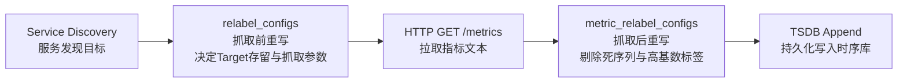
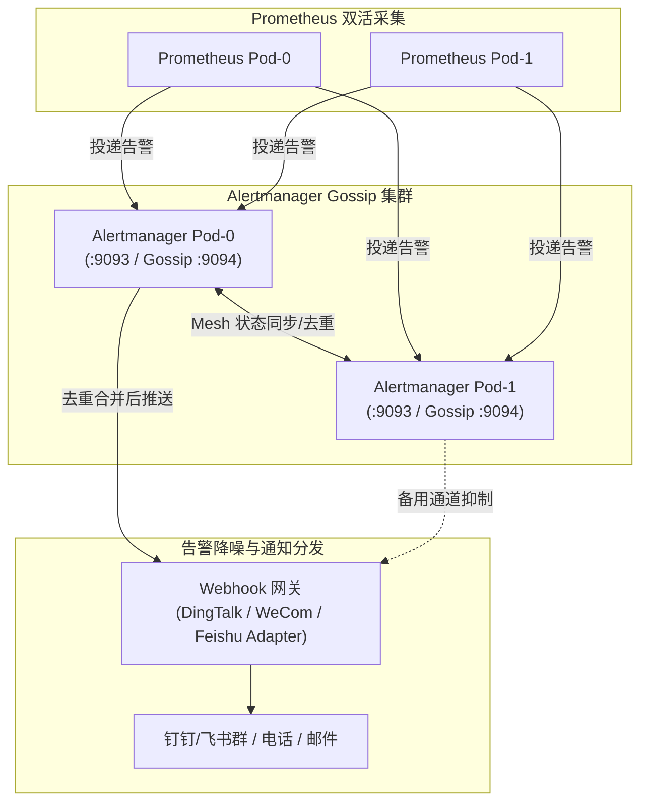

# Prometheus 与 Alertmanager 企业级架构设计与生产落地指南

## 一、 核心定位与业务背景

在云原生与大规模 Kubernetes 集群中，**Prometheus** 与 **Alertmanager** 构成了事实上的监控与告警工业标准。Prometheus 采用基于 HTTP 的 Pull（拉取）模型与高压缩比时序数据库（TSDB），搭配负责告警去重、分组、路由与抑制的 Alertmanager，为跨物理节点、容器运行时、Kubernetes 声明对象及企业级数据库（如 MySQL MGR）提供全栈指标监控。

然而，在生产环境落地时，单纯套用官方样例部署往往会遭遇 **内存爆炸（OOM）、磁盘 IO 打满、Pod 重启丢失历史时序、告警风暴与多实例数据孤岛** 等核心痛点。本文将从底层 TSDB 存储模型、抓取流水线、告警高可用拓扑到真实容量规划，系统化解析生产级落地方案。

---

## 二、 Prometheus 2.x TSDB 存储引擎底层剖析

Prometheus 2.x 采用自主研发的时序数据库引擎，其核心设计目标是：**极高的单机写入吞吐（每秒数十万至数百万点）与低延迟最近时间窗口查询**。

### 1. TSDB 内存与磁盘分层架构

```text
┌──────────────────────────────────────────────────────────────────────────────┐
│                              Prometheus 内存区 (RAM)                          │
│                                                                              │
│   Incoming Samples ───> ┌────────────────────────────────────────────────┐   │
│                         │             Head Chunk (活跃时序块)            │   │
│                         │  - 内存维护最近 1~3 小时未压缩采样数据         │   │
│                         │  - 达到 120 个 Sample 后封包转入 mmap          │   │
│                         └──────────────────────┬─────────────────────────┘   │
│                                                │ mmap                        │
│   Write-Ahead-Log ────> ┌──────────────────────▼─────────────────────────┐   │
│   (WAL 预写日志防丢)     │      Memory-Mapped Chunks (虚拟内存映射)       │   │
│                         └──────────────────────┬─────────────────────────┘   │
└────────────────────────────────────────────────┼─────────────────────────────┘
                                                 │ 2小时落盘 (Compaction)
┌────────────────────────────────────────────────▼─────────────────────────────┐
│                           本地持久化存储磁盘 (TSDB Blocks)                    │
│                                                                              │
│   ┌───────────────────────────┐         ┌───────────────────────────┐        │
│   │ Block: 01H8... (2h 原始块) │         │ Block: 01H9... (2h 原始块) │        │
│   │  ├─ chunks/ (时序压缩块)   │         │  ├─ chunks/               │        │
│   │  ├─ index (倒排索引字典)  │         │  ├─ index                 │        │
│   │  ├─ meta.json (元数据)    │         │  ├─ meta.json             │        │
│   │  └─ tombstones (删除标记) │         │  └─ tombstones            │        │
│   └─────────────┬─────────────┘         └─────────────┬─────────────┘        │
│                 │                                     │                      │
│                 └─────────────────┬───────────────────┘                      │
│                                   │ 后台大周期压缩 (Multi-block Compaction)   │
│                                   ▼                                          │
│                   ┌───────────────────────────┐                              │
│                   │ Block: 01HA... (8h / 24h) │                              │
│                   └───────────────────────────┘                              │
└──────────────────────────────────────────────────────────────────────────────┘
```

#### 关键机制解析：
1. **Head Block（内存头块）**：
   - 所有外部写入的指标采样点首先进入 Head Block，同时并行以 Append-Only 方式写入磁盘上的 **WAL（Write-Ahead Log）**，确保进程 Crash 重启后能够通过重放 WAL 100% 恢复内存未落盘数据。
   - 当单个 Chunk 积累到 **120 个采样点（Samples）** 或经过特定时间后，该 Chunk 会被切断（Cut），并通过系统调用 `mmap` 写至磁盘映射区，从 Go Heap 堆内存中解脱出来，大幅降低堆内存垃圾回收（GC）压力。
2. **2 小时落盘块（Block）**：
   - 每隔 2 小时，Head Block 中过期的内存 Chunk 连同倒排索引字典（Index）被固化生成一个不可变的 **Block 目录**。
3. **分层合并压缩（Compaction）**：
   - 后台协程定期扫描磁盘上的多个 2h 基础块，逐步将其合并为 6h、12h、24h 乃至更长时间的大 Block，消除重复标签键值，合并删除标记（Tombstones），提升长周期 PromQL 查询效率。

---

## 三、 Prometheus 抓取流水线生命周期：Relabel vs Metric Relabel

在 `prometheus.yml` 中，理解数据进入时序数据库之前的两个阶段至关重要：



| 对比维度 | `relabel_configs` (抓取前重定位) | `metric_relabel_configs` (抓取后指标重定位) |
| :--- | :--- | :--- |
| **生效阶段** | 目标发现（Target Discovery）之后，**发起 HTTP 抓取之前**。 | **HTTP 抓取完成返回文本数据之后**，写入 TSDB 之前。 |
| **操作对象** | 目标元数据标签（以 `__meta_` 开头的临时标签，如 `__address__`、`__metrics_path__`）。 | 指标自身的名字与业务标签（如 `container`、`pod`、`status`）。 |
| **典型用途** | 1. 过滤要抓取的 Pod / Service；<br>2. 动态改写目标抓取 IP/Port/Path；<br>3. 将 `__meta_kubernetes_node_name` 赋予目标 label。 | 1. 剔除高基数无用指标（如丢弃 `id=""` 的 cAdvisor 垃圾数据）；<br>2. 剥离带有随机 UUID、临时请求 ID 的标签；<br>3. 重命名或修改指标名称。 |
| **性能损耗** | 极低（仅按 Target 数量执行）。 | 较高（按每个抓取周期返回的 **指标行数** 逐行执行过滤，需精简规则）。 |

---

## 四、 生产级容量规划与内存计算模型

在生产环境中，**时序基数（Time Series Cardinality）** 是决定 Prometheus 资源开销的第一要素，而非磁盘保留时长。

### 1. 内存消耗容量估算公式

根据官方核心设计与海量生产实测：
$$\text{Memory (RSS)} \approx \text{Active Series} \times (3\text{ KB} \sim 8\text{ KB}) + \text{Query Headroom (50\%) }$$

- **Active Series（活跃时序数）**：通过 PromQL `prometheus_tsdb_head_series` 实时观测。
  - 标准 100 节点 K8s 集群（运行约 3000 Pods）：活跃时序数通常在 **30 万 ~ 80 万** 之间；
  - 基线常驻堆内存估算：$500,000 \times 4\text{ KB} \approx 2.0\text{ GB}$；
  - 叠加大跨度 PromQL（如 Grafana 刷新全集群 30 天聚合趋势图）峰值查询与 GC 抖动，**必须预留 50% ~ 100% 的 Buffer**，因此推荐生产配置为：`requests.memory=4Gi`，`limits.memory=8Gi`。

### 2. 生产关键启动参数与调优红线

```bash
/bin/prometheus \
  --config.file=/etc/prometheus/prometheus.yml \
  --storage.tsdb.path=/prometheus \
  --storage.tsdb.retention.time=15d \
  --storage.tsdb.retention.size=100GB \
  # 开启 WAL 压缩，可使 WAL 日志磁盘与恢复开销缩减 50%
  --storage.tsdb.wal-compression \
  # 启用生命周期管理 API（支持 curl -X POST http://localhost:9090/-/reload 动态重载）
  --web.enable-lifecycle \
  # 限制最大并发查询数，防止恶劣 PromQL 打崩数据库
  --query.max-concurrency=20 \
  --query.timeout=2m
```

---

## 五、 Alertmanager 高可用架构与告警路由收敛

Alertmanager 原生支持无需第三方存储（如 Consul/etcd）的 **分布式 Gossip（Memberlist）网状集群**。多个 Prometheus 实例同时向多个 Alertmanager 发送相同的告警事件，由 Alertmanager 在内部通过哈希环与集群状态同步完成**去重、合并分组、依赖抑制与静默**。



### 生产告警降噪三大机制：
1. **分组（Grouping）**：
   - 配置 `group_by: ['alertname', 'cluster', 'namespace', 'job']`。
   - 当机房交换机故障导致 50 个 Pod 同时断连时，Alertmanager 会将其合并为一条聚合通知推送到群聊，严禁发送 50 条消息产生轰炸。
2. **抑制（Inhibition）**：
   - 配置 `inhibit_rules`。
   - 当宿主机触发 `NodeDown`（严重致命）时，系统自动抑制该节点上所有 Pod 的 `PodDown`、`ContainerRestart` 告警，直击故障根因。
3. **静默（Silences）**：
   - 在生产计划内维护（如凌晨滚动升级内核或停机维保）时，在 Web 界面提前配置 2 小时标签静默，自动屏蔽预知告警。

---

## 六、 生产级落地的核心缺口与改良路径

评估基础安装文件（如纯 Manifests）与严苛生产环境标准的差距：

| 关注维度 | 样例/初级 Manifests 常见缺陷 | 企业级生产标准要求 |
| :--- | :--- | :--- |
| **存储持久化** | 使用 `emptyDir: {}` 或单机 `hostPath` | **必须采用 StatefulSet + PVC**，底层对接 Ceph RBD、独立 SSD 云盘或 Local PV，防 Pod 漂移数据蒸发。 |
| **配置重载** | 依赖手动执行 `kubectl exec ... -- curl -X POST /-/reload` | 挂载 **ConfigMap Reloader Sidecar**（如 `jimmidyson/configmap-reload`），检测 ConfigMap 变动秒级自动生效。 |
| **高可用与长周期** | 单副本 Deployment，历史数据受限于单盘容量 | 1. 采用 **双副本 Prometheus** 并行抓取防单点；<br>2. 接入 **Thanos / VictoriaMetrics** 实现冷热数据分层与 S3/MinIO 对象存储无限保留。 |
| **告警通知通道** | 默认原生仅支持 PagerDuty、Email、Slack | 国内生产环境必须部署 **Webhook Adapter** 容器，将 JSON Payload 转换为带 @所有人、Markdown 颜色高亮、一键静默链接的钉钉/企微卡片。 |

---

> [!TIP] 💡 关联技术与延伸阅读
>
> * [NodeExporter 宿主机全方位监控与指标基线](./02-NodeExporter宿主机全方位监控与指标基线.md)
> * [外部节点静态采集架构-ServiceMonitor与Endpoints深度思考与落地](./08-外部节点静态采集架构-ServiceMonitor与Endpoints深度思考与落地.md)
> * [cAdvisor 容器运行时指标全景与双轨采集对比](./03-cAdvisor容器运行时指标全景与双轨采集对比.md)
> * [kube-state-metrics 资源对象监控与大规模集群调优](./04-KubeStateMetrics资源对象监控与大规模集群调优.md)
> * [生产级监控体系缺口评估与 Operator 演进选型](./06-生产级监控体系缺口评估与Operator演进选型.md)
> * [企业级实战：Rancher 平台 MySQL 与外部节点监控全景落地指南](./07-企业级实战-Rancher平台MySQL与外部节点监控全景落地指南.md)
> * [生产级监控安装部署清单 (YAML)](../../../../05-Install/monitoring/README.md)
