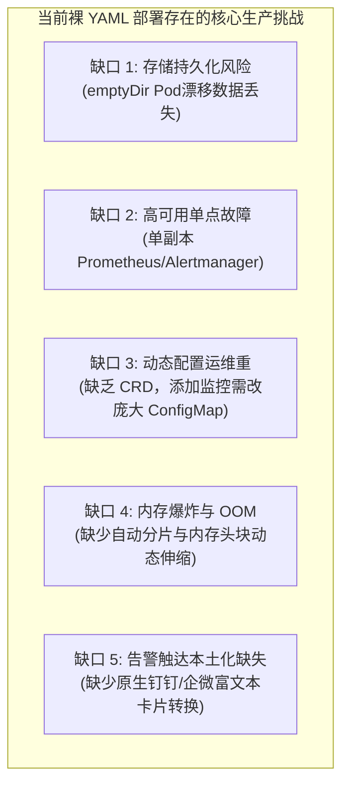

# 生产级监控体系缺口评估与 Operator 演进选型指南

## 一、 评估背景与架构自省

在基础安装清单（[`05-Install/monitoring/`](../../../../05-Install/monitoring/)）中，我们通过纯 Kubernetes 原生资源（Deployment、DaemonSet、ConfigMap、Service、Secret）构建了一套能够快速启动、低侵入、全组件覆盖的监控底座。

然而，站在 **企业级 SRE 架构师与严苛生产环境** 的视角下审视：**当前的清单是否能够直接支撑千级 Pod、金融级高可用与 7x24 小时零丢失的生产要求？** 答案是：**在基础开发/测试/中小规模集群表现良好，但在中大型严苛生产环境中存在若干结构性缺口。**

本文将对现有安装文件进行多维度深度体检，指出生产缺口，并给出演进路线。

---

## 二、 当前安装清单的生产缺口深度评估 (Gap Analysis)



### 1. 存储持久化与数据可靠性缺口

- **现状分析**：`02-prometheus.yaml` 与 `03-alertmanager.yaml` 中使用的是 `emptyDir: {}`（附带 PVC 注释说明）。
- **生产风险**：一旦宿主机发生内核故障或执行节点维护（`kubectl drain`），Prometheus Pod 漂移至其他 Worker 节点，**历史 TSDB 监控数据与告警历史将瞬间全部丢失**。
- **生产整改标准**：
  1. 必须将 `Deployment` 升级为 **`StatefulSet`**；
  2. 采用 `volumeClaimTemplates` 绑定企业级分布式持久化存储（如 Ceph RBD、极速 SSD 云盘或通过 Local Path Provisioner 绑定的专用高速 NVMe 本地盘）；
  3. 挂载必须保留至少 15 ~ 30 天磁盘容量（通常按每百万指标 200GB 预留）。

### 2. 高可用（HA）与脑裂抑制缺口

- **现状分析**：Prometheus 与 Alertmanager 均配置为 `replicas: 1`。
- **生产风险**：
  - Prometheus 单点重启期间（如加载规则、升级版本），整个集群出现 **5~10 分钟的监控盲区**；
  - Alertmanager 宕机期间，**集群告警完全断联**，发生严重故障无法感知。
- **生产整改标准**：
  - **Prometheus 双活架构**：部署 2 个对等实例，同时抓取相同目标，互为备份；
  - **Alertmanager 集群化**：部署 3 节点 StatefulSet，启用 `--cluster.peer` 参数构建网状 Gossip 集群，实现通知去重与跨可用区容灾。

### 3. 配置热重载与开发运维解耦缺口

- **现状分析**：新增监控业务时，SRE 需要手动修改 `prometheus-config` ConfigMap，并手动执行 `curl -X POST /-/reload`。
- **生产风险**：ConfigMap 达上千行后极易出现 YAML 语法缩进错误，直接导致 Prometheus 进程 Crash；研发团队无法自助为业务服务添加监控。
- **生产整改标准**：
  - **挂载 Config-Reloader Sidecar**：自动 Watch ConfigMap 变更并自动发送 Reload 请求；
  - **演进至 Prometheus Operator (CRD)**：使用 `ServiceMonitor`、`PodMonitor` 将监控配置权限下放给各业务命名空间。

### 4. 国内企业级告警通道适配缺口

- **现状分析**：Alertmanager 原生仅支持 Webhook、Email、Slack、PagerDuty。
- **生产风险**：国内生产主流使用的钉钉、企业微信、飞书无法直接解析 Alertmanager 原生 JSON Webhook，导致告警无法推送到群或缺失高亮卡片与 @特定值班人。
- **生产整改标准**：在 `monitoring` 命名空间常驻部署开源适配网关（如 `prometheus-webhook-dingtalk` 或 `feishu-alertmanager-webhook`）。

---

## 三、 三大演进技术选型全景横评

面对上述生产缺口，企业级云原生基础架构应如何选型演进？

| 选型维度 | 方案 A：裸清单深化优化 (当前优化版) | 方案 B：Prometheus-Operator (kube-prometheus) | 方案 C：VictoriaMetrics 集群版 |
| :--- | :--- | :--- | :--- |
| **部署难度** | ★☆☆☆☆ (极简，一键 apply，无额外 CRD) | ★★★☆☆ (需安装数十个 CRD 与控制器) | ★★★☆☆ (组件较多: vmagent/vmstorage/vmauth) |
| **维护门槛** | 低，标准 K8s 原生资源 | 中，需深入理解 CRD 控制器逻辑 | 中，需熟悉 VM 专属生态与组件交互 |
| **业务解耦** | 差 (全局统一 ConfigMap) | **极优 (研发通过 ServiceMonitor 声明式自管)** | **优 (完美兼容 Prometheus 协议与 CRD)** |
| **水平扩展性**| 差 (受单机 TSDB 内存与磁盘瓶颈限制) | 中 (支持分片，但长期存储仍需挂载 Thanos) | **极高 (存储计算天然分离，多副本无缝扩容)** |
| **长期时序归档**| 困难 (单盘 15~30 天已达极限) | 依赖接入 Thanos (S3/MinIO 对象存储) | **自带高效数据降采样与冷热存储分层** |
| **推荐适用场景**| **边缘集群、离线私有化交付、中小规模 (节点<100)** | **中大型标准化 K8s 集群 (官方首选标准体系)** | **千万级指标量、超大规模、多数据中心聚合汇聚** |

---

## 四、 生产环境优化交付与演进检查表 (Checklist)

若当前仍沿用清单部署，必须对照以下 Checklist 完成生产加固：

```markdown
- [ ] 1. 存储持久化：将 prometheus-server 改为 StatefulSet，绑定生产级 StorageClass。
- [ ] 2. 数据安全：启动参数显式开启 `--storage.tsdb.wal-compression`。
- [ ] 3. 内存防护：配置与活跃时序匹配的 requests/limits，防止被系统 OOM Killer 误杀。
- [ ] 4. 节点覆盖：node-exporter 确保具备 `tolerations: [{operator: Exists}]`，覆盖 Master 节点。
- [ ] 5. 存储防误报：node-exporter 必须排除 `overlayfs` 与 `tmpfs` 虚拟挂载点。
- [ ] 6. 容器监控：确认集群 containerd 是否已开启 `SystemdCgroup = true`。
- [ ] 7. 业务隔离：kube-state-metrics 针对超大集群启用 `--metric-labels-allowlist` 限制标签基数。
- [ ] 8. 数据库安全：mysqld-exporter 采用专用最小化只读账号，并限制 `MAX_USER_CONNECTIONS`。
- [ ] 9. 告警可靠性：部署 Webhook Adapter 实现钉钉/企微告警卡片格式化推送。
- [ ] 10. 架构演进：当集群节点数超过 100 时，计划迁移至 kube-prometheus (Operator)。
```

---

> [!TIP] 💡 关联技术与延伸阅读
>
> * [Prometheus 与 Alertmanager 企业级架构设计与生产落地](./01-Prometheus与Alertmanager架构设计与生产落地.md)
> * [云原生可观测性架构 Prometheus_Thanos_Tempo 与 eBPF 链路追踪](../08-云原生可观测性架构Prometheus_Thanos_Tempo与eBPF链路追踪.md)
> * [生产级监控安装清单与配置目录](../../../../05-Install/monitoring/README.md)
> * [万级节点与十万级 Pod 大规模集群调优指南](../07-万级节点与十万级Pod大规模集群调优指南.md)
