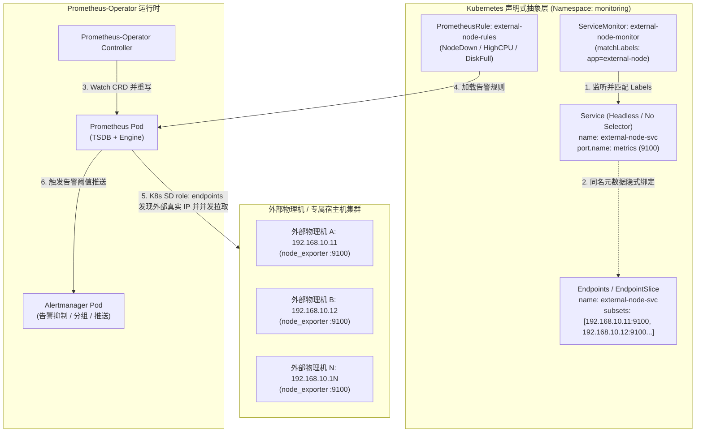
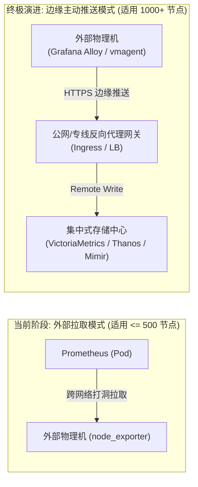
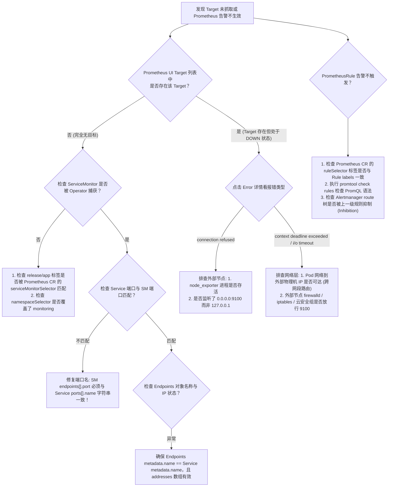

# 基于 ServiceMonitor、Service、Endpoints 与 PrometheusRule 的外部节点采集架构与三次深度思考

> [!NOTE]
> 本文档深入剖析在 Kubernetes 云原生监控（Prometheus-Operator / Rancher Monitoring）体系下，如何通过 **ServiceMonitor + Service + Endpoints + PrometheusRule** 四位一体声明式架构，纳管集群外部裸金属物理机、专属虚拟机与独立数据库节点的指标采集；并开展 **三次递进式深度思考**，从控制平面抽象哲学、底层网络流量与标签重写机制，直至超大规模瓶颈与架构演进极限。

---

## 1. 业务背景与技术定位 (Context & Core Value)

### 1.1 业务背景与架构痛点

在大型企业级 IT 架构（如医疗 HIS、金融核心交易、数据中台）的云原生演化进程中，并非所有算力节点都能或适合直接放入 Kubernetes 容器集群：

1. **高性能与硬件独占**：超大型关系型数据库（如 Oracle、MySQL MGR、PostgreSQL 高可用物理机）、大数据存储（HDFS、Ceph OSD）、专有硬件计算卡，因严苛的直接 I/O 要求与物理隔离策略，依然运行在裸金属机器或专属虚拟化集群中。
2. **监控中心云原生化**：运维与监控平台（Prometheus-Operator、Thanos、Alertmanager、Grafana）通常已全面跑在 Kubernetes 集群内部，享受容器化调度、水平弹性伸缩与声明式配置的红利。

### 1.2 核心诉求与传统方案弊端

此时产生了一个核心架构命题：**如何让运行在 K8s 内部的 Prometheus-Operator，以云原生、声明式、非侵入的方式纳管集群外部的大规模物理节点？**

| 方案对比                                                                          | 实现机制                                                                                    | 优势                                                                                    | 生产致命缺陷                                                                                     |
| :-------------------------------------------------------------------------------- | :------------------------------------------------------------------------------------------ | :-------------------------------------------------------------------------------------- | :----------------------------------------------------------------------------------------------- |
| **方案 A：原生额外配置逃逸 (`additionalScrapeConfigs`)**                  | 在 Prometheus CR 中挂载 Secret，注入传统`static_configs` 抓取抓取任务                     | 符合老旧 Prometheus 认知，无需建 K8s 对象                                               | 破坏声明式 GitOps 统一流程；需重启或重载核心 Pod；无法基于命名空间做多租户隔离与 RBAC 授权       |
| **方案 B：Pushgateway 中转推送**                                            | 外部节点将指标推送到 Pushgateway，Prometheus 再拉取                                         | 外部节点可单向出网                                                                      | Pushgateway 成为单点故障瓶颈；无法监控节点失联（指标留存导致幽灵在线）；无故障自愈与原生聚合能力 |
| **方案 C：ServiceMonitor + Service + Endpoints + PrometheusRule（本方案）** | 借助 Kubernetes 无选择器 Service 与静态 Endpoints 虚拟化外部资产，通过 CRD 声明式采集与告警 | 100% 遵从 K8s 声明式规范，多租户标签自治，动态热生效，与容器内 Pod 监控生命周期完全对齐 | 需要深入理解 K8s 服务发现机制与端点绑定契约                                                      |

---

## 2. 核心架构与四位一体运行拓扑 (Architecture & Deep Dive)

该方案的核心思想是：**“将集群外部物理 IP 虚拟化为 Kubernetes 原生 Endpoints，通过无 Selector 的 Service 提供契约接口，由 ServiceMonitor 驱动 Operator 动态生成采集配置，最后由 PrometheusRule 实现告警闭环”**。



### 2.1 四大核心组件生命周期与职责分工

1. **外部 Node Exporter**：宿主机操作系统级 Systemd 守护进程，暴露裸机 CPU、内存、磁盘 I/O、网络流量与系统负载指标（HTTP `:9100/metrics`）。
2. **无选择器 Service (`Service without Selector`)**：Kubernetes 原生对象。不定义 `spec.selector`，Kubernetes 就不会自动创建同名 Endpoints，从而为手动或自动化脚本接管后端端点创造了条件。它充当了逻辑服务名与端口契约的载体。
3. **静态 Endpoints / EndpointSlice**：将外部独立物理机 IP 与端口注册进集群 API Server，赋予外部资产与容器内部 Pod 完全等价的服务发现“坐标”。
4. **ServiceMonitor**：Prometheus-Operator 核心 CRD。定义抓取周期（`interval`）、端口匹配名称（`port`）、标签重写规则（`relabelings`），通知 Operator 将该 Service 生成为 Prometheus 的原生抓取 Job。
5. **PrometheusRule**：监控指标的守门员。声明告警触发表达式（PromQL）、持续时间（`for`）与通知路由标签，全声明式纳入版本控制。

---

## 3. 三次递进式深度思考 (Three In-depth Reflections)

为了探究此方案在企业级架构中的本质与边界，必须展开三次层层递进的思维碰撞。

### 第一次深度思考：【控制平面抽象哲学】—— 为什么不直接配 IP，偏要“多此一举”引入 Service+Endpoints？

* **直觉疑问**：
  在原生 Prometheus 时代，采集外部节点只需在 `prometheus.yml` 中写几行 `static_configs: - targets: ['192.168.10.11:9100']`。为什么 Prometheus-Operator 必须逼迫架构师创建 Service、编写 Endpoints，再挂上 ServiceMonitor？这不是把简单问题复杂化了吗？
* **底层本质剖析**：

  1. **声明式控制理论与单一职责法则（Separation of Concerns）**：
     - `Service` 声明了 **“服务契约”**（协议是 TCP、端口名称是 `metrics`、对外服务的逻辑语义）。
     - `Endpoints` 声明了 **“拓扑实例”**（谁当前在提供这个服务、物理 IP 是什么）。
     - `ServiceMonitor` 声明了 **“可观测性策略”**（采集频率 15s、超时 10s、标签重写清洗规则）。
     - 如果允许在 ServiceMonitor 中直接写 IP 列表，ServiceMonitor 就会沦落为一个混合了“拓扑定义”与“监控策略”的膨胀对象，违背了 Kubernetes 一切资源单一职责的架构美学。
  2. **外部资产在 K8s 内部的“平权化”（First-Class Citizen）**：
     - 一旦外部物理机被抽象为 Service + Endpoints，它们在 Kubernetes 控制平面眼中就与 Pod **毫无差别**。
     - 它们立刻享受了 Kubernetes 完整的治理能力：**Namespace 多租户隔离**、**统一 RBAC 访问权限**、**Kube-DNS 服务发现解析**、**NetworkPolicy 网络隔离策略** 以及 **统一标签系统（Label Selectors）**。
  3. **GitOps 流程防腐与权限收敛**：
     - 业务运维团队或基础设施团队需要新增 10 台外部节点时，**仅需要向 Git 仓库提交一份 Endpoints YAML 变更**，CI/CD 自动同步生效。
     - 他们无需拥有 Prometheus 核心配置的修改权限，也无需触碰 Prometheus-Operator 的管理权限，真正做到了“基础设施变更与监控系统底层解耦”。

---

### 第二次深度思考：【流量路径与标签重写黑魔法】—— 流量真的经过 Service VIP 吗？`instance` 标签丢失怎么破？

* **直觉误区与致命假象**：
  初学者常有一种直觉：“Prometheus 请求 Service 的 ClusterIP，然后由 Linux 内核 iptables/IPVS 负载均衡将流量分发给外部节点”。
  **这是极其危险的认知误区！如果在生产上真的通过 VIP 负载均衡轮询外部物理机，会导致灾难性的时序污染！**
* **底层流量路径真机剖析**：

  1. **Prometheus-Operator 的抓取原理**：
     Prometheus-Operator 根据 ServiceMonitor 生成抓取任务时，底层本质上配置的是 **Kubernetes 服务发现（`role: endpoints` 或 `role: endpointslice`）**，而不是普通 HTTP 反向代理。
     ```yaml
     # Operator 底层转换出的 Prometheus 核心配置原型
     - job_name: 'serviceMonitor/monitoring/external-node-monitor/0'
       kubernetes_sd_configs:
         - role: endpoints
           namespaces:
             names: [monitoring]
     ```
  2. **直连外部 IP，绝不走 ClusterIP 轮询**：
     Prometheus Server 直接调用 K8s API Server 的 Watch 接口，拿到 Endpoints 列表中的每一个独立外部 IP（`192.168.10.11:9100`、`192.168.10.12:9100`）。**Prometheus 容器向每一个物理 IP 发起并发独立的点对点 HTTP 直连抓取**。
     *原因*：时序数据库（TSDB）要求每个被抓取目标的指标具有持续性。如果走 VIP 轮询，第一次抓到 NodeA 的 CPU，第二次抓到 NodeB 的 CPU，由于标签完全相同，NodeA 与 NodeB 的指标交织在同一个时间线上，TSDB 的 `rate()` 计算将彻底崩溃并爆出大量断层尖刺！
* **标签污染危机与 Relabeling 救赎**：

  - **危机**：直连物理 IP 后，Prometheus 默认分配的指标标签是 `instance="192.168.10.11:9100"`。在包含成百上千节点的告警短信与 Grafana 仪表盘中，运维人员根本无法凭裸 IP 辨识这是“HIS 主数据库”还是“计费核心”。
  - **Relabeling 解决方案**：
    必须在 ServiceMonitor 的 `relabelings` 阶段实施标签重写，将元数据、真实主机名或通过 Metric Relabeling 清洗注入到目标 Label 中：
    ```yaml
    relabelings:
      - sourceLabels: [__meta_kubernetes_endpoint_address_target_name]
        targetLabel: node_name
      - sourceLabels: [__address__]
        regex: '(.*):9100'
        targetLabel: physical_ip
        replacement: '${1}'
    ```
* **端口名称强契约约束**：
  ServiceMonitor 中的 `endpoints[].port` 字段，**必须精确匹配 Service 中的 `spec.ports[].name`（如 `metrics`），严禁填写端口数字（如 9100）**！Prometheus-Operator 的 Controller 内部通过字符串比对端口名称，一旦不匹配，该 Target 会在没有任何报错提示的情况下被静默忽略。

---

### 第三次深度思考：【规模极限、架构缺陷与未来演进】—— 万台外部节点下的崩溃风险与终极形态

* **直面现实：这种方案的架构瓶颈在哪里？**
  虽然 Service + Endpoints 模式在几十至几百台外部节点的场景下表现优雅，但在超大规模企业级场景下，隐藏着不可忽视的架构暗礁：

  1. **Kubernetes API Server 的 Endpoints 膨胀与反序列化雪崩**：
     - 原生 `Endpoints` 对象是一个单体数组结构。根据 Kubernetes 官方基准，当单个 Endpoints 内的 IP 数量超过 1000 时，单次变更会导致巨大 JSON/Protobuf 消息全量传输与序列化，严重消耗 API Server CPU，甚至打满 etcd 单次事务传输上限。
     - **演进对策**：全面迁移至 Kubernetes 1.21+ 的 **EndpointSlice**。EndpointSlice 将成千上万的端点自动切片为每个包含最多 100 个端点的小对象，支持增量变更与高并发读取。
  2. **跨网络边界（Cross-Network Boundary）连通性阻力**：
     - Prometheus 处于容器集群内部 Pod 网络（Pod CIDR）；外部物理机处于 IDC 内部独立网段。
     - Pull（拉取）模型要求：**Kubernetes Pod 必须能够直接路由并访问外部物理机的所有 9100 端口**。这在跨机房、多 VPC、混合云、严苛金融 DMZ 网段环境下，会导致极其繁琐复杂的跨网段路由宣告与防火墙开孔申请。
  3. **安全审计与传输加密断层**：
     - 外部 node_exporter 默认暴露的是未加密、未授权的 HTTP 纯文本接口。在扁平内网中存在指标被恶意窃听、主机敏感拓扑外泄的风险；若全部开启 mTLS 双向认证，跨外部裸机的证书分发与轮转是一场运维噩梦。
* **超越当前：超大规模下的终极演进路径**



- **中等规模（< 500 台节点）**：坚守 **Service + EndpointSlice + ServiceMonitor**。配置规范、资产受控、无需引入额外系统组件。
- **超大规模（> 1000 台节点、多云/跨网）**：果断从 **Pull 模式演进为 Push/Agent 模式**。
  - 在外部节点部署轻量级采集代理（如 Grafana Alloy、VictoriaMetrics `vmagent` 或 OpenTelemetry Collector）。
  - 外部节点通过单向出网（Egress）将数据加密（HTTPS + Bearer Token）推送至集中监控集群的 `remote_write` 接口。无需在集群与机房之间打通上千条 Pod-to-Node 反向通信链路，彻底规避 Endpoints 膨胀与防火墙穿透问题。

---

## 4. 生产级落地规范与工程配置交付清单 (Production Manifests)

以下配置基于企业级生产标准编写，统一纳管于 `monitoring` 命名空间。

### 4.1 外部宿主机 Systemd 守护部署规范 (在各外部节点执行)

```bash
# 1. 建立非特权监控系统账号
useradd -r -s /bin/false -M prometheus

# 2. 部署 node_exporter 守护进程
cat <<'EOF' > /etc/systemd/system/node_exporter.service
[Unit]
Description=Prometheus Node Exporter
Documentation=https://prometheus.io/docs/guides/node-exporter/
After=network.target

[Service]
Type=simple
User=prometheus
Group=prometheus
# 生产级安全加固：过滤非真实物理硬件/虚拟文件系统，规避指标爆炸
ExecStart=/usr/local/bin/node_exporter \
  --web.listen-address=0.0.0.0:9100 \
  --web.max-requests=100 \
  --collector.filesystem.mount-points-exclude="^/(dev|proc|sys|var/lib/docker/.+|var/lib/kubelet/.+)($$|/)" \
  --collector.netclass.ignored-devices="^(veth.*|cali.*|flannel.*|docker.*|virbr.*)"
Restart=always
RestartSec=5s
LimitNOFILE=65536

[Install]
WantedBy=multi-user.target
EOF

# 3. 启动并启用开机自启
systemctl daemon-reload
systemctl enable --now node_exporter
```

---

### 4.2 无选择器 Service 清单 (`external-node-service.yaml`)

```yaml
apiVersion: v1
kind: Service
metadata:
  name: external-node-service
  namespace: monitoring
  labels:
    app: external-node-exporter
    tier: infrastructure
spec:
  # 关键点 1：必须为 None (Headless) 或保留 ClusterIP 均可，但绝对严禁定义 spec.selector
  clusterIP: None
  ports:
    - name: metrics # 关键点 2：此端口名必须与 ServiceMonitor 的 endpoint.port 100% 严格一致
      port: 9100
      protocol: TCP
      targetPort: 9100
```

---

### 4.3 静态端点清单（支持 Endpoints 与 EndpointSlice 双轨对比）

在 Kubernetes 中，可根据集群大版本采用单文件双轨管理：

```yaml
# =============================================================
# 【当前生产生效：Kubernetes 原生 Endpoints 静态绑定】
# 适用于 Kubernetes 全版本体系（1.16 ~ 1.30+）
# =============================================================
apiVersion: v1
kind: Endpoints
metadata:
  name: external-node-service # 必须与 Service 名称完全一致
  namespace: monitoring
  labels:
    app: external-node-exporter
subsets:
  - addresses:
      - ip: 192.168.10.11 # 生产物理机 01 (HIS 主数据库)
      - ip: 192.168.10.12 # 生产物理机 02 (HIS 从数据库)
      - ip: 192.168.10.13 # 生产物理机 03 (计费引擎)
    ports:
      - name: metrics # 端口名称必须与 Service 端口名称完全一致
        port: 9100
        protocol: TCP

# =============================================================
# 【注释备用：现代高并发 EndpointSlice 规范 (K8s 1.21+)】
# 当外部节点数量超过 100 台时，取消注释采用分片切片模式
# =============================================================
# apiVersion: discovery.k8s.io/v1
# kind: EndpointSlice
# metadata:
#   name: external-node-service-slice-1
#   namespace: monitoring
#   labels:
#     kubernetes.io/service-name: external-node-service
# addressType: IPv4
# ports:
#   - name: metrics
#     port: 9100
#     protocol: TCP
# endpoints:
#   - addresses:
#       - "192.168.10.11"
#     conditions:
#       ready: true
#   - addresses:
#       - "192.168.10.12"
#     conditions:
#       ready: true
#   - addresses:
#       - "192.168.10.13"
#     conditions:
#       ready: true
```

---

### 4.4 生产级 ServiceMonitor 清单 (`external-node-servicemonitor.yaml`)

```yaml
apiVersion: monitoring.coreos.com/v1
kind: ServiceMonitor
metadata:
  name: external-node-monitor
  namespace: monitoring
  labels:
    release: prometheus-stack # 必须匹配 Prometheus CR 的 serviceMonitorSelector 标签
spec:
  selector:
    matchLabels:
      app: external-node-exporter # 严格匹配 Service 上的 Labels
  namespaceSelector:
    matchNames:
      - monitoring
  endpoints:
    - port: metrics # 关键：必须等于 Service ports[].name
      interval: 15s
      scrapeTimeout: 10s
      honorLabels: true
      relabelings:
        # 1. 抽取外部节点真实 IP
        - sourceLabels: [__address__]
          regex: '(.*):9100'
          targetLabel: host_ip
          replacement: '${1}'
        # 2. 赋予节点基础设施分类
        - targetLabel: node_tier
          replacement: 'baremetal-external'
      metricRelabelings:
        # 生产调优：剔除不必要的高基数垃圾指标，保护 TSDB 内存
        - sourceLabels: [__name__]
          regex: '(node_scrape_collector_duration_seconds|node_timex_.*)'
          action: drop
```

---

### 4.5 关联 PrometheusRule 告警清单 (`external-node-rules.yaml`)

```yaml
apiVersion: monitoring.coreos.com/v1
kind: PrometheusRule
metadata:
  name: external-node-alert-rules
  namespace: monitoring
  labels:
    role: alert-rules
    release: prometheus-stack # 必须匹配 Prometheus CR 的 ruleSelector
spec:
  groups:
    - name: external-baremetal-node.rules
      rules:
        # 1. 外部节点宕机失联告警
        - alert: ExternalNodeDown
          expr: up{job=~".*external-node-service.*"} == 0
          for: 1m
          labels:
            severity: critical
            team: infrastructure
          annotations:
            summary: "外部裸金属物理机失联 (IP: {{ $labels.host_ip }})"
            description: "外部物理节点 {{ $labels.host_ip }} 的 node_exporter 已持续 1 分钟抓取失败，请立刻排查机器存活或网络连通性！"

        # 2. 外部物理机 CPU 持续过载 (饱和度 > 85%)
        - alert: ExternalNodeHighCpuUsage
          expr: (1 - avg by(host_ip) (rate(node_cpu_seconds_total{mode="idle", job=~".*external-node-service.*"}[5m]))) * 100 > 85
          for: 5m
          labels:
            severity: warning
            team: infrastructure
          annotations:
            summary: "外部物理机 CPU 饱和度高 (IP: {{ $labels.host_ip }})"
            description: "物理节点 {{ $labels.host_ip }} CPU 使用率近 5 分钟均值达 {{ $value | printf \"%.2f\" }}%，可能存在慢查询或死循环进程。"

        # 3. 外部物理机真实可用内存枯竭 (< 10%)
        - alert: ExternalNodeLowAvailableMemory
          expr: (node_memory_MemAvailable_bytes{job=~".*external-node-service.*"} / node_memory_MemTotal_bytes{job=~".*external-node-service.*"}) * 100 < 10
          for: 3m
          labels:
            severity: critical
            team: infrastructure
          annotations:
            summary: "外部物理机内存不足 (IP: {{ $labels.host_ip }})"
            description: "物理节点 {{ $labels.host_ip }} 可用内存低于 10% (剩余: {{ $value | printf \"%.2f\" }}%)，面临 Linux 内核 OOM-Killer 风险。"

        # 4. 根文件系统或重要数据盘满盘预警 (< 15%)
        - alert: ExternalNodeDiskSpaceFillingUp
          expr: (node_filesystem_avail_bytes{mountpoint="/", job=~".*external-node-service.*"} / node_filesystem_size_bytes{mountpoint="/", job=~".*external-node-service.*"}) * 100 < 15
          for: 5m
          labels:
            severity: critical
            team: infrastructure
          annotations:
            summary: "外部物理机磁盘空间告急 (IP: {{ $labels.host_ip }})"
            description: "物理节点 {{ $labels.host_ip }} 根目录剩余空间低于 15%，请尽快清理日志或扩容物理磁盘！"
```

---

## 5. 生产高频踩坑与排障决策树 (Troubleshooting Matrix)



### 5.1 现场排查与快速诊断三板斧命令

```bash
# 第一板斧：核验 Service 与 Endpoints 绑定是否成功（必须查出非空的 Endpoints IP）
kubectl get svc,endpoints -n monitoring -l app=external-node-exporter

# 第二板斧：核验 Prometheus CR 是否关联了该 ServiceMonitor
kubectl get prometheus -n monitoring -o yaml | grep -A 5 serviceMonitorSelector

# 第三板斧：进入 Prometheus Pod 内部，模拟对外部物理机的直接网络探测
kubectl exec -it -n monitoring prometheus-k8s-0 -c prometheus -- \
  wget -qO- --timeout=3 http://192.168.10.11:9100/metrics | head -n 15
```

---

## 6. 架构总结与全景要点 (Summary)

1. **架构模式的本质**：ServiceMonitor + Service + Endpoints 架构的根本价值在于**使用 Kubernetes 原生控制平面语意统一接管异构基础设施**。它绝不是为了制造繁琐，而是为了实现多租户隔离、RBAC 授权约束与 GitOps 流程防腐。
2. **流量直连关键**：Prometheus 抓取直接点对点访问 Endpoints 里的物理机真实 IP，绝对不经过 Service ClusterIP 负载均衡。必须警惕 `instance` 标签丢失，善用 `relabelings` 进行清洗。
3. **技术选型边界**：
   - 当节点数在几百台内时，本方案是企业级最稳健、最优雅的标准规范；
   - 当外部节点膨胀至几千台或跨越复杂网络隔离区（DMZ/多云专线）时，必须果断由 Pull 转向 **Push/Agent (Alloy / vmagent / OTel) + Remote Write** 架构。

---

> [!TIP] 💡 关联技术与延伸阅读
> * [Prometheus 与 Alertmanager 架构设计与生产落地](./01-Prometheus与Alertmanager架构设计与生产落地.md)
> * [NodeExporter 宿主机全方位监控与指标基线](./02-NodeExporter宿主机全方位监控与指标基线.md)
> * [企业级实战：Rancher 平台 MySQL 与外部节点监控全景落地指南](./07-企业级实战-Rancher平台MySQL与外部节点监控全景落地指南.md)
> * [生产级监控体系缺口评估与 Operator 演进选型](./06-生产级监控体系缺口评估与Operator演进选型.md)
> * [生产级监控安装部署清单 (YAML)](../../../../05-Install/monitoring/README.md)
