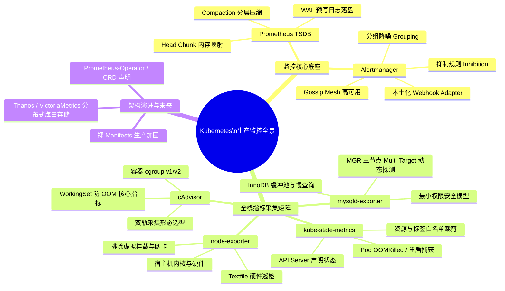

# 02-监控告警

## 目录说明
本目录包含 Kubernetes 云原生可观测性、Prometheus 监控体系、全栈 Exporter 采集器底层原理、生产级 SRE 调优及告警闭环的深度技术专题文档。

> **对应工程化部署 YAML 清单位于**：[`./05-Install/monitoring/`](../../../../05-Install/monitoring/)

## 内容索引
| 名称 | 类型 | 说明 |
|------|------|------|
| [./01-Prometheus与Alertmanager架构设计与生产落地.md](./01-Prometheus与Alertmanager架构设计与生产落地.md) | 文件 | TSDB 内存与磁盘分层原理、Head Chunk/WAL、Relabel 流水线、容量模型与 Alertmanager 高可用 |
| [./02-NodeExporter宿主机全方位监控与指标基线.md](./02-NodeExporter宿主机全方位监控与指标基线.md) | 文件 | 宿主机物理指标采集、虚拟文件系统/网络设备过滤、真实内存与磁盘 IO SRE 黄金 PromQL |
| [./03-cAdvisor容器运行时指标全景与双轨采集对比.md](./03-cAdvisor容器运行时指标全景与双轨采集对比.md) | 文件 | Kubelet 内嵌 vs 独立 DaemonSet 双轨架构、cgroup v2 适配、WorkingSet 与 Usage 内存防 OOM 辨析 |
| [./04-KubeStateMetrics资源对象监控与大规模集群调优.md](./04-KubeStateMetrics资源对象监控与大规模集群调优.md) | 文件 | Informer 监听机制、Pod 异常退出根因 (OOMKilled/CrashLoop) 捕获、标签白名单与水平分片 |
| [./05-MySQL-Exporter生产级监控与MGR集群多实例实战.md](./05-MySQL-Exporter生产级监控与MGR集群多实例实战.md) | 文件 | 最小化授权安全、Performance Schema 性能陷阱、MGR 3 节点集群 Multi-Target 探测模式 |
| [./06-生产级监控体系缺口评估与Operator演进选型.md](./06-生产级监控体系缺口评估与Operator演进选型.md) | 文件 | 基础 YAML 生产缺口体检（存储/高可用/配置重载）、Prometheus-Operator 与 VictoriaMetrics 演进选型 |
| [./07-企业级实战-Rancher平台MySQL与外部节点监控全景落地指南.md](./07-企业级实战-Rancher平台MySQL与外部节点监控全景落地指南.md) | 文件 | Rancher 体系下 ServiceMonitor + Endpoints 桥接外部数据库/MHA 节点、高频告警规则与 Grafana 实战 |

---

## 知识体系全景拓扑

---

> [!TIP] 💡 关联技术与延伸阅读
>
> * [生产级监控安装部署清单 (YAML)](../../../../05-Install/monitoring/README.md)
> * [云原生可观测性架构 Prometheus_Thanos_Tempo 与 eBPF 链路追踪](../08-云原生可观测性架构Prometheus_Thanos_Tempo与eBPF链路追踪.md)
> * [万级节点与十万级 Pod 大规模集群调优指南](../07-万级节点与十万级Pod大规模集群调优指南.md)
> * [MetricsServer 安装与 x509 证书排障](../02-MetricsServer安装与x509证书排障.md)
