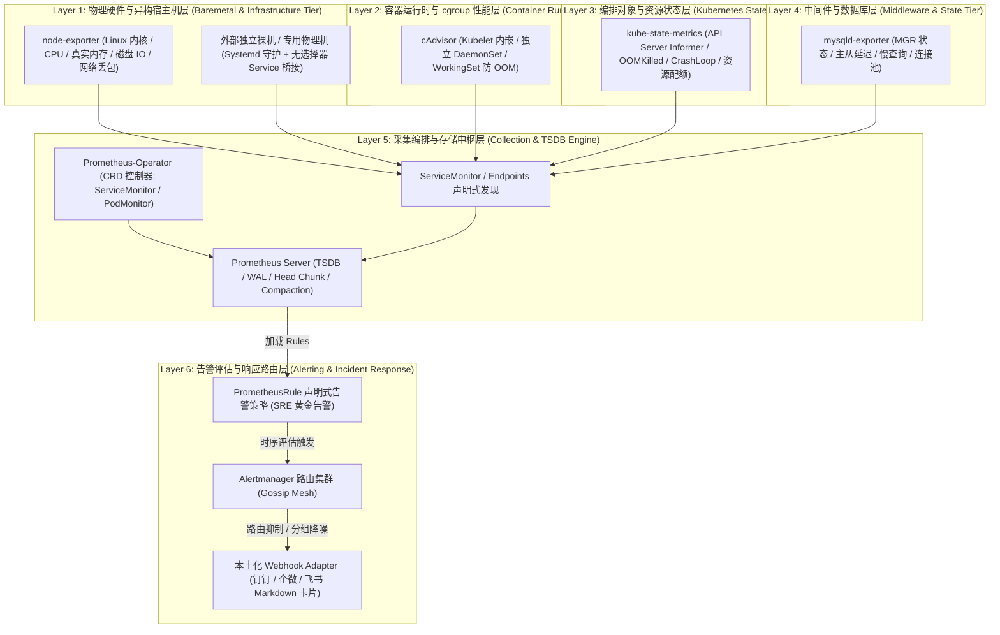
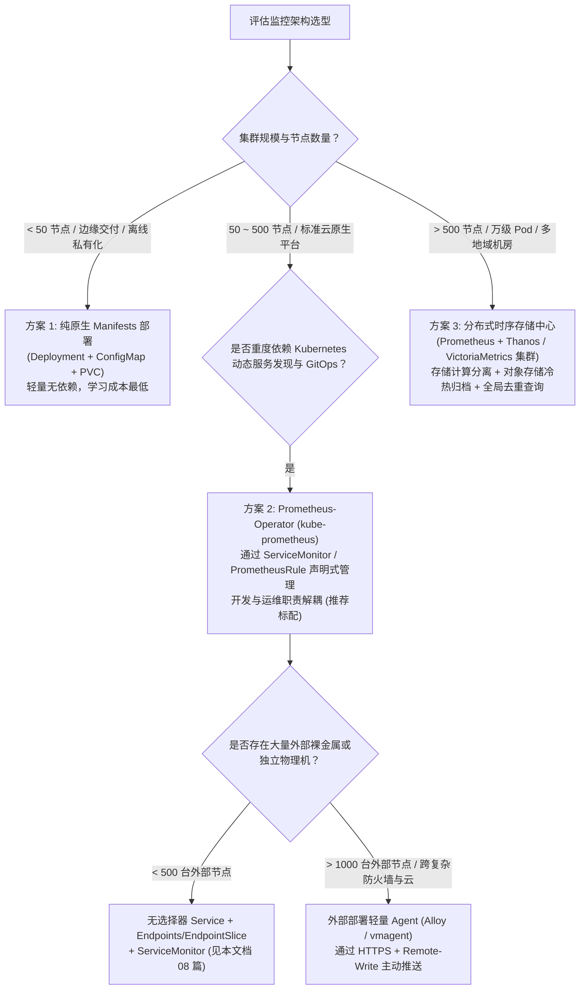
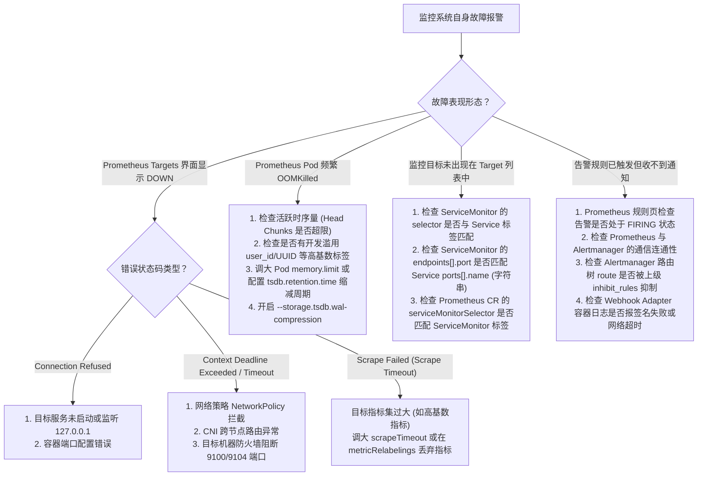

# 02-监控告警 (Kubernetes Observability & SRE Production Guide)

## 一、 业务定位与全景分层架构 (Architecture & 6-Layer Matrix)

在现代企业级 Kubernetes 与混合云基础设施中，监控与告警是 SRE 保障业务 99.99% 高可用性的“中枢神经”。单纯依赖容器存活探针（LivenessProbe）无法感知系统隐性性能退化、慢查询堆积、内存缓慢泄漏与跨网络分区故障。

本专题构建了一套自底向上覆盖 **物理宿主机 $\rightarrow$ 容器运行时 $\rightarrow$ K8s 控制面对象 $\rightarrow$ 核心数据库与中间件 $\rightarrow$ TSDB 时序引擎 $\rightarrow$ 告警路由闭环** 的六层全景可观测性体系：

---

## 二、 专题文档深度索引矩阵 (Knowledge Base Index)

本目录文档全景覆盖了从底层指标采集原理、生产级 SRE 调优、Operator 声明式演进到跨网络外部节点纳管的实战闭环：

| 序号 | 文档名称 | 核心技术点与底层实现机制 | 适用场景与生产产出 |
| :---: | :--- | :--- | :--- |
| **01** | [Prometheus 与 Alertmanager 架构设计与生产落地](./01-Prometheus与Alertmanager架构设计与生产落地.md) | TSDB 内存分层（Head Chunk/WAL/mmap/Compaction）、Relabel 流水线、容量规划模型、Alertmanager Gossip 高可用网状集群与去重机制 | 解决 Prometheus OOM、磁盘 IO 打满、时序断层与告警轰炸问题 |
| **02** | [NodeExporter 宿主机全方位监控与指标基线](./02-NodeExporter宿主机全方位监控与指标基线.md) | Linux 内核指标暴露机理、虚拟文件系统与虚拟网卡过滤白名单、真实可用内存（MemAvailable）与饱和度 PromQL、Textfile 自定义硬件巡检 | 物理节点与 Worker 宿主机健康度监控黄金基线 |
| **03** | [cAdvisor 容器运行时指标全景与双轨采集对比](./03-cAdvisor容器运行时指标全景与双轨采集对比.md) | cgroup v1 与 v2 驱动适配、Kubelet 内嵌 vs 独立 DaemonSet 架构横评、WorkingSet vs Usage 内存防 OOM 辨析 | 容器化业务资源容量规划与防假死告警策略 |
| **04** | [kube-state-metrics 资源对象监控与大规模集群调优](./04-KubeStateMetrics资源对象监控与大规模集群调优.md) | API Server Reflector/Informer 监听机制、Pod 异常退出根因（OOMKilled/CrashLoopBackOff）捕获、标签白名单裁剪与水平分片 | 万级 Pod 集群控制面监控与事件级故障感知 |
| **05** | [MySQL-Exporter 生产级监控与 MGR 集群多实例实战](./05-MySQL-Exporter生产级监控与MGR集群多实例实战.md) | MySQL 8.0 性能模式（performance_schema）指标提取、MGR 组复制拓扑与脑裂探测、主从秒级延迟预警、Multi-Target 动态探测架构 | 核心关系型数据库集群 7x24 小时高可用守门员 |
| **06** | [生产级监控体系缺口评估与 Operator 演进选型](./06-生产级监控体系缺口评估与Operator演进选型.md) | 裸 YAML 部署在存储持久化、高可用单点、配置热重载上的结构性缺口评估；Prometheus-Operator 与 VictoriaMetrics 深度对比选型 | 从初级 Manifests 向企业级 GitOps 监控演进决策 |
| **07** | [企业级实战：Rancher 平台 MySQL 与外部节点监控全景落地指南](./07-企业级实战-Rancher平台MySQL与外部节点监控全景落地指南.md) | Rancher 监控体系集成、无侵入 mysqld-exporter 部署、外部裸机 NodeExporter 纳管、高频告警规则与本土化 Webhook 路由 | 医疗 HIS、数据中心核心业务监控实战范式 |
| **08** | [外部节点静态采集架构-ServiceMonitor与Endpoints深度思考与落地](./08-外部节点静态采集架构-ServiceMonitor与Endpoints深度思考与落地.md) | **三次递进式深度思考**（抽象解耦哲学、底层流量点对点直连非 VIP 轮询、万级节点 API Server 瓶颈与 Push 演进）；无选择器 Service + 静态 Endpoints/EndpointSlice 双轨落地 | 混合云与跨网物理节点纳管的最佳实践与架构反思 |

---

## 三、 SRE 黄金指标与生产告警基线速查表 (Golden Signals & PromQL)

在生产可观测性设计中，遵循 Google SRE 黄金信号（延迟、流量、错误、饱和度）构建核心监控视图：

| 监控层级 | 监控对象 / 故障场景 | SRE 推荐 PromQL 表达式 | 生产告警阈值 | 严重级别 |
| :--- | :--- | :--- | :---: | :---: |
| **宿主机层** | 节点物理宕机 / 采集断联 | `up{job=~".*node-exporter.*"} == 0` | 持续 1m | `Critical` |
| **宿主机层** | 物理 CPU 持续饱和 | `(1 - avg by(instance) (rate(node_cpu_seconds_total{mode="idle"}[5m]))) * 100` | `> 85%` 持续 5m | `Warning` |
| **宿主机层** | 真实可用物理内存枯竭 | `(node_memory_MemAvailable_bytes / node_memory_MemTotal_bytes) * 100` | `< 10%` 持续 3m | `Critical` |
| **宿主机层** | 磁盘空间预测满盘 (线性回归) | `predict_linear(node_filesystem_avail_bytes{mountpoint="/"}[1h], 4*3600) < 0` | 4小时内写满 | `Warning` |
| **容器层** | 容器内存触发 OOM 告警线 | `container_memory_working_set_bytes / container_spec_memory_limit_bytes * 100` | `> 90%` 持续 2m | `Critical` |
| **容器层** | 容器 CPU Throttling 限流压制 | `sum by(pod)(rate(container_cpu_cfs_throttled_periods_total[5m])) / sum by(pod)(rate(container_cpu_cfs_periods_total[5m])) * 100` | `> 25%` 持续 5m | `Warning` |
| **K8s 对象** | Pod 遭遇 OOM 强杀 | `kube_pod_container_status_last_terminated_reason{reason="OOMKilled"} == 1` | 立即触发 | `Critical` |
| **K8s 对象** | Pod 持续崩溃循环 (CrashLoop) | `rate(kube_pod_container_status_restarts_total[15m]) * 60 > 2` | 15分钟重启>2次 | `Warning` |
| **数据库层** | MGR 组复制成员异常 | `mysql_perf_schema_members{member_state!="ONLINE"} == 1` | 立即触发 | `Critical` |
| **数据库层** | 主从复制同步断流 (SQL/IO 线程) | `mysql_slave_status_slave_io_running == 0 or mysql_slave_status_slave_sql_running == 0` | 持续 1m | `Critical` |

---

## 四、 监控架构演进与选型决策树 (Architectural Evolution Decision Tree)

企业在不同发展阶段和集群规模下，应当如何选择最合适的监控技术路线？

---

## 五、 SRE 生产高频排障决策树 (Troubleshooting Matrix)

当监控系统自身出现异常时，参考以下决策树进行系统化定位：

---

## 六、 对应工程部署清单与代码指引 (Production Delivery Artifacts)

本目录所有理论与架构专题，均在项目工程部署目录提供了开箱即用的工业级 YAML 清单：

- 📦 **监控工程交付全景目录**：[`05-Install/monitoring/`](../../../../05-Install/monitoring/README.md)
  - `01-namespace-rbac.yaml`：监控隔离命名空间与核心 RBAC 权限绑定；
  - `02-prometheus.yaml`：Prometheus Server 核心配置、TSDB 持久化与热重载；
  - `03-alertmanager.yaml`：Alertmanager 网状高可用集群与路由分发；
  - `04-grafana.yaml`：可视化大屏与企业级仪表盘 Provisioning；
  - `05-node-exporter.yaml`：宿主机全覆盖 DaemonSet；
  - `06-kube-state-metrics.yaml`：Kubernetes 编排状态采集器；
  - `07-alert-rules.yaml`：SRE 黄金告警规则库（CPU/内存/磁盘/网络/Pod/数据库）。

---

> [!TIP] 💡 关联技术与延伸阅读
>
> * [云原生可观测性架构 Prometheus_Thanos_Tempo 与 eBPF 链路追踪](../08-云原生可观测性架构Prometheus_Thanos_Tempo与eBPF链路追踪.md)
> * [万级节点与十万级 Pod 大规模集群调优指南](../07-万级节点与十万级Pod大规模集群调优指南.md)
> * [MetricsServer 安装与 x509 证书排障](../02-MetricsServer安装与x509证书排障.md)
> * [生产级监控安装部署清单 (YAML)](../../../../05-Install/monitoring/README.md)
