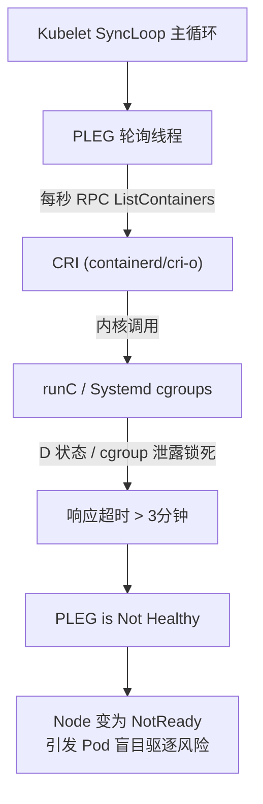
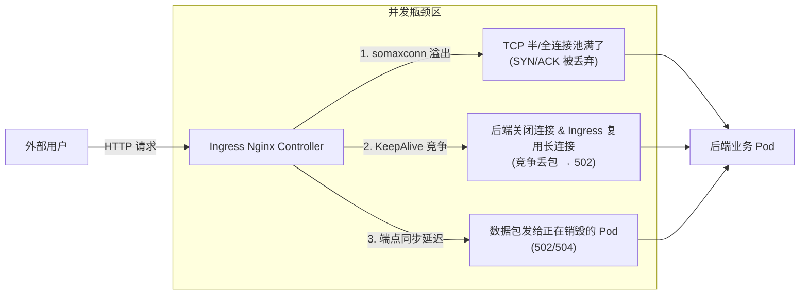
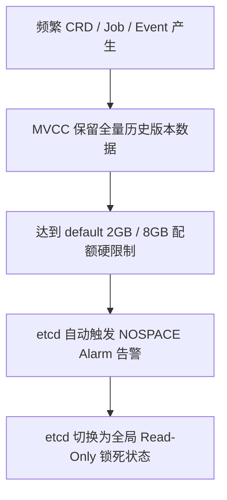
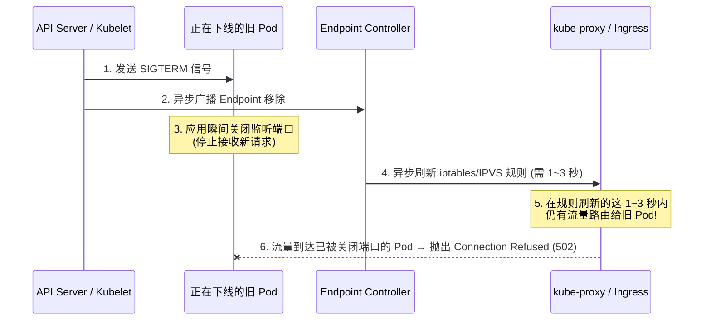
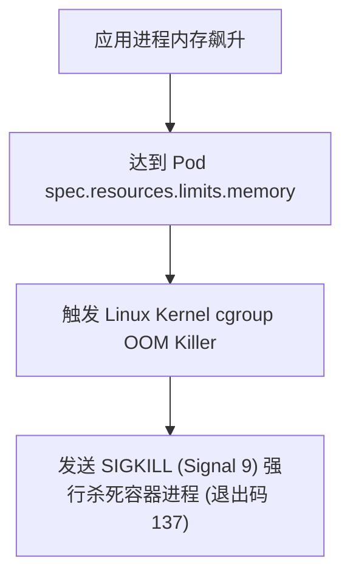
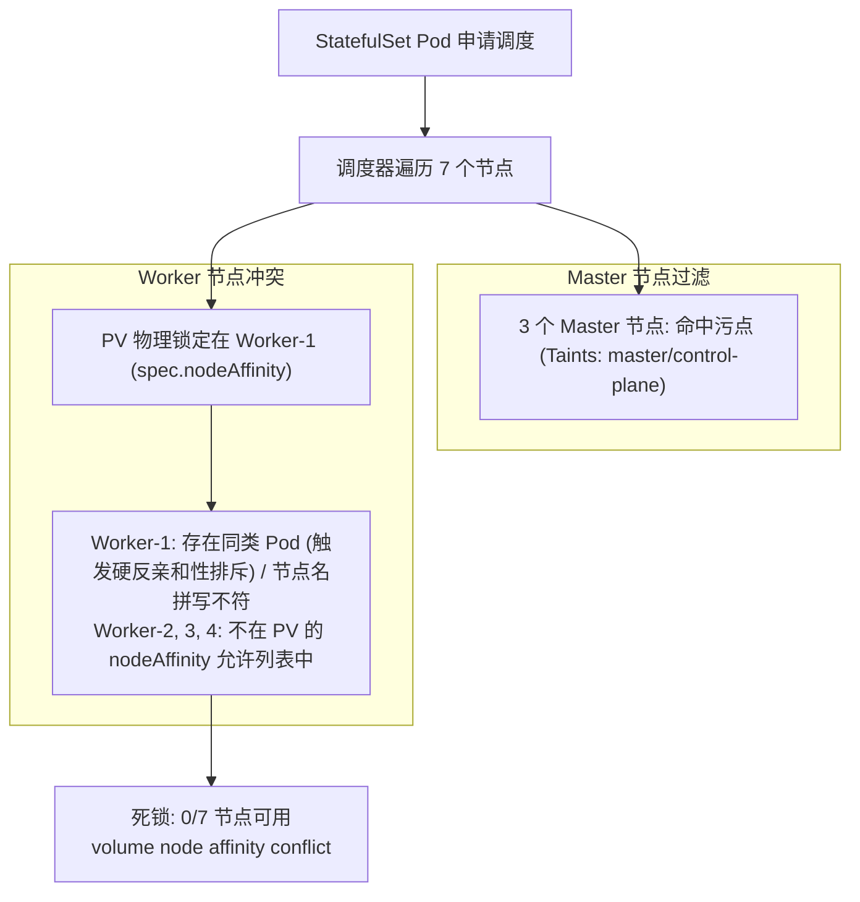
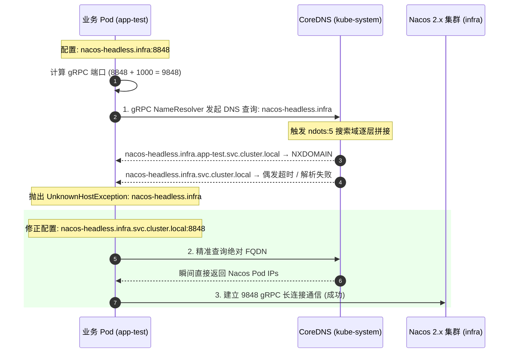

# 🚨 Kubernetes 生产级高难故障排查与实战解决方案

> 本文档面向高级 Kubernetes 工程师/云原生架构师面试与生产实战，选取了**出现的概率高、排查难度大、涉及底层原理深**的 5 大顶级生产典型难题，提供现象、根因链条、排查工具链以及彻底修复方案。

---

## 目录
- [一、 难题 1：PLEG is not healthy 导致节点批量 NotReady 与 Pod 锁死](#一-难题-1pleg-is-not-healthy-导致节点批量-notready-与-pod-锁死)
- [二、 难题 2：Ingress-Nginx 高并发下频繁出现 502 Bad Gateway / 504 Timeout](#二-难题-2ingress-nginx-高并发下频繁出现-502-bad-gateway--504-timeout)
- [三、 难题 3：etcd database space exceeded 数据库暴涨与只读锁死救援](#三-难题-3etcd-database-space-exceeded-数据库暴涨与只读锁死救援)
- [四、 难题 4：Calico/Flannel 跨节点大包传输丢包与 PMTU 网络黑洞](#四-难题-4calicoflannel-跨节点大包传输丢包与-pmtu-网络黑洞)
- [五、 难题 5：Deployment 滚动更新流量微损（优雅下线与竞争同步）](#五-难题-5deployment-滚动更新流量微损优雅下线与竞争同步)
- [六、 拓展难题 6：OOMKilled 内存暴涨与容器被杀定位](#六-拓展难题-6oomkilled-内存暴涨与容器被杀定位)
- [七、 拓展难题 7：非 Informer 全量 List 导致的 APIServer 压垮事件](#七-拓展难题-7非-informer-全量-list-导致的-apiserver-压垮事件)
- [八、 拓展难题 8：StatefulSet Local PV 与反亲和性引发的 volume node affinity conflict 调度死锁](#八-拓展难题-8statefulset-local-pv-与反亲和性引发的-volume-node-affinity-conflict-调度死锁)
- [九、 拓展难题 9：Nacos 2.x gRPC 9848 端口与 K8s 跨 Namespace CoreDNS ndots:5 解析失败](#九-拓展难题-9nacos-2x-grpc-9848-端口与-k8s-跨-namespace-coredns-ndots5-解析失败)

---

## 一、 难题 1：PLEG is not healthy 导致节点批量 NotReady 与 Pod 锁死

### 1.1 现象描述
集群中多个 Node 节点突然交替变为 `NotReady` 状态，节点上的 Pod 无法创建、无法删除（停留在 `Terminating`）。
执行 `kubectl describe node <node-name>` 在 Conditions 中看到：
`Kubelet stopped posting node status. PLEG is not healthy: pleg was last seen active 3m5s ago; threshold is 3m0s`。



### 1.2 深度根因链条
`PLEG` (Pod Lifecycle Event Generator) 是 Kubelet 内部负责检查节点上容器状态变更的核心模块。其工作流程为：
1. PLEG 默认每秒向 CRI 发起 `ListContainers` RPC 请求获取最新容器快照。
2. 比对上一次快照生成 PodEvent，推给 `SyncLoop` 处理。
3. 若整个检查+处理链路总耗时超过 3 分钟阈值，PLEG 被标记为 Unhealthy，Kubelet 会将节点状态置为 `NotReady`。

**导致超时的 3 大内核/底层根因**：
- **根因 A (D 状态进程与存储卡死)**：某些 Pod 访问 NFS/Ceph/块存储时发生存储 I/O 挂起，进程进入 Linux 不可中断休眠状态（D 状态）。CRI 在遍历容器状态或查询 Mount 目录时卡死在内核系统调用。
- **根因 B (cgroup v1 泄漏)**：频繁创建/销毁容器导致 Linux 内核 memory cgroup 未能回收（`cat /proc/cgroup` 看到 count 达到上限），导致 runc 执行 `crictl ps` 极度缓慢（单次耗时数秒甚至数分钟）。
- **根因 C (CRI/containerd 内部死锁)**：containerd 在高并发 Task 销毁时触发死锁，或者 shim 进程变为僵尸进程无法响应。

### 1.3 诊断与排查步骤

```bash
# 1. 检查 Kubelet 日志，确定 PLEG 响应耗时
journalctl -u kubelet --since "30m ago" | grep "PLEG is not healthy"

# 2. 手动测试 CRI 响应延迟 (定位是否为 CRI 阻塞)
time crictl ps -a
time crictl inspectp <sandbox-id>

# 3. 检查系统是否存在 D 状态进程 (卡在存储 I/O)
ps aux | awk '$8 ~ /D/ { print $0 }'

# 4. 检查 cgroup 泄漏数量 (若 > 60000 极大概率触发 PLEG 超时)
cat /proc/cgroups | grep memory

# 5. 使用 strace 追踪 containerd 阻塞点
strace -f -T -e trace=futex,write,read -p $(pgrep containerd)
```

### 1.4 彻底解决方案与调优参数

#### 方案一：解决 cgroup 泄漏（升级内核与配置）
在旧版本 Linux 内核 (低于 4.17) 中存在 `kmem` 内存泄漏问题。
- **临时修复**：重启 containerd 与 kubelet 释放句柄。
- **永久修复**：
  1. 升级 Linux 内核到 5.4+ 并开启 **cgroup v2**。
  2. 修改 kubelet 启动参数，关闭 kmem 统计：在 `kubelet` 配置中设置 `cgroupsPerQOS: true`，并在 containerd 中配置 `NoKmem = true`。

#### 方案二：调整 PLEG 阈值与并发数 (高规格节点调优)
对于 128核/512G 以上的超大规格节点（单节点运行 200+ Pod）：
在 `/var/lib/kubelet/config.yaml` 中调优：
```yaml
# 增加并发线程数与连接超时
containerRuntimeEndpoint: "unix:///run/containerd/containerd.sock"
runtimeRequestTimeout: "4m0s"
# 调整并发 Pod 处理限制
concurrentAutomaticReconnects: 5
```

#### 方案三：自动清理 D 状态与存储挂载超时
在 CSI / 存储插件中设置强制超时限制，配置 `stale-volume-cleanup`；对存储异常的 Pod 使用 `kubectl delete pod <pod> --force --grace-period=0` 前，先执行卸载：`umount -f -l /var/lib/kubelet/pods/<uid>/volumes/...`。

---

## 二、 难题 2：Ingress-Nginx 高并发下频繁出现 502 Bad Gateway / 504 Timeout

### 1.1 现象描述
在业务突发流量冲击或发布高峰期，外部客户端频繁接收到 HTTP `502 Bad Gateway` 或 `504 Gateway Timeout`。而查看后端应用 Pod 的 CPU/内存利用率并不高。



### 1.2 深度根因链条

1. **502 Bad Gateway 根因**：
   - **KeepAlive 竞争 (RST 报文)**：Ingress-Nginx 与后端 Pod 建立了 HTTP KeepAlive 长连接。若后端应用设置的 `keepalive_timeout`（如 60s）小于 Ingress-Nginx 的连接保持时间（如 75s），后端应用会主动发送 `FIN` 或 `RST` 包断开连接。恰好此时 Ingress 将新请求复用该连接发出，引发 `Connection reset by peer`，Nginx 抛出 502。
   - **Pod 下线异步竞争**：Pod 被删除时，Kubelet 立即发送 `SIGTERM` 杀进程，而 Ingress-Nginx 刷新 Lua 共享内存 Upstream 需要数百毫秒。部分流量仍被转发至已关闭端口的 Pod，引发 502。
2. **504 Gateway Timeout 根因**：
   - **Linux 内核全连接队列 (somaxconn) 溢出**：Nginx Pod 或应用 Pod 容器内的 `net.core.somaxconn` 默认值为 `128`。突发高并发流量下，TCP 三次握手全连接队列瞬间填满，后续 SYN/ACK 包被内核直接丢弃，导致 Ingress 代理建连超时（504）。

### 1.3 诊断与排查步骤

```bash
# 1. 查看 Ingress Nginx 错误日志
kubectl logs -n ingress-nginx <ingress-pod-name> | grep -E "502|504|Connection reset by peer"

# 2. 检查应用 Pod 内的 TCP 队列溢出统计
kubectl exec -it <app-pod> -- netstat -s | grep -i "listen"
# 输出示例: 1052 times the listen queue of a socket overflowed (全连接队列溢出)

# 3. 抓包确认长连接断开时机 (在 Ingress Pod 内执行)
tcpdump -i any port <app-port> -nn -vv | grep -E "Flags \[R.\]|Flags \[F.\]"
```

### 1.4 彻底解决方案与调优参数

#### 方案一：调优 TCP 内核参数与 Somaxconn (Pod 级别 sysctls)
在 Ingress Controller 和后端应用 Pod 的 Deployment 中，通过 `securityContext` 优化内核参数：

```yaml
spec:
  securityContext:
    sysctls:
    - name: net.core.somaxconn
      value: "65535"
    - name: net.ipv4.tcp_max_syn_backlog
      value: "65535"
```
*(注：需要集群开启 `--allowed-unsafe-sysctls=net.core.somaxconn,net.ipv4.tcp_max_syn_backlog`)*

#### 方案二：对齐 KeepAlive Timeout 参数
严格保证：**后端应用的 KeepAlive Timeout > Ingress Nginx 的 KeepAlive Timeout**。
- 修改 Ingress-Nginx ConfigMap：
  ```yaml
  apiVersion: v1
  kind: ConfigMap
  metadata:
    name: ingress-nginx-controller
    namespace: ingress-nginx
  data:
    keep-alive-requests: "10000"
    keep-alive: "60"
    upstream-keepalive-connections: "320"
    upstream-keepalive-timeout: "50"  # 小于后端的 60s
  ```
- 后端应用（如 SpringBoot / Nginx / Go）的 `keepalive_timeout` 设置为 `65s`。

#### 方案三：配置失败自动重试机制 (Zero 502 Config)
在 Ingress 资源中配置重试策略：
```yaml
metadata:
  annotations:
    nginx.ingress.kubernetes.io/proxy-next-upstream: "error timeout invalid_header http_502 http_503"
    nginx.ingress.kubernetes.io/proxy-next-upstream-tries: "3"
    nginx.ingress.kubernetes.io/proxy-next-upstream-timeout: "10"
```

---

## 三、 难题 3：etcd database space exceeded 数据库暴涨与只读锁死救援

### 3.1 现象描述
集群突然无法创建、更新任何资源（`kubectl apply` 报错），API Server 日志大量报错：
`rpc error: code = ResourceExhausted desc = etcdserver: mvcc: database space exceeded`。
此时 etcd 进入全局锁定状态，**拒绝所有写操作**，仅允许只读请求。



### 3.2 深度根因链条
1. etcd 采用 MVCC（多版本并发控制）架构，所有的增删改操作都是追加新版本，旧版本数据不会被实时覆盖。
2. 当集群中有频繁更新的资源（如 Helm 部署、Job 状态、高频 Event、或者组件未限制历史版本的 CRD）时，数据库体积迅速膨胀。
3. etcd 内部预设了数据库配额 `--quota-backend-bytes`（默认 2GB，上限 8GB）。当 db 文件大小超过配额时，etcd 自动触发 `NOSPACE` 告警，并将节点切换为**仅读模式**以保护 B+树结构不崩溃。

### 3.3 紧急救援与排错操作 SOP

#### 第一步：解除只读锁死与压缩历史版本 (Compact)

```bash
# 1. 寻找 etcd 节点及证书配置环境变量
export ETCDCTL_API=3
export ENDPOINTS="https://127.0.0.1:2379"
export CERTS="--cacert=/etc/kubernetes/pki/etcd/ca.crt --cert=/etc/kubernetes/pki/etcd/server.crt --key=/etc/kubernetes/pki/etcd/server.key"

# 2. 查看当前 etcd 告警状态
etcdctl $CERTS --endpoints=$ENDPOINTS alarm list
# 输出: memberID:8253139369935100062 alarm:NOSPACE

# 3. 获取最新 revision 并强制执行历史版本压缩
REV=$(etcdctl $CERTS --endpoints=$ENDPOINTS endpoint status --write-out="json" | grep -o '"revision":[^,]*' | awk -F':' '{print $2}')
etcdctl $CERTS --endpoints=$ENDPOINTS compact $REV

# 4. 清理数据库磁盘碎片 (Defrag 真正释放空间)
etcdctl $CERTS --endpoints=$ENDPOINTS defrag --cluster

# 5. 取消 NOSPACE 限制告警 (解除只读锁死关键步骤!)
etcdctl $CERTS --endpoints=$ENDPOINTS alarm disarm
```

#### 第二步：定位引发暴涨的“元凶” key 资源

```bash
# 统计 key 的数量分布前 20 名
etcdctl $CERTS --endpoints=$ENDPOINTS get "" --prefix --keys-only | awk -F'/' '{print "/"$2"/"$3}' | sort | uniq -c | sort -rn | head -n 20
```

常见元凶：
- `/registry/events/`：集群 Event 未配置自动清理。
- `/registry/masterleases/` 或 CRD 资源状态频繁更新。

### 3.4 彻底预防方案

1. **增大配额限制**：修改 etcd 静态 Pod 清单 (`/etc/kubernetes/manifests/etcd.yaml`)，设置配额为 8GB：
   ```yaml
   spec:
     containers:
     - command:
       - etcd
       - --quota-backend-bytes=8589934592  # 8GB
       - --auto-compaction-retention=1h    # 1小时自动压缩
       - --auto-compaction-mode=periodic
   ```
2. **APIServer 开启 Event 自动过期**：在 API Server 启动参数设置 `--event-ttl=1h`（默认 1 小时）。

---

## 四、 难题 4：Calico/Flannel 跨节点大包传输丢包与 PMTU 网络黑洞

### 4.1 现象描述
在集群网络中，Pod 间简单的 `ping`（小包）和 Curl 少量数据完全正常。但在进行文件上传、MySQL 大数据量查询或 gRPC 大报文传输时，连接卡死无响应，报 `Connection timed out`。

```mermaid
graph TD
    PodA["Pod-A (MTU=1500)"] -- "发送 1500B 大数据包" --> VethA["Veth-Pair"]
    VethA --> Flannel["CNI 封装设备 (VXLAN / IPIP)"]
    Note over Flannel: 添加 50B VXLAN 头部<br/>包总体积变为 1550B > 1500B
    Flannel -- "超过物理网卡 MTU" --> ETH0["宿主机 eth0 (MTU=1500)"]
    ETH0 -- "IP 分片丢弃 / 防火墙拦截 ICMP" --> Drop["网络包被静默丢弃 (网络黑洞)"]
```

### 4.2 深度根因链条
1. **网络封装开销**：标准以太网物理网卡的 MTU 一般为 `1500` 字节。
   - VXLAN 模式需要在原始以太网帧外增加 **50 字节**（Ethernet+IP+UDP+VXLAN 头部）。
   - IPIP 模式需要增加 **20 字节**（Outer IP 头部）。
2. **PMTU (Path MTU Discovery) 失效**：若 CNI 未正确配置 Pod 的虚拟网卡 MTU，Pod 默认发送 1500 字节的 IP 包。加上 VXLAN 封包后达到 1550 字节，发往物理网卡。
3. 宿主机物理网络若开启了 DF (Don't Fragment) 标记，且安全组/防火墙屏蔽了 ICMP `Fragmentation Needed` (Type 3, Code 4) 报文，Pod 无法得知需要缩小发包体积，导致大包被网络路由器**静默丢弃**（Path MTU 黑洞）。

### 4.3 诊断与排查步骤

```bash
# 1. 在 Pod 内使用指定包大小测试连通性 (-s 指定 payload 大小，-D 设置 DF 不分片)
kubectl exec -it <pod-a> -- ping -c 2 -s 1460 -D <pod-b-ip>
# 若 1460 失败，降低到 1410 测试:
kubectl exec -it <pod-a> -- ping -c 2 -s 1410 -D <pod-b-ip>
# 若 1410 成功，确定为 MTU 不匹配问题!

# 2. 查看节点网卡 MTU 与 Pod 网卡 MTU
ip link show eth0          # 宿主机网卡，假设为 1500
ip link show flannel.1     # VXLAN 设备
kubectl exec -it <pod-a> -- ip link show eth0
```

### 4.4 彻底解决方案

修改 CNI ConfigMap，严格按以下公式计算并配置 MTU：
$$\text{Pod MTU} = \text{宿主机物理网卡 MTU} - \text{封装协议头部开销}$$
- **VXLAN 模式**：设置 Pod MTU = `1500 - 50 = 1450`（或 1430）。
- **IPIP 模式**：设置 Pod MTU = `1500 - 20 = 1480`。

**Calico 配置示例**：
```bash
kubectl edit configmap calico-config -n kube-system
# 修改 veth_mtu 字段:
veth_mtu: "1450"

# 重启 calico-node daemonset 生效
kubectl rollout restart daemonset calico-node -n kube-system
```

---

## 五、 难题 5：Deployment 滚动更新流量微损（优雅下线与竞争同步）

### 5.1 现象描述
在发布新版本 Deployment 时，即使配置了 `readinessProbe`，Prometheus 监控仪表盘上依旧会出现短暂的 500 / 502 错误脉冲，少量线上请求失败。



### 5.2 深度根因链条
当 API Server 删除旧 Pod 时，**两条异步管道同时并行触发**：
1. **控制面管道 (删除 Endpoint)**：Endpoint Controller 监听到删除事件，修改 Endpoints 列表，并通过 Watch 广播给 `kube-proxy` 和 `Ingress Controller` 去刷新节点上的 IPVS/iptables 路由规则（全网刷新需要 **1~3 秒**）。
2. **节点管道 (杀死容器进程)**：Kubelet 几乎在同一时刻收到删除指令，直接向容器主进程发送 `SIGTERM` 信号。
   - 若应用没有实现 `SIGTERM` 捕获，或者收到 `SIGTERM` 后立即关闭了 TCP 服务监听端口；
   - 在 `1~3 秒` 的网络规则刷新时间差内，发往该 Pod 的请求依然会被路由器送达，但容器端口已关，引发 `Connection Refused`。

### 5.3 彻底解决方案：PreStop 延迟拦截 + 优雅停机

通过配置 **PreStop 钩子强制人工延时**，确保网络规则彻底刷完后，再停止应用进程。

#### 1. 生产级优雅下线 Deployment 配置标准

```yaml
apiVersion: apps/v1
kind: Deployment
metadata:
  name: zero-downtime-app
spec:
  replicas: 3
  strategy:
    type: RollingUpdate
    rollingUpdate:
      maxSurge: 25%
      maxUnavailable: 0        # 保证发布过程中可用副本数不降低
  template:
    spec:
      terminationGracePeriodSeconds: 60  # 给予充足的清理时间 (默认30s)
      containers:
      - name: app
        image: nginx:latest
        lifecycle:
          preStop:
            exec:
              command:
              - /bin/sh
              - -c
              - "sleep 15"     # 核心拦截: 等待全网 Ingress/kube-proxy 剔除本 Endpoint
        readinessProbe:
          httpGet:
            path: /healthz
            port: 8080
          initialDelaySeconds: 5
          periodSeconds: 3
```

#### 2. 原理过程演练
```text
T0: 发起 Pod 删除指令
T1: Kubelet 触发 preStop 钩子，执行 `sleep 15`，容器进程仍正常处理请求。
T2: 与此同时，Endpoint Controller 将该 Pod 从 Endpoint 剔除。
T3: 1~3 秒内，kube-proxy 与 Ingress 彻底刷新完路由规则，不再向该 Pod 发送新流量。
T15: preStop `sleep 15` 结束，Kubelet 向容器发送 SIGTERM。
T16: 应用不再有新流量到达，优雅处理完剩余存量连接后安全退出。
```

通过添加 `preStop: sleep 15`，彻底解决了 Kubelet 杀进程与路由刷新的异步竞争，实现了真正的**发布零宕机 (Zero-Downtime Deployment)**。

---

## 六、 拓展难题 6：OOMKilled 内存暴涨与容器被杀定位

### 6.1 现象
Pod 突然崩溃重启，`kubectl describe pod` 显示退出码为 `137`，`Reason: OOMKilled`。



### 6.2 区分两种 OOM 触发源
1. **容器级 OOM (cgroup Limit)**：容器进程使用内存达到了 YAML 中定义的 `limits.memory`。此时宿主机物理内存依然充足，仅针对该容器生效。
2. **宿主机级 OOM (Node Memory)**：宿主机物理内存被全部吃光。Linux 内核全局 OOM Killer 按照 `oom_score_adj` 打分筛选，杀掉得分最高的进程。

### 6.3 生产定位与止血 SOP
```bash
# 1. 确认 OOM 事件与被杀进程的 PID
dmesg -T | grep -i "oom-killer"

# 2. 获取上一次退出时的容器详细描述
kubectl get pod <pod-name> -o jsonpath='{.status.containerStatuses[0].lastState.terminated}'

# 3. 查看容器当前内存使用量与监控趋势
kubectl top pod <pod-name> --containers

# 4. 针对 Java 应用排查 JVM 堆外内存/无节制缓存泄露：
# 确保设置了 -XX:MaxRAMPercentage=75.0 (留出 25% 堆外内存给 metaspace 及 OS)
```

---

## 七、 拓展难题 7：非 Informer 全量 List 导致的 APIServer 压垮事件

### 7.1 现象
集群中某个微服务批量重启或扩容时，`kube-apiserver` CPU 直接冲顶 100%，内存暴涨触发 OOM。

### 7.2 根因
第三方 Controller 或业务程序在使用 `client-go` 时，**错误地直接使用了 `clientset.CoreV1().Pods("").List(...)` 发起全量查询**，而没有使用带有本地内存缓存的 `SharedInformer`。几百个实例同时全量查询，使得 APIServer 频繁从 etcd 读取并序列化海量 JSON/Protobuf 数据，瞬间打爆 APIServer。

### 7.3 止血与治理
1. **紧急拦截**：在 APIServer 的 APF (API Priority and Fairness) 中针对该异常 ServiceAccount 的 FlowSchema 调整隔离规则，降低其并发限制。
2. **代码规范**：强制要求所有二次开发组件与 Operator 必须使用 `Informer` 机制。

---

## 八、 拓展难题 8：StatefulSet Local PV 与反亲和性引发的 volume node affinity conflict 调度死锁

### 8.1 现象描述
部署有状态服务（如 Redis、Elasticsearch、MySQL）时，Pod 长期停留在 `Pending` 状态。
执行 `kubectl describe pod <pod-name>` 报错：
```text
0/7 nodes are available: 
  - 1 node(s) had untolerated taint {node-role.kubernetes.io/control-plane: }, 
  - 2 node(s) had untolerated taint {node-role.kubernetes.io/master: }, 
  - 4 node(s) had volume node affinity conflict. 
preemption: 0/7 nodes are available: 7 Preemption is not helpful for scheduling.
```



### 8.2 深度根因链条
1. **Local PV 的硬性节点绑定**：本地持久化卷（Local PV）的 `spec.nodeAffinity` 通过 `kubernetes.io/hostname` 精确锁定了某台物理机。
2. **调度死锁场景**：
   - **场景 A（命名拼写差异）**：手动或自动创建 PV 时，节点名称存在拼写偏差（如 PV 写为 `kube-node01`，而实际节点名为 `kube-node-1`），导致没有任何 Worker 能满足 PV 的亲和性。
   - **场景 B（硬反亲和与存储绑定冲突）**：StatefulSet 配置了 `podAntiAffinity` 强制分散，但 StorageClass 设置为 `Immediate`（立即绑定），导致 PVC 被提前绑定在已经运行了同类 Pod 的节点上，触发“不能去这个节点（反亲和限制）”与“必须去这个节点（PV 亲和限制）”的调度互斥死锁。
   - **场景 C（PV 不可变字段限制）**：在 K8s 中，PV 的 `spec.nodeAffinity` 是不可修改字段（Immutable）。通过 `kubectl edit pv` 修改会直接报 `field is immutable`。

### 8.3 诊断与恢复 SOP

```bash
# 1. 提取 Pod 关联的 PVC 和 PV
PVC=$(kubectl get pod <pod-name> -n <ns> -o jsonpath='{.spec.volumes[*].persistentVolumeClaim.claimName}')
PV=$(kubectl get pvc $PVC -n <ns> -o jsonpath='{.spec.volumeName}')

# 2. 查看 PV 锁定的节点名称
kubectl get pv $PV -o yaml | grep -A 8 nodeAffinity

# 3. 对照集群实际 Worker 节点名称
kubectl get nodes

# 4. 强制无损重建 PV (利用 --force 规避 immutable 限制)
kubectl get pv $PV -o yaml > fix-pv.yaml
sed -i 's/错误节点名/真实节点名/g' fix-pv.yaml
kubectl replace --force -f fix-pv.yaml
```

### 8.4 预防方案
1. **强制使用延迟绑定**：将本地存储类的 `volumeBindingMode` 设置为 `WaitForFirstConsumer`。
2. **反亲和性改用软亲和**：在 StatefulSet 中将 `podAntiAffinity` 的 `requiredDuringSchedulingIgnoredDuringExecution`（硬）改为 `preferredDuringSchedulingIgnoredDuringExecution`（软）。

---

## 九、 拓展难题 9：Nacos 2.x gRPC 9848 端口与 K8s 跨 Namespace CoreDNS ndots:5 解析失败

### 9.1 现象描述
Spring Cloud 微服务在启动注册 Nacos 时频繁抛出：
`Caused by: com.alibaba.nacos.shaded.io.grpc.StatusRuntimeException: UNAVAILABLE: Unable to resolve host nacos-headless.infra`
`Caused by: java.lang.RuntimeException: java.net.UnknownHostException: nacos-headless.infra`
服务无法连接注册中心导致启动失败（`CrashLoopBackOff`）。



### 9.2 深度根因链条
1. **Nacos 2.x 双端口架构机制**：
   - HTTP 端口：`8848`（基础配置与健康检查）。
   - gRPC 端口：`9848`（默认 `serverPort + 1000`，核心长连接与推空机制）。
   - 若仅创建了普通 NodePort/Service 暴露了 8848 而未暴露 9848，gRPC 客户端连接会直接挂起。
2. **K8s `ndots:5` 与短域名跨 Namespace 解析盲区**：
   - 在 K8s Pod 的 `/etc/resolv.conf` 中，默认包含 `options ndots:5`。
   - 当短域名（如 `nacos-headless.infra`）的点号数量少于 5 时，系统会先依次拼接 `search` 列表中的域（如 `<当前命名空间>.svc.cluster.local`）。
   - Nacos 底层 shaded gRPC 客户端内部的 `DnsNameResolver` 对短域名搜索域兼容性较差，极易引发解析中断。
3. **`hostNetwork` 穿透绕过 CoreDNS**：
   - 若业务 Pod 开启了 `hostNetwork: true`，默认会退化为直接读取宿主机 DNS，从而完全无法解析任何 K8s 内网 Service 域名。

### 9.3 彻底解决方案

#### 方案 1：必须配置完整的全限定域名 (FQDN)
在微服务环境变量或配置中心中，将 `server-addr` 写全绝对域名：
```yaml
spring:
  cloud:
    nacos:
      discovery:
        server-addr: nacos-headless.infra.svc.cluster.local:8848
      config:
        server-addr: nacos-headless.infra.svc.cluster.local:8848
```

#### 方案 2：暴露 9848 端口的 Headless Service 标准配置
确保 Nacos 命名空间内包含暴露 9848 端口的 Headless 服务：
```yaml
apiVersion: v1
kind: Service
metadata:
  name: nacos-headless
  namespace: infra
spec:
  type: ClusterIP
  clusterIP: None
  ports:
  - name: server
    port: 8848
    targetPort: 8848
  - name: grpc
    port: 9848
    targetPort: 9848
  - name: raft
    port: 9849
    targetPort: 9849
  selector:
    app: nacos
```

#### 方案 3：HostNetwork Pod 显式注入集群 DNS 策略
如果业务 Pod 必须开启 `hostNetwork: true`，在 Pod Spec 中显式声明：
```yaml
spec:
  hostNetwork: true
  dnsPolicy: ClusterFirstWithHostNet  # 确保主机网络下优先使用 CoreDNS
```

---

> [!TIP] 💡 关联技术与延伸阅读
>
> * [Kubelet PLEG 节点死锁排障](../01-组件原理/04-Kubelet/04-Kubelet_PLEG与节点死锁故障深度解析.md)
> * [集群网络抓包与底层诊断](../04-集群网络/06-K8s集群网络故障诊断与抓包实战指南.md)
> * [etcd 故障恢复与灾难备份](./11-etcd备份与恢复实战指南.md)
