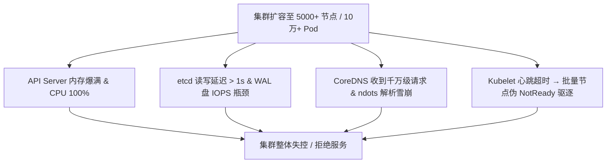
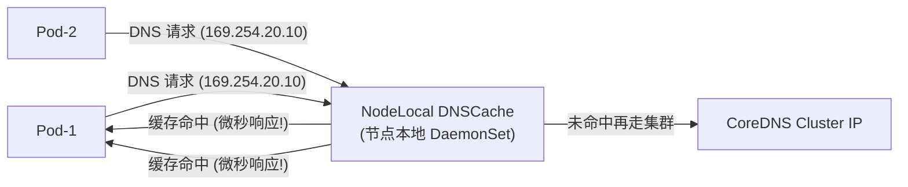

# ⚡ 万级节点与十万级 Pod 大规模集群性能调优指南

> 本文档面向云原生架构师与高级 Kubernetes 工程师，深入剖析集群规模扩展至 5,000~10,000 节点、10 万~50 万 Pod 时，控制面 (API Server, etcd, KCM, Scheduler)、数据面 (kubelet, kube-proxy, CoreDNS) 的瓶颈根因与生产级调优参数指南。

---

## 目录
- [一、 大规模集群的核心性能瓶颈全景](#一-大规模集群的核心性能瓶颈全景)
- [二、 控制面 API Server 与 APF 流量调优](#二-控制面-api-server-与-apf-流量调优)
- [三、 etcd 极限吞吐与存储调优](#三-etcd-极限吞吐与存储调优)
- [四、 Kubelet 与工作节点性能调优](#四-kubelet-与工作节点性能调优)
- [五、 CoreDNS 与服务发现高并发优化](#五-coredns-与服务发现高并发优化)

---

## 一、 大规模集群的核心性能瓶颈全景

当集群规模突破 5,000 节点 / 10 万 Pod 时，常规配置的集群会出现以下崩溃现象：



---

## 二、 控制面 API Server 与 APF 流量调优

### 2.1 开启 APF (API Priority and Fairness) 细粒度流控

弃用传统的全局粗暴限流（`--max-requests-inflight`），开启 APF 隔离不同来源的流量：

```yaml
# 生产推荐配置: /etc/kubernetes/manifests/kube-apiserver.yaml
spec:
  containers:
  - command:
    - kube-apiserver
    - --enable-priority-and-fairness=true
    - --max-requests-inflight=3000          # 只读最大并发
    - --max-mutating-requests-inflight=1000 # 写入最大并发
    - --watch-cache-sizes=Node#5000,Pod#50000,Endpoints#20000 # 扩大 Watch 缓存内存
```

#### 配置自定义 FlowSchema 保障节点心跳与选主流量：
创建 `FlowSchema` 确保 `system-nodes` (kubelet 心跳) 和 `leader-election` 永远不被限流丢弃。

### 2.2 预防 Informer 全量列表雪崩 (ResourceVersion=0 保护)

在超大规模集群中，控制器或组件启动时若发起不带 `resourceVersion` 的 `LIST` 请求，API Server 会**穿透 Watch Cache 直接查询 etcd**。100 个节点同时穿透会导致 etcd 立即瘫痪。

**调优原则**：
- 所有 Informer/List 请求必须显式设置 `resourceVersion="0"`（从 API Server 内存 Watch Cache 获取，不穿透到 etcd）。

---

## 三、 etcd 极限吞吐与存储调优

### 3.1 硬件与部署架构升级
- **存储介质**：必须使用 **NVMe SSD** 磁盘。etcd 对 WAL 预写日志的 `fsync` 延迟要求极高（`fdatasync` 延迟必须小于 **10ms**）。
- **读写分离部署**：在大规模集群中，将 `Events` 拆分到独立的 etcd 集群中：
  ```yaml
  --etcd-servers=https://etcd-main-1:2379,https://etcd-main-2:2379
  --etcd-servers-overrides=/events#https://etcd-events-1:2379,https://etcd-events-2:2379
  ```

### 3.2 etcd 启动调优参数指南

```bash
# /etc/kubernetes/manifests/etcd.yaml
containers:
- command:
  - etcd
  - --quota-backend-bytes=8589934592     # 增大存储配额到 8GB (上限)
  - --auto-compaction-retention=5m       # 每 5 分钟自动压缩历史版本
  - --auto-compaction-mode=periodic
  - --max-request-bytes=15728640         # 允许单次最大 15MB 写入
  - --heartbeat-interval=250             # 心跳间隔 250ms (适应跨机房)
  - --election-timeout=1250              # 选举超时 1250ms
```

---

## 四、 Kubelet 与工作节点性能调优

### 4.1 调整心跳频率与驱逐阈值，防止节点“伪 NotReady”

在超大集群中，网络抖动或 API Server 忙会导致 Kubelet 心跳上报延迟。默认 40s 不上报就会触发 Pod 误驱逐。

```yaml
# 1. Kubelet 参数配置 (/var/lib/kubelet/config.yaml)
nodeStatusUpdateFrequency: 20s   # 心跳上报频率从 10s 降低到 20s，减轻 APIServer 压力
nodeStatusReportFrequency: 5m    # 全量状态上报间隔扩展为 5 分钟

# 2. kube-controller-manager 参数配置
--node-monitor-grace-period=5m0s # 允许节点最多 5 分钟不上报才置为 NotReady
--pod-eviction-timeout=5m0s       # 置为 NotReady 后等待 5 分钟才发起驱逐
```

### 4.2 镜像并发拉取与资源预留调优

```yaml
# Kubelet 配置文件
serializeImagePulls: false       # 允许并发拉取镜像
maxParallelImagePulls: 5          # 最大并发镜像拉取数
systemReserved:
  cpu: "2000m"
  memory: "4Gi"
kubeReserved:
  cpu: "2000m"
  memory: "4Gi"
evictionHard:
  memory.available: "1Gi"
  nodefs.available: "10%"
```

---

## 五、 CoreDNS 与服务发现高并发优化

### 5.1 解析性能优化 (AutoPath & Cache)

在大规模集群中，默认 `ndots:5` 会导致域名查询放大 4 倍。

修改 CoreDNS ConfigMap `Corefile`：

```text
apiVersion: v1
kind: ConfigMap
metadata:
  name: coredns
  namespace: kube-system
data:
  Corefile: |
    .:53 {
        errors
        health {
           lameduck 5s
        }
        ready
        kubernetes cluster.local in-addr.arpa ip6.arpa {
           pods insecure
           fallthrough in-addr.arpa ip6.arpa
           ttl 30
        }
        prometheus :9153
        forward . /etc/resolv.conf {
           max_concurrent 1000           # 允许并发上游查询
        }
        cache 300                        # 调大 DNS 缓存时间至 300s
        loop
        reload
        loadbalance
    }
```

### 5.2 部署 NodeLocal DNSCache (节点级 DNS 缓存)

通过在每个 Node 部署 `NodeLocal DNSCache` (DaemonSet)，将 Pod 的 DNS 请求在**节点本地拦截**，避免打到 CoreDNS Pod。



> [!TIP]
> **效果**：引入 NodeLocal DNSCache 后，集群 DNS 查询延迟从 20ms+ 降低至 **< 1ms**，CoreDNS 压力下降 90% 以上。

---

## 六、 深度扩展：Linux sysctl 内核网络矩阵与 Kubelet 预留推导 (参考源: Cloudflare Engineering & Datadog)

### 1. 5000+ 节点生产级 `/etc/sysctl.conf` 内核矩阵
针对海量网络套接字连接与 `conntrack` 跟踪表防溢出：

```ini
# /etc/sysctl.d/99-k8s-scale.conf
# 1. 连接跟踪表上限 (防止 TABLE_FULL 丢包)
net.netfilter.nf_conntrack_max = 1048576
net.netfilter.nf_conntrack_tcp_timeout_established = 86400

# 2. 软中断半连接与全连接队列 (防 SYN Flood 丢包)
net.core.somaxconn = 32768
net.core.netdev_max_backlog = 16384
net.ipv4.tcp_max_syn_backlog = 16384

# 3. 内存与端口范围
net.ipv4.ip_local_port_range = 1024 65535
fs.file-max = 2097152
fs.inotify.max_user_watches = 524288
```

---

### 2. Kubelet 内存/CPU 资源预留自动推导公式
对于 128 核 CPU / 512GB 内存的大型工作节点，`kube-reserved` 推荐推导逻辑为：

$$\text{Memory}_{\text{reserved}} = 255\text{MB} + (11\text{MB} \times N_{\text{cores}}) + (100\text{MB} \times S_{\text{memory\_GB}})$$

对于 512GB 节点：
$$\text{Memory}_{\text{reserved}} = 255\text{MB} + (11 \times 128) + (100 \times 512) \approx 52.8\text{GB}$$
确保在大规模 Pod 频繁启动和销毁时，Kubelet 与 containerd 拥有足够的物理内存防 OOM！

---

> [!TIP] 💡 关联技术与延伸阅读
>
> * [etcd 读写吞吐与内存调优](../01-组件原理/08-etcd底层架构MVCC与高可用运维.md)
> * [kube-apiserver P&R 优先级与公平并发控制](../01-组件原理/01-API_Server.md)
> * [IPVS Hash 模式在超大规模集群中的应用](../01-组件原理/05-Kube_Proxy.md)
