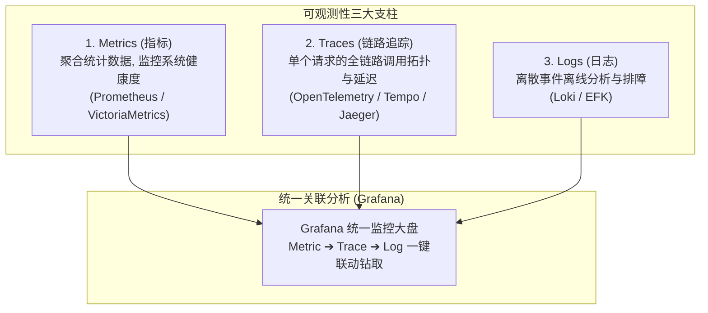
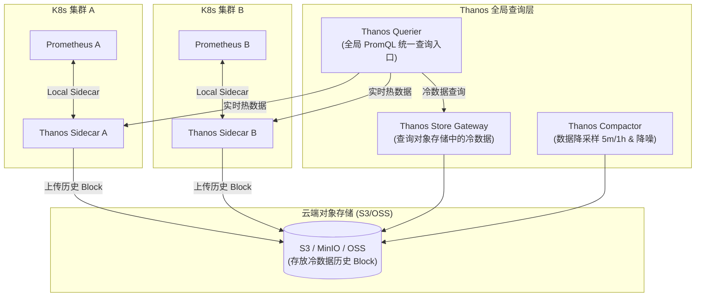
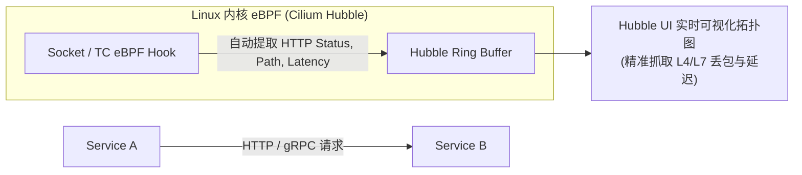

# 📊 云原生可观测性架构：Prometheus、Thanos、Tempo 与 eBPF 链路追踪

> 本文档面向云原生架构师与高级 Kubernetes 工程师，深入剖析云原生可观测性三大支柱（Metrics, Traces, Logs），详解 Prometheus + Thanos 高可用大容量架构、OpenTelemetry 标准、Grafana Tempo 分布式链路追踪，以及基于 eBPF (Cilium Hubble / Pixie) 的无侵入可观测性。

---

## 目录
- [一、 云原生可观测性三大支柱与架构全景](#一-云原生可观测性三大支柱与架构全景)
- [二、 Prometheus + Thanos 高可用与长期存储架构](#二-prometheus--thanos-高可用与长期存储架构)
- [三、 OpenTelemetry 标准与 Grafana Tempo 链路追踪](#三-opentelemetry-标准与-grafana-tempo-链路追踪)
- [四、 基于 eBPF (Cilium Hubble) 的零侵入服务拓扑与网络观测](#四-基于-ebpf-cilium-hubble-的零侵入服务拓扑与网络观测)
- [五、 生产级 Golden Signals (黄金指标) 告警规则实践](#五-生产级-golden-signals-黄金指标-告警规则实践)

---

## 一、 云原生可观测性三大支柱与架构全景



---

## 二、 Prometheus + Thanos 高可用与长期存储架构

原生单实例 Prometheus 存在内存易爆、不支持长期存储、不支持多集群统一查询的痛点。**Thanos** 通过对象存储实现了无限容量扩展与全局视图。



---

## 三、 OpenTelemetry 标准与 Grafana Tempo 链路追踪

**OpenTelemetry (OTel)** 是 CNCF 统一的指标与链路采集标准。

### W3C TraceContext 跨服务传递：
通过在 HTTP / gRPC 报文 Header 中传递 `traceparent`，实现跨微服务的全局追踪：

$$\text{traceparent: } \text{00-4bf92f3577b34da6a3ce929d0e0e4736-00f067aa0ba902b7-01}$$

- `4bf92f3577b34da6a3ce929d0e0e4736`：全局唯一 **Trace ID**。
- `00f067aa0ba902b7`：当前 Span 的 **Span ID**。

---

## 四、 基于 eBPF (Cilium Hubble) 的零侵入服务拓扑与网络观测

传统 Tracing 需要在业务代码中埋点（如引入 OTel SDK）。**Cilium Hubble 基于 eBPF** 实现了**无需修改一行代码、无需重新编译镜像**的零侵入网络与 L7 协议可观测性。



### Hubble 命令行实时抓包诊断：

```bash
# 1. 实时观测特定 namespace 下的 HTTP 异常流量 (5xx 状态码)
hubble observe --namespace default --http-status 5xx -f

# 2. 查看两个 Pod 之间的 TCP 建立连接延迟
hubble observe --from-pod default/service-a --to-pod default/service-b --protocol tcp
```

---

## 五、 生产级 Golden Signals (黄金指标) 告警规则实践

基于 Google SRE 提出的 **Four Golden Signals (延迟、流量、错误、饱和度)** 配置 Prometheus 告警规则：

```yaml
groups:
- name: golden_signals_alerts
  rules:
  # 1. Error Rate (错误率告警: HTTP 5xx 占比 > 5%)
  - alert: HighHttpErrorRate
    expr: |
      sum(rate(http_requests_total{status=~"5.."}[5m])) 
      / 
      sum(rate(http_requests_total[5m])) * 100 > 5
    for: 2m
    labels:
      severity: critical
    annotations:
      summary: "服务 {{ $labels.service }} 5xx 错误率超过 5%！"

  # 2. Latency (延迟告警: P99 延迟 > 2 秒)
  - alert: HighP99Latency
    expr: histogram_quantile(0.99, sum(rate(http_request_duration_seconds_bucket[5m])) by (le)) > 2
    for: 3m
    labels:
      severity: warning
    annotations:
      summary: "P99 响应延迟超过 2 秒！"
```

---

> [!TIP] 💡 关联技术与延伸阅读
>
> * [kube-state-metrics 资源状态指标接入](./03-kube-state-metrics配置与监控架构.md)
> * [eBPF 底层内核探测机制](../04-集群网络/04-eBPF与Cilium下一代网络架构原理.md)
