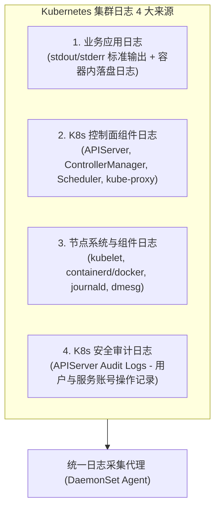
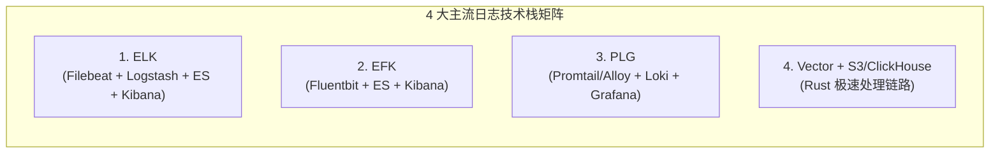

# 🪵 Kubernetes 集群日志管理全景指南：ELK、EFK 与 Loki 架构对比、选型与生产实战

本文全面梳理 Kubernetes 集群中的日志来源分类、3 大日志采集架构模式，深度对比主流日志技术栈（ELK、EFK、PLG/Loki、Vector），并提供生产级多行堆栈熔合、LogQL 查询语法以及存储分级治理的最佳实践。

---

## 一、 Kubernetes 集群日志来源与分类全景

在 Kubernetes 集群中，日志散落在宿主机、容器可写层、Pod 挂载卷以及 Kubernetes 组件中。完整的日志体系需覆盖以下 4 大来源：



### 1. 详细日志分类与存放路径表

| 日志类型 | 常见产生组件 | 宿主机原始物理路径 | 采集方式 |
| :--- | :--- | :--- | :--- |
| **容器标准输出** | 业务应用容器 (`stdout/stderr`) | `/var/log/pods/<pod_uid>/<container_name>/` 或 `/var/log/containers/*.log` | 挂载宿主机目录通过 DaemonSet 采集 |
| **容器落盘日志** | 未输出到 stdout 的应用写盘日志 | 容器内路径（需通过 `emptyDir` 或 `hostPath` 暴露到宿主机） | DaemonSet 或 Sidecar 容器采集 |
| **K8s 控制面** | APIServer, Scheduler 等 | 容器化部署：`/var/log/pods/`<br/>二进制部署：`/var/log/kubernetes/*.log` | DaemonSet / Filebeat |
| **Node 守护进程** | kubelet, containerd, docker | Linux `journald`（通过 `journalctl -u kubelet` 查看） | Vector / Fluentbit 智能读取 systemd |
| **APIServer 审计**| API 调用的鉴权与操作轨迹 | `/var/log/kubernetes/audit/audit.log` (由 apiserver 策略配置) | Filebeat 收集推送到 SIEM/ES |

---

## 二、 Kubernetes 日志采集架构 3 大模式剖析

针对 Kubernetes 的动态 Pod 声明周期，业界形成了 3 种主流的日志采集架构模式：

```text
┌─────────────────────────────────────────────────────────────────────────────┐
│ 模式 1: Node 级别 DaemonSet 统一采集 (最推荐，生产首选 90% 场景)            │
│ 宿主机 /var/log/pods ──► [DaemonSet Agent: Filebeat/Fluentbit] ──► ES/Loki  │
│ 优点: 资源开销极小，业务 Pod 无侵入；缺点: 需应用将日志输出到 stdout        │
├─────────────────────────────────────────────────────────────────────────────┤
│ 模式 2: Pod 级别 Sidecar 容器采集                                           │
│ [业务容器 (写文件)] ──(共享 emptyDir Volume)──► [Sidecar Agent 容器] ──► 远端 │
│ 优点: 隔离性强，可处理写死在容器内部路径的文本日志；缺点: 资源消耗翻倍      │
├─────────────────────────────────────────────────────────────────────────────┤
│ 模式 3: 应用直连 SDK 异步推送                                               │
│ [业务应用 (Log4j/Zap)] ──(TCP/HTTP 异步发送)──► [Kafka / Logstash / ES]     │
│ 优点: 链路最短，无 Agent 转换开销；缺点: 代码强耦合，网络阻塞可能卡死业务    │
└─────────────────────────────────────────────────────────────────────────────┘
```

### 3 种采集模式综合对比矩阵

| 对比维度 | 模式 1：DaemonSet 采集 | 模式 2：Sidecar 采集 | 模式 3：应用直连 SDK |
| :--- | :--- | :--- | :--- |
| **业务代码侵入性**| **零侵入** | 零侵入 (需修改 Pod Spec) | **高侵入** (需引入 SDK 配置) |
| **资源消耗 (CPU/RAM)**| **极低** (全节点共享 1 个 Agent) | 极高 (每个 Pod 增加 1 个容器) | 低 (消耗业务容器少量 CPU) |
| **Pod 动态适应** | 自动感知 Pod 启停与标签注入 | 自动绑定 Pod 生命周期 | 需自行配置应用注册与鉴权 |
| **适用场景** | `stdout` 标准输出应用 (云原生首选) | 遗留系统、写死文件路径的日志 | 追求极致性能与自定义 Header 场景 |

---

## 三、 主流 Kubernetes 日志技术栈深度对比

目前业界主流的 4 套日志处理技术栈分别是：**ELK**、**EFK**、**PLG (Loki)** 以及基于 **Vector** 的下一代 Pipeline。



### 4 大技术栈横向测评表

| 维度对比 | ELK (Elastic Stack) | EFK (Fluentd/Fluentbit + ES) | PLG (Grafana Loki) | Vector 架构 |
| :--- | :--- | :--- | :--- | :--- |
| **日志采集器** | Filebeat / Logstash | Fluentbit (C语言) / Fluentd | Promtail / Grafana Alloy | **Vector (Rust 语言)** |
| **传输/清洗层** | Logstash | Fluentd / Logstash | Loki Ingestor (标签流) | Vector Transform |
| **存储与索引引擎**| **Elasticsearch** (全文倒排索引) | **Elasticsearch** (全文倒排索引) | **Grafana Loki** (仅索引 Label，日志压缩存对象存储) | OpenSearch / ClickHouse / S3 |
| **可视化控制台**| Kibana | Kibana | **Grafana** (与 Prometheus 监控同屏) | Grafana / Kibana |
| **内存与 CPU 开销**| **高** (Logstash/ES 极其吃内存) | 中等 (Fluentbit 内存开销仅几 MB) | **极低** (仅为 ES 的 1/5 ~ 1/10) | **极低** (Rust 内存安全且极速) |
| **存储成本** | 较高 (索引文件体积大) | 较高 (索引文件体积大) | **极低** (对象存储 S3/MinIO，极高压缩率)| 视后端存储而定 |
| **检索性能** | **微秒级全文检索** | **微秒级全文检索** | 秒级 (基于时间范围与 Label 过滤后扫描) | 极快 |
| **适用场景** | 复杂全文检索、安全日志分析 | K8s 云原生标准通用方案 | **云原生统一可观测性、成本敏感型** | 追求高吞吐、低延迟日志处理 |

### 3.2 Filebeat / Logstash vs Fluentbit / Fluentd 深度横向对比

这 4 个组件经常被放在一起讨论，但它们的**语言底层、资源占用与设计角色**有着本质区别：

#### 1. 软件基因与角色分工矩阵

| 对比维度 | **Filebeat** | **Logstash** | **Fluentbit** | **Fluentd** |
| :--- | :--- | :--- | :--- | :--- |
| **开源生态** | Elastic (SSPL 协议) | Elastic (SSPL 协议) | **CNCF 基金会** | **CNCF 毕业项目** |
| **开发语言** | **Go 语言** | **Java / JRuby (JVM)** | **纯 C 语言** | **Ruby + C** |
| **核心角色** | **边缘采集器 (Shipper)** | **集中式清洗转换中心 (Processor)** | **极轻量采集与转换器 (Ultra-light Agent)** | **云原生日志汇聚处理引擎 (Collector)** |
| **内存开销 (RAM)** | **~10 - 30 MB** | **~500 MB - 2 GB+** (极吃内存) | **~3 - 10 MB** (极致轻量) | **~30 - 100 MB** |
| **CPU 占用** | 低 | 高 (JVM GC & 复杂 Grok) | **极低** | 中等 |
| **插件机制** | 内置模块 (也可写 Go 扩展) | 极其丰富 (Input/Filter/Output) | 内置常用 C 插件 | 极其丰富 (500+ RubyGems 插件) |

#### 2. K8s 生产环境 3 种典型组合选型策略

```text
┌─────────────────────────────────────────────────────────────────────────────┐
│ 组合 1: Fluentbit (DaemonSet) ──► ES / Loki (推荐: 极轻量直连)              │
│ 适用场景: 追求极致低资源消耗(每个节点仅需 5MB 内存)，解析简单的 JSON/CRI 日志 │
├─────────────────────────────────────────────────────────────────────────────┤
│ 组合 2: Filebeat (DaemonSet) ──► Logstash 集群 ──► ES (推荐: 大厂经典 ELK)   │
│ 适用场景: 节点侧快速抓取，中心侧利用 Logstash 进行极其复杂的 Grok 抽取与格式转换│
├─────────────────────────────────────────────────────────────────────────────┤
│ 组合 3: Fluentbit (DaemonSet) ──► Fluentd 汇聚 ──► S3 / ES (推荐: CNCF 标准) │
│ 适用场景: 纯开源云原生生态，节点侧 C 极速采集，中心侧利用 Fluentd 丰富插件分发 │
└─────────────────────────────────────────────────────────────────────────────┘
```

---

## 四、 云原生首选：Grafana Loki (PLG) 架构与 LogQL 实战

由于 Elasticsearch 维护成本高、内存开销大，**Grafana Loki** 已成为 Kubernetes 领域最受欢迎的轻量级日志解决方案。

### 1. Loki 核心设计哲学
* **不进行全文索引**：Loki 模仿 Prometheus 的设计，仅对日志的 **Labels（元数据标签，如 `namespace`、`pod`、`app`）** 建立索引。
* **数据日志体直接压缩存储**：日志内容本身被切块压缩存入对象存储（如 MinIO、AWS S3、Ceph）。

### 2. LogQL 实用查询语法手册 (与 PromQL 高度一致)

#### A. 基础标签选择器 (Label Matchers)
```logql
# 查询 prod 命名空间下 order-service 的日志
{namespace="prod", container="order-service"}
```

#### B. 行过滤表达式 (Line Filter)
```logql
# 包含 "ERROR" 且不包含 "timeout" 的日志
{namespace="prod", app="payment"} |= "ERROR" != "timeout"

# 使用正则表达式匹配 5xx 状态码
{namespace="prod", app="nginx"} |~ "HTTP/1.1\" 5[0-9]{2}"
```

#### C. 日志转化为监控指标 (Log to Metric)
在 Grafana 中直接将日志转换为 QPS 曲线或错误率趋势图：
```logql
# 统计过去 5 分钟内，每秒产生 ERROR 日志的数量 (按 pod 聚合)
sum by (pod) (rate({namespace="prod", app="user-service"} |= "ERROR" [5m]))

# 统计 Nginx 5xx 错误的 QPS
sum(rate({app="ingress-nginx"} |~ " 5\\d{2} " [1m]))
```

---

## 五、 生产级 Filebeat / Containerd 多行日志堆栈熔合配置

在 Java (SpringBoot) 等应用中，一条 Exception 异常抛出通常包含上百行 Stack Trace。如果采集器不进行多行合并，每一行会被拆分为独立日志送往 ES/Loki，导致日志切碎无法阅读。

### 1. Containerd (CRI) 格式日志解析
Containerd 产生的物理日志格式如下：
```text
2026-08-10T10:15:30.123456789Z stdout F java.lang.NullPointerException
2026-08-10T10:15:30.123457890Z stdout F     at com.example.service.OrderService.create(OrderService.java:42)
```

### 2. Filebeat 生产级 `multiline` 配置 YAML 模版

```yaml
apiVersion: v1
kind: ConfigMap
metadata:
  name: filebeat-config
  namespace: logging
data:
  filebeat.yml: |
    filebeat.inputs:
    - type: container
      paths:
        - /var/log/containers/*.log
      
      # 1. 多行日志合并规则 (以 YYYY-MM-DD 或 ISO8601 时间戳开头的行为新日志，其余行合并到上一行)
      multiline.type: pattern
      multiline.pattern: '^[0-9]{4}-[0-9]{2}-[0-9]{2}'
      multiline.negate: true
      multiline.match: after
      multiline.timeout: 5s

      # 2. 自动注入 Kubernetes 元数据 (Pod Name, Namespace, Labels)
      processors:
        - add_kubernetes_metadata:
            host: ${NODE_NAME}
            matchers:
            - logs_path:
                logs_path: "/var/log/containers/"

    output.kafka:
      hosts: ["kafka-cluster:9092"]
      topic: "k8s-app-logs"
```

---

## 六、 生产级日志治理最佳实践与避坑指南

### 1. 宿主机磁盘爆盘防护 (Log Rotation)
避免应用无节制刷日志打爆宿主机 `/var/lib/docker` 或 `/var/log` 分区：
* **Containerd 配置**：在 `/etc/containerd/config.toml` 中配置日志切分大小：
  ```toml
  [plugins."io.containerd.grpc.v1.cri"]
    max_container_log_line_size = 16384
```
* **Kubelet 参数设置**：设置单容器日志上限：
  ```yaml
  # kubelet-config.yaml
  containerLogMaxSize: "100Mi"
  containerLogMaxFiles: 3
  ```

### 2. 日志结构化 (JSON Format)
* 强烈建议推动业务团队将应用日志输出格式统一修改为 **JSON 格式**。
* **优势**：采集端 Agent（Filebeat / Vector）可自动展开 JSON 字段，实现秒级字段检索（如 `json.trace_id: "abc12345"`），无需正则 Extract 消耗 CPU。

### 3. 日志生命周期与冷热分级 (ILM / Retention)
为了兼顾检索性能与存储成本，实施**三级存储策略**：

```text
┌─────────────────────────────────────────────────────────────────────────┐
│ 1. 热数据层 (Hot - SSD 硬盘)                                            │
│    留存时间: 1 ~ 7 天 | 保证高频故障排查的极速检索                      │
├─────────────────────────────────────────────────────────────────────────┤
│ 2. 温数据层 (Warm - 普通 HDD / 高压缩索引)                              │
│    留存时间: 8 ~ 30 天 | 用于月度复盘与慢查询诊断                      │
├─────────────────────────────────────────────────────────────────────────┤
│ 3. 冷数据/归档层 (Cold - S3 / MinIO 对象存储 / 离线压缩包)               │
│    留存时间: 31 ~ 180+ 天 | 满足安全合规审计需求，随时离线挂载恢复         │
└─────────────────────────────────────────────────────────────────────────┘
```

---

### 关联阅读
* 📖 [10-Kubernetes生产级EFK(Elasticsearch+Fluentd+Fluentbit+Kibana)企业级架构、高可用集群部署与底层原理深度实战指南.md](./10-Kubernetes生产级EFK(Elasticsearch+Fluentd+Fluentbit+Kibana)企业级架构、高可用集群部署与底层原理深度实战指南.md)
* 📖 [08-云原生可观测性架构Prometheus_Thanos_Tempo与eBPF链路追踪.md](./08-云原生可观测性架构Prometheus_Thanos_Tempo与eBPF链路追踪.md)
* 📖 [06-生产级高难故障排查与实战方案.md](./06-生产级高难故障排查与实战方案.md)
* 📖 [Ingress基础全景与进化延伸指南](../04-集群网络/05-1-Ingress基础全景与进化延伸指南.md)

---

> [!TIP] 💡 关联技术与延伸阅读
>
> * [生产级 EFK 企业级架构与高可用部署实战](./10-Kubernetes生产级EFK(Elasticsearch+Fluentd+Fluentbit+Kibana)企业级架构、高可用集群部署与底层原理深度实战指南.md)
> * [Fluent Bit 轻量边缘采集器](./01-EFK/02-FluentBit.md)
> * [Fluentd 生产级管道配置](./01-EFK/03-Fluentd.md)
