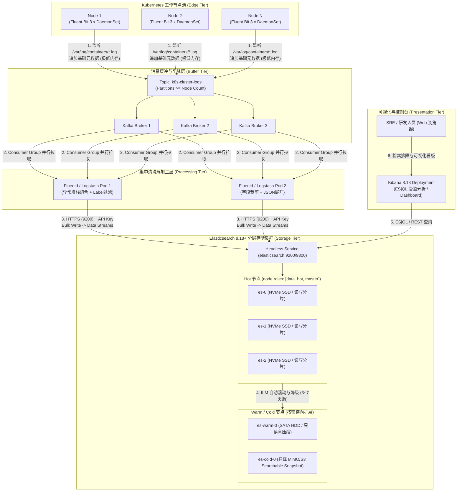

# 🪵 Kubernetes 生产级 EFK (Elasticsearch + Fluentd/Fluent Bit + Kibana) 企业级架构、高可用集群部署与底层原理深度实战指南

本文面向 Kubernetes 生产环境，基于 **Elastic Stack 8.18+** 最新架构标准与 **CNCF 云原生日志采集标准**，全面整合并深度扩展了 **EFK 企业级架构演进**、**Lucene 9/10 底层数据结构（FST/FOR/Roaring Bitmap）与 ES 写入全链路原理**、**3 节点高可用 Elasticsearch StatefulSet 生产级编排**、**Fluent Bit 极轻量边缘采集器**、**Fluentd 复杂清洗/Java异常堆栈熔合/Label过滤管道**、**Kibana 8.18 控制台与 ES|QL 管道查询引擎**，以及**操作系统内核调优、ILM 数据流生命周期与高难故障排障 SOP**。

---

## 一、 EFK 8.18+ 企业级架构拓扑与演进全景

### 1. 架构演进的三大阶段

在云原生日志治理的发展过程中，EFK 架构经历了从简单直接到高度分层解耦的演进：

```
+-----------------------------------------------------------------------------------+
| 阶段 1: 极简节点直连型 (小规模集群 < 10 Nodes)                                       |
| Pod (stdout) -> DaemonSet Fluent Bit (轻量采集) -> 单节点/轻量 ES -> Kibana UI    |
| 特点: 架构极简、零维护门槛；缺点: 无缓冲削峰，ES 抖动易丢失日志，无多副本高可用保障 |
+-----------------------------------------------------------------------------------+
                                         │
                                         ▼
+-----------------------------------------------------------------------------------+
| 阶段 2: 8.18 Data Stream 与高可用安全集群型 (中规模集群 10 ~ 100 Nodes)              |
| Pod (CRI Multi-line) -> Fluentd / Fluent Bit -> ES 8.18 Data Streams (HTTPS/TLS)  |
| 特点: 3 节点 StatefulSet 高可用、自动 Rollover 分片管理、默认 TLS/Token 身份鉴权    |
+-----------------------------------------------------------------------------------+
                                         │
                                         ▼
+-----------------------------------------------------------------------------------+
| 阶段 3: 企业级 Kafka 缓冲削峰解耦型 (海量集群 > 100 Nodes / 日日志 TB~PB 级)           |
| Edge (Fluent Bit) -> Kafka 缓冲集群 -> Aggregators (Fluentd) -> ES 8.18 Multi-Tier|
| (Hot/Warm/Cold/Frozen 分层存储) -> ES|QL 极速分析 / Kibana 8.18 控制台            |
| 特点: 业务端轻量采集，消息队列削峰防压垮，中心端复杂清洗，冷热数据分级降本 50%+     |
+-----------------------------------------------------------------------------------+
```

---

### 2. 企业级全景架构拓扑 (Kafka + EFK 8.18+)

针对生产环境高吞吐、多租户隔离与冷热生命周期治理需求，推荐的企业级全景架构如下：



---

### 3. 核心采集与汇聚组件全方位对比矩阵

在构建日志链路时，选择合适的 Agent 决定了系统的稳定性和资源消耗：

| 对比维度 | **Fluent Bit** | **Fluentd** | **Filebeat** | **Logstash** |
| :--- | :--- | :--- | :--- | :--- |
| **开源生态** | **CNCF 毕业项目** | **CNCF 毕业项目** | Elastic (SSPL 协议) | Elastic (SSPL 协议) |
| **开发语言** | **纯 C 语言** | **Ruby + C 扩展** | **Go 语言** | **Java / JRuby (JVM)** |
| **核心角色** | **极轻量边缘采集器** | **集中式汇聚与清洗引擎** | **轻量边缘采集器 (Shipper)** | **重量级集中式数据转换中心** |
| **内存开销 (RAM)** | **~3 MB - 10 MB** (极致轻量) | **~30 MB - 100 MB** | **~15 MB - 35 MB** | **~500 MB - 2 GB+** (极吃内存) |
| **CPU 消耗** | **微乎其微 (< 1%)** | 低 ~ 中等 | 低 | 较高 (JVM GC & 正则 Grok) |
| **插件生态** | 内置约 100+ 核心插件 | **极其丰富 (500+ RubyGems)** | 内置模块与特定 Beats | 极其丰富 (支持丰富过滤器) |
| **数据缓冲机制** | 内存环形队列 + 本地 SQLite 磁盘缓冲 | 内存队列 + **极稳定的多线程文件缓冲** | 内存队列 + 磁盘 Spool | 内存队列 + 磁盘持久化队列 (PQ) |
| **Java 异常堆栈熔合** | 支持多行正则 (Multiline) | **原生 `detect_exceptions` 智能插件** | 支持 multiline 配置 | 支持 multiline 编解码 |
| **最佳落地场景** | **K8s 工作节点 DaemonSet 首选** | **复杂日志集中清洗 / 数据分流** | Elastic 全家桶环境节点采集 | 大厂遗留复杂 ETL 转换链路 |

---

### 4. Fluent Bit 与 Fluentd 最新版本功能演进与技术突破

随着云原生和 OpenTelemetry 标准的快速演进，两个项目在最新版本中均取得了关键的技术突破：

#### (1) Fluent Bit 最新演进（v3.x / 最新架构）
* **全原生 HTTP/2 多路复用**：Input/Output 插件（如 OpenSearch、OTel、Splunk）原生集成 HTTP/2 通信，显著降低高并发场景下的 TCP 连接与握手开销。
* **Processors 就地计算引擎**：突破了传统 Filter 管道的跨阶段内存复制瓶颈，支持在 Input 阶段直接挂载 Processors 进行流内就地富化与数据转换。
* **SQL-based Stream Processor（SQL 流处理）**：支持在单进程内部直接使用类 SQL 语法（`SELECT * FROM STREAM WHERE ...`）完成复杂过滤、字段提取与聚合。
* **SIMD 指令集 JSON 加速（AVX2 / ARM NEON）**：利用现代 CPU 向量指令集优化内部二进制与 JSON 之间的编解码，转换吞吐量提升高达 **30%**。
* **全原生 YAML 声明式配置**：彻底告别旧版 Classic 键值对格式，全面拥抱 Kubernetes 云原生声明式配置与环境变量安全插值。
* **Logs + Metrics + Traces (OTel) 三位一体**：原生集成 OpenTelemetry OTLP 协议，支持 Metrics 过滤与 Prometheus Remote Write，成为全栈可观测性采集器。

#### (2) Fluentd 最新演进（v1.17 / v1.19+ 长期支持版）
* **YAML 语法深度规范化**：全面支持 `$log_level` 声明式定义，彻底解决 YAML 场景下配置语法歧义与兼容性问题。
* **`in_tail` 模式匹配与轮转鲁棒性**：新增 `glob_policy`（支持 `[]`, `?`, `{}` 等高级通配符），彻底修复 `follow_inodes` 与文件轮转历史文件句柄泄漏问题。
* **Buffer Chunk 损坏容灾自愈**：节点非正常宕机导致的磁盘 Buffer 文件损坏时，Fluentd 自动进行备份隔离与告警，杜绝单文件损坏阻断整个写入管道。
* **云原生 HTTP 传输与 AWS SigV4 认证**：`out_http` 默认支持 gzip 压缩传输、连接池复用（`reuse_connections`），并原生集成 AWS Signature Version 4 签名鉴权。

---

### 5. Fluent Bit vs Fluentd 选型优缺点深度剖析与决策模型

#### (1) 选型优缺点全景对照

| 维度 | **Fluent Bit 优缺点剖析** | **Fluentd 优缺点剖析** |
| :--- | :--- | :--- |
| **主要优势 (Pros)** | 1. **资源消耗极低**：内存仅 3~10MB，CPU 占用低于 1%，适合大规模 Node DaemonSet。<br/>2. **零运行时依赖**：单一纯 C 静态二进制，无 Ruby/JVM 运行时开销，启动毫秒级。<br/>3. **高性能与现代协议**：SIMD JSON 加速、HTTP/2、原生 OpenTelemetry (Logs/Metrics/Traces)。<br/>4. **可靠轻量缓冲**：原生支持内存环形队列 + SQLite 本地磁盘背压缓冲。 | 1. **超大规模插件生态**：拥有 500+ RubyGems 插件，几乎支持市面上所有系统与数据源。<br/>2. **复杂清洗能力 (ETL)**：支持非常复杂的业务逻辑、动态多条件路由、动态查库富化。<br/>3. **异常堆栈智能合并**：`detect_exceptions` 插件对复杂多语言异常堆栈合并极其成熟。<br/>4. **成熟的企业级文件 Buffer**：多线程写入、重试退避与损坏分片容灾极其稳健。 |
| **主要局限 (Cons)** | 1. **插件生态较精简**：内置约 100+ 核心插件，小众/特定私有系统的支持较少。<br/>2. **自定义高级清洗门槛较高**：复杂非通用清洗需借助 Lua 或 WASM 编写扩展。<br/>3. **动态路由灵活性稍逊**：相比 Fluentd 的全编程化 Ruby 脚本，路由规则相对静态。 | 1. **内存与 CPU 开销较大**：基础占用 30~100MB+，节点数多时集群总资源消耗高。<br/>2. **GIL 并发限制**：受 CRuby 全局解释器锁限制，高吞吐需启动多个 Worker 进程。<br/>3. **容器镜像较大**：依赖完整 Ruby 运行时与编译工具链，镜像体积通常 > 100MB。 |

#### (2) 生产选型决策树与场景自检

```
                              [ 日志架构选型决策起点 ]
                                         │
                ┌────────────────────────┴────────────────────────┐
          [ 部署位置 / 角色？]                              [ 业务清洗复杂度？]
          ┌─────┴─────┐                                     ┌─────┴─────┐
     工作节点 (Node DaemonSet) 中心汇聚 (Aggregator)       基础过滤/JSON/正则  复杂多源富化/小众协议/特殊脱敏
          │                   │                             │                   │
          ▼                   ▼                             ▼                   ▼
     Fluent Bit            Fluentd                     Fluent Bit            Fluentd
  (低开销/高密度)       (强路由/富化清洗)              (内置 Filter/Lua)    (500+ Ruby 插件库)

                                         │
                ┌────────────────────────┴────────────────────────┐
          [ 总体吞吐与可靠性？]                             [ 可观测性整合目标？]
          ┌─────┴─────┐                                     ┌─────┴─────┐
       常规规模       突发海量峰值 / 金融级不丢日志        仅日志治理 (Logs)   全栈 OTel (Logs/Metrics/Traces)
          │                   │                             │                   │
          ▼                   ▼                             ▼                   ▼
      直连架构         Kafka + Fluentd 削峰              Fluentd / EFK        Fluent Bit 3.x
```

#### (3) 4 大生产落地架构推荐组合：
1. **轻量直连组合（中小规模 < 30 节点）**：`Fluent Bit (DaemonSet)` ➔ `Elasticsearch StatefulSet / Loki` ➔ `Kibana`。极致省资源，链路极简。
2. **CNCF 标准双层分工组合（中大规模 50~300+ 节点，官方强烈推荐）**：`Fluent Bit (DaemonSet 采集与打标)` ➔ `Fluentd (中心汇聚集群，复杂清洗/异常熔合/脱敏)` ➔ `Elasticsearch / S3`。兼顾节点低消耗与中心强扩展。
3. **消息队列削峰解耦组合（海量/金融级 > 300 节点）**：`Fluent Bit (DaemonSet)` ➔ `Kafka / RocketMQ 集群` ➔ `Fluentd / Logstash 消费集群` ➔ `Elasticsearch 分层存储`。抗流量尖刺与压垮，100% 可靠性保障。
4. **云原生全栈 OTel 架构（现代化统一可观测）**：`Fluent Bit 3.x (DaemonSet)` ➔ `Fluent Bit 汇聚池 / OTel Collector` ➔ `ClickHouse / OpenSearch / Tempo`。Logs/Metrics/Traces 统一采集。

---


## 三、 生产级 3 节点高可用 Elasticsearch 8.18+ 集群编排实战

本节提供符合生产级标准的 3 节点高可用 ES 集群编排，包含**反亲和性物理隔离**、**内核参数与权限自动修正**、**JVM 调优**及**动态 StorageClass PVC 声明**。

### 1. 步骤一：创建 Logging 命名空间与 RBAC 权限


---

## 四、 边缘轻量采集器：Fluent Bit 极轻量 DaemonSet 实战

Fluent Bit 作为纯 C 语言开发的边缘采集器，单 Pod 内存消耗仅 **~5MB**。它直接挂载宿主机 `/var/log/containers/*.log`，解析 Containerd CRI 日志并动态注入 Kubernetes 元数据。

### `04-fluent-bit-daemonset.yaml`


---

## 五、 复杂业务汇聚引擎：Fluentd 生产级异常堆栈熔合与 Label 过滤实战

当业务存在**Java 多行 Exception 异常堆栈**、需要根据 **Pod Label 白名单过滤日志** 或执行**深度 JSON 展开与冗余瘦身**时，Fluentd 展现出极强的管道处理能力。

### 1. 4 大核心清洗能力设计
1. **多格式 JSON/CRI 时间戳智能解析 (`multi_format`)**。
2. **`detect_exceptions`**：自动识别 Java、Python、Node.js 异常堆栈并拼装为单条日志记录。
3. **`grep` 标签过滤**：只收集打上 `logging=true` 标签的 Pod 日志，过滤测试/噪音容器日志，为 ES 节省 80% 存储。
4. **`record_transformer` 瘦身**：剔除 `docker.container_id`、`kubernetes.master_url` 等无用元数据，降低索引体积 30%。

---

### 2. 完整管道配置与 DaemonSet 清单

---

## 八、 本地关联阅读

* 📖 [09-Kubernetes集群日志管理全景指南_ELK_EFK与Loki对比选型与生产实战.md](./09-Kubernetes集群日志管理全景指南_ELK_EFK与Loki对比选型与生产实战.md)
* 📖 [08-云原生可观测性架构Prometheus_Thanos_Tempo与eBPF链路追踪.md](./08-云原生可观测性架构Prometheus_Thanos_Tempo与eBPF链路追踪.md)
* 📖 [06-生产级高难故障排查与实战方案.md](./06-生产级高难故障排查与实战方案.md)
* 📖 [07-万级节点与十万级Pod大规模集群调优指南.md](./07-万级节点与十万级Pod大规模集群调优指南.md)

---

> [!TIP] 💡 关联技术与延伸阅读
>
> * [Elasticsearch 核心原理深度指南](./01-EFK/01-Elasticsearch.md)
> * [Fluent Bit 边缘采集器指南](./01-EFK/02-FluentBit.md)
> * [Fluentd 管道配置详解](./01-EFK/03-Fluentd.md)
> * [Kibana 部署与 ILM 生命周期管理](./01-EFK/04-Kibana.md)
