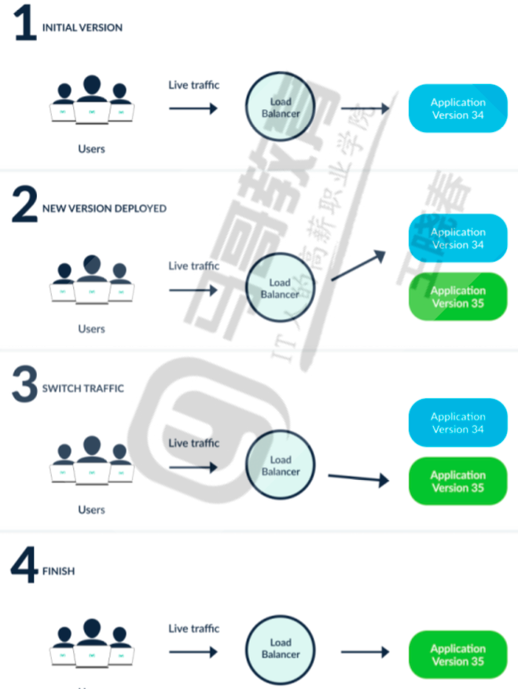
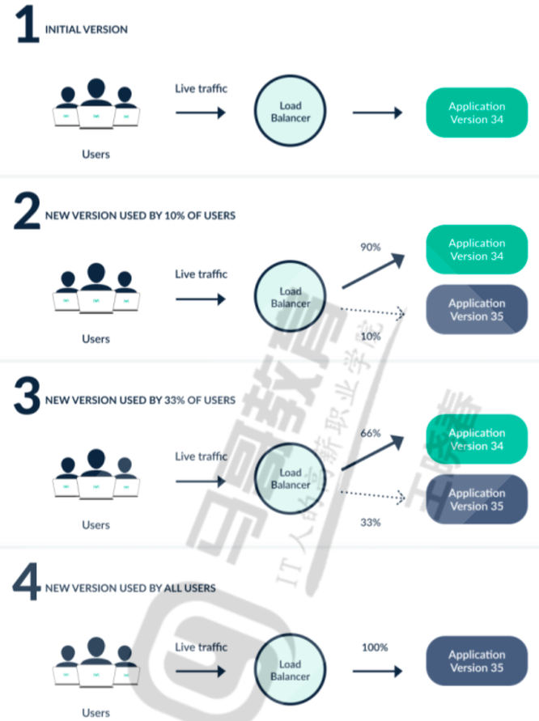

# ⛵ Argo 概述与 Rollouts 金丝雀发布指南

在云原生持续交付（CD）与渐进式发布领域，**Argo** 家族是目前最主流的开源解决方案。Argo 于 2020 年加入 CNCF，并于 2022 年毕业，已被广泛用于生产环境。本文将介绍 Argo 生态体系，并重点剖析 **Argo Rollouts** 这一实现蓝绿发布、金丝雀发布以及渐进式交付的强大组件。

---

## 一、 Argo 子项目生态蓝图

Argo 项目由四个专为 Kubernetes 设计的云原生子组件构成，分别满足不同的管道自动化场景：

```text
┌────────────────────────────────────────────────────────────────────────┐
│                              Argo Project                              │
└──────┬───────────────────┬───────────────────┬───────────────────┬─────┘
       │                   │                   │                   │
       ▼                   ▼                   ▼                   ▼
┌──────────────┐    ┌──────────────┐    ┌──────────────┐    ┌──────────────┐
│  Workflows   │    │      CD      │    │    Events    │    │   Rollouts   │
│ (任务流引擎)  │    │  (GitOps交付) │    │(事件驱动框架) │    │(渐进式发布)   │
└──────────────┘    └──────────────┘    └──────────────┘    └──────────────┘
```

1. **Argo Workflows (工作流引擎)**：
   * **作用**：Kubernetes 原生工作流引擎，用于在集群上创建、管理和协调复杂的容器化任务。
   * **特点**：支持有向无环图（DAG），适用于大数据处理、机器学习管道和 CI/CD 流程。
2. **Argo CD (GitOps 交付)**：
   * **作用**：基于声明式 GitOps 理念的持续交付工具。
   * **特点**：监听 Git 仓库的配置声明，自动将其同步到 Kubernetes 集群中，并提供丰富的 RBAC 与回滚能力。
3. **Argo Events (事件驱动框架)**：
   * **作用**：事件驱动的工作流自动化框架。
   * **特点**：支持多种事件源（Webhooks, S3, PubSub 等），当触发特定事件时，自动启动 Argo Workflows 或创建集群资源。
4. **Argo Rollouts (渐进式发布)**：
   * **作用**：管理高级部署策略的控制器。
   * **特点**：提供蓝绿部署、金丝雀发布、细粒度流量配比控制，以及基于外部指标（Prometheus 等）的自动健康分析与回滚。

---

## 二、 Argo Rollouts 架构与设计

### 1. 核心架构拓扑
Argo Rollouts 引入了自定义控制器和 CRD，以接管或扩展 Kubernetes 原生的部署对象（Deployment）。

```text
                     ┌──────────────────────┐
                     │  Rollout Controller  │
                     └──────────┬───────────┘
                                │ 监听与调谐 CRD
                                ▼
                       ┌──────────────────┐
                       │   Rollout CRD    │ (替代 Deployment)
                       └────────┬─────────┘
                                │
         ┌──────────────────────┴──────────────────────┐
         ▼                                             ▼
┌──────────────────┐                         ┌──────────────────┐
│   ReplicaSet A   │                         │   ReplicaSet B   │
│ (旧版本/Active)   │                         │ (新版本/Preview)  │
└────────┬─────────┘                         └────────┬─────────┘
         │                                             │
         │             通过 Service 切换流量            │
         └──────────────┐              ┌───────────────┘
                        ▼              ▼
                 ┌──────────────┐┌──────────────┐
                 │Active Service││Preview Servic│
                 └──────────────┘└──────────────┘
```

* **Rollout Controller**：集群控制器，负责调谐和处理 Rollout 资源的生命周期。
* **Rollout CRD**：声明式配置文件，格式与原生的 Deployment 极其类似，但额外包含了策略配置字段（如蓝绿、金丝雀步骤等）。
* **AnalysisTemplate / AnalysisRun**：定义如何收集和评估外部监控数据（例如 Prometheus 查询），判定新版本是否健康，以决定升级还是回滚。
* **Traffic Routing (流量管理)**：集成 ServiceMesh (Istio, Linkerd) 和 Ingress 控制器（Nginx Ingress, ALB 等），实现从 0% 到 100% 精确的流量割接。

### 2. 为什么需要 Argo Rollouts？ (对比原生 RollingUpdate)
Kubernetes 默认的滚动更新（RollingUpdate）在生产环境中面临许多限制：
* **流量割接粗糙**：无法精确控制流量导入新版本的比例（例如：只导入 5% 流量测试）。
* **缺乏深度验证**：就绪探针（Readiness Probe）只能进行简单的健康端口检测，无法读取监控系统（如 Prometheus）的异常率指标。
* **自动决策缺失**：发生异常时，滚动更新会一直阻塞，无法做到自动化中止并瞬时回滚（Rollback）。

---

## 三、 核心发布策略配置与实战

### 1. 蓝绿部署 (Blue-Green Deployment)
蓝绿部署通过创建两个独立的环境（Active/Active-Service 和 Preview/Preview-Service）来实现零停机更新。新版本先部署到 Preview 环境，验证通过后，将 Active Service 的 Selector 指向 Preview 容器，瞬间切换流量。



```yaml
# rollout-bluegreen.yaml
apiVersion: argoproj.io/v1alpha1
kind: Rollout
metadata:
  name: blue-green-example
spec:
  replicas: 3
  revisionHistoryLimit: 3
  selector:
    matchLabels:
      app: blue-green-app
  template:
    metadata:
      labels:
        app: blue-green-app
    spec:
      containers:
      - name: web
        image: nginx:1.21.0
  strategy:
    blueGreen:
      activeService: myapp-active            # 生产流量访问的 Service
      previewService: myapp-preview          # 测试/预发流量访问的 Service
      autoPromotionEnabled: false            # 禁用自动升级，需人工确认 (Promote) 后才切流
```

---

### 2. 金丝雀发布 (Canary Deployment)
金丝雀发布通过细粒度的步骤逐步引导用户流量到新版 ReplicaSet 中，期间提供暂停宽限期，以观察系统响应。



```yaml
# rollout-canary.yaml
apiVersion: argoproj.io/v1alpha1
kind: Rollout
metadata:
  name: canary-example
spec:
  replicas: 5
  selector:
    matchLabels:
      app: canary-app
  template:
    metadata:
      labels:
        app: canary-app
    spec:
      containers:
      - name: web
        image: nginx:1.21.0
  strategy:
    canary:
      steps:
      - setWeight: 10                         # 步骤 1：导入 10% 流量到新版本
      - pause: {}                             # 步骤 2：永久暂停，等待人工干预确认
      - setWeight: 40                         # 步骤 3：继续扩充到 40% 流量
      - pause:
          duration: 30s                       # 步骤 4：自动观察暂停 30 秒
      - setWeight: 80                         # 步骤 5：扩充到 80% 流量
      - pause:
          duration: 10s
```

---

### 3. 金丝雀分析与自动化回滚 (Canary Analysis)
通过关联 Prometheus，在金丝雀步骤中动态执行 `AnalysisRun`，一旦查询到新版本返回 5xx 比例超出安全阈值，直接自动中止并实施零有损回滚。

```yaml
# analysis-template.yaml
apiVersion: argoproj.io/v1alpha1
kind: AnalysisTemplate
metadata:
  name: prometheus-error-rate
spec:
  metrics:
  - name: success-rate
    interval: 30s
    successCondition: result[0] >= 0.95        # 要求成功率必须大于 95%
    failureLimit: 3                            # 容忍最多 3 次失败，超过即判定更新失败
    provider:
      prometheus:
        address: http://prometheus.monitoring.svc.cluster.local:9090
        query: |
          sum(rate(http_requests_total{status=~"2.*|3.*"}[2m])) 
          / 
          sum(rate(http_requests_total[2m]))
```

在 `Rollout` 的策略中调用此模板：
```yaml
spec:
  strategy:
    canary:
      analysis:
        templates:
        - templateName: prometheus-error-rate
      steps:
      - setWeight: 20
      - pause: { duration: 5m }
```

---

## 四、 控制器安装与运维命令行

### 1. 部署 Argo Rollouts 控制器与 Dashboard
```shell
# 创建命令空间
kubectl create namespace argo-rollouts

# 1. 部署控制器
kubectl apply -n argo-rollouts -f https://github.com/argoproj/argo-rollouts/releases/latest/download/install.yaml

# 2. 部署 Dashboard WebUI
kubectl apply -n argo-rollouts -f https://github.com/argoproj/argo-rollouts/releases/latest/download/dashboard-install.yaml
```

### 2. 部署 Kubectl Argo Rollouts 插件 (运维提效利器)
```shell
# 下载二进制包 (以 Linux amd64 为例)
curl -LO https://github.com/argoproj/argo-rollouts/releases/latest/download/kubectl-argo-rollouts-linux-amd64
mv kubectl-argo-rollouts-linux-amd64 /usr/local/bin/kubectl-argo-rollouts
chmod +x /usr/local/bin/kubectl-argo-rollouts

# 校验插件
kubectl argo rollouts version
```

### 3. 常用运维管理命令
```shell
# 1. 查看 Rollout 资源的实时灰度状态和拓扑树
kubectl argo rollouts -n my-namespace get rollout <rollout-name> --watch

# 2. 人工促进升级 (从 Pause 暂停状态跳过，继续后续流量步骤)
kubectl argo rollouts -n my-namespace promote <rollout-name>

# 3. 人工强行中止当前更新并实施即时回滚
kubectl argo rollouts -n my-namespace abort <rollout-name>

# 4. 撤销回退到之前的修订版
kubectl argo rollouts -n my-namespace undo <rollout-name>
```

---

> [!TIP] 💡 关联技术与延伸阅读
>
> * [原生 Deployment 滚动更新机制](../02-集群负载/03-Deployment.md)
> * [云原生应用无损上下线实践](../08-应用与实战/02-云原生应用无损上下线实践.md)
