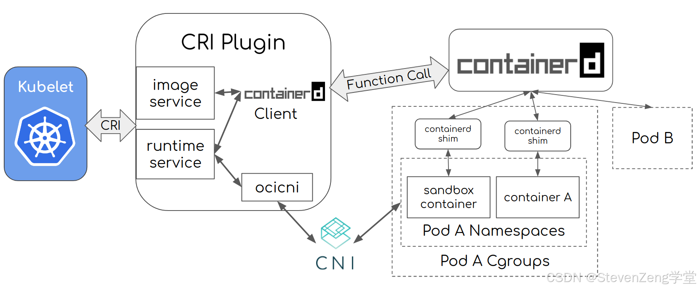

# 🐳 Docker 与 Containerd 容器运行时底座

容器运行时是 Kubernetes 的物理底座。深入理解容器的底层隔离隔离技术（Namespace/Cgroup）、开放容器标准（OCI）、以及现代容器引擎（Containerd）与 Kubelet 的协作机理，对于排查节点级生产故障至关重要。

---

## 一、 OCI 标准与容器底座隔离技术

### 1. OCI (Open Container Initiative) 开放容器计划
OCI 制定了容器领域的统一标准，解耦了开发、打包与底层运行时的强绑定关系：
* **Runtime Specification (运行时规范)**：定义了容器的文件系统包如何解压缩到硬盘，并通过底层系统调用运行起来。
* **Image Specification (镜像规范)**：定义了镜像打包的格式、层级结构、Manifest 清单及文件系统序列化规范。

### 2. 容器底座的两大支柱：Namespace 与 Cgroups
容器本质上是**宿主机上受到资源配额限制和命名空间隔离的普通进程**。

#### A. Linux Namespace (命名空间隔离)
Namespace 实现了进程视图的局部化隔离，使得容器内的进程认为自己拥有完整的操作系统环境。
* **`pid` namespace**：隔离进程 ID。容器内的 1 号进程（如 `/demo/app`）与宿主机真实的 PID 完全映射隔离。
* **`net` namespace**：网络空间隔离。容器拥有独立的虚拟网卡设备、IP 地址、路由表、`/proc/net` 目录。基于 **Veth Pair** 桥接到宿主网桥进行跨空间通信。
* **`ipc` namespace**：进程间通信隔离。防止容器进程直接向宿主机或其他容器的共享内存、消息队列读写数据。
* **`mnt` namespace**：文件系统挂载隔离。每个容器看到的文件系统根目录 `/` 独立，配合 **chroot/pivot_root** 改变根挂载点。
* **`uts` namespace**：主机名与域名隔离。容器内可以有自己独立的 Hostname，对集群 DNS 寻址非常关键。
* **`user` namespace**：用户与用户组 ID 隔离。容器内虽然是 root (UID 0)，但映射到宿主机只是一个没有特权的普通用户，确保宿主机安全。

#### B. Linux Cgroups (Control Groups 资源控制)
Cgroups 对容器进程所能消耗的物理资源总量进行上限硬限制：
* **资源上限**：可硬性配置 CPU 使用率（Shares/Quota）、内存限制（Memory Limit，超额触发内核 OOM Killer 杀掉容器）、磁盘 I/O 读写速率。
* **层级关系**：以树状目录结构存在于 `/sys/fs/cgroup/` 下，子 Cgroup 自动继承并受限于父 Cgroup 的配额上限。

---

## 二、 Containerd 引擎架构与 Kubelet 协同

### 1. 什么是 Containerd？
**Containerd** 是从 Docker 内部剥离出来并独立捐献给 CNCF 的核心容器运行时。它提供容器全生命周期管理，包括镜像拉取、元数据存储、容器执行、虚拟网络及存储卷挂载。

Kubelet 与 Containerd 之间的协作拓扑如下：



* **CRI 插件**：直接内置在 Containerd 进程中，消除了早期的 Dockershim 这一额外转发层。Kubelet 通过 `unix:///run/containerd/containerd.sock` 的 gRPC 接口直接向 Containerd 发送 CRI 指令。

### 2. 经典面试题：创建单容器 Pod 的工作时序全过程
当 Kubelet 收到调度到当前节点的 Pod 清单时，底层调用逻辑如下：
```text
Kubelet             Containerd (CRI 插件)                 CNI / Runc
  │                          │                                 │
  ├─ 1. RunPodSandbox ──────>│                                 │
  │                          ├─ 2. 调用 CNI 配置网络 ──────────>│ (创建 NetNS, 分配 IP)
  │                          ├─ 3. 拉取并启动 Pause 容器 ──────>│ (注入 Namespace)
  │                          │                                 │
  ├─ 4. PullImage ──────────>│ (本地没有则从私有仓库下载镜像)     │
  │                          │                                 │
  ├─ 5. CreateContainer ────>│                                 │
  │                          ├─ 6. 调用 Runc 创建应用容器 ──────>│ (将其放入 Pause 的命名空间)
  │                          │                                 │
  ├─ 7. StartContainer ─────>│ (容器启动，业务服务就绪)          │
```

---

## 三、 ctr vs crictl 常用命令行对照

在节点故障排查时，我们经常需要登录节点去直接操作底层的容器或镜像。注意区分 containerd 自带的 `ctr` 与 Kubernetes 专用的 `crictl`。

> [!WARNING]
> **Namespace 隔离陷阱**：
> Containerd 的资源是分命名空间（Namespace）隔离的。
> * **K8S 镜像/容器**：全部存放在 Containerd 的 **`k8s.io`** namespace 中。
> * **默认 namespace**：`ctr` 默认操作的命名空间为 `default`。所以直接执行 `ctr image list` **看不到任何 K8S 集群的镜像**。必须加上 `-n k8s.io` 选项。
> * **crictl 默认对齐**：`crictl` 专为 K8S 调试设计，默认就只操作 `k8s.io` namespace。

### 常用命令对照速查表：

| 运维场景 | Containerd 原生 `ctr` 命令 (需加 `-n k8s.io`) | K8S 调试专用 `crictl` 命令 |
| :--- | :--- | :--- |
| **查看镜像** | `ctr -n k8s.io image list` | `crictl images` |
| **拉取镜像** | `ctr -n k8s.io image pull <image_url>` | `crictl pull <image_url>` |
| **查看容器** | `ctr -n k8s.io container list` | `crictl ps` |
| **查看 Pod (沙箱)** | *(ctr 没有 Pod 概念，只能查 Pause 容器)* | `crictl pods` |
| **查看容器日志** | *(不支持直接查看，需去宿主机 /var/log/pods 读)* | `crictl logs <container_id>` |
| **进入容器终端** | `ctr -n k8s.io task exec --exec-id 1 <id> sh` | `crictl exec -it <container_id> sh` |
| **跳过不安全证书拉取**| `ctr -n k8s.io image pull -k <harbor_url>` | *(依赖 crictl.yaml 配置文件中的仓库定义)* |

---

## 四、 Containerd 生产调优实践

### 1. 私有镜像仓库凭证与代理设置
为了让 Containerd 在集群中自动通过代理或者内网加速器拉取镜像，需要配置 `/etc/containerd/config.toml` 下的 `registry.mirrors`。

```toml
[plugins."io.containerd.grpc.v1.cri".registry]
  config_path = "/etc/containerd/certs.d" # 指定证书与加速配置的外部目录
```

在对应的配置目录下创建仓库代理配置文件：
```bash
mkdir -p /etc/containerd/certs.d/docker.io
cat << EOF > /etc/containerd/certs.d/docker.io/hosts.toml
server = "https://registry-1.docker.io"

[host."https://dockerproxy.com"]
  capabilities = ["pull", "resolve"]
EOF
```

---

## 五、 Docker BuildKit / Buildx 高级镜像构建与缓存清理

在扩展节点或 CI 镜像构建机上，经常使用 **BuildKit** 与 **Docker Buildx** 进行多平台（amd64/arm64）的高速镜像构建。

### 1. 清理 Buildx 构建缓存
长期频繁构建会导致宿主机上堆积几百 GB 的缓存。可以使用以下参数进行精确清理：
```bash
# 1. 查看缓存和系统空间占用
docker system df
docker buildx du

# 2. 清理 72 小时（3天）之前未使用的所有构建缓存
docker buildx prune --filter until=72h

# 3. 强制清理所有的 builder 缓存
docker buildx prune --all --force
```

---

> [!TIP] 💡 关联技术与延伸阅读
>
> * [Kubelet CRI 容器运行时接口](../01-组件原理/04-Kubelet/CRI.md)
> * [Pause 容器与命名空间共享](../01-组件原理/04-Kubelet/03-Docker与Containerd底层实现及Pause通信深度解析.md)
