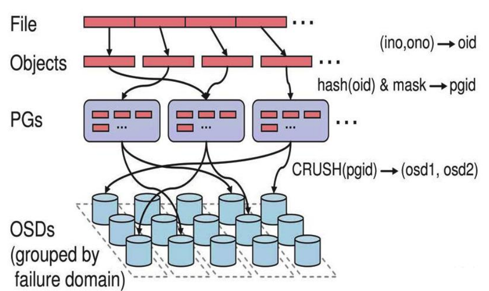

# 📦 Ceph 分布式存储架构与部署实战

在云计算和 Kubernetes 生态中，**Ceph** 是目前最为主流的高性能、去中心化分布式存储解决方案。它实现了**块存储（RBD）**、**文件存储（CephFS）** 和 **对象存储（RGW）** 的三合一“统一存储”底座。本文详述 Ceph 的核心架构机理、数据存取寻址过程，以及基于 `ceph-deploy` 的多节点物理集群部署。

---

## 一、 Ceph 核心架构与守护进程

Ceph 的底层是一个完备的分布式对象存储系统，称为 **RADOS** (Reliable Automatic Distributed Object Store)。所有上层的文件、块和对象数据，在底座中最终都以 RADOS 的二进制对象形式落盘。

```text
┌────────────────────────────────────────────────────────┐
│                        Clients                         │ (Kubernetes, OpenStack, etc.)
└──────┬────────────────────┬────────────────────┬───────┘
       │ (CephFS)           │ (RBD)              │ (RGW S3/Swift)
       ▼                    ▼                    ▼
┌──────────────┐    ┌──────────────┐    ┌──────────────┐
│   MDS 服务   │    │  librbd 库   │    │  RGW 对象网关 │
└──────┬───────┘    └──────┬───────┘    └──────┬───────┘
       │                   │                   │
       ▼                   ▼                   ▼
┌────────────────────────────────────────────────────────┐
│               librados (API 客户端连接库)               │
└──────────────────────────┬─────────────────────────────┘
                           │ TCP 物理连接
                           ▼
┌────────────────────────────────────────────────────────┐
│                      RADOS 集群                         │
│ ┌──────────────┐   ┌──────────────┐   ┌──────────────┐ │
│ │  ceph-mon    │   │   ceph-mgr   │   │   ceph-osd   │ │
│ │  (集群监视器)│   │  (运行管理器) │   │ (数据落盘进程)│ │
│ └──────────────┘   └──────────────┘   └──────────────┘ │
└────────────────────────────────────────────────────────┘
```

### 1. 核心守护进程介绍
* **Ceph OSD (Object Storage Daemon，对象存储守护程序)**：
  * **作用**：处理数据的物理存取、副本复制、数据恢复与均衡。
  * **机制**：通常宿主机上的**每一块物理磁盘都对应一个独立的 OSD 进程**。集群要求至少有 3 个 OSD 节点以实现数据的三副本高可用。
* **Ceph Monitor (ceph-mon，集群监视器)**：
  * **作用**：维护整个集群的状态映射图（Cluster Map），包括 Mon Map、OSD Map、PG Map、MDS Map 和 CRUSH Map。
  * **高可用**：负责身份验证（CephX 协议）。必须以**奇数个节点**（如 3、5、7）部署以形成 quorum 选主决策，防止脑裂。
* **Ceph Manager (ceph-mgr，管理器)**：
  * **作用**：追踪系统运行指标、存储空间利用率、系统负载等运行时监控状态，对外公开 Web 仪表盘（Dashboard）及 REST API。
* **Ceph MDS (ceph-mds，元数据服务器)**：
  * **作用**：专为 **CephFS** (文件系统存储) 提供服务，管理文件和目录的元数据。*块存储和对象存储不需要运行 MDS*。

---

## 二、 CRUSH 算法与数据存取映射原理

Ceph 的强悍性能和极致扩展性来自于其核心的 **CRUSH** (Controlled Replication Under Scalable Hashing) 算法。它是一种去中心化的寻址方法，**客户端无需向中心节点查询元数据，而是直接在本地计算出数据存放的物理 OSD 节点**。

### 1. 数据寻址映射流程图
在客户端向 Ceph 写入文件时，会经历以下四层映射计算：



1. **File ────────> Object (对象化切片)**：
   * 客户端将待写入的连续大文件，按照预定大小（默认 4MB）切分为多个固定的 **Object** (对象)。每个 Object 获得一个唯一 ID (`oid`)。
2. **Object ──────> PG (归置组分配)**：
   * 将 `oid` 通过哈希算法映射到一个虚拟的容器中，称为 **PG** (Placement Group，归置组)。
   * **公式**：`hash(oid) & mask = pgid`。
   * **作用**：解耦了数以亿计的对象与有限的 OSD 之间的直接关系，大大降低了集群状态图的更新体积。
3. **PG ──────────> OSD Set (物理落盘组)**：
   * 客户端在本地运行 CRUSH 算法，以 `pgid` 作为输入，结合当前集群的拓扑规则（CRUSH Map），计算出该 PG 所包含的 3 个物理 OSD ID（主副本 OSD，以及备副本 OSDs）。
4. **主 OSD 写入与副本分发**：
   * 客户端直接将数据包发送给**主 OSD**。主 OSD 写入本地磁盘后，同步将数据复制给**备份 OSDs**，等待备份 OSD 写入完成并返回 ACK 后，主 OSD 向客户端确认写入完成（保证强一致性）。

---

## 三、 Ceph 生产环境规划与硬件选型

* **MON 节点**：至少 3 台，建议物理机（16 Core, 16G Memory, 200G 磁盘）。
* **MGR 节点**：至少 2 台，常与 MON 节点混布。
* **OSD 节点**：至少 4 台，推荐全闪 NVMe/SSD（高 IOPS），主网卡必须绑定**万兆（10GbE）网卡**，因为 OSD 副本复制会产生巨大的内部横向网络流量。

---

## 四、 ceph-deploy 部署多节点实战 (Pacfic 版本 v16)

本实战演示采用专用的 `ceph-deploy` 节点，向 3 个存储节点部署 Pacific 版本的 Ceph 集群。

### 1. 节点角色与网络规划

| 主机名 | 管理公网 IP | 内部集群 IP (副本传输) | 角色 | 安装软件 |
| :--- | :--- | :--- | :--- | :--- |
| **ceph-deploy** | `10.168.56.100` | `192.168.56.100` | 管理端 | `ceph-deploy`, `ceph-common` |
| **ceph-mon-mgr1**| `10.168.56.101` | `192.168.56.101` | MON, MGR | `ceph-mon`, `ceph-mgr` |
| **ceph-mon-mgr2**| `10.168.56.102` | `192.168.56.102` | MON, MGR | `ceph-mon`, `ceph-mgr` |
| **ceph-mon3** | `10.168.56.103` | `192.168.56.103` | MON | `ceph-mon` |
| **ceph-data1** | `10.168.56.104` | `192.168.56.104` | OSD | `ceph-osd` (磁盘: sdb, sdc, sdd) |
| **ceph-data2** | `10.168.56.105` | `192.168.56.105` | OSD | `ceph-osd` (磁盘: sdb, sdc, sdd) |
| **ceph-data3** | `10.168.56.106` | `192.168.56.106` | OSD | `ceph-osd` (磁盘: sdb, sdc, sdd) |

### 2. 部署前置条件准备 (所有节点执行)
```bash
# 1. 创建管理用户 cephstore
groupadd -r -g 2022 cephstore
useradd -r -m -s /bin/bash -u 2022 -g 2022 cephstore
echo cephstore:TestCase123 | chpasswd

# 2. 授予免密 sudo 权限
echo "cephstore ALL=(ALL) NOPASSWD: ALL" >> /etc/sudoers

# 3. 添加清华大学 Ceph 软件源 (Ubuntu 18.04 示例)
apt install -y ca-certificates
wget -q -O- 'https://mirrors.tuna.tsinghua.edu.cn/ceph/keys/release.asc' | apt-key add -
apt-add-repository 'deb https://mirrors.tuna.tsinghua.edu.cn/ceph/debian-octopus/ bionic main'
apt update
```

在 **ceph-deploy** 管理节点上，切换为 `cephstore` 用户并配置到各节点的 SSH 免密登录：
```bash
su - cephstore
ssh-keygen -t rsa -N "" -f ~/.ssh/id_rsa
for i in {100..106}; do ssh-copy-id cephstore@10.168.56.$i; done
```

---

### 3. 集群引导与组件部署

在 **ceph-deploy** 节点的 `/home/cephstore/ceph-clusters` 目录下执行引导：

```bash
# 1. 初始化集群配置并声明网络段
ceph-deploy new --cluster-network 192.168.56.0/24 --public-network 10.168.56.0/24 ceph-mon-mgr1

# 2. 生成的 ceph.conf 默认配置检查
# [global]
# fsid = 668e9605-7ba1-4c5e-800e-97c076ffaa09
# public_network = 10.168.56.0/24
# cluster_network = 192.168.56.0/24
# mon_initial_members = ceph-mon-mgr1
# mon_host = 10.168.56.101

# 3. 登录所有 mon 节点，提前安装 ceph-mon 基础包
# apt install ceph-mon -y

# 4. 在部署节点创建初始 Monitor
ceph-deploy mon create-initial

# 5. 在部署节点推送 client.admin 密钥到其他节点
ceph-deploy admin ceph-deploy ceph-data3
# 修复管理节点上的密钥访问权限
sudo setfacl -m u:cephstore:rw /etc/ceph/ceph.client.admin.keyring
```

---

### 4. 部署 MGR 与 OSD 存储磁盘

```bash
# 1. 在 ceph-mon-mgr1 安装 ceph-mgr 并初始化
# (目标节点先执行：apt install ceph-mgr -y)
ceph-deploy mgr create ceph-mon-mgr1

# 💥 2. 解决 "mon is allowing insecure global_id reclaim" 的安全告警
# 这是由于新版本安全策略，执行以下命令关闭非安全声明：
ceph config set mon auth_allow_insecure_global_id_reclaim false
ceph -s # 状态变回 HEALTH_OK

# 3. 部署 OSD：擦除并拉起物理磁盘 (以 ceph-data1 的 sdb, sdc 盘为例)
ceph-deploy disk zap ceph-data1 /dev/sdb
ceph-deploy disk zap ceph-data1 /dev/sdc

# 4. 将磁盘加入集群创建 OSD 存储资源
ceph-deploy osd create ceph-data1 --data /dev/sdb
ceph-deploy osd create ceph-data1 --data /dev/sdc

# 5. 查看集群树状状态
ceph osd tree
```

---

## 五、 RADOS 原始存取测试 (命令行实战)

我们可以直接绕过文件系统，利用 `rados` 命令行客户端向 RADOS 存储池中直接读写对象，验证集群健康状况。

```shell
# 1. 创建名为 mypool 的存储池，分配 32 个 PG
ceph osd pool create mypool 32 32

# 2. 上传本地 syslog 日志文件并命名为对象 "msg"
sudo rados put msg /var/log/syslog --pool=mypool

# 3. 列出存储池中的对象
rados ls --pool=mypool
# 输出: msg

# 4. 定位对象 "msg" 的物理存储路径 (验证 CRUSH 映射)
ceph osd map mypool msg
# 输出: object 'msg' -> pg 3.e4c81fc1 (3.1) -> up ([0,8], p0) acting ([0,8], p0)
# 这表明该对象存放在 PG 3.1 中，对应的物理磁盘为 OSD-0 和 OSD-8。

# 5. 从 Ceph 集群下载该对象
sudo rados get msg --pool=mypool /opt/recovered-syslog.txt

# 6. 从存储池中删除对象
sudo rados rm msg --pool=mypool
```

---

> [!TIP] 💡 关联技术与延伸阅读
>
> * [Ceph 存储应用与高可用运维指南](./04-Ceph存储应用与高可用运维.md)
> * [Ceph 在 K8s 中的 CSI 挂载与 IOPS 调优](../05-集群存储/02-Ceph_RBD与CephFS在K8s的高性能挂载与IOPS调优.md)
