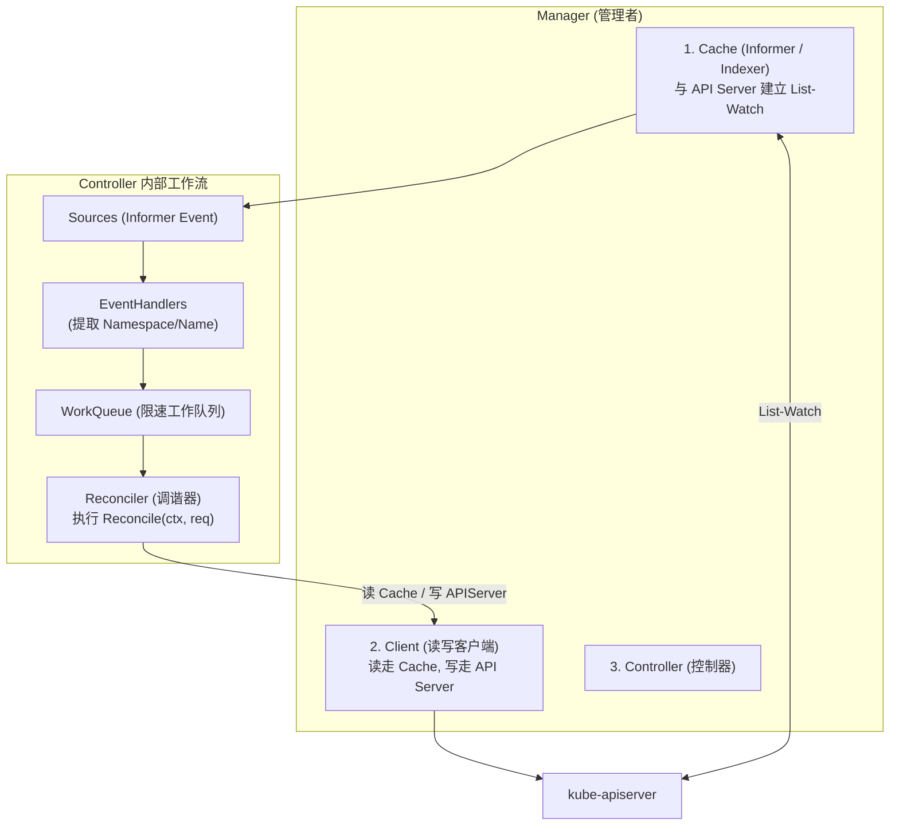
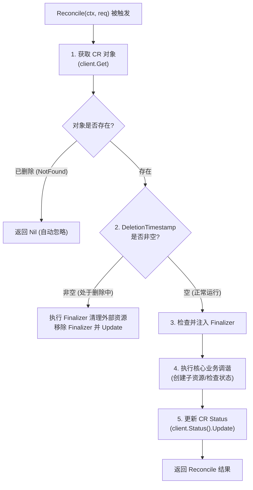
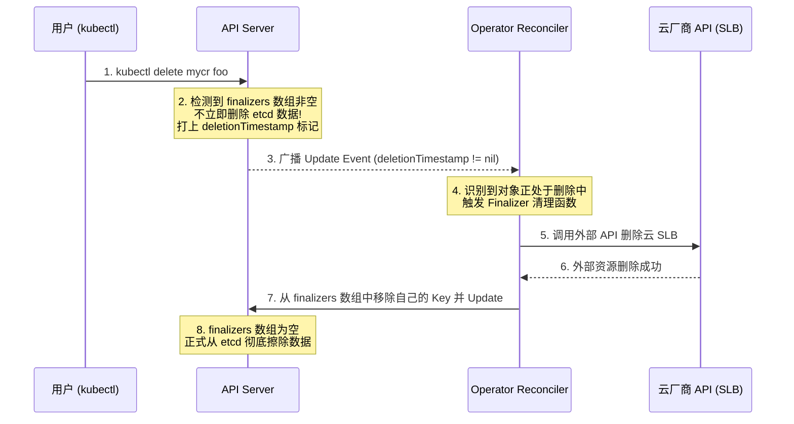

# ⚙️ Operator 开发与 Controller-Runtime 深度原理

> 本文档面向高级 Kubernetes 工程师与云原生架构师，深入解析 Custom Resource Definition (CRD)、Operator 架构设计哲学、Controller-Runtime 内部组件机制，以及生产级 Reconcile 调谐幂等性与 Finalizer 优雅清理逻辑。

---

## 目录
- [一、 为什么需要 Operator 与声明式扩展](#一-为什么需要-operator-与声明式扩展)
- [二、 Operator 核心组件架构 (Controller-Runtime)](#二-operator-核心组件架构-controller-runtime)
- [三、 Reconcile (调谐) 核心逻辑与生命周期](#三-reconcile-调谐-核心逻辑与生命周期)
- [四、 生产级 Reconcile 幂等性与并发安全设计](#四-生产级-reconcile-幂等性与并发安全设计)
- [五、 Finalizer (终结器) 优雅清理机制与死锁防护](#五-finalizer-终结器-优雅清理机制与死锁防护)

---

## 一、 为什么需要 Operator 与声明式扩展

Kubernetes 原生支持 Deployment、StatefulSet 等通用负载，但无法理解数据库（如 MySQL 主从同步、Redis 哨兵切主、Elasticsearch 分片重平衡）等复杂有状态应用的**运维知识**。

**Operator = Custom Resource Definition (CRD) + Custom Controller**

```text
Domain Knowledge (运维专家知识) + Kubernetes API (声明式原语) = Operator
```

通过将运维专家的经验（扩缩容、备份、故障转移、版本升级）编写为 Go 代码逻辑，实现复杂应用在 K8s 上的**自动化自愈与运维**。

---

## 二、 Operator 核心组件架构 (Controller-Runtime)

社区主流开发框架（如 Kubebuilder / Operator-SDK）底层都基于 `sig-siter/controller-runtime` 库。



### 核心组件职责：

1. **Manager**：整个 Operator 的入口与容器，管理 Informer Cache、Client、Scheme 注册表，并控制所有 Controller 的启动与优雅退出。
2. **Cache**：底层封装 SharedInformer。所有的**读操作（`client.Get`, `client.List`）都默认走内存 Cache**，极大减轻 etcd 负担。
3. **Client**：读写分离客户端。
   - **读**：查内存 Cache。
   - **写**：直接发往 API Server（`client.Create`, `client.Update`, `client.Patch`, `client.Delete`）。
4. **WorkQueue**：带速率限制（RateLimiting）的队列。自动支持指数退避重试（Exponential Backoff），防止死循环冲垮集群。
5. **Reconciler**：开发者编写的核心业务逻辑，实现 `Reconcile(ctx, req) (Result, error)` 接口。

---

## 三、 Reconcile (调谐) 核心逻辑与生命周期

Reconcile 的核心思想是：**驱动实际状态 (Actual State) 向期望状态 (Desired State) 靠拢**。



### Reconciler 接口与返回值

```go
type Reconciler interface {
    Reconcile(context.Context, Request) (Result, error)
}
```

返回值有 3 种常见形式：
- `return ctrl.Result{}, nil`：调谐成功，无须重试，等待下一次事件触发。
- `return ctrl.Result{Requeue: true}, nil` 或 `return ctrl.Result{RequeueAfter: 30 * time.Second}, nil`：显式要求在指定时间后**重新入队**再次调谐（常用于轮询外部异步状态）。
- `return ctrl.Result{}, err`：调谐遇到错误，对象将被推回 WorkQueue，触发**指数退避重试**。

---

## 四、 生产级 Reconcile 幂等性与并发安全设计

在分布式系统中，Reconcile 可能会被频繁触发（事件重复投递、缓存更新延时）。必须确保 Reconcile 逻辑具备**绝对的幂等性**。

### 1. 乐观锁冲突与 ResourceVersion 错误处理
API Server 采用乐观并发控制（OCC）。当多个协程试图更新同一个 CR 资源时，可能抛出 `409 Conflict` 错误：
`Operation cannot be fulfilled on mycr.foo.example.com "my-resource": the object has been modified; please apply your changes to the latest version and try again`。

**生产级应对原则**：
- **不要在 Reconcile 中直接吞掉 409 错误**。直接将错误返回：`return ctrl.Result{}, err`，让 WorkQueue 的 Backoff 机制自动重新入队最新的 `ResourceVersion` 再次执行。
- **读写分离**：更新 Status 时使用 `r.Status().Update(ctx, instance)`，避免修改 Spec 字段引发不必要的全局版本碰撞。

### 2. 避免无休止的自我死循环 (Event Filter / Predicate)
若 Controller 在调谐中更新了 CR 的 Status，更新行为又触发了 Update Event，导致该 CR 再次进队执行 Reconcile，就会引发**死循环（Infinite Reconcile Loop）**。

**解决方案：使用 Predicate 过滤事件**

```go
// 限制 Controller 只对 Spec 修改或 Generation 变化响应，忽略单纯的 Status 变动
func (r *MyReconciler) SetupWithManager(mgr ctrl.Manager) error {
    return ctrl.NewControllerManagedBy(mgr).
        For(&v1alpha1.MyCustomResource{}).
        WithEventFilter(predicate.GenerationChangedPredicate{}). // 核心过滤!
        Complete(r)
}
```

---

## 五、 Finalizer (终结器) 优雅清理机制与死锁防护

当用户执行 `kubectl delete mycr foo` 时，如果该自定义资源创建了集群外部的资源（如云厂商 SLB、RDS 数据库、S3 存储桶），常规的删除操作会导致外部资源泄露。

**Finalizer 机制**：在资源被彻底从 etcd 擦除前，拦截删除动作，先清理外部资源。



### 生产级 Finalizer 实现代码标准：

```go
const myFinalizerName = "foo.example.com/finalizer"

func (r *MyReconciler) Reconcile(ctx context.Context, req ctrl.Request) (ctrl.Result, error) {
    var instance v1alpha1.MyResource
    if err := r.Get(ctx, req.NamespacedName, &instance); err != nil {
        return ctrl.Result{}, client.IgnoreNotFound(err)
    }

    // 1. 检查对象是否处于删除阶段
    if instance.ObjectMeta.DeletionTimestamp.IsZero() {
        // 对象未被删除，确保注入 Finalizer
        if !controllerutil.ContainsFinalizer(&instance, myFinalizerName) {
            controllerutil.AddFinalizer(&instance, myFinalizerName)
            if err := r.Update(ctx, &instance); err != nil {
                return ctrl.Result{}, err
            }
        }
    } else {
        // 对象正在被删除中
        if controllerutil.ContainsFinalizer(&instance, myFinalizerName) {
            // 执行外部清理逻辑 (如删除云 SLB)
            if err := r.deleteExternalResources(&instance); err != nil {
                // 如果清理失败，返回 err，Finalizer 留在原位，下一次重新重试，防止资源泄露!
                return ctrl.Result{}, err
            }

            // 清理成功，移除 Finalizer
            controllerutil.RemoveFinalizer(&instance, myFinalizerName)
            if err := r.Update(ctx, &instance); err != nil {
                return ctrl.Result{}, err
            }
        }
        // 结束逻辑
        return ctrl.Result{}, nil
    }

    // 2. 正常的业务 Reconcile 逻辑...
    return ctrl.Result{}, nil
}
```

> [!WARNING]
> **Finalizer 死锁防护**：若外部 API 永久故障导致 `deleteExternalResources` 持续报错，Pod/CR 会永远卡在 `Terminating` 状态。紧急救援命令：
```bash
# 解锁 SOP: 强制移除该 CR 对象的 finalizers 字段
kubectl patch myapp/my-app-instance -n default --type json -p='[{"op": "remove", "path": "/metadata/finalizers"}]'
```

---

## 六、 深度扩展：Predicates 事件过滤器与 Indexer 二级索引优化 (参考源: K8s 官方 Docs & Kubebuilder Book)

### 1. `builder.WithEventFilter(predicate)` 流量降噪
默认情况下，任何子资源（如 Deployment / Pod）的任意微小修改（包括 `resourceVersion` 或 `status` 变更）都会触发 Reconcile。

* **使用 `predicate.GenerationChangedPredicate` 过滤嘈杂事件**：
  只有当用户真实修改了 YAML 的 `spec` 导致 `metadata.generation` 递增时，才真正推送 Key 到 WorkQueue，屏蔽由于 Status 定时上报引发的频繁冗余调谐！

---

### 2. `FieldIndexer` 高效反向索引
默认 Cache 仅建立以 `Namespace/Name` 为 Key 的索引。当需要根据 `spec.nodeName` 查询节点上的全部 Pod 时，直接 List 会导致全量内存扫描（$O(N)$ 复杂度）。

* **使用 `mgr.GetFieldIndexer().IndexFields()` 创建 $O(1)$ 反向索引**：
  ```go
  // 注册以 spec.nodeName 为 Key 的反向索引
  mgr.GetFieldIndexer().IndexField(ctx, &corev1.Pod{}, "spec.nodeName", func(rawObj client.Object) []string {
      pod := rawObj.(*corev1.Pod)
      return []string{pod.Spec.NodeName}
  })
  ```
  通过建立二级索引，在大规模集群检索性能提升 **100 倍以上**！

---

> [!TIP] 💡 关联技术与延伸阅读
>
> * [CRD 与 Kubebuilder 实战开发流程](../08-应用与实战/03-CRD与Kubebuilder开发流程.md)
> * [原生 Controller Manager 控制循环与 Informer 机制](../01-组件原理/02-Controller_Manager.md)
