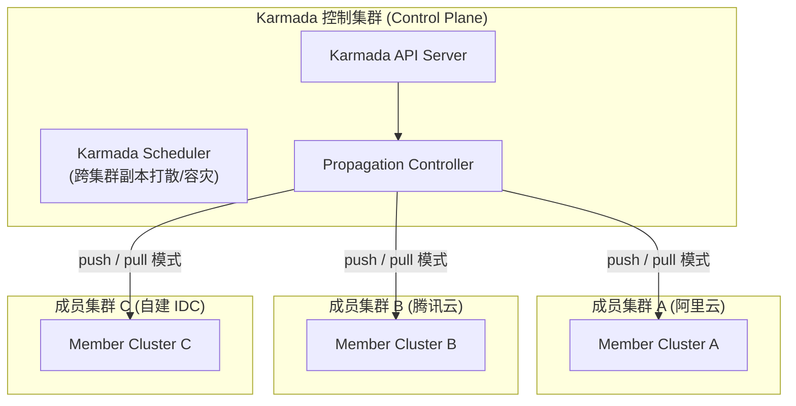
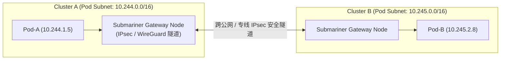

# 🌐 Karmada 与 Submariner 多集群编排与跨集群网络实战

> 本文档面向云原生架构师与高级 Kubernetes 工程师，深入剖析多集群管理与混合云多云编排架构，包含 CNCF Karmada 跨集群应用分发与 Override 策略、Submariner 跨集群 Pod/Service 网络扁平化互通实战。

---

## 目录
- [一、 多集群 (Multi-Cluster) 架构演进与需求场景](#一-多集群-multi-cluster-架构演进与需求场景)
- [二、 Karmada 多集群云原生编排控制面架构](#二-karmada-多集群云原生编排控制面架构)
- [三、 Karmada 传播策略 (PropagationPolicy) 与差异化覆盖 (OverridePolicy)](#三-karmada-传播策略-propagationpolicy-与差异化覆盖-overridepolicy)
- [四、 Submariner 跨集群网络扁平化连通架构](#四-submariner-跨集群网络扁平化连通架构)
- [五、 跨集群 Service 服务发现与全球负载均衡](#五-跨集群-service-服务发现与全球负载均衡)

---

## 一、 多集群 (Multi-Cluster) 架构演进与需求场景

随着企业规模扩大，单集群遭遇 5,000 节点瓶颈，或出于**混合云容灾、多地域就近接入、租户硬隔离**的考量，多集群成为必然选择。



---

## 二、 Karmada 多集群云原生编排控制面架构

Karmada 保留了完全兼容 Kubernetes 原生 API 的设计，用户无需修改原有的 Deployment/Service YAML。

### 核心解耦架构：
1. **Resource Template (资源模板)**：原生的 K8s YAML（如 Deployment）。
2. **PropagationPolicy (传播策略)**：定义资源分发到哪些集群（如 30% 到阿里云，70% 到自建 IDC）。
3. **OverridePolicy (覆盖策略)**：定义各集群的差异化配置（如阿里云镜像走私有镜像仓库，自建 IDC 修改域名配置）。

---

## 三、 PropagationPolicy 与 OverridePolicy 实践

### 1. 跨集群传播策略示例：

```yaml
apiVersion: policy.karmada.io/v1alpha1
kind: PropagationPolicy
metadata:
  name: nginx-propagation
spec:
  resourceSelectors:
    - apiVersion: apps/v1
      kind: Deployment
      name: nginx-deployment
  placement:
    clusterAffinity:
      clusterNames:
        - member-aliyun
        - member-tencent
    replicaScheduling:
      replicaDivisionPreference: Weighted
      replicaWeightPreference:
        staticWeightList:
          - targetCluster:
              clusterNames:
                - member-aliyun
            weight: 3                  # 30% 流量副本分配给阿里云
          - targetCluster:
              clusterNames:
                - member-tencent
            weight: 7                  # 70% 流量副本分配给腾讯云
```

---

## 四、 Submariner 跨集群网络扁平化连通架构

在多集群架构中，不同集群的 Pod IP 和 Service IP 默认无法直连。**Submariner** 实现了跨集群 Pod 之间的**三层网络直接互通**。



### 核心组件：
- **Submariner Gateway Engine**：负责建立跨集群的 IPsec 或 WireGuard 加密隧道。
- **Globalnet Controller**：解决多集群之间 **Pod IP 网段重叠 (CIDR Overlap)** 的问题（通过 NAT 映射分配全局 GlobalIP）。
- **Lighthouse**：基于 Multi-Cluster Service (MCS) API 标准的跨集群 DNS 服务发现。

---

## 五、 跨集群 Service 服务发现与全球负载均衡

使用 Submariner Lighthouse，Pod-A 在 Cluster-A 中可直接解析并访问 Cluster-B 中的跨集群服务：

$$\text{域名格式: } \text{<service-name>.<namespace>.svc.clusterset.local}$$

```bash
# 在 Cluster-A 的 Pod 内直接访问 Cluster-B 的服务
curl my-service.default.svc.clusterset.local
```

---

> [!TIP] 💡 关联技术与延伸阅读
>
> * [单集群网络模型原理](../04-集群网络/02-Kubernetes集群网络.md)
> * [跨集群资源迁移方案](../06-集群运维/04-K8S跨集群命名空间资源迁移脚本.md)
