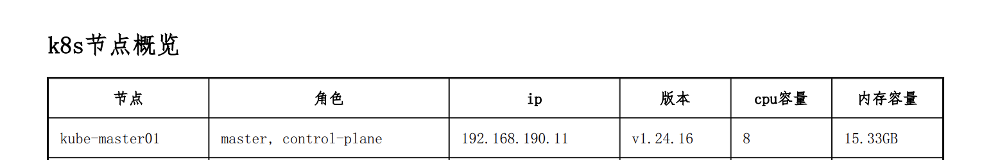
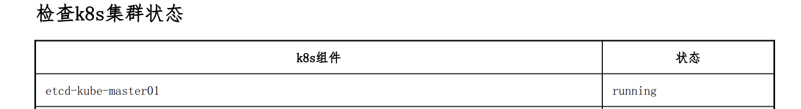
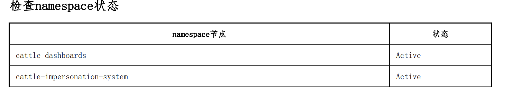
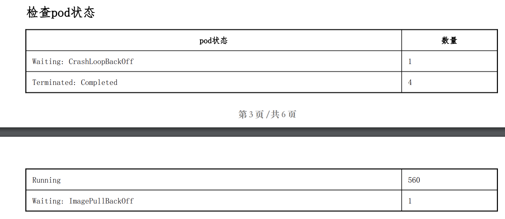
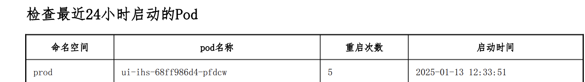
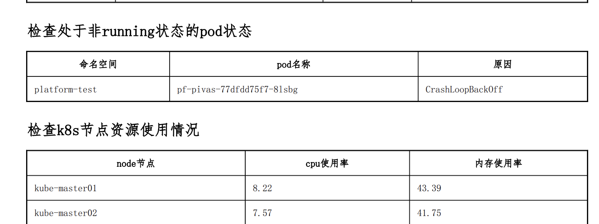
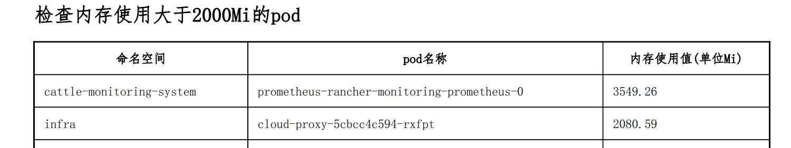
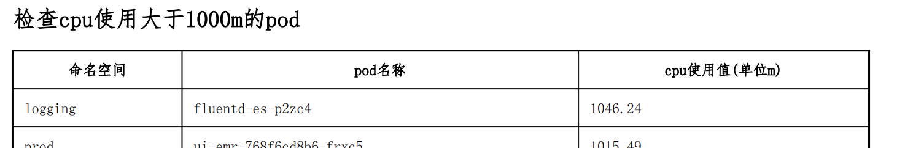

# 🩺 集群健康巡检与脚本自动化指南

Kubernetes 集群的日常健康巡检是保障业务系统高可用运行的核心工作。定期巡检有助于提前发现节点资源瓶颈、etcd 延迟剧增、Pod 频繁重启、或者 TLS 证书即将过期等隐患。本文提供一套系统化的巡检指标维度，并附带一套开箱即用的自动化 Bash 巡检脚本。

---

## 一、 集群巡检核心技术指标维度

巡检工作主要围绕以下五个层级展开，每个层级都有特定的检查指令：

```text
┌────────────────────────────────────────────────────────────────────────┐
│                        K8S Cluster Inspection                          │
└──────┬───────────────────┬───────────────────┬───────────────────┬─────┘
       │                   │                   │                   │
       ▼                   ▼                   ▼                   ▼
┌──────────────┐    ┌──────────────┐    ┌──────────────┐    ┌──────────────┐
│  控制面组件   │    │  物理计算节点 │    │  业务工作负载 │    │ 证书与安全性  │
│ (Component)  │    │  (Node/OS)   │    │ (Pod/Restart)│    │ (TLS Certs)  │
└──────────────┘    └──────────────┘    └──────────────┘    └──────────────┘
```

### 1. 控制面组件与 etcd 状态
* **API Server 延迟**：使用 `kubectl get --raw /readyz` 或 `/healthz` 快速确定 API 服务响应。
* **etcd 数据库监控**：通过 etcdctl 检查数据库大小、碎片率及 Leader 选举次数。
* **核心组件状态**：在高版本 K8S 中，通过查询 `kube-system` 命名空间下的静态 Pod（kube-apiserver, kube-controller-manager, kube-scheduler）获取状态。

### 2. 节点及宿主机资源（OS 层）
* **计算资源水位**：监控各节点的 CPU、Memory 利用率，防止突发流量导致节点打上 `MemoryPressure` 污点。
* **存储容量水位**：检查 `/var/lib/kubelet` 所在磁盘分区的 `DiskPressure`。如果使用率超过 85%，Kubelet 将开始强制驱逐（Evict）Pod。
* **系统连接与文件描述符**：查看内核 `sysctl` 参数中的 `file-max` 以及连接数，避免高并发下文件句柄耗尽。
* **时间同步状态**：检查 NTP/Chrony 服务状态，确保节点间时间偏差小于 500ms。

### 3. 工作负载与服务健康度
* **非正常状态 Pod 统计**：过滤 `Status` 不是 `Running` 或 `Completed` 的 Pod（如 `Evicted`, `CrashLoopBackOff`, `ImagePullBackOff`）。
* **高频重启 Pod 追溯**：查询过去 24 小时内重启次数大于 5 次的 Pod，这通常代表容器内程序发生了 `OOMKilled` 或死锁崩溃。
* **CoreDNS 状态**：监控 CoreDNS 的请求时延与丢包，检查是否打上了 `ndots` 过大引起的性能瓶颈。

### 4. 证书到期检测
* **集群内部证书**：Kubeadm 生成的证书默认有效期只有 1 年。需要定期执行 `kubeadm certs check-expiration`，防止证书过期导致 API Server 无法启动。

---

## 二、 自动化巡检 Bash 脚本 (开箱即用)

将以下脚本保存为 `k8s_check.sh`。执行该脚本将自动拉取集群的核心状态，并输出格式清晰、带颜色标识的 ASCII 巡检报告。

```bash
#!/bin/bash
# k8s_check.sh - Kubernetes 自动化巡检脚本

RED='\033[0;31m'
GREEN='\033[0;32m'
YELLOW='\033[1;33m'
BLUE='\033[0;34m'
NC='\033[0m' # 无颜色

echo -e "${BLUE}====================================================${NC}"
echo -e "${BLUE}        ☸️  Kubernetes 集群自动化巡检报告 ☸️         ${NC}"
echo -e "${BLUE}====================================================${NC}"
echo -e "执行时间: $(date '+%Y-%m-%d %H:%M:%S')"
echo ""

# 1. 检查 API Server 连通性
echo -e "${YELLOW}[1/6] 检查 API Server 连通性...${NC}"
HEALTH_STATUS=$(kubectl get --raw /healthz 2>/dev/null)
if [ "$HEALTH_STATUS" == "ok" ]; then
    echo -e "  API Server 状态: ${GREEN}健康 (ok)${NC}"
else
    echo -e "  API Server 状态: ${RED}异常 (不可达)${NC}"
fi
echo ""

# 2. 检查集群节点状态
echo -e "${YELLOW}[2/6] 检查集群节点状态 (Nodes)...${NC}"
NOT_READY_NODES=$(kubectl get nodes --no-headers | grep -v "Ready" | wc -l)
if [ "$NOT_READY_NODES" -eq 0 ]; then
    echo -e "  所有节点状态: ${GREEN}健康 (Ready)${NC}"
else
    echo -e "  存在非 Ready 节点: ${RED}$NOT_READY_NODES 台${NC}"
    kubectl get nodes | grep -v "Ready"
fi
echo ""

# 3. 检查集群资源水位 (kubectl top)
echo -e "${YELLOW}[3/6] 检查计算节点资源负载...${NC}"
kubectl top nodes
echo ""

# 4. 检查非正常 Pod 状态
echo -e "${YELLOW}[4/6] 检索非正常运行的 Pod (Excluding Running/Completed)...${NC}"
ABNORMAL_PODS=$(kubectl get pods -A --no-headers | grep -v -E "Running|Completed" | wc -l)
if [ "$ABNORMAL_PODS" -eq 0 ]; then
    echo -e "  异常 Pod 数量: ${GREEN}0${NC}"
else
    echo -e "  警告: 存在 ${RED}$ABNORMAL_PODS${NC} 个异常状态的 Pod:"
    kubectl get pods -A | grep -v -E "Running|Completed"
fi
echo ""

# 5. 检查频繁重启的 Pod
echo -e "${YELLOW}[5/6] 检索重启次数过高 (>=5次) 的 Pod...${NC}"
kubectl get pods -A -o jsonpath='{range .items[*]}{.metadata.namespace}{"\t"}{.metadata.name}{"\t"}{.status.containerStatuses[0].restartCount}{"\n"}{end}' | \
awk '$3 >= 5 {print "  Namespace: "$1", Pod: "$2", 重启次数: \033[0;31m"$3"\033[0m"}'
echo ""

# 6. 检查证书过期情况
echo -e "${YELLOW}[6/6] 检查 Kubeadm API 证书有效期...${NC}"
if command -v kubeadm &> /dev/null; then
    kubeadm certs check-expiration | grep -E "admin.conf|apiserver.crt|controller-manager.conf|scheduler.conf"
else
    echo -e "  ${YELLOW}提示: 当前节点未安装 kubeadm，跳过证书过期检测。${NC}"
fi

echo -e "${BLUE}====================================================${NC}"
echo -e "${BLUE}                巡检完毕，谢谢使用！                  ${NC}"
echo -e "${BLUE}====================================================${NC}"
```

---

## 三、 巡检实战指标图例参考

以下为常用的图形化巡检仪表盘监控要点图示（请结合 Prometheus / Grafana 数据看板对齐）：

















---

> [!TIP] 💡 关联技术与延伸阅读
>
> * [生产级高难故障排查与实战方案](../06-集群运维/06-生产级高难故障排查与实战方案.md)
> * [Kubectl 效率调优与 K9s 实战](./04-Kubectl效率调优与K9s实战.md)
