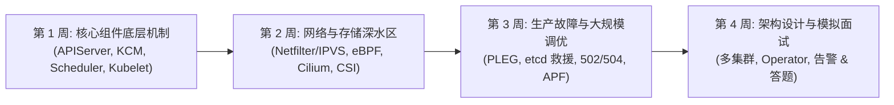
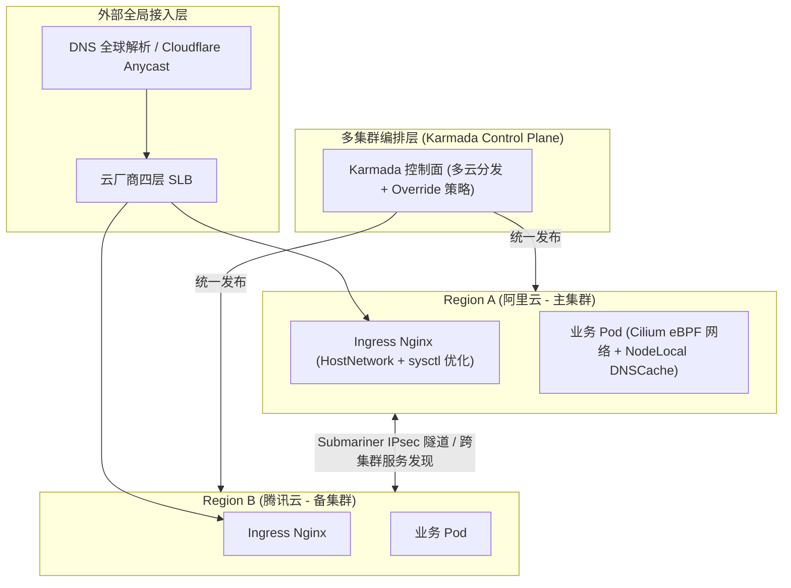

# 🎯 高级 Kubernetes 工程师 / 云原生架构师面试全景复习计划与冲刺指南

> 本指南针对高级 Kubernetes 工程师、云原生架构师、SRE 专家岗位，制定了 4 周全景备考冲刺路径、核心技术深度追问答题模板、高频架构设计题解析以及现场排障实战指南。

---

## 目录
- [一、 4 周备考冲刺时间线与复习路径](#一-4-周备考冲刺时间线与复习路径)
- [二、 核心技术模块深度追问与高分答题模板](#二-核心技术模块深度追问与高分答题模板)
  - [2.1 控制面组件与 etcd 深度](#21-控制面组件与-etcd-深度)
  - [2.2 K8s 网络与 eBPF 深度](#22-k8s-网络与-ebpf-深度)
  - [2.3 存储与 CSI 深度](#23-存储与-csi-深度)
  - [2.4 大规模集群调优与高可用](#24-大规模集群调优与高可用)
- [三、 高频架构设计题解析](#三-高频架构设计题解析)
- [四、 现场模拟排障 (Live Troubleshooting) 应对策略](#四-现场模拟排障-live-troubleshooting-应对策略)

---

## 一、 4 周备考冲刺时间线与复习路径



### 复习计划表：

| 阶段 | 聚焦主题 | 知识库核心对标文档 | 备考重点目标 |
| :--- | :--- | :--- | :--- |
| **第 1 周** | 控制面底层机制与生命周期 | [01-组件原理/07-请求在各组件间的流转详细流程.md](../01-组件原理/07-请求在各组件间的流转详细流程.md)<br/>[01-组件原理/08-etcd底层架构MVCC与高可用运维.md](../01-组件原理/08-etcd底层架构MVCC与高可用运维.md) | 熟练画出请求在 8 大关卡的流转；口述 Raft 共识、MVCC 与 treeIndex/boltdb 映射。 |
| **第 2 周** | 网络与存储深水区 | [04-集群网络/04-eBPF与Cilium下一代网络架构原理.md](../04-集群网络/04-eBPF与Cilium下一代网络架构原理.md)<br/>[05-集群存储/01-CSI架构与存储挂载全链路机制.md](../05-集群存储/01-CSI架构与存储挂载全链路机制.md) | 对比 iptables vs IPVS vs eBPF；清晰口述 Attach/Mount (Stage & Publish) 区别。 |
| **第 3 周** | 生产高难故障与调优 | [06-集群运维/06-生产级高难故障排查与实战方案.md](../06-集群运维/06-生产级高难故障排查与实战方案.md)<br/>[06-集群运维/07-万级节点与十万级Pod大规模集群调优指南.md](../06-集群运维/07-万级节点与十万级Pod大规模集群调优指南.md) | 掌握 PLEG 超时、etcd 只读锁死、502/504 优化、MTU 黑洞与 preStop 优雅下线。 |
| **第 4 周** | 扩展与多集群架构 | [07-集群扩展/07-Operator开发与Controller-Runtime原理.md](../07-集群扩展/07-Operator开发与Controller-Runtime原理.md)<br/>[07-集群扩展/08-Karmada与Submariner多集群编排与跨集群网络实战.md](../07-集群扩展/08-Karmada与Submariner多集群编排与跨集群网络实战.md) | 口述 Controller-Runtime 调谐逻辑与 Finalizer；回答多集群与零信任架构设计。 |

---

## 二、 核心技术模块深度追问与高分答题模板

### 2.1 控制面组件与 etcd 深度

#### 面试官追问：若 API Server 的 etcd 数据库触发了 `database space exceeded`，整个集群处于只读锁死，你会怎么紧急救援？

> **💡 高分标准回答范式（现象 -> 根因 -> SOP 操作 -> 预防）**：
> 1. **现象与根因**：etcd 存在 MVCC 机制，旧版本数据未被及时压缩导致数据库体积超过配额（默认 2GB）。etcd 会自动抛出 `NOSPACE` 告警并将节点设为全局只读。
> 2. **SOP 救援四步法**：
>    - **第一步 (Compact)**：使用 `etcdctl compact <revision>` 强制压缩逻辑历史版本。
>    - **第二步 (Defrag)**：运行 `etcdctl defrag` 回收物理磁盘空间与碎片。
>    - **第三步 (Disarm)**：运行 `etcdctl alarm disarm` **解除 NOSPACE 只读锁定**（关键步骤！）。
>    - **第四步 (验证)**：测试 `kubectl create` 恢复写能力。
> 3. **长效预防**：修改 etcd 静态 Pod 参数设置 `--quota-backend-bytes=8589934592` (8GB)，并配置 `--auto-compaction-retention=5m`。

---

### 2.2 K8s 网络与 eBPF 深度

#### 面试官追问：为什么在万级 Service 规模下 Cilium 的性能远高于 kube-proxy (iptables)？

> **💡 高分标准回答范式（算法复杂度 -> 内核路径 -> Bypass）**：
> 1. **算法复杂度差异**：iptables 规则链是线性链表，匹配时间复杂度为 $O(N)$。万级 Service 对应几万条规则，每个报文都要挨个遍历。而 Cilium 将路由条目保存在 **eBPF Maps（哈希表）** 中，匹配时间复杂度为恒定的 **$O(1)$**。
> 2. **Netfilter 协议栈避让**：iptables 必须走完整个 Netfilter 挂接点与 Conntrack 连接跟踪表；Cilium 在 **TC (Traffic Control)** 挂接点直接用 eBPF 修改 SKB 并转发，**绕过了整个 Netfilter 链**。
> 3. **SockOps 旁路直连**：针对同宿主机 Pod 通信，Cilium 通过 `sock_hash` 捕获 `sendmsg`，直接进行 Socket 指针映射，**完全绕过了 TCP/IP 传输层与 Veth 设备**，延迟下降 50% 以上。

---

### 2.3 存储与 CSI 深度

#### 面试官追问：Pod 挂载 PVC 时发生的 Attach 和 Mount 有什么本质区别？

> **💡 高分标准回答范式（控制面 vs 节点面 -> 两阶段细节）**：
> 1. **运行位置与执行者不同**：
>    - **Attach 阶段**：运行在 Master 控制面，由 `AttachDetachController` 配合 `external-attacher` 执行。调用云厂商 API 将块存储挂载为宿主机上的物理裸设备（如 `/dev/vdb`）。
>    - **Mount 阶段**：运行在 Node 工作节点，由 `Kubelet VolumeManager` 配合 `CSI Node Plugin` 执行。
> 2. **Mount 的内部两子阶段**：
>    - **Stage 阶段 (`NodeStageVolume`)**：在宿主机上将裸设备格式化（如 `ext4`），并挂载到 Kubelet 全局目录（避免多 Pod 重复格式化）。
>    - **Publish 阶段 (`NodePublishVolume`)**：使用 Linux `mount --bind` 命令，将全局目录绑定到该 Pod 专属的私有目录，最终由 CRI 映射进容器 Namespace。

---

## 三、 高频架构设计题解析

### 题目：请设计一个支撑 10 万 QPS 的企业级跨云/多机房高可用 Kubernetes 架构方案



#### 架构核心设计要素：
1. **控制面多云分发**：使用 **Karmada** 保持 API 原生兼容，通过 `PropagationPolicy` 实现权重流量分发（如 70% 阿里云，30% 腾讯云），配置 `OverridePolicy` 解决镜像仓库与配置差异。
2. **跨集群网络与服务发现**：部署 **Submariner** 建立跨集群 IPsec 加密隧道，结合 Lighthouse 插件实现跨集群 `*.clusterset.local` 域名解析。
3. **数据面与性能极效**：
   - 全面采用 **Cilium eBPF** 替代 kube-proxy，开启 `SockOps` 与 `XDP` 抵御 DDoS。
   - 部署 **NodeLocal DNSCache**，将 DNS 解析延迟降至 < 1ms。
   - 部署 **Thanos** 实现多集群 Prometheus 监控指标的统一全局查询与对象存储长期备份。

---

## 四、 现场模拟排障 (Live Troubleshooting) 应对策略

在面试的 Live Troubleshooting 环节，请遵循 **“思路方法论 -> 现象定位 -> 逻辑推导 -> 彻底解决”** 的原则：

```text
[第一步: 缩小范围]
确认问题是发生在 控制面 (APIServer/Scheduler/etcd) 还是 数据面 (Kubelet/CNI/CSI/Pod应用)?

[第二步: 快速状态检查]
1. kubectl get nodes -o wide (看节点 Ready 状态及资源开销)
2. kubectl get pods -A | grep -v Running (快速定位异常 Pod)
3. kubectl describe pod <pod-name> (查看 Events 事件链)

[第三步: 深入日志与指标]
1. kubectl logs --previous (查看容器上一次崩溃崩溃前的日志)
2. journalctl -u kubelet / journalctl -u containerd (查宿主机底层日志)
3. netstat / ipvsadm / tcpdump (网络问题三板斧)

[第四步: 底层命令根因排查]
1. crictl ps -a / crictl inspect (检查 CRI 状态)
2. etcdctl endpoint status (检查 etcd 状态)
3. dmesg -T | grep -i oom (检查操作系统级 OOM-Killer)
```

---

> [!TIP] 💡 关联技术与延伸阅读
>
> * [组件通信与架构核心原理](../01-组件原理/00-组件通信与原理概述.md)
> * [集群网络核心模型](../04-集群网络/02-Kubernetes集群网络.md)
> * [CSI 存储核心机制](../05-集群存储/01-CSI架构与存储挂载全链路机制.md)
> * [生产级高难故障排查实战](../06-集群运维/06-生产级高难故障排查与实战方案.md)
