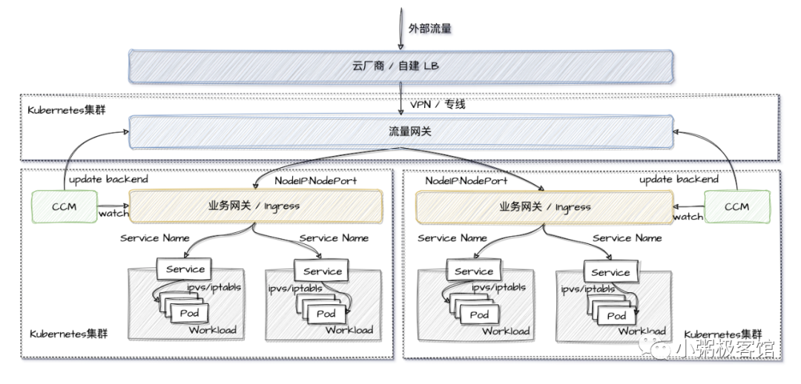
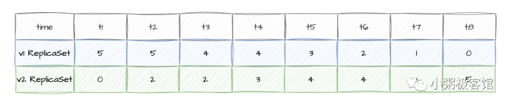
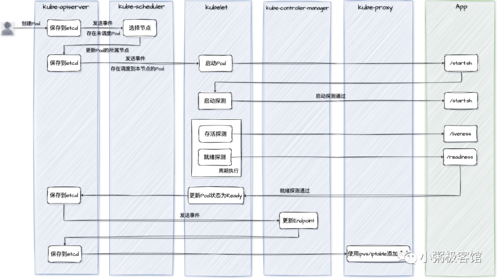
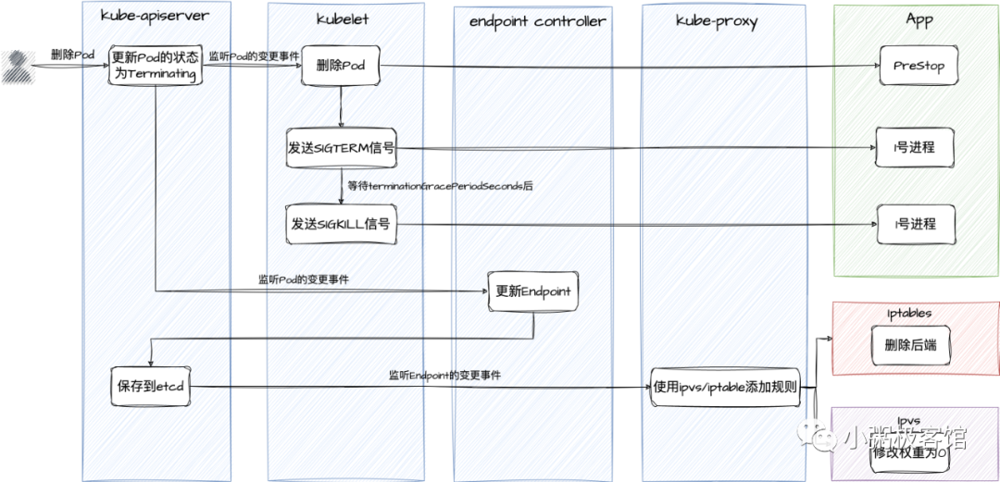

# 🚀 云原生应用无损上下线实践

在频繁的生产迭代中，开发团队经常会遇到以下痛点：**为什么在应用滚动发布或重启期间，系统会出现短暂的 502/504 等 5xx 错误，导致流量有损？**

深度排查发现，无损发布的瓶颈主要集中在两个场景：
1. **上线时**：容器尚未初始化完毕（如 JVM 资源未加载、数据连接池未建立），系统路由便已将外部流量导入，导致请求被直接拒绝。
2. **下线时**：Pod 被销毁时没有执行优雅关闭，或平台侧路由清理延迟，导致流量仍被分发到已终止的副本上。

本文详述在 Kubernetes 中实现应用“零有损”上线与下线的最优解及工业级配置模板。

---

## 一、 集群南北向流量转发过程剖析

要解决发布过程中的流量损耗，必须先理清企业内部的南北向流量转发路径：



1. **外部负载均衡 (Cloud LB)**：对外暴露的单一入口 IP，由云厂商 SLB/ELB 或自建 Nginx L4 组成。
2. **流量网关 (Global Gateway)**：专注于全局安全方案、限流过滤、黑白名单控制（如 WAF、APISIX 等）。
3. **业务网关 / Ingress (L7 转发层)**：充当 K8S 集群的入口。根据 HTTP 协议的 Host、Path 将流量分发到集群内部指定的 Service。
4. **Service (K8S L4 虚拟负载)**：基于 `kube-proxy` 配置各节点的 `ipvs/iptables` 规则，将流量均匀分发到后端的各个 Pod 容器。

在应用发布时，如果其中任意一环的路由更新与 Pod 的生命周期产生时间偏差，就会导致流量打空，产生 50x 错误。

---

## 二、 Deployment 滚动更新的数学计算

Kubernetes 的 Deployment 原生支持滚动更新（RollingUpdate），主要通过 `maxSurge` 和 `maxUnavailable` 两个参数来控制安全边界：



* **`maxSurge`**：升级过程中，允许超出期望副本数的**最大 Pod 个数**。可以配置为整数（如 `1`）或百分比（如 `25%`）。
* **`maxUnavailable`**：升级过程中，允许处于不可用状态的**最大 Pod 个数**。
* **计算示例**：假设期望副本数（Replicas）为 5，两个参数均使用默认值 `25%`。
  * `maxSurge`（向上取整）= `5 * 25% = 1.25` -> 2。即滚动更新期间，集群最多会临时拉起 `5 + 2 = 7` 个 Pod。
  * `maxUnavailable`（向下取整）= `5 * 25% = 1.25` -> 1。即同一时间，最多只有 1 个旧 Pod 被停机销毁。

---

## 三、 服务“无损上线”：就绪探测配置

很多时候，容器启动了并不等于服务能够处理流量。



### 1. 三种探针协同工作
Kubelet 会按顺序对新拉起的容器执行三种探测：
* **启动探针 (Startup Probe)**：用于判断容器内的进程是否成功启动。在它通过前，其他探针全部处于禁用状态。这能防止大型应用（如 SpringBoot）因启动慢被存活探针误杀。
* **存活探针 (Liveness Probe)**：定期检查容器是否还“活着”。如果不通过，Kubelet 会直接重启容器。
* **就绪探针 (Readiness Probe)**：定期检查容器**是否能够接收请求**。一旦通过，Endpoint 控制器才会将该 PodIP 挂载到 Service 的后端列表中；如果不通过，PodIP 会被立即剔除。

### 2. 生产痛点：切忌使用 TCP 探测作为就绪指标
常规 Web 服务应该**首选 HTTP 接口探测，避免使用 TCP 探测**。因为当进程端口打开后，TCP 握手会立刻返回成功，但此时 JVM 或内部数据库连接池可能还在初始化，导致流量导入后发生 502。

---

## 四、 服务“无损下线”：[优雅停机](../02-集群负载/06-资源更新/优雅关闭服务.md)与 preStop 钩子

服务下线时的流量损耗，主要因为 Pod 的销毁与 [kube-proxy](../01-组件原理/05-Kube_Proxy.md) 的路由规则删除是**并行执行**的。



### 1. 为什么会产生下线流量有损？
当删除 Pod 请求提交给 API Server 后：
* **路径 A（销毁）**：Kubelet 监听到事件，向容器发送 `SIGTERM` 信号，进程准备退出。
* **路径 B（网络）**：Endpoint 控制器监听到事件，将 PodIP 从端点移除，[kube-proxy](../01-组件原理/05-Kube_Proxy.md) 异步在所有主机上修改 iptables/ipvs 规则以切断流量。

由于路径 B 的网络路由更新存在几秒的延迟，此时路径 A 的容器如果已经关闭，后继进来的流量仍会打到这个死掉的 Pod 上，造成有损。

### 2. 解决方法 1：使用 `preStop` 钩子进行睡眠缓冲
在 Kubelet 向容器发送 `SIGTERM` 信号前，强制让容器执行 `preStop` 脚本（如 `sleep 15`）。这能让容器延迟退出，给宿主机 kube-proxy 和上游 Ingress 网关留够清理路由规则的时间。

```yaml
lifecycle:
  preStop:
    exec:
      command:
        - /bin/sh
        - -c
        - "sleep 15" # 睡眠 15 秒，等网络路由更新完毕后再真正发 SIGTERM
```

### 3. 解决方法 2：正确使用 `exec` 形式启动 1 号进程
如果我们在 Dockerfile 中使用启动脚本（如 `CMD ["/demo/start.sh"]`），且在脚本中未使用 `exec` 启动子进程：
```bash
#!/bin/sh
# start.sh 错误示例
/demo/app
```
这样容器内的 1 号进程是 `start.sh`，我们的应用是子进程。当 Kubelet 发生 `SIGTERM` 信号给 1 号进程（sh）时，**sh 进程不会自动将该信号转发给子进程 (app)**。导致应用无法进行优雅退出，直到宽限期（默认 30s）结束后被 `SIGKILL` 强杀。

#### 💡 修正方案：
在启动脚本中使用 `exec` 引导业务，或者在 Dockerfile 中直接以 JSON 格式启动：
```bash
#!/bin/sh
# start.sh 推荐写法
exec /demo/app
```

---

## 五、 工业级无损上下线 Deployment 模板

以下是一套经过生产验证的高可用无损发布配置清单：

```yaml
apiVersion: apps/v1
kind: Deployment
metadata:
  name: non-disruptive-app
  namespace: production
spec:
  replicas: 3
  strategy:
    type: RollingUpdate
    rollingUpdate:
      maxSurge: 1                  # 升级时最多允许超标 1 个 Pod
      maxUnavailable: 0            # 升级期间必须保证 100% 的期望副本数在线
  selector:
    matchLabels:
      app: web-server
  template:
    metadata:
      labels:
        app: web-server
    spec:
      terminationGracePeriodSeconds: 45 # 优雅退出的总宽限时间 (必须大于 preStop 睡眠时间 + 业务退出处理时间)
      containers:
      - name: web-app
        image: registry.company.com/library/web-app:1.2.0
        ports:
        - containerPort: 8080
        
        # 1. 优雅下线：preStop 钩子
        lifecycle:
          preStop:
            exec:
              command:
              - /bin/sh
              - -c
              - "sleep 15 && wget -qO- http://127.0.0.1:8080/actuator/shutdown" # 睡眠 15 秒给网关下线，然后发起应用内部优雅关闭
              
        # 2. 启动探测：防止大应用启动超时误杀
        startupProbe:
          httpGet:
            path: /actuator/health/liveness
            port: 8080
          failureThreshold: 20
          periodSeconds: 5               # 最多允许启动 20 * 5 = 100 秒
          
        # 3. 就绪探测：通过后才允许流量进入
        readinessProbe:
          httpGet:
            path: /actuator/health/readiness
            port: 8080
          initialDelaySeconds: 5
          periodSeconds: 5
          successThreshold: 1
          failureThreshold: 2
          
        # 4. 存活探测：运行时定期检查
        livenessProbe:
          httpGet:
            path: /actuator/health/liveness
            port: 8080
          initialDelaySeconds: 10
          periodSeconds: 10
```

---

## 六、 深度扩展：Nginx Ingress `proxy-next-upstream` 自动重试与生产模板 (参考源: Ingress-Nginx Docs & Uber Engineering)

### 1. Ingress 侧 502 重试避坑配置 (`proxy-next-upstream`)
在 Pod 下线极端并发时刻，即便设置了 `preStop: sleep 15`，由于长连接 HTTP Keep-Alive 复用，依然可能有打在旧连接上的请求抛出 TCP RST。

* **Ingress-Nginx 动态避坑注解**：
  在 Ingress 配置文件中加入以下 Annotations，当 Nginx 向后端某个 Pod 发起 HTTP 请求遇到 502/504 或 TCP 重置时，**对客户端无感地自动重试下一个健康的 Pod**！

```yaml
metadata:
  annotations:
    # 当遭遇错误/超时/502/503 时，自动重试下一个 Pod
    nginx.ingress.kubernetes.io/proxy-next-upstream: "error timeout http_502 http_503"
    nginx.ingress.kubernetes.io/proxy-next-upstream-tries: "3"
    nginx.ingress.kubernetes.io/proxy-next-upstream-timeout: "10"
```

---

### 2. 工业级 Zero-502 无损上线 Deployment 黄金模板

```yaml
apiVersion: apps/v1
kind: Deployment
metadata:
  name: zero-downtime-app
spec:
  replicas: 4
  strategy:
    type: RollingUpdate
    rollingUpdate:
      maxSurge: 25%         # 保持 1 个增量缓冲区
      maxUnavailable: 0     # 升级期间不允许丢失任何现存 Pod!
  template:
    spec:
      terminationGracePeriodSeconds: 45 # 优雅退出的总超时窗口
      containers:
      - name: app
        image: registry.example.com/app:v2.0
        lifecycle:
          preStop:
            exec:
              command: ["/bin/sh", "-c", "sleep 15"] # 强行等待网络路由剔除
        startupProbe:
          httpGet:
            path: /healthz
            port: 8080
          failureThreshold: 30
          periodSeconds: 2 # 给 SpringBoot/JVM 预留最多 60s 启动时间
        readinessProbe:
          httpGet:
            path: /readiness
            port: 8080
          periodSeconds: 5
          successThreshold: 1 # 连续 1 次成功后才注入 Endpoints 挂载流量
```

---

> [!TIP] 💡 关联技术与延伸阅读
>
> * [优雅停机与服务平滑退出详解](../02-集群负载/06-资源更新/优雅关闭服务.md)
> * [就绪探针 ReadinessProbe 配置](../02-集群负载/01-Pod/健康检查与可用性检查.md)
> * [kube-proxy 异步摘流与 preStop 延时规避 502](../01-组件原理/05-Kube_Proxy.md)
