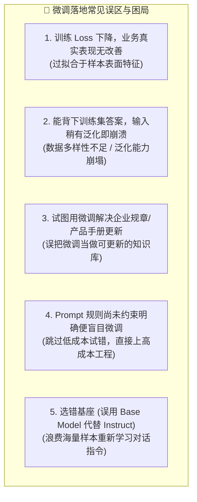
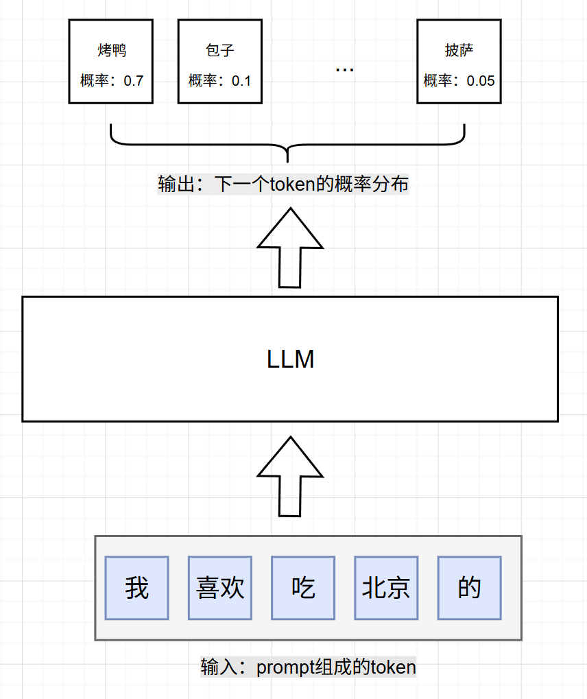
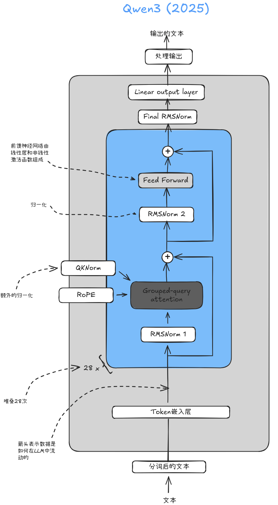
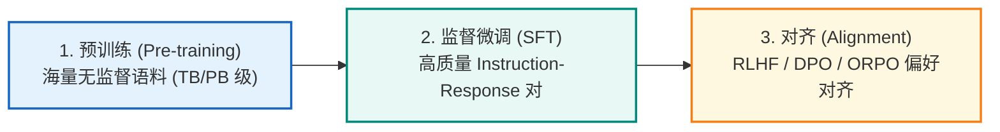
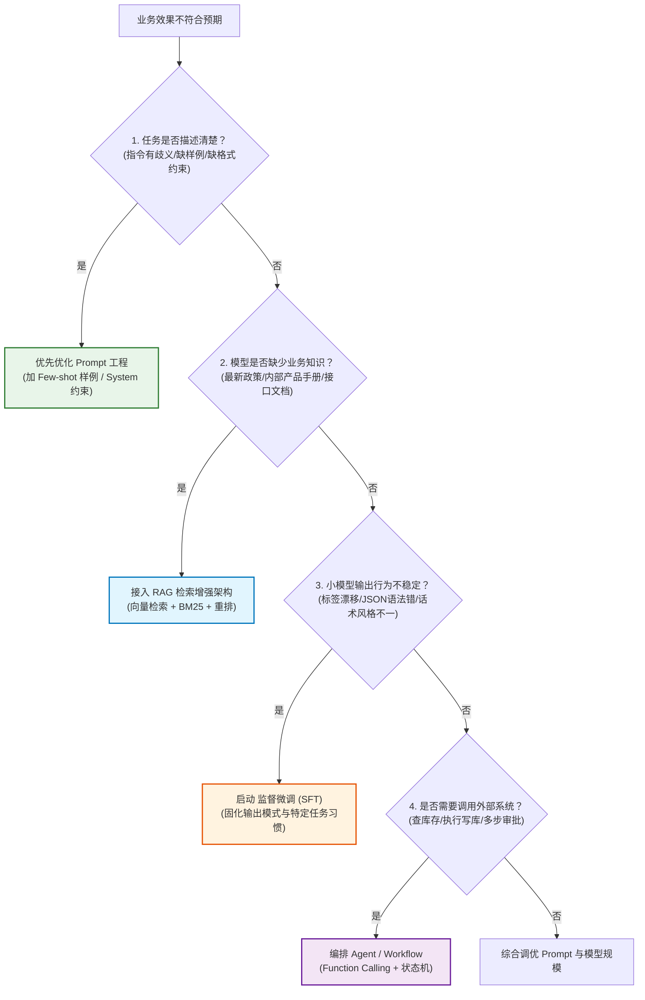
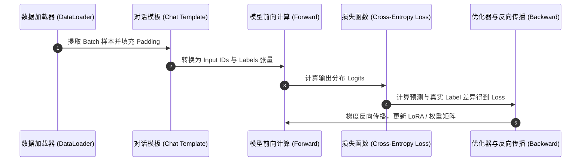
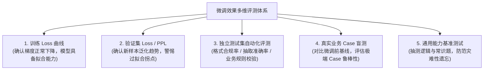

# 🧠 28 - 大模型微调概述与训练闭环 (SFT 机制与工程落地全景)

> 来源：[AI 智能体实战速成指南 (ai-agents-from-zero)](https://didilili.github.io/ai-agents-from-zero/#/28-%E5%A4%A7%E6%A8%A1%E5%9E%8B%E5%BE%AE%E8%B0%83%E6%A6%82%E8%BF%B0%E4%B8%8E%E6%95%B4%E4%BD%93%E6%B5%81%E7%A8%8B)

大模型微调（Fine-Tuning）是 AI 工程师从“API 调用者”迈向“模型能力定制者”的关键分水岭。微调的核心价值**不是“向模型塞入新知识”，而是“重塑模型在特定任务输入下的行为习惯与条件概率分布”**。

本文深度剖析大模型微调的底层运行机制（Token 预测、参数矩阵、损失函数、反向传播），系统梳理 Prompt、RAG、SFT 与 Agent 的技术边界，并完整构建包含“模型选型 ⇄ 数据准备 ⇄ 训练配置 ⇄ 多维验证”的工业级训练闭环。

---

> [!NOTE] 🎯 核心目标与学习导读
>
> - **理解微调的物理定位**：掌握微调解决的是“行为与格式的稳定性”，而非“外挂资料库的检索”。
> - **建立底层机制直觉**：搞懂 Tokenizer、参数浮点矩阵、前向 Loss 计算与反向梯度传播的完整数学/工程流转。
> - **建立技术选型决策树**：熟练运用 `Prompt ➜ RAG ➜ SFT ➜ Agent` 四分法排查业务瓶颈。
> - **掌握 SFT 闭环全生命周期**：模型选择、数据工程、训练超参调优、过拟合与灾难性遗忘防范、多维验证体系。
> - **工程实操落地**：掌握标准微调实验卡（Fine-Tuning Card）的书写与基线对比方法论。

---

## 一、 🎯 认知重塑：微调先解决什么问题

在实际项目中，微调常被误认为是一件纯“调参炼丹”的底层任务：下载开源权重、配置 YAML、运行训练脚本、查看 Loss 曲线。很多初学者一遇到模型效果不好，第一反应就是“抓一批数据跑微调”，最终陷入以下典型困局：



### 核心认知防线
在敲下第一行训练命令前，必须先理清四道核心问题：
1. **大语言模型为什么能被微调？**（底层的数学原理与生成机制是什么）
2. **微调到底改变了模型的什么？**（改的是浮点权重矩阵，还是模型内部的资料库）
3. **哪些问题值得微调，哪些问题坚决不该微调？**（划分 Prompt、RAG、SFT 与 Agent 边界）
4. **一次规范的企业级微调项目应该如何形成闭环？**（验证与基线比训练本身更重要）

---

## 二、 ⚙️ 底层原语：微调到底改变了什么

### 2.1 逐 Token 生成机制与自回归解码

大语言模型（LLM）生成文本时并非一次性输出整篇文章，而是基于**自回归机制（Autoregressive Decoding）**反复执行单步预测：

$$\text{Next Token} \sim P(w_t \mid w_1, w_2, \dots, w_{t-1}; \Theta)$$

> **核心逻辑**：根据当前输入的所有上下文序列，计算词表（Vocabulary）中每一个 Token 的条件概率分布，并依据采样策略抽取下一个 Token。




> [!TIP] 💡 监督微调 (SFT) 的本质
> 监督微调并不是让模型“背诵问答对”，而是通过成百上千条高质量的“`输入 Prompt ➜ 期望输出 Target`”样本，**强行拉高期望输出 Token 序列的生成概率**。当模型在某种特定输入模式下反复被矫正，它的生成分布就会收敛到我们期望的行为模式上。

---

### 2.2 参数矩阵的本质：语言与任务模式的压缩经验

现代 Transformer 架构模型由以下三层主要结构构成：

1. **输入嵌入层 (Embedding Layer)**：将离散的 Token ID 映射为高维连续密集向量。
2. **Transformer Block 堆叠层**：由多头自注意力机制（Self-Attention / GQA）、前馈神经网络（FFN / MLP）、RMSNorm 归一化以及 RoPE 旋转位置编码堆叠而成，负责提取复杂的语义关联。
3. **输出解码头 (LM Head)**：将隐藏层向量映射回词表维度（Vocab Size），经由 Softmax 得到预测概率。



模型中所谓的 `0.5B`、`7B`、`14B`、`32B`，指的是模型中浮点数参数（Weights）的总量。

> **参数不是一张关系型数据库表，也不是结构化的文档库。**
> 
> 参数矩阵本质上是模型在海量数据预训练与微调中沉淀的**“生成倾向矩阵”**。微调所做的事情，就是在保留模型基础语言理解能力的前提下，对这组权重矩阵进行微小的偏置更新（全参微调）或挂载低秩可训练增量（LoRA / QLoRA）。

---

### 2.3 技术选型四分法：RAG 补知识，微调改行为

将业务需求误配技术方案是大模型落地失败的首要原因。下表给出了清晰的选型标准：

| 业务需求类别 | 最佳技术路径 | 关键技术选型理由 |
| :--- | :--- | :--- |
| **让模型掌握企业内部制度、最新产品手册、私有文档** | **RAG (检索增强生成)** | 知识具备**高时效性**与**动态更新需求**，需严格提供原文段落引注，杜绝幻觉 |
| **让模型严格按指定 JSON Schema、固定标签或特定语气输出** | **监督微调 (SFT)** | 属于**行为倾向塑造**与**输出格式收窄**，通过微调可让小模型具备极强的规则遵循力 |
| **让模型查询数据库、调用三方 API、执行多步事务流程** | **[Agent / Tools](./AI应用后端学习计划_Agent与RAG方向.md)** | 需要**流程状态机编排**、**条件分支判定**与**外部工具执行**，非纯模型生成能解决 |
| **让模型在已有能力下明确任务范围与格式要求** | **[Prompt 工程](./PromptEngineeringGuide_重点精读笔记.md)** | **成本最低、上线最快、排错最简单**，是所有方案的前置第一道防线 |

```text
┌─────────────────────────────────────────────────────────────┐
│                      大模型应用落地选型铁律                  │
├─────────────────────────────────────────────────────────────┤
│   • Prompt 工程 ➜ 负责【明确需求】与【低成本试错】            │
│   • RAG 架构   ➜ 负责【动态补充私有/最新事实知识】           │
│   • 监督微调    ➜ 负责【固化输出格式/特定风格/小模型提效】    │
│   • Agent 编排  ➜ 负责【连接外部系统/多步任务执行】          │
└─────────────────────────────────────────────────────────────┘
```

---

### 2.4 训练 vs 推理：参数是否发生物理更新

| 核心维度 | 推理阶段 (Inference) | 训练阶段 (Training / SFT) |
| :--- | :--- | :--- |
| **计算图流向** | **仅前向传播 (Forward Pass)** | **前向计算 ➜ 计算 Loss ➜ 反向传播 (Backward) ➜ 梯度更新** |
| **参数状态** | 权重处于**只读状态 (Frozen)**，参数完全不发生改变 | 权重参数或 LoRA Adapter 矩阵**持续更新** |
| **显存开销** | 仅需容纳模型权重 + KV Cache 缓存 | 需容纳模型权重 + 梯度 (Gradients) + 优化器状态 (Optimizer States) + 激活值 (Activations) |
| **多轮对话影响** | 对话上下文仅在本次 Context 中生效，不会永久改变模型 | 样本作为训练集被反复遍历反向传播，永久重塑模型权重 |


---

## 三、 🧬 训练生命周期：预训练、SFT 与对齐

### 3.1 LLM 进化的三个关键阶段



1. **预训练 (Pre-training)**：
   - **输入数据**：万亿级 Token 的公开语料（网页、书籍、代码、论文）。
   - **目标能力**：掌握语言语法结构、世界通识知识与基础文本续写能力（Next-Token Prediction）。
2. **监督微调 (SFT, Supervised Fine-Tuning)**：
   - **输入数据**：高质量的“指令-回答”问答对（通常千条至数万条级别）。
   - **目标能力**：学会理解用户意图，从“文本续写器”转变为“具备助手意识的任务执行器”。
3. **人类偏好对齐 (Alignment)**：
   - **输入数据**：偏好排序样本（`Chosen vs Rejected`）、安全合规准则。
   - **目标能力**：确保回答有用（Helpful）、诚实（Honest）、无害（Harmless），消除模型越狱与恶意生成风险。

---

### 3.2 为什么企业应用微调优先从 SFT 切入？

- **成本收益最高**：在成熟基座上，只需几百至数千条高质量 SFT 样本即可快速收敛。
- **目标极其明确**：输入与标准输出一一对应，Loss 曲线与验证指标可量化追踪。
- **开箱即用工具链**：LLaMA-Factory 等现代框架提供从 WebUI 到 CLI 的全自动化 SFT 流水线。

---

### 3.3 Base Model vs Instruct Model 选型矩阵

```text
┌────────────────────────────────────────────────────────┐
│                      基座选型决策                      │
└───────────────────────────┬────────────────────────────┘
                            │
          ┌─────────────────┴─────────────────┐
          ▼                                   ▼
  【选择 Base Model】                 【选择 Instruct Model】(强烈推荐)
   • 擅长：纯文本续写                  • 擅长：理解对话角色与任务指令
   • 劣势：不理解 System/User 分工      • 优势：微调只需学习具体业务输出规则
   • 场景：超大规模领域深度预训练      • 场景：绝大多数企业级业务微调首选
```

> [!IMPORTANT] ⚠️ 选型建议
> 企业级应用微调**强烈建议 100% 优先选择 Instruct / Chat 模型**（如 `Qwen2.5-7B-Instruct`、`Llama-3.1-8B-Instruct`）。
> 除非拥有数百万条指令数据且要从头塑造底层行为，否则选用 Base 模型会浪费大量算力去重新教模型“什么是问答对话”。

---

## 四、 ⚖️ 决策准绳：什么时候值得启动微调？

### 4.1 四类问题的开训前排查决策树




---

### 4.2 微调具备高 ROI 的五大典型特征

1. **任务模式长期稳定**：业务输入输出格式半年内不会频繁颠覆（如电商评论标签抽取、意图识别）。
2. **格式要求极度严苛**：必须输出固定字段的纯净 JSON 或严格用分号分隔的关键词列表。
3. **标注样本质量极高**：拥有 500 ~ 5000 条人工复核过的标准 Ground Truth 数据。
4. **具备可自动化的评测指标**：可通过 Exact Match、F1-Score、JSON 校验器或业务规则精准评分。
5. **小模型低成本端侧部署诉求**：因显存、延迟或算力成本限制，需将 70B 大模型的能力“蒸馏/灌注”给 0.5B ~ 7B 极速小模型。

---

## 五、 🔄 闭环工程：监督微调 (SFT) 四步循环实战

微调不是单次执行的脚本，而是一套**实验驱动的闭环体系**：


---

### 5.1 步骤一：底座模型选型矩阵 (Model Selection)

| 业务场景类型 | 推荐初始参数规模 | 关键评估维度与考量 |
| :--- | :--- | :--- |
| **文本意图分类 / 关键词提取** | `0.5B ~ 3B` | 任务边界极窄，输出短，追求极致的吞吐与低延迟 |
| **工单打标 / 普通客服话术生成** | `7B ~ 14B` | 需要平衡自然语言理解能力与流畅规范的表达 |
| **企业知识库问答 (配合 RAG)** | `7B ~ 14B 起步` | 重点考验根据检索上下文提取答案与防幻觉能力 |
| **复杂结构化提取 / NL2SQL** | `14B ~ 32B` | 强依赖多步推理能力、严格的语法生成与 Schema 感知 |
| **边缘设备 / 离线轻量端侧** | `0.5B ~ 1.5B` | 算力受限，注重 INT4/INT8 量化后的显存占用 |

---

### 5.2 步骤二：数据工程与格式规范 (Data Preparation)

> **微调界铁律：Garbage in, Garbage out（垃圾进，垃圾出）。数据质量决定微调上限。**

#### 黄金样本的三大准则
1. **输入分布真实**：严禁闭门造车合成脱离业务实际的假 Prompt。
2. **输出规范强一致**：同类样本的格式、标点、大小写规则必须 100% 统一。
   ```text
   ❌ 混乱格式（导致模型混乱）：
      样本1: 标签：手机; 屏幕碎了
      样本2: ["手机", "碎屏"]
      样本3: 手机,屏幕故障
   
   ✅ 规范格式（模型收敛极快）：
      样本1: 手机; 屏幕故障
      样本2: 手机; 屏幕碎裂
      样本3: 平板; 电池鼓包
   ```
3. **数据严格切分**：按照 `8:1:1` 或 `9:1` 严格切分训练集与独立测试集，严禁数据穿越泄漏。

---

### 5.3 步骤三：微调训练与核心超参速查 (Fine-Tuning Execution)




#### 核心超参数配置速查表

| 超参数名称 | 典型取值范围 | 工程意义与调优指引 |
| :--- | :--- | :--- |
| **Epoch (训练轮数)** | `2 ~ 5` 轮 | 遍历数据集的次数。SFT 轮数不宜过多，否则极易引发过拟合 |
| **Batch Size (批大小)** | `4 ~ 32` (按显存调整) | 单次更新梯度的样本数。可通过 `Gradient Accumulation` 累加步数 |
| **Learning Rate (学习率)** | LoRA: `1e-4 ~ 5e-5`<br>全参: `1e-5 ~ 1e-6` | 学习率过大会导致震荡发散，过小则难以收敛。常搭配 Warmup 预热 |
| **Cutoff Length (截断长度)** | `1024 ~ 4096` | 单条样本最大 Token 截断限制。显存消耗与此长度呈平方级关系 |
| **LoRA Rank ($r$)** | `8 ~ 64` (常见 `16/32`) | 低秩矩阵的维度。维度越高可学特征越多，但显存开销增大 |
| **LoRA Alpha ($\alpha$)** | 通常设为 $2 \times r$ | LoRA 权重的缩放因子 |

---

### 5.4 步骤四：多维证据链验证 (Model Evaluation)

严禁仅凭“训练 Loss 下降”判定微调成功。合格的验证必须形成多维证据闭环：



---

## 六、 📋 生产落地：开训前检查清单与实验卡规范

### 6.1 三维开训检查清单

```markdown
- [ ] 【需求维度】业务规则是否长期固定？是否已充分验证 Prompt 优化极限？
- [ ] 【需求维度】明确定义微调是为了“改行为/定格式”，而非“灌入动态事实”？
- [ ] 【数据维度】样本数量（500+）、标注一致性（100%）、清洗脱敏是否已达标？
- [ ] 【数据维度】是否已分离出绝对隔离的 100~200 条黄金测试集？
- [ ] 【工程维度】底座模型权重、Tokenizer 与 Chat Template 是否完整匹配？
- [ ] 【工程维度】显存开销已完成预估（LoRA / QLoRA 选型与 Batch/Cutoff 配置无溢出风险）？
- [ ] 【工程维度】是否已跑通原始基线模型在测试集上的表现基准数据？
```

---

### 6.2 标准微调实验卡规范 (Fine-Tuning Card)

在生产环境中，每一次微调实验都必须如实记录实验卡，保证实验可复现、指标可对比：

```markdown
# 🧪 微调实验卡 (Fine-Tuning Experiment Card)

### 1. 基本信息与目标
* **实验代号**：EXP-202608-ECOMM-KEYWORD-V1
* **核心目标**：从电商售后评论中抽取 3~8 个核心故障/产品关键词
* **标准输出格式**：仅输出关键词，英文字符分号 `;` 分隔，无任何多余前缀

### 2. 模型与数据配置
* **基座模型**：`Qwen2.5-1.5B-Instruct`
* **训练样本量**：训练集 1800 条，独立验证集 200 条 (`keywords_sft.jsonl`)
* **微调方案**：LoRA (`r=16, alpha=32, target_modules=q_proj,k_proj,v_proj,o_proj`)
* **核心超参**：`epoch=3, lr=1e-4, batch_size=8, cutoff_len=1024, warmup_ratio=0.1`

### 3. 基线对比与评测结果
| 评估维度 | 原始基座模型 (Few-shot) | 微调后模型 (SFT-V1) | 提升幅度 |
| :--- | :--- | :--- | :--- |
| **格式合规率 (纯分号分隔)** | 64.5% | **99.0%** | +34.5% |
| **关键词抽取精准度 (F1)** | 71.2% | **89.6%** | +18.4% |
| **单请求平均响应延迟** | 820ms (Prompt 较长) | **260ms** (极简指令) | 提速 68% |
| **通用常识回答抽检** | 正常 | 正常 (无明显退化) | 达标 |

### 4. 失败用例归因与迭代
* **典型错误用例**：超长评论（>800字）中出现遗漏故障点的现象。
* **下一轮迭代策略**：补充 200 条长文本复杂售后评论样本，并调整 Cutoff Length 至 1536。
```

---

## 七、 🧪 实战演练：典型业务场景决策矩阵

| 场景编号 | 具体业务诉求描述 | 最佳技术方案 | 深入决策逻辑与归因 |
| :---: | :--- | :---: | :--- |
| **01** | 员工在 OA 中查询“年假申报流程”与“差旅报销标准” | **RAG** | 规章政策动态修订，必须精准溯源段落出处，不可硬编码于模型参数。 |
| **02** | 规范客服机器人的品牌问候语、特定术语规范与拒答委婉话术 | **先 Prompt，不稳则 SFT** | 属于表达语气与风格规范。小模型在长对话中若出现风格漂移，微调是最稳解法。 |
| **03** | 从用户工单自然语言中提取固定 12 种系统故障标签（JSON 输出） | **监督微调 (SFT)** | 标签空间固定、格式极其严苛，微调可将小模型遵循率提升至 99%+。 |
| **04** | 针对突发重大财经新闻进行实时政策解读与影响分析 | **RAG** | 突发事实属于模型预训练截断后的新知识，微调更新存在滞后性且成本高昂。 |
| **05** | 用户下达指令：“查询 A 商品库存，若大于 5 则自动创建采购订单” | **[Agent / Tools](./AI应用后端学习计划_Agent与RAG方向.md)** | 包含读写真实数据库、API 认证与多步状态流转，必须依赖智能体工作流执行。 |

---

## 八、 ❓ 深度思考题与核心解析

> [!IMPORTANT] 💡 思考题与工程面试精要
>
> 1. **为什么说“微调可以改行为，但不能做事实知识库”？**
>    - **解析**：微调改变的是高维空间中 Token 的条件概率分布，它无法像数据库索引一样提供确定性的 CRUD、版本回滚和精确段落溯源。知识库问答需依赖 RAG 架构提供事实注入。
>
> 2. **在计算图中，推理和训练的根本区别是什么？**
>    - **解析**：推理仅执行**前向传播（Forward Pass）**，参数只读；训练需在前向计算后通过 Loss 函数评估预测误差，并执行**反向传播（Backward Pass）**计算偏导数，借助优化器更新参数矩阵。
>
> 3. **小模型遇到格式不稳定时，标准排障步骤是什么？**
>    - **解析**：① 优化 Prompt 明确约束 ➜ ② 提供 2~3 个 Few-shot 样例 ➜ ③ 开启结构化输出 (JSON Schema/Tool Calling) ➜ ④ 若遵循率仍不足，收集 500+ 高质量一致性样本进行 SFT 微调。
>
> 4. **什么是灾难性遗忘？在微调中如何规避？**
>    - **解析**：灾难性遗忘指模型过分拟合垂直领域新数据，导致通识、推理或代码能力大幅退化。规避策略：采用 LoRA 低秩微调（冻结基座）、降低学习率、控制训练轮数并在数据集中回掺 5%~10% 的通用高质量指令数据。

---

## 🏁 本章小结与进阶路线

```text
               大模型微调概述与训练闭环
                         │
        ┌────────────────┼────────────────┐
        ▼                ▼                ▼
   【核心原理】      【选型决策】      【四步闭环】
  • 逐 Token 预测  • Prompt 控要求   • 选型: 优先 Instruct
  • 参数即生成倾向  • RAG 补知识      • 数据: 质量决定上限
  • 训练 Loss 反传  • 微调 定行为     • 训练: 超参稳健配置
  • 推理 只读前向  • Agent 搞执行    • 验证: 多维证据对比
```

- **本章核心认知**：微调是基于高质量样本调整条件概率倾向的工程，重点在于确定性的行为固化与小模型提效。
- **下一阶段进阶**：建议继续深入学习数据工程（JSONL 数据集构建、ShareGPT 格式、Chat Template 对话模板）以及参数高效微调方法（LoRA / QLoRA 显存计算）。

---

> [!TIP] 💡 关联技术与延伸阅读
>
> * [提示词工程核心精读笔记 (Few-shot / CoT 原理与实操)](./PromptEngineeringGuide_重点精读笔记.md)
> * [阶段一：大模型 API 原语与 Function Calling 学习资料](./阶段一_基础重塑_API与FunctionCalling学习资料.md)
> * [AI 应用后端开发学习计划 (Agent 与 RAG 方向)](./AI应用后端学习计划_Agent与RAG方向.md)
> * [综合 AI 后端开发全景学习计划与目标](./综合AI后端开发学习计划与目标.md)
