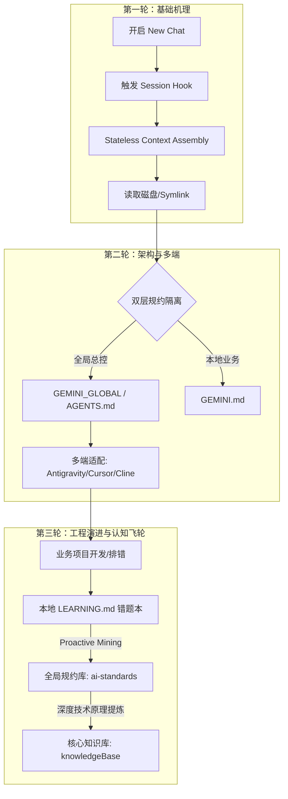

# AI 智能体全局规范引擎与 IDE 热加载机制深度解析 (三轮进阶剖析)

> **归档位置**：`knowledgeBase/01_Inbox/04-AI/29-AI智能体全局规范引擎与IDE热加载机制深度解析.md`  
> **核心关联**：[ai-standards 全局规范库](file:///Users/hexianghong/code/ai-standards) ｜ [知识库目录索引](../README.md)  
> **标签**：#AI智能体 #Antigravity #规则引擎 #上下文工程 #SRE工程化

---

## 🎯 导读与技术背景

在现代 AI 辅助研发（Pair Programming）与自动化 Agent 运维体系中，如何让分布在不同仓库的微服务与工具链**统一遵循团队工程红线与架构规约**，同时支持**低成本同步更新与个人/团队知识反哺**，是一个典型的上下文工程与架构治理课题。

本文基于实际工程演进，对 **AI IDE 会话机制、全局规约热加载、双层隔离架构以及知识库演进闭环** 进行**三轮递进式深度复盘与技术提炼**。

---



---

## 🔄 第一轮深度剖析：基础机理篇 —— 无状态会话与底层文件 I/O 动态加载

### 1. 为什么“开启新会话”会自动重新读取规则？

许多开发者误以为 AI IDE（如 Google DeepMind Antigravity、Cursor、Windsurf 等）维持着常驻的“长连接缓存”，其实在上下文工程中，**每一次开启新会话（New Chat / Session）都是一次严格的“无状态组装（Stateless Context Assembly）”**：

1. **会话初始化生命周期 Hook (Session Bootstrap)**：
   - 当用户在客户端点击 `+ New Chat` 时，IDE 宿主进程会销毁旧会话的运行上下文（内存中的 Conversation History）。
   - 触发会话初始化 Hook，执行环境探针：探测当前活动工作区（Workspace Root）、检测打开的文件指针、检索关联的规约文件。
2. **实时文件 I/O 读取**：
   - IDE 依据预设文件名（如 `GEMINI.md`, `AGENTS.md`）向操作系统内核发起文件系统调用（`stat` / `open` / `read`）。
   - **完全绕过上一次会话的显存/内存缓存**：IDE 每次直接从操作系统的 VFS（虚拟文件系统）抓取最新字节流，组装为当前会话的 `System Prompt`（如 `<user_rules>` 标签块）。
3. **消除历史偏见与幻觉残留**：
   - 在旧会话中，AI 可能会被长上下文中的多轮问答干扰，产生“注意力分散”或“规约漂移”。新会话通过物理级重新读取，强行重置了智能体的注意力基线。

### 2. 符号链接（Symlink）的零拷贝物理穿透机制

在多项目全局治理中，若采用“全量拷贝规则文件”到每个项目的做法，极易出现版本碎片化。本架构采用**符号软链接（Symbolic Link）**架构：

```text
外部项目 A (Project A) ───[软链接: GEMINI_GLOBAL.md]───┐
                                                       ▼
外部项目 B (Project B) ───[软链接: GEMINI_GLOBAL.md]───┼──▶ /Users/.../ai-standards/core-rules/INSTRUCTIONS.md (物理唯一事实来源)
                                                       ▲
知识库   (knowledgeBase)──[软链接: GEMINI_GLOBAL.md]───┘
```

- **物理单点更新，全网即时生效**：
  软链接本身只是一个包含目标路径字符串的 inode 指针。当 `ai-standards` 仓库发生修改（如合并了新的 SRE 故障排查规约或 `git pull`），**没有任何外部项目需要执行文件同步**。
- **动态字节流读取**：
  在任何外部项目开辟新会话时，IDE 打开 `GEMINI_GLOBAL.md`，内核顺着符号链接解引用（Resolve Path）并读取物理磁盘上的最新数据，实现“**零部署成本、零延迟热生效**”。

---

## 🔄 第二轮深度剖析：架构与多端适配篇 —— 双层规约设计与平台级嗅探差异

### 1. 双层规约架构（Dual-Layer Rule Architecture）

规范体系严禁将“项目私有业务”与“全局通用标准”混写在一个文件内，必须遵循职责分离：

| 层次维度 | 承载文件 | 存储属性 | 核心职责与设计原则 |
| :--- | :--- | :--- | :--- |
| **全局总控层 (Global)** | `GEMINI_GLOBAL.md` / `AGENTS.md` | **只读软链接** (指向 `ai-standards`) | **定义行业最佳实践与团队红线**：安全边界、SRE 排障 SOP、技术栈规范动态路由（Go/Java/Vue）、多智能体 Handover 协议。自动加入 `.gitignore`，杜绝污染项目仓库。 |
| **本地上下文层 (Local)** | `GEMINI.md` | **实体文件** (提交至各业务仓库) | **定义业务边界与局部特性**：业务背景、核心领域模型、关键接口定义、本地专属构建/测试脚本、本地 MCP 推荐服务。由业务开发团队自行维护。 |

### 2. Antigravity 智能体原生嗅探规则深度探秘

以 **Google DeepMind Antigravity** 智能体架构为例，其原生规约加载机制与通用 IDE 存在显著不同：

- **原生常驻注入（Always-On Rules）**：
  Antigravity 会自动向上递归扫描工作区，原生识别以下特征文件并无条件注入系统 Prompt 的 `<user_rules>` 块：
  1. `GEMINI.md`
  2. `AGENTS.md`
  3. `.agents/rules/*.md`
- **规约继承与穿透方案**：
  - **方案一（推荐）：本地显式继承声明**：
    在业务仓库的 `GEMINI.md` 顶部第一行添加显式引用：
    ```markdown
    > [!IMPORTANT]
    > 本项目严格遵循并继承全局 AI 最高执行总控：[GEMINI_GLOBAL.md](./GEMINI_GLOBAL.md)
    ```
    AI 在解析 `GEMINI.md` 时会顺着链接无缝加载全局规则。
  - **方案二：双文件原生共存（`AGENTS.md` 全局 + `GEMINI.md` 本地）**：
    由于 Antigravity 原生同时扫描 `AGENTS.md` 和 `GEMINI.md`，可将指向全局总控的软链接命名为 `AGENTS.md`，本地业务仍用 `GEMINI.md`。两者在会话建立时同时被注入系统级 Context，形成极致的原生静默融合。

### 3. 多平台 AI IDE 规约适配矩阵

为了实现“一套规范，处处运行”，初始化脚本 [init-project.sh](file:///Users/hexianghong/code/ai-standards/automation-tools/init-project.sh) 建立了针对主流平台的适配矩阵：

```text
ai-standards/core-rules/INSTRUCTIONS.md (源文件)
  ├── ln -sf ──▶ GEMINI_GLOBAL.md            (面向 Antigravity)
  ├── ln -sf ──▶ .cursorrules                (面向 Cursor 经典模式)
  ├── ln -sf ──▶ .cursor/rules/*.mdc         (面向 Cursor 模块化规则)
  ├── ln -sf ──▶ .clinerules                 (面向 Cline 智能体)
  └── ln -sf ──▶ .github/copilot-instructions.md (面向 GitHub Copilot)
```

---

## 🔄 第三轮深度剖析：工程演进与认知进化篇 —— 规范版本感知与三维演进飞轮

### 1. 外部项目如何感知全局规范更新？

当团队其他成员或上游更新了 `ai-standards`，在业务项目中如何感知与确认？

1. **AI 探针自检（对话即感知）**：
   直接对 AI 发送指令：
   > *“请帮我查看一下全局规范库（ai-standards）最近有无最新 commit，并列出关键变更点。”*
   AI 可通过 `run_command` 执行 `git -C /Users/.../ai-standards log -n 5 --oneline` 并向开发者汇总最新规约。
2. **自动化更新与健康检查脚本**：
   在任何目标工程根目录执行：
   ```bash
   # 自检并修复失效软链接，重新挂载最新标准
   /Users/hexianghong/code/ai-standards/automation-tools/init-project.sh -u
   ```
3. **版本号显式打标机制**：
   在 `INSTRUCTIONS.md` 顶部标注 SemVer 版本号（例如 `v1.2.0 - 2026-09-14`），使版本追溯直观透明。

### 2. 闭环生态：三维知识与规约演进飞轮

单向的规则下发容易导致规约与生产实际脱节。必须建立**自下而上的反哺与认知进化体系**：

```text
┌────────────────────────────────────────────────────────────────────────┐
│                      三维自闭环认知进化飞轮                            │
└───────────────────────────────────┬────────────────────────────────────┘
                                    │
       ┌────────────────────────────┼────────────────────────────┐
       ▼                            ▼                            ▼
【维度一：业务工程实践】       【维度二：规约执行引擎】     【维度三：个人/团队知识库】
  (各外部微服务项目)                (ai-standards)              (knowledgeBase)
• 业务代码实现与 TDD           • 全局 SRE 架构与防护红线   • 底层技术原理与源码剖析
• 本地 LEARNING.md 错题本      • 自动化排障 SOP 决策树     • 系统性知识框架沉淀
• 偶发 Bug 与特定踩坑反思      • 双语分流执行总控          • 终身复习与认知跃迁

       │                            ▲                            ▲
       └────────── 反哺提炼 ────────┴────────── 深度沉淀 ────────┘
```

#### 运转流程说明：
1. **日常开发与碰撞**：在外部微服务或运维项目中，AI 协助解决偶发问题并写入项目本地 `LEARNING.md`。
2. **主动挖掘协议 (Proactive Mining Protocol)**：
   当 AI 识别出某个问题属于系统性架构缺陷或黄金排错路径时，主动提示：
   > *"💡 提示：本次解决的问题具备通用价值，建议提炼并归档至 `ai-standards` 或核心知识库 `knowledgeBase`。是否需要我生成提炼草案？"*
3. **分流归档**：
   - 若属于**强制性规约/SOP**（如“禁止在循环中查询数据库”、“502 链路排查步骤”），归档至 `ai-standards`；
   - 若属于**深度原理/技术机制**（如“MySQL MVCC 底层图解”、“AI IDE 规则加载机制”），沉淀至个人知识库 `/Users/hexianghong/code/knowledgeBase`。

---

## 📋 总结与行动清单 (Takeaways)

1. **会话重读本质**：New Chat 是无状态组装，物理磁盘/软链接变动即可实现零延迟热重载。
2. **规约隔离红线**：全局总控走软链接 + `.gitignore`；业务私有走 `GEMINI.md` 实体文件。
3. **Antigravity 最佳实践**：在业务 `GEMINI.md` 中引用 `GEMINI_GLOBAL.md`，或软链接命名为 `AGENTS.md`。
4. **认知资产沉淀**：通过 Proactive Mining 机制，实现从“业务实战 -> 规范引擎 -> 个人知识库”的双向自演进。
