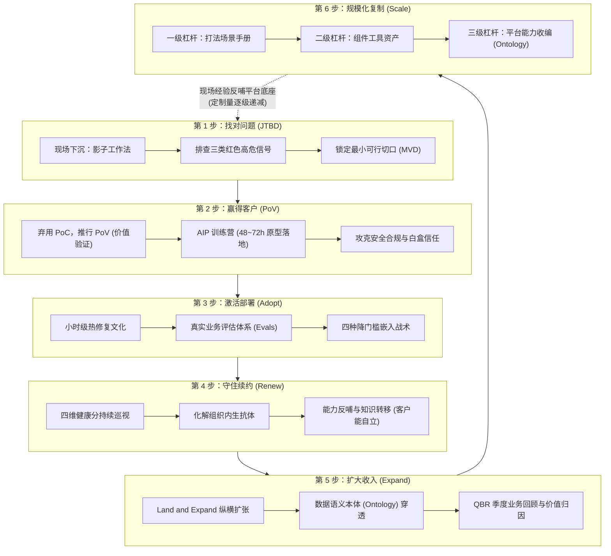
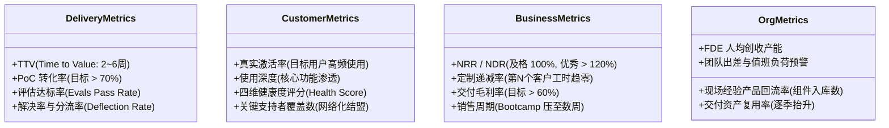

# 前线部署工程师 (FDE) 全景实战指南与企业级 AI 落地方法论

> [!NOTE]
> - **原始参考来源**：[FDE-the-Guidance-Book-of-Forward-Deployed-Engineer](https://github.com/xdash/FDE-the-Guidance-Book-of-Forward-Deployed-Engineer)
> - **在线官网**：[fde4.ai](https://fde4.ai)
> - **原著作者**：范冰（《增长黑客》作者，网名 XDash）
> - **核心定位**：本文档深度解构范冰原著，融合硅谷顶级 AI 厂商（Palantir、OpenAI、Anthropic、Scale AI、Harvey、Sierra）与中国本土先行者的第一手工程实践，全景剖析 FDE 的崛起脉络、六步交付飞轮、核心指标度量及规模化产品复制机制。

---

## 1. 业务背景与 FDE 的破局崛起 (Context & Core Value)

### 1.1 “生成式 AI 的鸿沟”与 95% 死亡陷阱
2025 年，麻省理工学院 (MIT) NANDA 实验室发布里程碑式行业报告《生成式人工智能的鸿沟》（*The GenAI Divide*）。报告在调研全球 52 家企业组织、回收 153 份高管问卷并解剖 300 多个公开 AI 项目后揭示了一个严酷现实：
* **95% 的企业生成式 AI 项目未能产生任何能写进财务报表的实际价值**；
* 麦肯锡同步数据证实：仅有 **6%** 的企业能明确表明 AI 对其业务利润贡献超过 5%；
* 斯坦福大盘数据：企业组织内部 **88%** 都在尝试 AI，但真正跑进生产环境、嵌入日常工作流的智能体应用比例仅有个位数。

```
传统采购死循环：
供应商惊艳 Demo (流光溢彩) --> CEO 拍板签约 (数百万美元) --> 交付代码与验收单 --> 9 个月后无人使用 (系统空转) --> 预算被砍/项目死亡
```

**核心痛点与行业真相**：
1. **模型能力已不再稀缺**：主流开源与商用模型（GPT-4o、Claude 3.5 Sonnet、DeepSeek-V3/R1）基座智商完全过剩；
2. **稀缺的是把模型塞进客户混乱现实的人**：模型在测试集和 Demo 中对答如流，但一旦进入生产，面对的是**“不记反馈、不存上下文、不进工作流”**的泥潭；
3. **墙的两侧割裂**：造软件的人在总部吹着冷气看抽象画像，价值产生的人在车间、机房、合规室面对密密麻麻没有文档的 Excel 与口耳相传的潜规则。

---

### 1.2 什么是 FDE（前线部署工程师）？
定义源自 Palantir 早期高管、OpenAI 前首席研究官鲍勃·麦格鲁（Bob McGrew）：
> **前线部署工程师 (Forward Deployed Engineer，简称 FDE)，是一个驻扎在客户现场、填补“产品能做的事”与“客户需要的事”之间鸿沟的工程师。**

* **驻扎现场 (Forward Deployed)**：军事术语借用，指把最具战斗力的人布置在离问题最近的前线；工作语境深度嵌入客户现场（进客户群、读真实脏数据、开一线例会、看一线人员过真实的一天）；
* **鸿沟 (The Gap)**：开箱即用的 SaaS 不需要 FDE；业务逻辑越复杂、壁垒越深（金融风控、高端制造、医疗合规、法律分析、国防情报），越需要 FDE；
* **工程师 (Engineer)**：写的是生产环境级的高可靠代码，而不是写 PPT 汇报的咨询顾问。

---

### 1.3 核心角色边界划分 (What FDE is NOT)

为了彻底厘清 FDE 与传统软件角色的界限，必须通过严谨的对比矩阵划清“四不属于”原则：

| 角色类型 | 工作终点 | 核心交付物 | 计费模式 | 典型思维 |
| :--- | :--- | :--- | :--- | :--- |
| **售前工程师 (Pre-sales)** | 客户签约前 | PPT 演示方案、技术应答书 | 挂钩首单销售佣金 | “怎么让客户相信这事能成” |
| **驻场外包 (Outsourcing)** | 工时耗尽 | 烟囱式定制代码、人走系统停 | 按人天/人头计费 (T&M) | “客户提什么需求我就写什么代码” |
| **咨询顾问 (Consultant)** | 交付项目报告 | 战略洞察、PPT 流程建议书 | 按项目阶段/里程碑付费 | “只提改进建议，对系统最终运行不负责” |
| **传统平台研发 (Dev)** | 功能合入主干分支 | 通用平台功能、抽象 API | 内部固定薪资 | “追求单一功能普适上万家客户，拒绝个性定制” |
| **前线部署工程师 (FDE)** | **客户形成稳定使用习惯** | **生产级可用系统 + 沉淀平台资产** | **订阅续约与结果扩容分成** | **“去他的可泛化性，先把眼前的客户救活，再反哺平台”** |

```
Palantir 官方著名论断 —— Dev versus Delta (开发工程师对三角洲):
- 平台工程师 (Dev): 负责“一种能力，服务多个客户”，追求标准化、通用性与架构洁癖；
- 前线部署工程师 (Delta): 负责“一个客户，调动多种能力”，追求在战壕里快速拼接、打穿业务阻碍。
```

---

## 2. FDE 六步交付全景时序飞轮 (The 6-Phase Delivery Flywheel)

FDE 方法论不是无序的现场救火，而是一套严密咬合的端到端价值闭环体系：



---

### 2.1 阶段一：找对问题 (JTBD 框架与避坑清单)
FDE 进场的第一准则：**不要拿着锤子找钉子**。大模型不能解决所有问题，甚至大多数问题根本不需要大模型。

* **影子工作法 (Shadowing)**：坐在真实业务人员旁边，不带优越感地观察他过完一整天，记录真实工作流中在哪些地方抓狂、在哪些步骤反复切换 5 个系统抄数据；
* **JTBD (Jobs-To-Be-Done) 视角**：客户买的不是“大模型技术”，而是“别让我在审计时漏掉洗钱交易”、“让车间工人少走 3000 步”。

#### 🚨 必须果断放弃的“三类高危项目警报”：
1. **“无主之地” (No-man's land)**：集团发文要搞 AI，IT 部门牵头，但业务部门无人署名、无人参与。这类项目 100% 死于验收后的无人问津；
2. **“只许看，不给碰” (Look but don't touch)**：安全合规部门死守数据，只给合成数据或三年前脱敏垃圾数据。在假数据上验证出来的“完美模型”，进生产环境立刻崩溃；
3. **“寻找解决方案的问题” (Solution looking for a problem)**：业务本身逻辑极简单，规则脚本（IF-ELSE 或 SQL）30 行就能稳定搞定，客户高管为了迎合风口硬要上 Agent。

---

### 2.2 阶段二：赢得客户 (告别 PoC，推行 PoV 训练营)

#### 概念验证坟墓 (PoC Graveyard) vs 价值验证 (PoV)
传统软件销售热衷于免费做 PoC（Proof of Concept），往往陷入“无明确指标、无排他承诺、无业务裁判”的无限拉锯。FDE 推行 **PoV (Proof of Value，价值验证)**：
* **时间盒 (Timebox) 强约束**：最长不超过 2~4 周，甚至压到 48~72 小时；
* **前置对赌协议**：进场前明确约定，“一旦达成指标 X，立即进入合同采购阶段”；
* **Palantir AIP Bootcamp（训练营）战法**：
  - 客户必须携带脱敏后的**真实业务数据**到场；
  - FDE 与客户工程师、业务人员在同一间屋子里封闭开发 1 到 5 天；
  - 现场组装 Agent、连通工作流并产生真实可看、可点的业务结果，让决策高管在第 3 天当场拍板签约。

---

### 2.3 阶段三：激活部署 (热修复文化与四种降门槛战术)

系统上线第一天，不是胜利，而是“首日魔咒”的开始。九成企业存在“官方采购系统空转，员工私下用个人 ChatGPT 解决问题”的“影子 AI”现象。

#### 1. 小时级的“热修复”响应文化
传统产品开发以“月/双周 Sprint”迭代，而 FDE 部署期以**小时**计算：
* 上午车间工人抱怨：“戴着厚手套，屏幕上的按钮点不中” $\rightarrow$ 下午 FDE 把按钮面积放大两倍；
* 上午风控专家反馈：“导出的报表缺少供应商税号字段” $\rightarrow$ 下午 14:00 字段补全并重新热部署。
* **效果**：极速响应在第一时间粉碎一线用户的抵触心理，建立无可替代的信任底座。

#### 2. 评估体系 (Evals) 驱动工程质量
* AI 的输出是概率性的、场景相关的，不能靠单元测试的 Pass/Fail 判定；
* **构建闭环 Evals 三步法**：
  1. **来自真实案例**：抓取一线高频错题和复杂业务边界作为评测集；
  2. **业务专家当裁判**：让天天用系统的业务老师傅参与打分（摩根士丹利让理财顾问打分，约翰迪尔让农艺师参与判定）；
  3. **挂接生产监控**：生产日志持续采样打分，准确率一旦漂移跌破 SLA 阈值，立即自动告警排查。

#### 3. 降低用户使用门槛的“四种绝招”

```
战术 1: 寄生在用户已有界面中
   - 绝不强迫用户注册登录新系统
   - 业务员天天用 Excel，就做 Office 插件；天天用企微/钉钉，就做 IM 机器人；天天在现场，就装进手持 PDA

战术 2: 默认值里藏着激活率
   - 严禁让用户面对一个空荡荡的输入框发呆问“然后呢？”
   - 第一次打开系统，基于客户真实数据自动预填模板、预置当日待办列表

战术 3: 把“写 Prompt”封装为“点按钮”
   - 不要妄想业务员个个是“提示词工程专家”
   - 把高频复杂链路沉淀为一键动作：“核对今日发票”、“生成跨境合规摘要”，背后调度多 Agent 协作

战术 4: 先做“副驾驶”，再做“自动驾驶”
   - 面对高风险/高责任业务，严禁一步到位做黑盒全自动
   - 采用 Human-in-the-loop：AI 负责草拟检索、人负责最终审核点击确认，责任依然归人，阻力瞬间降为零
```

---

### 2.4 阶段四：守住续约 (组织抗体消解与能力转移)

FDE 模式的商业命脉在**净收入留存 (NRR > 120%)**。

#### 1. 读懂并拆解组织政治 (三大心法)
新系统上线，必然打破原有的信息垄断、压缩原有审批权、夷平某些资深老员工的壁垒，天然会遭遇“深水区冷暴力抵制”：
* **心法一：扩张必须带上“地头蛇”**：每进一个新部门，先拉拢最具威望的业务骨干共同设计场景，“人们绝不会反对自己亲手参与建造的东西”；
* **心法二：三层人群利益分别对齐 (Harvey 律所经典实践)**：
  - 对**合伙人 (买单层)**：展示这个案子如何多赚 30% 利润；
  - 对**初级助理 (实操层)**：展示今晚可以少加班 3 小时；
  - 对**知识管理律师 (中枢层)**：展示全所过去二十年的沉睡经验终于被结构化唤醒；
* **心法三：永远给“旧秩序”留体面**：在宣讲时强调“这套旧流程过去十年支撑了集团的辉煌，现在我们要用智能体将其经验放大一百倍”，杜绝踩贬历史。

#### 2. 能力转移原则 (FDE 的最高道德)
**咨询顾问靠客户持续离不开自己赚钱，而优秀的 FDE 以“客户最终不再需要自己”为成功验收标准**。必须在驻场后期输出完备 SOP、培训客户侧骨干，让客户能够自主扩展新 Agent，将系统内化为组织资产。

---

### 2.5 阶段五：扩大收入 (Land & Expand 与语义本体 Ontology)

```
单点攻坚 (Land)           横向渗透 (Expand)           企业级生态 (Ontology)
[单部门客服/反洗钱]  -->  [扩展至采购、法务、供应链]  -->  [全集团核心业务语义底座]
    $20 万/年                  $100 万/年                   $1000 万/年
```

#### 企业数据语义本体 (Ontology) 核心机制
Palantir Foundry 与 AIP 能够在大型企业持续扩容的杀手锏是 **Ontology**：
* 企业的 ERP、CRM、Mes、本地文件散落各处，模型直接读数据库表往往会产生灾难性误解；
* **Ontology 是架设在物理数据与 AI 模型之间的语义映射层**：
  - **对象 (Objects)**：把原始表定义为业务实体（如“飞机”、“客户”、“航线”）；
  - **属性 (Properties)**：实体的实时状态（如“燃油余量”、“当前逾期天数”）；
  - **链路 (Links)**：实体间的拓扑关系（如“客户 A 关联账户 B 执飞航线 C”）；
  - **动作 (Actions)**：经权限管控的安全可执行工具（如“重新派单”、“冻结账户”、“触发退款”）。
一旦 Ontology 建成，集团内任何新部门想要接入 AI，只需在现有语义层上调用动作，几小时就能搭出一个新业务智能体。

---

### 2.6 阶段六：规模化复制 (三级杠杆与产品化收编)

前 Palantir FDE Barry 的警世名言：
> **“如果你不把现场学习转化为产品资产，你得到的只是一堆定制项目，收入增长与人数线性绑定，最终沦为一家软件外包公司。”**

#### 麦格鲁的三级复制杠杆模型：

```
                    ▲
                   / \
                  /   \     【三级杠杆：产品平台层 (Platform & Ontology)】
                 / 三级 \    - 抽象为通用开箱即用能力，消灭现场交付成本
                /───────\    - 麦格鲁喻：“浇筑平整高速公路 (Highways)”
               /  二级   \   【二级杠杆：组件工具层 (Components & Tools)】
              /───────────\  - 连接器、评估框架、数据清洗 Pipeline、工业算法包
             /    一级     \ 【一级杠杆：打法场景层 (Playbooks & Checklists)】
            /───────────────\- 尽调清单、反脆弱雷区库、场景实施模板、SOP 手册
```

#### 判定现场代码能否产品化的“四问法则”：
1. **是个性还是共性？** 该需求是否在 **3 个以上独立客户** 处重复出现过？
2. **泛化成本是否划算？** 麦格鲁提示：“现场代码快而糙，将其通用的成本往往高于重写一遍”。必须计算未来 10 家客户省下的交付人天能否覆盖研发重构成本；
3. **能否让不会写代码的人用起来？** 现场工具是工程师用的脚本，产品化必须封装为拖拽式 UI 或自然语言配置（如 Decagon 的 AOP 自然语言流程定义）；
4. **抽象层是否选对？** 是否会把核心平台拖入泥潭，造成不可承受的终身维护负担。

---

## 3. FDE 全链路核心度量指标体系 (Metrics Framework)

指标贵精不贵多，企业级部署应紧盯以下四大维度的关键生命线：



### 3.1 四大维度核心指标速查表

| 指标维度 | 核心指标名称 | 工业界标准基线 | 深度说明与避坑红线 |
| :--- | :--- | :--- | :--- |
| **交付层** | **TTV (Time to Value)** | **MVD $\le$ 2~4 周** | 从工程师进场到客户一线业务首次感受到真实价值的时间。周期变长即危险信号。 |
| **交付层** | **Evals 达标率** | **生产抽检 $\ge$ 90%** | 基于真实业务抽检评测集的模型通过率，是业务防质量滑坡的硬指标。 |
| **客户层** | **真实激活率** | **目标客群 $\ge$ 70%** | **分母必须是目标岗位一线总人数**，绝不能用“已开通账号数”作伪指标。 |
| **客户层** | **客户四维健康分** | **每周动态巡查 $\ge$ 80** | 综合运算：`使用频次(40%) + 业务价值(30%) + 关系层级(15%) + 商务回款(15%)`。 |
| **商业层** | **NRR (净收入留存)** | **$\ge$ 120% (优秀线)** | 衡量老客户在第二年是扩容还是缩减。低于 100% 意味着商业模式在失血。 |
| **商业层** | **定制递减率** | **第 N 个相比第 1 个降 80%** | 麦格鲁核心试金石：连续 3 个客户定制工时未下降，说明产品回流彻底失效。 |
| **组织层** | **资产复用率** | **新项目复用 $\ge$ 60%** | 衡量新项目启动时，有多少代码、组件、检查清单直接继承自过往资产库。 |

---

## 4. 全球标杆落地案例深度复盘 (Case Studies)

### 4.1 空客 (Airbus) 与 Palantir Skywise 平台
* **痛点**：A380 燃油泵故障反复发作，空客内部工程师排查 24 个月毫无头绪，直接威胁数百亿美元订单交付；
* **FDE 介入**：Palantir 工程师进驻图卢兹工厂，用 Foundry 接入全机传感器、供应链与检修数据，**仅用 2 周破案**（飞机爬升特定姿态时燃油物理晃离泵体）；
* **飞轮演进**：空客将全套数据底座沉淀为行业级平台 **Skywise**，由最初的单个客户演变为生态渠道，现已接入全球 150 多家航空公司、上万架飞机。

### 4.2 顶级法律科技独角兽 Harvey
* **痛点**：顶尖律所对错误零容忍，且合伙人、高年级律师与助理诉求严重冲突；
* **FDE 策略**：为三类人群定制三套交互与评估，把“写提问词”封装为单点动作（如合同穿透审查、先例交叉对比）；
* **复制机制**：将年利达（Linklaters）首单踩坑经验凝练为标准化律所 Playbook，快速横向复制至普华永道、佳利等全球顶级机构。

### 4.3 西班牙对外银行 (BBVA) 12 万人大规模激活
* **痛点**：传统全员 AI 运动容易沦为“填鸭式培训”，形式主义严重；
* **FDE 策略**：
  1. 首期仅发 3,300 个账号，不设全员 KPI，允许员工自发创建 GPTs；
  2. 从自发涌现的 2 万个助手中提取高频刚需，将优质场景通过内网展开展出；
  3. 扩容至 1.1 万人，最后全面铺开至 25 个国家 12 万名员工，平均为员工每周节省 3 小时工时。

---

## 5. 云原生、SRE 与架构师转型 FDE 的跃迁路径

### 5.1 为什么云原生/SRE 工程师是 FDE 的最佳种子？
许多人误以为只有算法专家才能做 FDE，事实上当前行业数据显示：**深谙系统工程、数据底座与可靠性保障的 SRE / 云原生架构师，在客户现场的存活率远高于纯算法研究员**：
1. **模型只是冰山一角**：真实企业落地中，90% 的工程问题在于网络打通、企业鉴权、RBAC 细粒度权限映射、数据脱敏、高并发熔断、低延迟流式响应；
2. **对生产环境的敬畏心**：SRE 具备刻在骨子里的故障排查决策树（排查 CPU、I/O、连接池、超时机制）、防雪崩机制与可观测性思维；
3. **闭环能力**：具备将复杂开源工具链（如 Kubernetes、Prometheus、EFK/Elasticsearch、Agent 框架）快速粘合解决一线实际痛点的实战基因。

### 5.2 六个月个人 FDE 能力自修清单
* **第 1~2 周：下沉倾听**：旁听一线业务（客服、运维、销售）操作，不准谈技术名词，详细记录一线人员一天是如何切换工具的；
* **第 1~2 个月：认领真实事故**：深入一次业务故障闭环，从排障定位一直跟到业务损失评估与根因复盘；
* **第 3 个月：现场最小切口攻坚**：深入现场，找到一个能在一周内用简单脚本/Agent 搞定的业务阻塞点，并在当月上线闭环；
* **第 4~6 个月：建立评估与资产回流意识**：为自己开发的每个功能配套 Evals 自动化评测用例，并将其提炼为可复用的组件或团队 Playbook。

---

## 6. 参考资料与原始来源 (References & Source Links)

- **GitHub 官方开源仓库**：[xdash/FDE-the-Guidance-Book-of-Forward-Deployed-Engineer](https://github.com/xdash/FDE-the-Guidance-Book-of-Forward-Deployed-Engineer)
- **书籍在线阅读官网**：[fde4.ai](https://fde4.ai)
- **原著作者**：范冰（网名 XDash，《增长黑客》作者）
- **核心报告与文献出处**：
  - 麻省理工学院 NANDA 实验室 2025 年报告《The GenAI Divide: State of Enterprise AI Implementation》
  - Palantir 官方技术博客《Dev versus Delta》与 SEC S-1 招股说明书
  - 斯坦福大学 2025 年《AI Index Report》
  - 兰德公司 (RAND) 与标普全球 (S&P Global) 企业级生成式人工智能调研报告

---

> [!TIP] 💡 关联技术与延伸阅读
>
> * [AI 智能体全局规范引擎与 IDE 热加载机制深度解析](./29-AI智能体全局规范引擎与IDE热加载机制深度解析.md)
> * [大模型监督微调 (SFT) 核心原理与训练闭环](./28-大模型微调概述与整体流程.md)
> * [企业级实战：Rancher 平台外部节点监控与 Prometheus 告警全景指南](../03-K8S/06-集群运维/02-监控告警/07-企业级实战-Rancher平台MySQL与外部节点监控全景落地指南.md)
> * [生产事故复盘与 RCA 根因分析标准模板](../../07_Templates/01_生产事故复盘与RCA根因分析模板.md)
