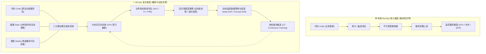
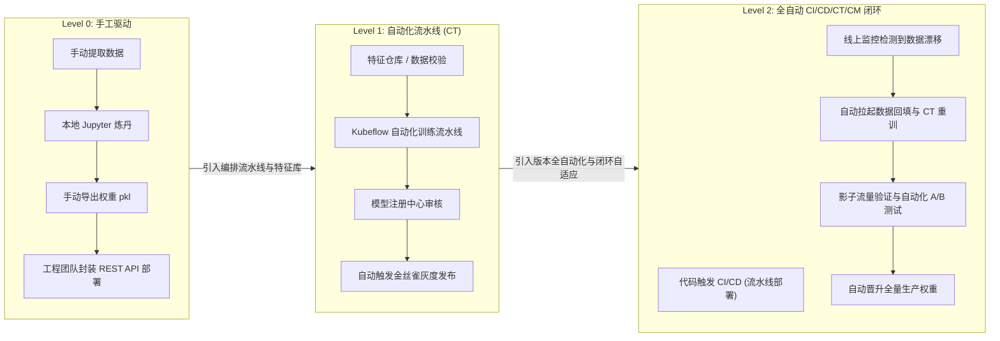
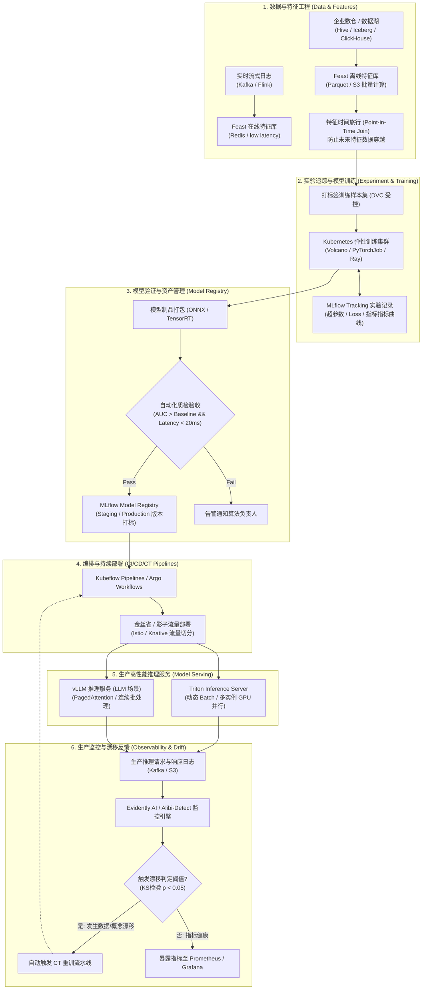
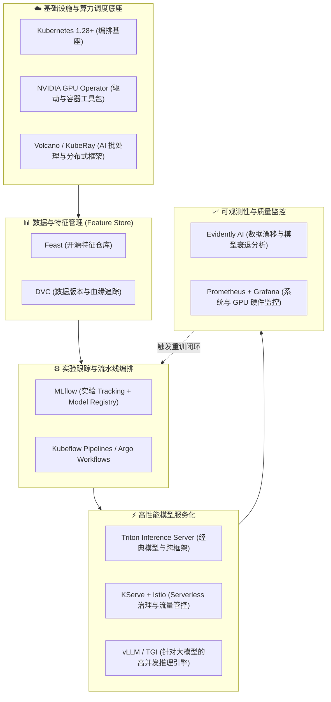
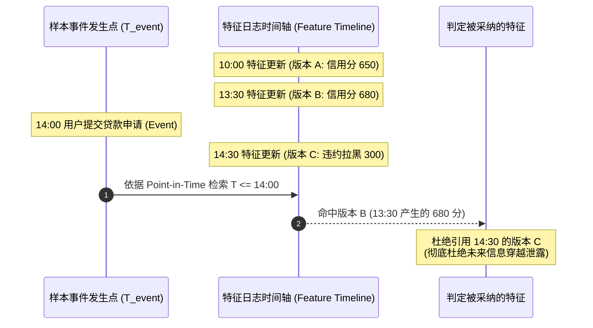
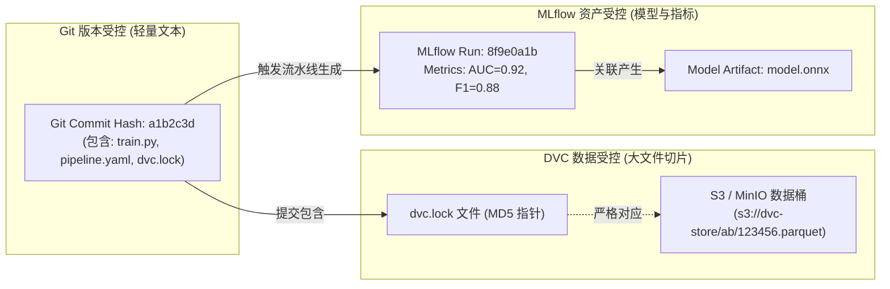
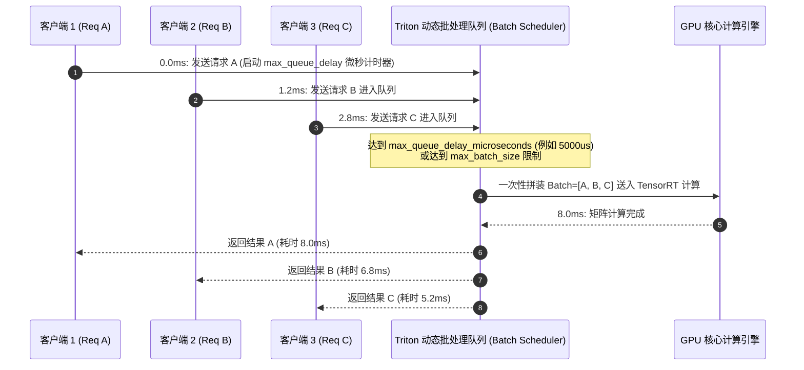
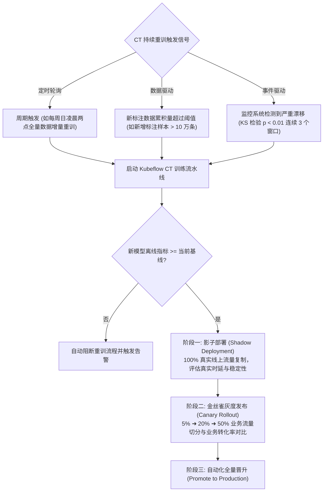
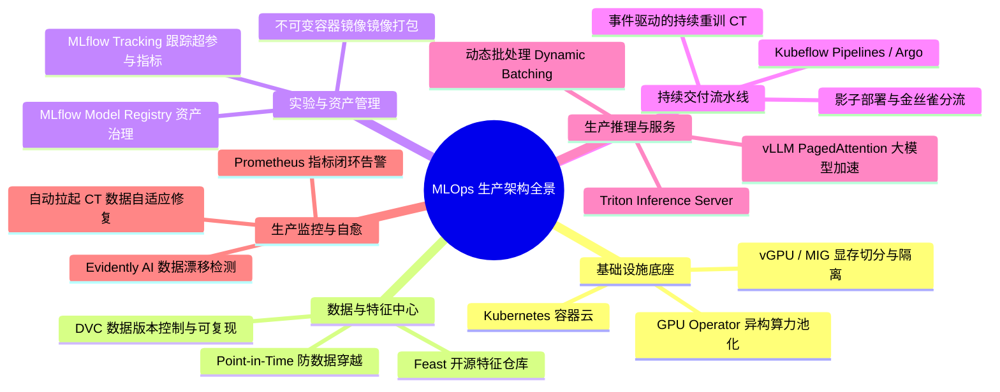

# 🚀 31 - MLOps 工程化架构全景与生产落地实战指南

> [!NOTE]
> 本文档面向企业级 SRE、DevOps 与 AI 平台架构师，深度梳理 **MLOps（机器学习运维）** 的工程体系底座、核心生命周期闭环、生产级技术栈选型（Kubeflow、MLflow、Feast、Triton/vLLM、Evidently）、关键机制底层原理与高频排障决策树，并建立通向大模型 LLMOps 演进的架构全景。

---

## 1. 业务背景与技术定位 (Context & Core Value)

### 1.1 为什么需要 MLOps：软件工程与算法落地的“断裂带”

在企业传统软件工程中，**DevOps** 体系已通过标准化的 CI/CD 流程实现了代码的敏捷交付、自动化测试与不可变基础设施部署。然而，当企业将机器学习（Machine Learning）与深度学习模型引入生产系统时，传统 DevOps 体系遭遇了根本性的失效：



### 1.2 DevOps 与 MLOps 的本质差异对照

| 维度                     | 传统 DevOps                                     | 现代 MLOps                                                                                             |
| :----------------------- | :---------------------------------------------- | :----------------------------------------------------------------------------------------------------- |
| **版本控制核心**   | 单一维度：代码（Git Commit / Tag）              | **三重耦合**：代码 + 数据集版本 + 模型浮点权重（Git + DVC + MLflow）                             |
| **测试对象与手段** | 确定性逻辑：单元测试、集成测试、代码覆盖率      | 概率性效果：离线精度（AUC/F1）、鲁棒性测试、数据质量校验、偏差评估                                     |
| **部署产物**       | 二进制文件、JAR 包、轻量无状态 Docker 镜像      | 多 GB 浮点权重文件、模型计算图、TensorRT/ONNX 序列化引擎、推理运行时容器                               |
| **基础设施诉求**   | 通用 x86 CPU、标准网络、弹性 Pod 水平扩缩 (HPA) | 异构算力（NVIDIA GPU / NPU）、高速互联（RoCE / InfiniBand）、异构显存调度与切分（vGPU / MIG）          |
| **衰退与告警机制** | 静态规则：服务崩溃、5xx 错误率突增、资源耗尽    | **隐式失效（Silent Failure）**：服务正常返回 200，但输入数据分布突变导致预测结果失准             |
| **自动化飞轮**     | CI（持续集成）+ CD（持续交付）                  | CI + CD +**CT（持续重训 Continuous Training）** + **CM（持续监控 Continuous Monitoring）** |

### 1.3 Google MLOps 成熟度演进模型 (Maturity Levels)



1. **Level 0（手工驱动阶段）**：数据科学家在本地或单机 Jupyter 笔记本中编写脚本，手动将导出的 `.pkl` / `.bin` 交付给后端团队包装为 Flask/FastAPI 服务上线。**痛点**：线上线下不一致、实验无法完全复现、模型上线周期以月计。
2. **Level 1（流水线自动化与持续重训 CT）**：通过自动化流水线完成“数据读取 ➜ 特征变换 ➜ 分布式训练 ➜ 效果评估 ➜ 导出注册”全链路。当新数据到达时，可一键或定时触发自动化重训。
3. **Level 2（全自动 CI/CD/CT 敏捷闭环）**：算法代码的提交触发 CI 自动化测试并构建流水线镜像；业务流量与监控指标发现数据漂移（Data Drift）时，自主触发 CT 训练、影子环境评测并完成渐进式热替换发布，实现无需人工干预的自适应工程闭环。

---

## 2. MLOps 端到端架构拓扑与生命周期流转 (Architecture & Lifecycle)

一个生产级 MLOps 平台通常横跨六大关键功能阶段，各环节之间通过统一的元数据中心与对象存储解耦：



---

## 3. 生产级开源核心技术栈选型与协同矩阵 (Production Technology Stack)

在构建企业级统一 MLOps 平台时，推荐的技术栈选型及组件边界划分如下：



### 生产各层主流工具对比与选型指南

| 架构层级               | 主流工具选型                                          | 优势与核心价值                                                                | 适用生产场景与选型建议                                               |
| :--------------------- | :---------------------------------------------------- | :---------------------------------------------------------------------------- | :------------------------------------------------------------------- |
| **算力底座**     | **Kubernetes + GPU Operator** vs 传统物理机部署 | 统一算力池化调度、动态切分（MIG / MPS / HAMi）、按需申请与隔离                | 生产环境标配，实现 CPU/GPU 混合调度与弹性收缩                        |
| **特征仓库**     | **Feast** vs 自建 Redis/Hive 脚本               | 彻底解决线上推理（<10ms）与线下训练的特征一致性，天然支持防数据穿越           | 推荐在具有高频动态特征（如风控、推荐、CTR 预估）的项目中全面引入     |
| **实验与版本**   | **MLflow** vs Weights & Biases (WandB)          | MLflow 100% 开源无私网合规风险，集 Tracking、Artifacts 与 Registry 于一体     | 企业私有化部署首选 MLflow；追求云端高级协作体验可选 WandB            |
| **流水线编排**   | **Kubeflow Pipelines (KFP)** vs Airflow         | KFP 基于 Kubernetes CRD 原生驱动容器化 Step，资源隔离与 GPU 复用极佳          | 纯算法流水线推荐 KFP / Argo；传统数据清洗 ETL 占大头时协同 Airflow   |
| **模型推理引擎** | **Triton Inference Server** vs TorchServe       | Triton 支持多模型并发、动态批处理（Dynamic Batching）、C++ 极速后端           | 推荐作为工业级标配；大模型（LLM）场景使用**vLLM** 替代原生后端 |
| **监控与漂移**   | **Evidently AI** vs 自研统计脚本                | 开箱即用支持 KS 检验、PSI、卡方检验、生成可视化 HTML 报告与 Prometheus Metric | 监控模型衰退的工业级事实标准，可直接嵌入 Kubernetes Pod 周期巡检     |

---

## 4. 关键工程机制与底层原理深度剖析 (Deep Dive Mechanisms)

### 4.1 特征防穿越机制：时间旅行 Join (Point-in-Time Correctness)

在机器学习模型（如金融欺诈、信贷评分、点击率预估）训练中，最隐蔽也是最严重的 Bug 就是**特征穿越（Data Leakage / Target Leakage）**：用“未来”的数据预测“过去”的行为。

#### 底层数学与时序原理

假设用户在 $T_{event} = \text{2026-09-20 14:00:00}$ 发生了一笔刷卡交易。我们希望提取该用户“过去 30 天的消费总额”作为特征。

- **错误做法（静态 Join）**：在离线数仓中直接执行 `LEFT JOIN user_features ON user_id`，取到的是生成训练集时刻（比如今天凌晨）的值，包含了该笔交易发生之后的刷卡数据。模型在线下评估表现完美，线上预测瞬间崩塌。
- **正确做法（Point-in-Time / ASOF Join）**：对于观察点数据集（Observation Frame）中的每一条样本，特征提取器只能回溯查找该实体在 $T_{feature} \le T_{event}$ 且最新生效的历史特征切片：

$$
F_{\text{valid}}(entity, T_{event}) = \arg\max_{t \le T_{event}} \{ F(entity, t) \}
$$



#### Feast 声明式特征定义代码范式

```python
# feature_store.yaml / features.py
from datetime import timedelta
from feast import Entity, FeatureView, Field, FileSource
from feast.types import Float32, Int64

# 1. 定义实体
user_entity = Entity(name="user_id", join_keys=["user_id"], description="用户唯一标识")

# 2. 声明离线数据源（包含事件发生时间戳 event_timestamp）
user_stats_source = FileSource(
    name="user_stats_source",
    path="s3://mlops-feature-store/user_stats.parquet",
    timestamp_field="event_timestamp",
    created_timestamp_column="created_timestamp"
)

# 3. 定义带有 TTL（生存周期）的 FeatureView
user_stats_view = FeatureView(
    name="user_stats_feature_view",
    entities=[user_entity],
    ttl=timedelta(days=30),
    schema=[
        Field(name="historical_avg_amount", dtype=Float32),
        Field(name="transaction_count_30d", dtype=Int64),
    ],
    online=True,  # 自动同步至在线低延迟存储 (Redis)
    source=user_stats_source,
)
```

---

### 4.2 代码、数据、模型三重版本血缘溯源 (Triple Lineage with Git + DVC + MLflow)

工业级模型可复现性的黄金准则：**任何一个线上运行的模型，必须能在 15 分钟内通过同一个代码 Commit、同批次不可变数据切片、同一套超参数完全重新训练出同等权重的模型。**



#### 操作规程与联动命令

```bash
# 1. 追踪大规模数据集变更，生成数据指纹
dvc add data/train_dataset.parquet
git add data/train_dataset.parquet.dvc .gitignore
git commit -m "feat(data): 更新 2026-Q3 金融反欺诈训练切片"
dvc push  # 将真实多 GB 数据上传至企业级 MinIO/S3 存储

# 2. 训练脚本内部集成 MLflow 自动化血缘绑定
# train.py
import mlflow
import os

with mlflow.start_run(run_name="lgb_prod_retrain"):
    # 记录当前执行的 Git Commit 与数据版本
    mlflow.log_param("git_commit", os.getenv("GIT_COMMIT_HASH"))
    mlflow.log_param("dvc_data_version", "2026-Q3-v1.2")
    mlflow.log_params({"max_depth": 6, "learning_rate": 0.03, "n_estimators": 500})
  
    # ... 模型训练流程 ...
    mlflow.log_metrics({"val_auc": 0.9234, "p99_latency_ms": 12.4})
    mlflow.sklearn.log_model(model, artifact_path="model", registered_model_name="RiskScoreEngine")
```

---

### 4.3 线上高性能模型服务：Triton 动态批处理机制 (Dynamic Batching)

在模型推理部署中，单请求串行处理会导致 GPU 计算核心（CUDA Cores / Tensor Cores）极度空闲，显卡利用率往往不足 10%；而若盲目增大 Batch Size，又会导致用户端 P99 延迟无法接受。

**Triton Dynamic Batching** 是平衡高并发吞吐（Throughput）与低请求延迟（Latency）的核心技术：



#### Triton 生产级 `config.pbtxt` 核心参数定义

```protobuf
name: "fraud_detection_onnx"
platform: "onnxruntime_onnx"
max_batch_size: 64

# 开启动态批处理调度器
dynamic_batching {
  # 优先组装的目标批次大小列表
  preferred_batch_size: [ 16, 32, 64 ]
  # 最多在队列中等待的微秒数 (5000us = 5ms)，确保 P99 延迟有严格上限
  max_queue_delay_microseconds: 5000
}

# 实例组调度（在单个 GPU 上运行多个并发模型实例，打满计算流水线）
instance_group [
  {
    count: 2
    kind: KIND_GPU
    gpus: [ 0 ]
  }
]
```

---

### 4.4 持续训练触发策略与渐进式发布 (CT Triggers & Progressive Rollout)

生产环境模型不是一次性交付物，必须建立基于事件驱动的自动化生命周期流转机制：



1. **影子流量（Shadow / Dark Traffic）**：通过服务网格（如 Istio）将生产真实请求在网关处复制一份异步发送给待验证的 Candidate 模型。Candidate 的计算结果被丢弃，不返回给真实用户。**核心价值**：零业务风险验证新模型的显存占用、并发吞吐与长尾延迟。
2. **金丝雀发布（Canary Rollout）**：小比例（如 5%）真实用户流量由新模型响应，实时对比新旧模型在真实业务指标（如支付转化率、点击率、报错率）上的差异。

---

## 5. 生产级高频踩坑与排障决策矩阵 (Troubleshooting Matrix)

### 5.1 典型故障 1：线上线下特征不一致 (Train-Serve Skew)

- **现象**：离线训练模型 AUC 高达 0.94，在验证集与测试集表现完美；但一上线生产，预测准确率断崖式下跌至 0.55，业务转化率指标异动。
- **根因分析**：
  1. **特征提取逻辑双重维护**：算法工程师用 Python/Pandas 写离线特征生成，后端工程师用 Java/Go 重新实现线上在线计算，在时间窗口、空值填充或浮点舍入上出现微小逻辑分歧；
  2. **特征穿越**：离线特征表中包含了未来数据（如计算“过去 7 天平均点击”时未严格切断在打标时刻点之前）。
- **排查与验证**：
  ```bash
  # 采集线上请求的实际传入特征，与离线生成该时间点的特征执行一致性对齐检验
  python3 -c "
  import pandas as pd
  import numpy as np

  online_df = pd.read_parquet('online_request_features.parquet')
  offline_df = pd.read_parquet('offline_pit_features.parquet')

  # 逐字段比对数值差异
  diff = (online_df - offline_df).abs()
  max_diff = diff.max()
  print('字段最大绝对偏差:\n', max_diff[max_diff > 1e-4])
  "
  ```
- **修复方案**：
  1. 引入 **Feast** 统一特征仓库，在线离线共享同一份声明式特征视图定义；
  2. 离线训练特征构造严格使用 `get_historical_features` 接口，配合 `entity_df` 中的事件时间戳（`event_timestamp`）强制执行 Point-in-time 检索。

---

### 5.2 典型故障 2：GPU 训练资源利用率极低 (GPU Starvation / IO Bottleneck)

- **现象**：`nvidia-smi` 监控显示 GPU 显存已被占满，但 GPU 利用率（GPU-Util）在 0% 到 90% 之间剧烈锯齿状波动，整体算力均值不足 15%，昂贵的 GPU 资源严重浪费。
- **根因分析**：**GPU 饥饿现象**。主机的 CPU 预处理与磁盘 IO 无法及时向 GPU 提供下一个 Batch 的张量，GPU 在等待数据传输过程中被挂起（IO Bound）。
- **排查定位**：
  ```bash
  # 1. 监控系统磁盘 IO 瓶颈与等待率
  iostat -xz 1 5

  # 2. 观察主机 CPU 是否打满与上下文切换
  vmstat 1 5

  # 3. 使用 PyTorch Profiler 分析 Step 内时间开销分布
  ```
- **修复方案**：
  1. **多进程数据加载与显存锁页**：在 DataLoader 中开启 `num_workers > 4` 并设置 `pin_memory=True`；
  2. **异步预取**：开启 `prefetch_factor=2`，使 CPU 提前在显存中缓存 2 个批次的数据；
  3. **数据格式转换**：将数万个细碎图片/文本文件打包为 **WebDataset / TFRecord / Arrow** 大文件格式，将随机小 IO 转换为连续顺序流式读。

---

### 5.3 典型故障 3：Triton 推理端 P99 延迟毛刺与显存 OOM 崩溃

- **现象**：在生产流量高峰期，推理服务网关出现大量 HTTP 504 响应超时，后端 Triton Pod 发生 OOMKilled 重启，Grafana 上观察到 P99 延迟由正常的 15ms 突增至 800ms+。
- **根因分析**：

  1. `max_queue_delay_microseconds` 设置过大，在极端突发流量下请求排队时间严重积压；
  2. `max_batch_size` 允许的上限过高，当最大批次（如 128）进入 GPU 显存执行矩阵运算时，显存峰值超出硬件物理显存，触发 CUDA out of memory 崩溃。
- **修复方案与生产推荐配置**：

  ```protobuf
  # 修改 config.pbtxt，收紧动态排队约束并开启显存限制
  dynamic_batching {
    # 将排队等待时间严格控制在 3ms 内
    max_queue_delay_microseconds: 3000
    preferred_batch_size: [ 8, 16, 32 ]
  }

  # 严格限制最大并发 batch
  max_batch_size: 32
  ```

  同时在 Kubernetes Deployment 中为 Triton Pod 配置精确的共享内存大小（`/dev/shm`）：
  ```yaml
  volumes:
  - name: dshm
    emptyDir:
      medium: Memory
      sizeLimit: 8Gi
  volumeMounts:
  - mountPath: /dev/shm
    name: dshm
  ```

---

### 5.4 典型故障 4：模型隐式性能衰退与概念漂移 (Data & Concept Drift)

- **现象**：线上服务各项基础设施指标（CPU、内存、GPU、QPS、5xx 错误率）全绿，但业务端报表显示模型预测有效性持续下滑。
- **根因分析**：
  1. **数据漂移（Data Drift）**：输入特征的统计分布 $P(X)$ 发生显著变化（例如换季后用户的搜索关键词偏好迁移、外部宏观经济变化导致的消费特征右移）；
  2. **概念漂移（Concept Drift）**：输入与目标标签之间的映射关系 $P(Y \mid X)$ 发生根本逆转（例如黑产团伙攻防升级，以往被判定为可信的特征行为组合已被用于套利）。
- **排障与检测（基于 Evidently AI）**：
  ```python
  # drift_detection_job.py
  from evidently.report import Report
  from evidently.metric_preset import DataDriftPreset
  import pandas as pd

  # 1. 加载基线数据（模型训练集分布）与过去 24 小时线上推理实际输入数据
  reference_data = pd.read_parquet("s3://mlops-data/reference_baseline.parquet")
  current_data = pd.read_parquet("s3://mlops-data/current_24h_production.parquet")

  # 2. 运行漂移检测报表
  drift_report = Report(metrics=[DataDriftPreset()])
  drift_report.run(reference_data=reference_data, current_data=current_data)

  # 3. 解析漂移指标并输出 Prometheus 报警
  results = drift_report.as_dict()
  share_of_drifted_columns = results["metrics"][0]["result"]["share_of_drifted_columns"]

  if share_of_drifted_columns > 0.3:  # 超过 30% 的特征发生统计显著性漂移
      print(f"CRITICAL: 检测到严重数据漂移: {share_of_drifted_columns * 100:.1f}% 特征异常!")
      # 触发自愈动作：调用 Kubeflow API 拉起 CT 重训流水线
  ```

---

## 6. 从 MLOps 到 LLMOps 的架构演进 (Evolution to LLMOps)

随着大语言模型（LLM）的全面普及，传统以“结构化特征 + 浅层/深度模型”为中心的 MLOps 正在快速向 **LLMOps（大模型运维）** 演化。理解二者的架构断代是现代化 AI 架构师的必备素质：

```mermaid
graph LR
    subgraph MLOps_Core ["传统 MLOps (以小模型/判别模型为主)"]
        direction TB
        M_Data["结构化特征 (表格 / 数值 / 类别)"]
        M_Train["单机 / 单卡全量训练 (LightGBM, ResNet)"]
        M_Eval["确定性指标 (AUC, F1, RMSE)"]
        M_Serve["单张 GPU 装载多个模型 (Triton / ONNX)"]
        M_Mon["KS 检验 / PSI 分布漂移检测"]
    end

    subgraph LLMOps_Core ["现代化 LLMOps (以百亿/千亿大语言模型为主)"]
        direction TB
        L_Data["非结构化语料 / 对话指令对 (SFT, RLHF, DPO)"]
        L_Train["多机多卡分布式并行微调 (LoRA, DeepSpeed, Megatron)"]
        L_Eval["大模型裁判 (LLM-as-a-Judge) + 语法/幻觉/安全性评测"]
        L_Serve["跨卡张量并行 (TP) + PagedAttention 显存池 (vLLM)"]
        L_Mon["Prompt / Completion 语义漂移 + 幻觉率 + 毒性检测"]
    end

    MLOps_Core -->|"基础设施向多模态与大规模并行演进"| LLMOps_Core
```



### 核心维度关键演进剖析

1. **算力与显存调度**：
   - **传统 MLOps**：模型权重通常仅几十 MB 到几 GB，单张 GPU（如 T4/A10）可容纳多个推理实例。
   - **LLMOps**：模型尺寸跃升至 7B/70B/671B，单张卡甚至装不下完整模型，必须依赖张量并行（TP）、流水线并行（PP），并借助 **PagedAttention（vLLM）** 解决传统推理中由于 KV Cache 碎片化导致的显存爆炸问题。
2. **评估基准（Evaluation）**：
   - **传统 MLOps**：目标值明确（0 或 1、连续浮点数），AUC/准确率可一键计算；
   - **LLMOps**：开放性文本生成没有标准答案，必须建立由 **“规则断言（Regex/JSON格式）+ 语义相似度（Embeddings）+ 大模型作为裁判（LLM-as-a-Judge）+ 人工抽样对齐”** 组成的多维综合评测平台。
3. **交付流水线形态**：
   - **传统 MLOps**：重在代码驱动的周期性全量重训（CT）；
   - **LLMOps**：基座模型（Base Model）极少从头重训，重在 **RAG 向量数据库实时同步、提示词工程（Prompt Versioning）、LoRA 适配器动态热挂载** 与安全对齐防护栏（NeMo Guardrails）。

---

## 7. 架构总结与思维导图 (Summary)



- **核心原则 1：可复现性是 MLOps 的生命线**。坚持代码、数据版本与模型权重的三重受控与强制血缘绑定。
- **核心原则 2：特征一致性先于算法调优**。通过统一 Feature Store 消除 Train-Serve Skew，守住无未来穿越的 Point-in-time 底线。
- **核心原则 3：动静平衡兼顾吞吐与低延迟**。在推理端充分利用 Dynamic Batching 与异构硬件并行，榨干 GPU 算力资源。
- **核心原则 4：监控是一切自适应重训的起点**。将 Silent Failure（数据与概念漂移）纳入核心监控指标，构建可观测性自愈闭环。

---

> [!TIP] 💡 关联技术与延伸阅读
> * **大模型微调原理与训练闭环**：[`./28-大模型微调概述与整体流程.md`](./28-大模型微调概述与整体流程.md)
> * **前线部署工程师 (FDE) 生产落地方法论**：[`./30-前线部署工程师(FDE)全景实战指南与企业级AI落地方法论.md`](./30-前线部署工程师%28FDE%29全景实战指南与企业级AI落地方法论.md)
> * **云原生容器组件与核心原理**：[`../03-K8S/01-组件原理/README.md`](../03-K8S/01-组件原理/README.md)
> * **代码仓库标签规范与生产版本发布**：[`../05-Devops/01-代码仓库与版本治理/01-代码仓库标签体系与企业级版本发布深度指南.md`](../05-Devops/01-代码仓库与版本治理/01-代码仓库标签体系与企业级版本发布深度指南.md)
