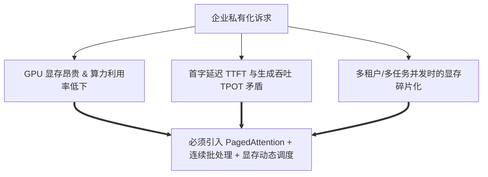
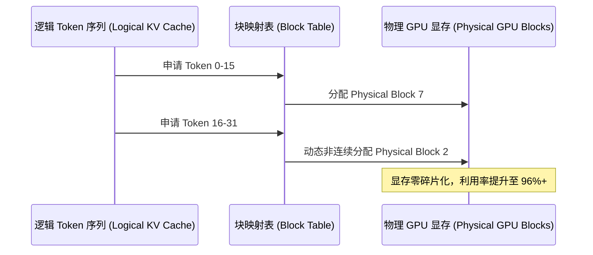

# 企业私有化大模型微调与高效推理架构实践

> **主办方/公众号**：InfoQ / AICon 全球人工智能开发与应用大会  
> **分享主题**：企业私有算力环境下的大模型高效微调与高并发推理服务架构  
> **核心标签**：`vLLM` `TensorRT-LLM` `PagedAttention` `Continuous Batching` `AWQ量化` `LoRA微调`

---

## 📺 课程与学习资源导航

- **📺 官方高清视频回放**：[Bilibili - AICon官方频道：大模型推理加速与私有化部署](https://search.bilibili.com/all?keyword=AICon+%E5%A4%A7%E6%A8%A1%E5%9E%8B%E6%8E%A8%E7%90%86%E5%8A%A0%E9%80%9F+vLLM) / [InfoQ 公开课](https://www.infoq.cn/)
- **📦 讲义与 PPT**：[AICon 2024-2025 会议讲义下载专区](https://aicon.infoq.cn/)
- **💻 开源工具与参考仓库**：
  - 推理加速引擎：[vLLM (GitHub)](https://github.com/vllm-project/vllm) / [TensorRT-LLM (GitHub)](https://github.com/NVIDIA/TensorRT-LLM)
  - 微调框架：[LLaMA-Factory (GitHub)](https://github.com/hiyouga/LLaMA-Factory) / [Unsloth (GitHub)](https://github.com/unslothai/unsloth)

---

## 1. 企业私有化部署痛点

在企业自建 GPU 机房或私有云环境中部署开源模型（如 Qwen2.5-72B、DeepSeek-V3、LLaMA-3）面临三大核心矛盾：



1. **显存墙（Memory Wall）与 KV Cache 浪费**：传统 HuggingFace 推理预分配显存导致碎片率高达 60%~80%，长文本并发极易触发 OOM。
2. **静态 Batching 效率低下**：长请求拖慢短请求，造成 GPU 计算核心大量空转等待。
3. **微调成本高昂**：全量参数微调（Full Parameter Fine-Tuning）对显存要求极大，难以敏捷适配数十个垂直业务场景。

---

## 2. 生产级高并发推理架构图解

```mermaid
flowchart TB
    subgraph IngressGateway["1. 流量接入与排队调度"]
        UserReq[高并发 HTTP/gRPC 请求] --> NginxLoadBalancer[Nginx / Envoy]
        NginxLoadBalancer --> FastAPIServer[FastAPI 兼容 OpenAI API 接口层]
        FastAPIServer --> RequestQueue[动态请求优先级队列]
    end

    subgraph InferenceEngine["2. vLLM / TensorRT-LLM 推理核心"]
        RequestQueue --> Scheduler[连续批处理调度器 (Continuous Batching)]
        Scheduler --> PagedAttentionMgr[PagedAttention 显存虚拟分页管理]
        
        subgraph MemoryPool["GPU 显存物理块 (Memory Pool)"]
            PagedAttentionMgr --> Block1[Block 0 (KV Cache)]
            PagedAttentionMgr --> Block2[Block 1 (KV Cache)]
            PagedAttentionMgr --> Block3[Block N (动态分配/释放)]
        end

        subgraph ModelCompute["模型计算核 (Tensor Parallelism)"]
            Scheduler --> GPU0[GPU 0: Qwen/DeepSeek Weights (AWQ/FP8)]
            Scheduler --> GPU1[GPU 1: Qwen/DeepSeek Weights (AWQ/FP8)]
        end
    end

    subgraph MultiLoRAManager["3. 动态 Multi-LoRA 适配器热插拔"]
        GPU0 & GPU1 <--> LoRAPool[(LoRA 权重池: 客服/代码/审核/法律)]
        Scheduler -->|根据请求 Header| DynamicAdapter[动态加载/卸载指定 LoRA]
    end
```

---

## 3. 核心关键技术原理详解

### 3.1 PagedAttention 虚拟分页机制

借鉴操作系统虚拟内存分页技术，将每个序列的 KV Cache 划分为固定大小的 Block（如 16 或 32 个 Token）。



### 3.2 连续批处理（Continuous Batching / Iteration-level Scheduling）

传统静态 Batching 需要等待整个 Batch 内所有 Sequence 全部生成完毕才能处理下一批；而**连续批处理以 Iteration（单个 Token 步长）为单位进行调度**：

- 当某个 Sequence 遇到 `<|endoftext|>` 结束时，立即释放其占用的 KV 块；
- 调度器在下一个 Iteration 立即插入队列中等候的新请求。
- **收益**：吞吐量（Throughput）直接提升 **4x ~ 8x**。

---

## 4. 生产级部署实操配置示例

### 4.1 vLLM 高性能启动配置（生产环境脚本）

针对多卡（如 2 张 A100/H800）部署企业主流开源大模型并开启 Multi-LoRA：

```bash
#!/usr/bin/env bash
# 企业级 vLLM 生产启动脚本

python3 -m vllm.entrypoints.openai.api_server \
    --model /data/models/Qwen2.5-72B-Instruct-AWQ \
    --tensor-parallel-size 2 \
    --dtype float16 \
    --gpu-memory-utilization 0.95 \
    --max-model-len 8192 \
    --max-num-seqs 256 \
    --kv-cache-dtype auto \
    --enable-prefix-caching \
    --enable-lora \
    --lora-modules \
        customer_service=/data/loras/cs_adapter \
        legal_audit=/data/loras/legal_adapter \
    --max-loras 4 \
    --max-lora-rank 32 \
    --host 0.0.0.0 \
    --port 8000
```

> **关键参数说明**：
> - `--enable-prefix-caching`：开启系统级 Prompt 前缀缓存，长 System Prompt 场景首字延迟降低 80%。
> - `--gpu-memory-utilization 0.95`：压榨显存空间用于 KV Cache 缓冲池。
> - `--enable-lora`：单实例支持动态多业务适配器热加载，避免为每个业务单独起集群。

---

## 5. 生产避坑与调优经验

1. **量化格式选型**：
   - 优先选择 **AWQ (Activation-aware Weight Quantization)** 或 **FP8**（Ada/Hopper 架构支持），精度损失比传统 GPTQ 更小，特别是长上下文与逻辑推理场景表现更稳。
2. **Prefix Caching 冲突与隔离**：
   - 如果开启了 `--enable-prefix-caching`，需确保多租户的 System Prompt 结构一致，或者严格做好租户隔离，防止出现由于 Cache 命中引起的逻辑串话。
3. **首字延迟（TTFT）与吞吐量（Throughput）的权衡**：
   - 在高并发吞吐优先场景，调大 `--max-num-seqs`（如 256/512）；
   - 在强实时人机交互对话场景，调小 `--max-num-seqs`（如 64/128），以保证单用户的首字响应时间控制在 500ms 以内。

---

## 6. 讲座 Q&A 互动精选

- **Q：企业内既有客服场景（短文本高并发），又有文档分析场景（长文本低并发），该如何混部？**
  - **讲师解答**：**强建议物理集群隔离**。长文本（如 32k+ 上下文）计算 Prefill 阶段耗时极长，会严重阻塞短文本的 Token 生成队列。可设立一个“长文本专用集群”和一个“交互对话专用集群”，在 API Gateway 处根据 `context_length` 动态路由。
