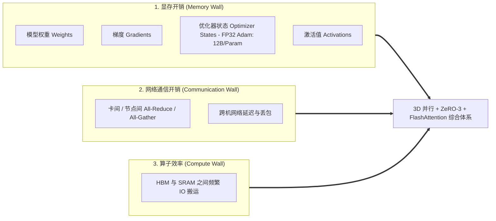
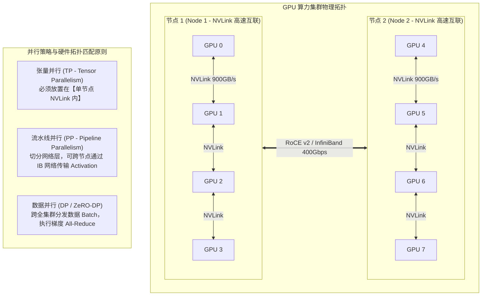
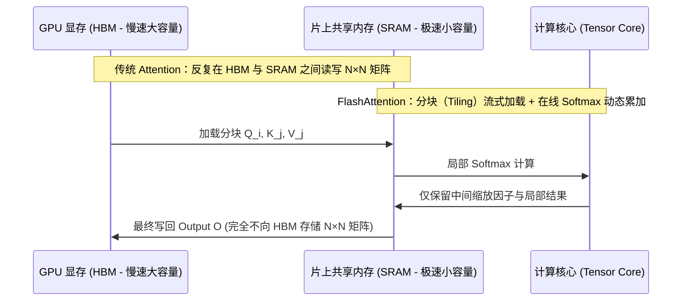

# 大模型训练加速与分布式算力优化实战

> **主办方/公众号**：智东西 / 智东西公开课  
> **分享主题**：千亿大模型分布式训练并行策略、显存压缩与高带宽网络优化实战  
> **核心标签**：`3D并行` `Megatron-LM` `DeepSpeed ZeRO` `FlashAttention-2` `RoCE/InfiniBand` `通信与计算重叠`

---

## 📺 课程与学习资源导航

- **📺 官方高清视频回放**：[Bilibili - 智东西公开课官方合集](https://search.bilibili.com/all?keyword=%E6%99%BA%E4%B8%9C%E8%A5%BF%E5%85%AC%E5%BC%80%E8%AF%BE+%E5%A4%A7%E6%A8%A1%E5%9E%8B%E8%AE%AD%E7%BB%83%E5%8A%A0%E9%80%9F) / [智东西公开课官网直播间](https://www.zhidx.com/open)
- **📦 讲义与 PPT**：智东西公开课专栏课件与行业白皮书
- **💻 开源工具与参考仓库**：
  - 分布式训练核心：[NVIDIA Megatron-LM (GitHub)](https://github.com/NVIDIA/Megatron-LM)
  - 微软训练加速引擎：[DeepSpeed (GitHub)](https://github.com/microsoft/DeepSpeed)
  - 极致算子加速：[FlashAttention (GitHub)](https://github.com/Dao-AILab/flash-attention)

---

## 1. 分布式训练核心瓶颈

训练千亿参数模型（如 70B+）时，单卡 80GB 显存甚至无法容纳模型参数与优化器状态。算力集群面临三大“开销墙”：



---

## 2. 3D 混合并行架构策略（Megatron-DeepSpeed）



### 并行策略选型黄金法则
- **TP (张量并行)**：通信极其频繁（每层两次 All-Reduce），通信量大，**严禁跨节点**，必须限制在机内 8 卡 NVLink 域内（TP ≤ 8）。
- **PP (流水线并行)**：仅在 Stage 边界传递激活值和反向梯度，通信量小，适合跨机器扩展（Cross-Node）。
- **DP / ZeRO (数据并行)**：配合 ZeRO 显存分片（ZeRO-1/2/3），横向扩展集群规模。

---

## 3. FlashAttention-2 算子加速原理

传统 Self-Attention 需将 $N \times N$ 的 Attention Matrix 写入 GPU 高带宽显存（HBM），造成严重的内存带宽受限（Memory-Bound）。



- **显存节约**：从 $O(N^2)$ 降低至 $O(N)$（长文本训练不再发生显存爆炸）。
- **计算加速**：IO 开销减少 5x 以上，整体训练端到端提速 **2x ~ 3x**。

---

## 4. 生产级 DeepSpeed 训练配置示例 (ZeRO-3 + Offload)

```json
{
  "train_batch_size": 128,
  "train_micro_batch_size_per_gpu": 2,
  "gradient_accumulation_steps": 8,
  "bf16": {
    "enabled": true
  },
  "zero_optimization": {
    "stage": 3,
    "offload_optimizer": {
      "device": "cpu",
      "pin_memory": true
    },
    "offload_param": {
      "device": "none"
    },
    "overlap_comm": true,
    "contiguous_gradients": true,
    "sub_group_size": 1e9,
    "reduce_bucket_size": "auto",
    "stage3_prefetch_bucket_size": "auto",
    "stage3_param_persistence_threshold": "auto"
  },
  "gradient_clipping": 1.0,
  "wall_clock_breakdown": false
}
```

> **参数核心剖析**：
> - `zero_optimization.stage = 3`：将参数、梯度、优化器状态全部切片到各个 GPU 上，显存占用降至最低。
> - `overlap_comm = true`：开启计算与通信重叠（在当前层计算的同时预取下一层的参数切片）。
> - `bf16.enabled = true`：相比 FP16 动态范围更大，完全杜绝下溢导致数值溢出（Loss 变 NaN）。

---

## 5. 生产避坑指南与排错心得

1. **NCCL 通信超时与掉卡（Watchdog Timeout）**：
   - 现象：分布式训练突然卡死在某个 Step，随后报 `NCCL watchdog timeout`。
   - 排查：90% 是由于网络微突发（PFC 死锁）或某一张 GPU 降频（Slow Node）。
   - 解决：配置 `export NCCL_ASYNC_ERROR_HANDLING=1` 并开启慢节点自动探测与隔离脚本。
2. **Loss 尖刺（Loss Spike）与梯度爆炸**：
   - 在千亿模型训练时，出现突然 Loss 暴涨。
   - 策略：配置实时 Checkpoint 滚动保存（如每 100 步保存一次）；在数据侧过滤异常极端长序列（Bad Token）；限制学习率 Warmup 周期。

---

## 6. 讲座 Q&A 精选

- **Q：在 RoCE v2 物理网络下，如何避免 PFC 死锁导致的分布式训练中断？**
  - **讲师解答**：建议在交换机上配置 ECN（显式拥塞通知）配合网卡 DCQCN 算法，在拥塞队列达到阈值时提前降速，尽量避免触发 PFC 强行暂停帧；同时升级 NCCL 开启多通道自适应路由。
