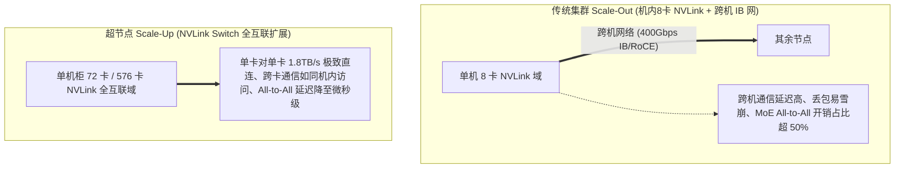

# 2026 中国 AI 算力与异构超节点集群大会实战

> **主办方/公众号**：智东西 / 智猩猩公开课  
> **分享主题**：万卡时代超节点（SuperNode）算力互联架构、Scale-Up 与 Scale-Out 综合网络拓扑优化  
> **核心标签**：`超节点 (SuperNode)` `NVLink Network` `Scale-Up 纵向扩展` `RoCE v2 无损网络` `智算集群运维`

---

## 📺 课程与学习资源导航

- **📺 官方视频回放**：[Bilibili - 智东西公开课：AI 算力大会与超节点架构](https://space.bilibili.com/393278857) ｜ [智猩猩直播专区](https://www.zhidx.com/open)
- **💻 开源基准与监控**：
  - 算力集群网络评测：[NCCL Tests (GitHub)](https://github.com/NVIDIA/nccl-tests)
  - 集群监控平台：[DCGM-Exporter (Prometheus)](https://github.com/NVIDIA/gpu-monitoring-tools)

---

## 1. 架构演进：从“传统机架堆叠”到“单机即超节点（Scale-Up）”

随着模型参数突破万亿并全面普及 MoE 稀疏激活架构，全互联通信（All-to-All）成为集群最大瓶颈：



---

## 2. 72 卡 / 576 卡超节点机柜供电与液冷系统拓扑

```mermaid
flowchart TB
    subgraph RackPower["1. 供电系统 (50kW~120kW 超高功率机柜)"]
        Grid[三相 480V 交流电] --> Busbar[机柜铜排 Busbar]
        Busbar --> Rectifier[整流模块 (AC to 54V DC 直流供电)]
    end

    subgraph LiquidCooling["2. 全液冷闭环散热 (Direct-to-Chip Liquid Cooling)"]
        CDU[冷却分配单元 (CDU)] --> ColdPlate[GPU/NVSwitch 芯片级冷板]
        ColdPlate --> HotLiquid[吸收 95%+ 核心热量]
        HotLiquid --> HeatExchanger[板式换热器 / 冷却塔]
    end

    subgraph Interconnect["3. NVLink 铜缆互连总线 (NVLink Spine)"]
        GPU_Nodes[72 张 Blackwell GPU] <==>|背板无源铜缆 (Passive Copper 1.8TB/s)| NVSwitchTray[NVLink Switch 托盘]
    end
```

---

## 3. 生产避坑指南与集群调优经验

1. **铜缆 vs 光模块选型**：
   - 在超节点机柜内部，优先使用**无源铜缆（Passive Copper DAC）**替代光模块，功耗降低数千瓦且 MTBF（平均故障间隔时间）提升一个数量级。
2. **PFC 死锁与 ECN 拥塞控制参数调优**：
   - 配置交换机 ECN 标记阈值，配合网卡 DCQCN 算法，确保在大规模 All-to-All 突发通信时不触发硬件暂停帧。
