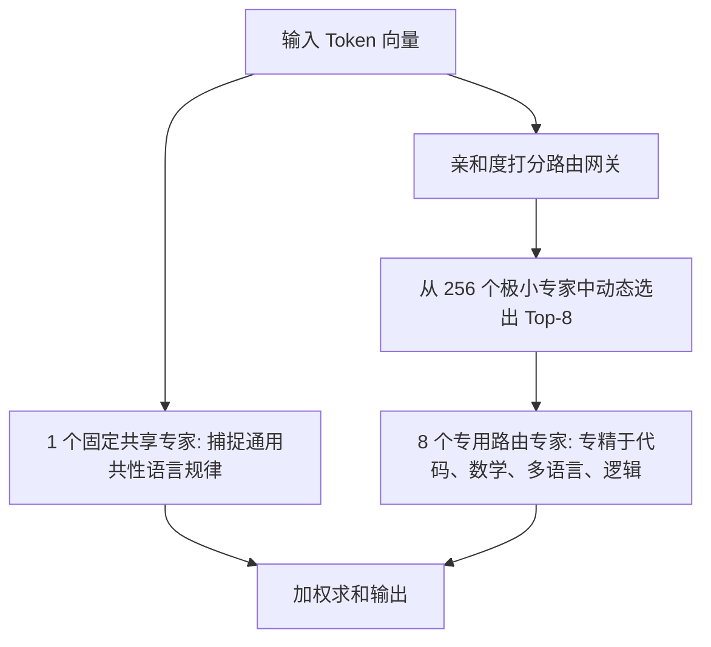

# MoE 混合专家模型架构与 MLA 多头潜变量注意力深度解析

> **主办方/公众号**：机器之心 Synced / SOTA 研习社  
> **分享主题**：DeepSeek-V3 核心架构：细粒度专家切分（Fine-Grained MoE）、无辅助损失负载均衡与 DualPipe 流水线重叠  
> **核心标签**：`DeepSeek-V3` `细粒度 MoE` `无辅助损失负载均衡` `DualPipe` `MLA`

---

## 📺 课程与学习资源导航

- **📺 官方视频回放**：[Bilibili - 机器之心：DeepSeek-V3 核心架构剖析](https://space.bilibili.com/21966597)
- **💻 开源论文**：[DeepSeek-V3 Technical Report (arXiv)](https://arxiv.org/abs/2412.19437)

---

## 1. 核心架构突破：细粒度专家切分与共享专家

传统 MoE（如 8 选 2 专家）每个专家参数量过大，难以实现知识的精准解耦；DeepSeek-V3 采用**极细粒度专家切分（256 专家选 8 个激活）+ 1 个固定共享专家（Shared Expert）**：

---

## 2. 无辅助损失的动态负载均衡策略（Auxiliary-Loss-Free Load Balancing）

传统 MoE 通过在 Loss 中加入复杂的辅助损失强制专家均衡，但这会显著破坏主任务收敛；DeepSeek-V3 创新引入**专家专属动态偏置项（Bias Term）**：

$$s_{i,t} = \text{Softmax}(\text{TopK}(u_i \cdot x_t + b_i))$$

- 当某个专家负载过重时，动态调低其偏置 $b_i$；当某个专家饥饿空闲时，调高其偏置 $b_i$。
- **收益**：模型总参数达 6710 亿（671B），但单 Token 计算仅激活 370 亿（37B），在保证极致表现的同时实现了最优硬件算力利用率。
