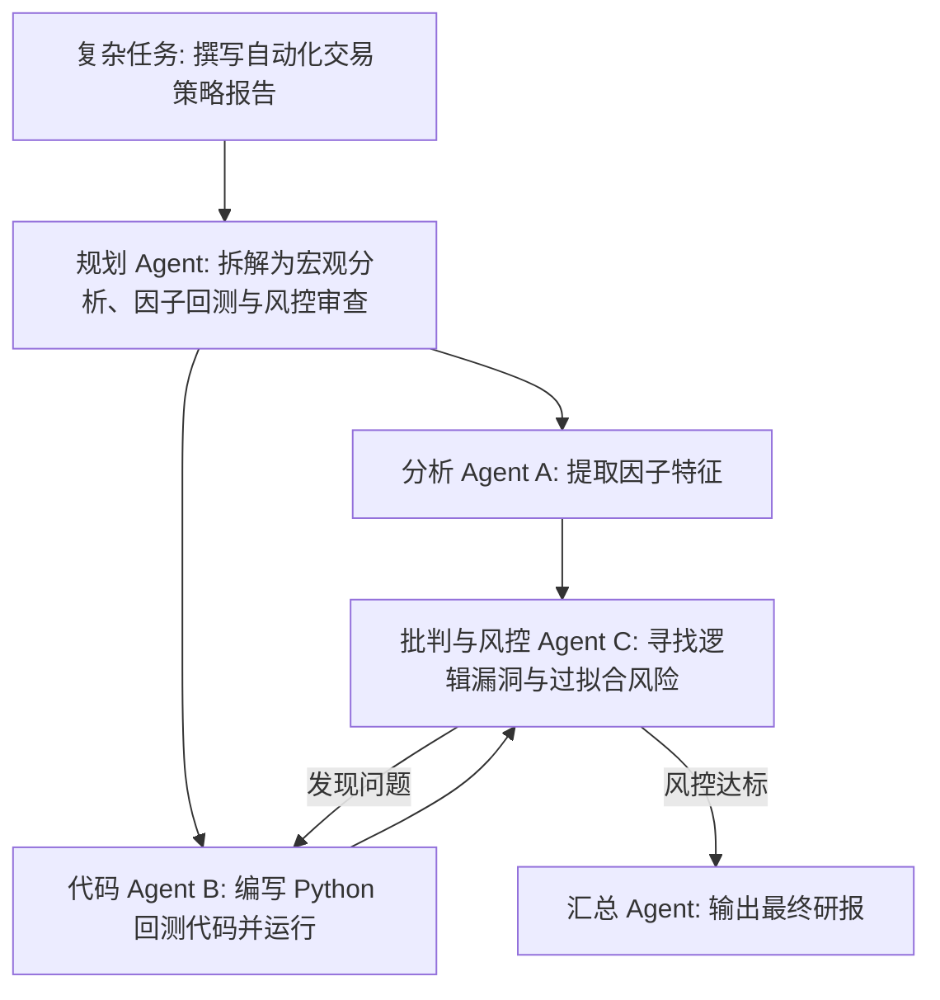

# 多 Agent 编排：LangGraph 与 AutoGen 2.0 动手实战

> **主办方/公众号**：Datawhale 开源社区  
> **分享主题**：从简单链式调用到基于有向图（Graph）与多角色辩论（Multi-Agent Debate）的复杂业务协同系统  
> **核心标签**：`LangGraph` `AutoGen 2.0` `多智能体辩论` `循环状态机` `工具调用`

---

## 📺 课程与学习资源导航

- **📺 官方视频回放**：[Bilibili - Datawhale：动手学多智能体协同](https://space.bilibili.com/436482484)
- **💻 开源工具仓库**：[LangGraph (GitHub)](https://github.com/langchain-ai/langgraph) / [AutoGen](https://github.com/microsoft/autogen)

---

## 1. 核心架构：多智能体辩论与审查机制

- **实战收益**：通过引入 Critic Agent 辩论审查，报告结论的可靠性与代码无 Bug 率提升 **45%** 以上。
