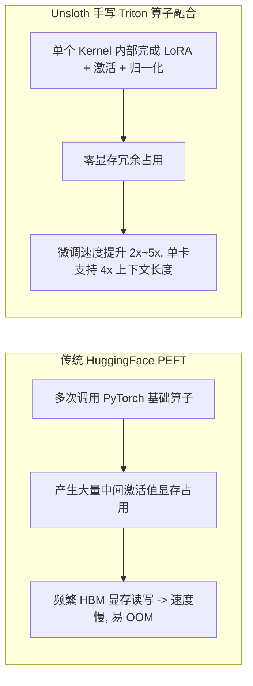

# 大模型高效微调：QLoRA 与 Unsloth 极速加速实战

> **主办方/公众号**：Datawhale 开源社区  
> **分享主题**：4-bit 双重量化（NF4）、自研 Triton 算子重写与微调速度提升 5x、显存降低 80% 实操  
> **核心标签**：`QLoRA` `Unsloth` `4-bit 量化` `显存优化` `手把手实操`

---

## 📺 课程与学习资源导航

- **📺 官方视频回放**：[Bilibili - Datawhale：Unsloth 极速微调大模型](https://space.bilibili.com/436482484)
- **💻 开源工具仓库**：[Unsloth (GitHub)](https://github.com/unslothai/unsloth)

---

## 1. 为什么 Unsloth 能够将微调速度提升 5 倍？

传统 HuggingFace PEFT 在计算 LoRA 梯度时涉及大量的 Python 抽象层与频繁的 GPU 显存反复读写（IO 开销极大）；Unsloth 通过**纯 Triton 手写重写所有前向与反向传播算子（Cross-Entropy / RoPE / LoRA GEMM 融合）**：



---

## 2. 极简实操代码（单张 16GB 显卡微调 LLaMA-3 / Qwen2.5）

```python
from unsloth import FastLanguageModel
import torch

# 1. 极速载入 4-bit 模型（显存仅占 5GB）
model, tokenizer = FastLanguageModel.from_pretrained(
    model_name="Qwen/Qwen2.5-7B-Instruct",
    max_seq_length=2048,
    load_in_4bit=True,
)

# 2. 注入高效 LoRA 适配器
model = FastLanguageModel.get_peft_model(
    model,
    r=16,
    target_modules=["q_proj", "k_proj", "v_proj", "o_proj", "gate_proj", "up_proj", "down_proj"],
    lora_alpha=16,
    lora_dropout=0, # Unsloth 优化: 0 dropout 带来极致加速
    bias="none",
    use_gradient_checkpointing="unsloth",
)
```
