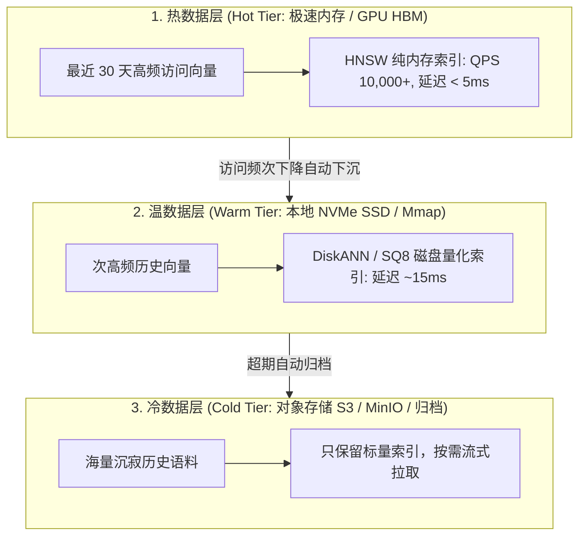

# Milvus 2.6 架构大揭秘：超大规模高并发检索与智能冷热分层

> **主办方/公众号**：Zilliz 官方社区 / Milvus 向量数据库  
> **分享主题**：十亿级向量检索成本控制：基于 S3/MinIO 对象存储与 SSD/内存智能冷热分层架构演进  
> **核心标签**：`Milvus 2.6` `冷热分层存储` `十亿级向量` `Knowhere 算子加速` `成本控制`

---

## 📺 课程与学习资源导航

- **📺 官方视频回放**：[Bilibili - Zilliz 官方：Milvus 2.6 架构演进与十亿级实战](https://space.bilibili.com/401490289)
- **💻 开源工具与参考仓库**：[milvus-io/milvus (GitHub)](https://github.com/milvus-io/milvus)

---

## 1. 核心架构演进：打破“全内存存储”的高昂成本魔咒

传统 HNSW 向量索引必须全部载入昂贵的物理内存中；Milvus 2.6 推出**三层存储金字塔与智能数据生命周期（Data Tiering）**：

- **TCO 成本收益**：在百亿级规模下，综合硬件服务器采购成本直接**降低 70% 以上**。
